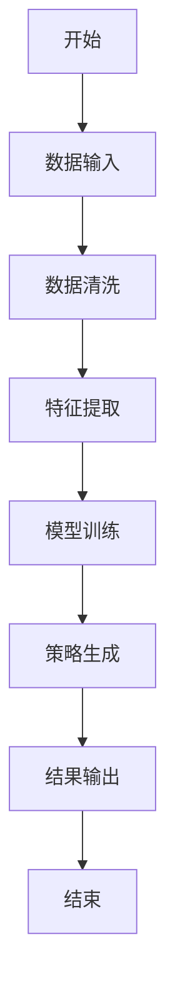
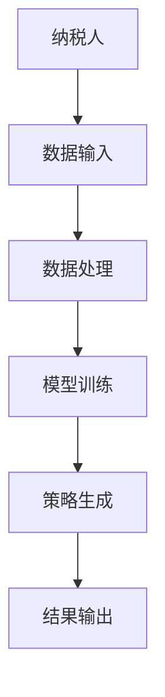

                 


# 智能税收筹划策略推荐系统

---

## 关键词：
智能税收筹划、策略推荐系统、数据驱动、机器学习、算法优化、系统架构、税务优化

---

## 摘要：
智能税收筹划策略推荐系统通过数据驱动和智能算法，为纳税人提供个性化的税收优化方案。本文从系统背景、核心概念、算法原理、系统架构、项目实战等多个维度，详细阐述了智能税收筹划策略推荐系统的实现过程与应用场景，旨在为读者提供一套高效、实用的税收优化解决方案。

---

# 第一章：智能税收筹划策略推荐系统的背景与意义

## 1.1 税收筹划的定义与重要性
- 1.1.1 税收筹划的基本概念
- 1.1.2 税收筹划在企业财务管理中的作用
- 1.1.3 当前税收筹划面临的挑战

## 1.2 智能化税收筹划的必要性
- 1.2.1 传统税收筹划的局限性
- 1.2.2 数据驱动与人工智能在税收筹划中的优势
- 1.2.3 智能税收筹划策略推荐系统的应用场景

## 1.3 系统的目标与核心功能
- 1.3.1 系统的目标
- 1.3.2 系统的核心功能模块
- 1.3.3 系统的预期效益

---

# 第二章：智能税收筹划策略推荐系统的原理与方法

## 2.1 数据驱动的税收优化原理
- 2.1.1 数据收集与处理
- 2.1.2 数据特征提取与分析
- 2.1.3 数据驱动的税收优化模型

## 2.2 智能算法在税收策略推荐中的应用
- 2.2.1 常见的智能算法（如机器学习、深度学习）
- 2.2.2 算法在税收策略推荐中的实现步骤
- 2.2.3 算法优化与性能提升

## 2.3 系统化推荐的实现逻辑
- 2.3.1 推荐系统的框架设计
- 2.3.2 推荐策略的生成与优化
- 2.3.3 推荐结果的验证与评估

---

# 第三章：智能税收筹划策略推荐系统的算法实现

## 3.1 算法原理概述
- 3.1.1 税收优化的目标函数与约束条件
- 3.1.2 算法的基本原理与实现步骤
- 3.1.3 算法的数学模型与公式

## 3.2 算法流程图


## 3.3 算法实现的代码示例
```python
import numpy as np
from sklearn import linear_model

# 数据预处理
data = np.array([[20000, 10000], [30000, 15000], [40000, 20000]])
X = data[:, 0]
y = data[:, 1]

# 模型训练
model = linear_model.LinearRegression()
model.fit(X.reshape(-1, 1), y)

# 策略生成
def generate_strategy(X_new):
    y_pred = model.predict(X_new.reshape(-1, 1))
    return y_pred
```

## 3.4 算法的优化与改进
- 3.4.1 算法的调优策略
- 3.4.2 算法的性能评估与对比
- 3.4.3 算法的适用场景与局限性

---

# 第四章：智能税收筹划策略推荐系统的系统架构设计

## 4.1 系统架构概述
- 4.1.1 系统的整体架构设计
- 4.1.2 系统的功能模块划分
- 4.1.3 系统的交互流程设计

## 4.2 系统架构图


## 4.3 系统接口设计
- 4.3.1 系统的主要接口定义
- 4.3.2 接口的交互流程与协议
- 4.3.3 接口的实现细节与注意事项

## 4.4 系统交互图


---

# 第五章：智能税收筹划策略推荐系统的项目实战

## 5.1 环境安装与配置
- 5.1.1 开发环境的搭建
- 5.1.2 依赖库的安装与配置
- 5.1.3 数据集的准备与预处理

## 5.2 系统核心代码实现
```python
import pandas as pd
from sklearn.model_selection import train_test_split
from sklearn.metrics import accuracy_score

# 数据加载
data = pd.read_csv('tax_data.csv')
X = data.drop('target', axis=1)
y = data['target']

# 数据分割
X_train, X_test, y_train, y_test = train_test_split(X, y, test_size=0.2)

# 模型训练
model = linear_model.LogisticRegression()
model.fit(X_train, y_train)

# 模型评估
y_pred = model.predict(X_test)
print("Accuracy:", accuracy_score(y_test, y_pred))
```

## 5.3 实际案例分析
- 5.3.1 案例背景与数据描述
- 5.3.2 案例的处理过程与结果
- 5.3.3 案例的分析与总结

---

# 第六章：智能税收筹划策略推荐系统的优化与提升

## 6.1 算法优化与性能提升
- 6.1.1 算法的改进策略
- 6.1.2 算法的性能优化方法
- 6.1.3 算法的适用性分析

## 6.2 系统架构的优化
- 6.2.1 系统架构的改进方向
- 6.2.2 系统性能的优化措施
- 6.2.3 系统的可扩展性设计

## 6.3 最佳实践与注意事项
- 6.3.1 税收筹划中的注意事项
- 6.3.2 系统使用中的常见问题与解决方案
- 6.3.3 税收政策变化对系统的影响

---

# 第七章：总结与展望

## 7.1 全文总结
- 7.1.1 系统的核心内容与实现方法
- 7.1.2 系统的主要创新点与优势
- 7.1.3 系统的实际应用价值与意义

## 7.2 未来展望
- 7.2.1 税收筹划技术的发展趋势
- 7.2.2 智能税收筹划策略推荐系统的未来发展方向
- 7.2.3 人工智能在税收优化中的潜在应用

---

## 作者：AI天才研究院/AI Genius Institute & 禅与计算机程序设计艺术 /Zen And The Art of Computer Programming

---

### 附录：
- 附录A：相关术语解释
- 附录B：算法实现的详细代码
- 附录C：系统架构设计的详细说明

