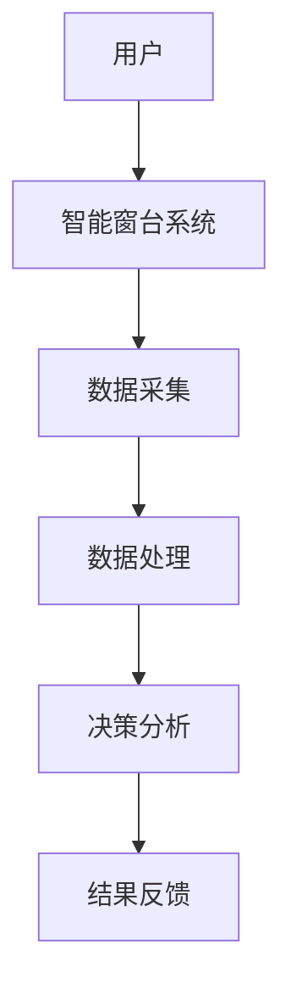
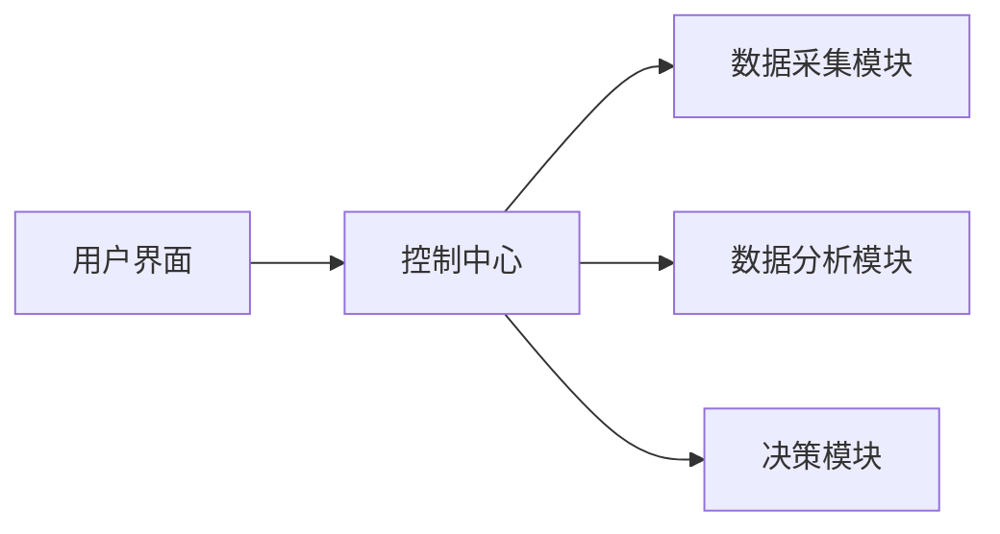
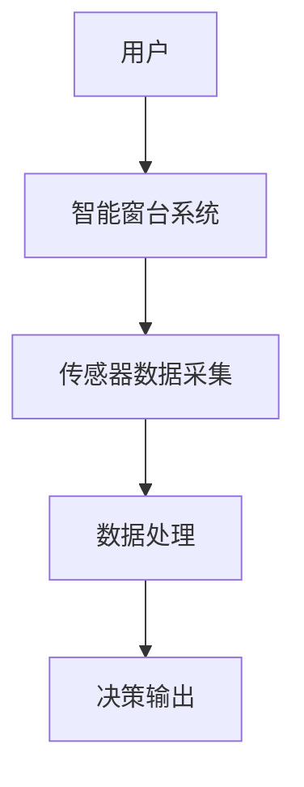

                 


# 智能窗台：AI Agent的室内植物生长监测

> 关键词：AI Agent，室内植物监测，传感器数据，机器学习，智能系统设计

> 摘要：本文探讨了AI Agent在室内植物生长监测中的应用，从系统架构设计到算法实现，再到项目实战，全面解析智能窗台的实现过程。文章通过详细的技术分析和案例解读，展示了如何利用AI技术优化植物生长监测的效率和精度。

---

# 第1章: 智能窗台与AI Agent的背景介绍

## 1.1 问题背景与描述

### 1.1.1 室内植物生长监测的现状与挑战

随着城市化进程的加快，越来越多的人开始在室内种植植物，但植物的生长环境复杂多变，人工监测效率低下且容易出错。传统的植物监测方法依赖于人工观察，不仅耗时耗力，而且难以实时获取数据。

### 1.1.2 AI Agent在植物监测中的作用

AI Agent（人工智能代理）能够通过传感器实时采集植物生长环境数据，并利用机器学习算法分析这些数据，帮助我们更好地理解植物生长需求，优化生长环境。AI Agent还能通过自动化控制设备（如智能灯、温控器）调整环境条件，从而实现植物生长的智能化管理。

### 1.1.3 智能窗台的定义与目标

智能窗台是一种结合了AI技术的室内植物生长监测系统，其目标是通过实时监测植物的生长环境（如光照、温度、湿度等），利用AI算法分析数据，为用户提供最优的植物生长建议，并通过自动化设备实现环境的智能调控。

---

## 1.2 问题解决与边界

### 1.2.1 AI Agent如何解决植物监测问题

AI Agent通过传感器实时采集植物生长环境数据，利用机器学习模型分析数据，识别植物的健康状况和生长需求，从而为用户提供个性化的植物养护建议。AI Agent还能通过自动化设备调整环境条件，确保植物在最佳环境下生长。

### 1.2.2 智能窗台的边界与外延

智能窗台系统的边界包括传感器、数据采集模块、数据分析模块和自动化控制设备。外延部分则包括与用户交互的界面、远程数据存储和第三方API接口。

### 1.2.3 核心要素与组成分析

智能窗台系统的核心要素包括：
1. **传感器**：用于采集植物生长环境数据（如光照、温度、湿度）。
2. **数据采集模块**：负责将传感器数据传输到系统中。
3. **数据分析模块**：利用机器学习算法分析数据，识别植物健康状况。
4. **自动化控制设备**：根据AI Agent的建议调整环境条件。

---

## 1.3 核心概念与联系

### 1.3.1 AI Agent与室内植物监测的关系

AI Agent通过实时监测植物生长环境数据，利用机器学习算法分析数据，为植物生长提供智能化的解决方案。AI Agent不仅是数据的消费者，也是系统的决策者和执行者。

### 1.3.2 实体关系图（ER图）分析

以下是智能窗台系统的实体关系图：


### 1.3.3 系统流程图

以下是智能窗台系统的流程图：



---

# 第2章: AI Agent的核心原理与技术

## 2.1 AI Agent的基本原理

### 2.1.1 AI Agent的定义与分类

AI Agent是一种能够感知环境并采取行动以实现目标的智能实体。根据功能不同，AI Agent可以分为简单反射型、基于模型的反射型、目标驱动型和效用驱动型。

### 2.1.2 基于强化学习的AI Agent

强化学习是一种通过试错方式来优化决策模型的技术。在植物监测中，AI Agent可以通过强化学习算法不断优化其决策策略，以实现最佳的植物生长环境。

### 2.1.3 多智能体系统与协作

在智能窗台系统中，多个AI Agent可以协作完成不同的任务。例如，一个AI Agent负责数据分析，另一个负责环境调控。

---

## 2.2 传感器与数据采集

### 2.2.1 光照、温度、湿度传感器的工作原理

光照传感器通过测量环境中的光强来判断植物的光照需求；温度传感器通过测量环境温度来判断植物的温度需求；湿度传感器通过测量环境湿度来判断植物的湿度需求。

### 2.2.2 数据采集的流程与挑战

数据采集的流程包括传感器数据采集、数据预处理和特征提取。挑战包括传感器数据的噪声干扰、数据采集频率的平衡以及数据存储的效率。

### 2.2.3 数据预处理与特征提取

数据预处理包括数据清洗、归一化和标准化。特征提取则是通过降维技术（如PCA）提取对植物生长影响最大的特征。

---

## 2.3 数据分析与机器学习

### 2.3.1 常见机器学习算法在植物监测中的应用

常用的机器学习算法包括线性回归、支持向量机（SVM）、随机森林和神经网络等。

### 2.3.2 算法选择与优化

算法选择需要根据具体问题和数据特点来决定。优化方法包括参数调优、特征选择和模型集成等。

### 2.3.3 模型训练与评估

模型训练需要使用训练数据集，评估指标包括准确率、召回率和F1分数等。

---

## 2.4 系统架构与设计

### 2.4.1 系统功能模块划分

智能窗台系统主要包括数据采集模块、数据分析模块和自动化控制模块。

### 2.4.2 系统架构设计图

以下是智能窗台系统的架构设计图：



### 2.4.3 接口设计与交互流程

以下是智能窗台系统的交互流程图：



---

# 第3章: 智能窗台的系统实现

## 3.1 系统功能设计

### 3.1.1 用户界面设计

用户界面需要简洁直观，包括数据可视化、历史数据查询和自动化控制等功能。

### 3.1.2 数据采集与传输

数据采集模块需要与多种传感器兼容，并支持多种数据传输协议。

### 3.1.3 数据分析与可视化

数据分析模块需要支持多种数据可视化方式，如折线图、柱状图和饼图等。

---

## 3.2 系统架构设计

### 3.2.1 分层架构设计

智能窗台系统的架构设计分为数据采集层、数据处理层和决策控制层。

### 3.2.2 微服务架构实现

采用微服务架构可以提高系统的扩展性和维护性。

### 3.2.3 高可用性与容错设计

通过负载均衡和故障容错设计，确保系统的高可用性。

---

## 3.3 接口设计与实现

### 3.3.1 API接口定义

API接口需要定义数据格式和调用方式。

### 3.3.2 接口实现与测试

接口实现需要遵循RESTful API设计规范，并进行充分的测试。

### 3.3.3 接口交互流程

以下是智能窗台系统接口的交互流程图：


---

## 3.4 项目实战

### 3.4.1 环境安装

需要安装Python、传感器驱动和相关机器学习库（如scikit-learn、TensorFlow）。

### 3.4.2 系统核心实现源代码

以下是系统核心实现的源代码示例：

```python
import numpy as np
from sklearn.linear_model import LinearRegression

# 数据预处理
data = np.array([[1, 20, 70], [2, 25, 65], [3, 30, 60]])
X = data[:, 1:3]
y = data[:, 0]

# 模型训练
model = LinearRegression()
model.fit(X, y)

# 模型预测
new_data = np.array([[20, 70]])
print(model.predict(new_data))
```

### 3.4.3 代码应用解读与分析

以上代码实现了基于线性回归的植物生长预测模型。数据预处理部分包括数据加载和特征提取。模型训练部分使用了scikit-learn库中的LinearRegression模型。模型预测部分对新数据进行了预测。

### 3.4.4 实际案例分析

通过实际案例分析，我们可以看到AI Agent在植物监测中的巨大潜力。例如，通过实时监测和分析植物的光照、温度和湿度数据，AI Agent可以为用户提供个性化的植物养护建议，并通过自动化设备调整环境条件。

---

# 第4章: 最佳实践与总结

## 4.1 最佳实践

### 4.1.1 系统设计中的注意事项

在系统设计中，需要注意传感器的兼容性、数据的实时性和系统的可扩展性。

### 4.1.2 项目开发中的技巧

在项目开发中，需要注意代码的可维护性、接口的规范性和文档的完整性。

### 4.1.3 系统优化建议

可以通过引入更先进的机器学习算法（如深度学习）和优化传感器布局来进一步提升系统的性能。

---

## 4.2 小结

智能窗台系统通过AI Agent实现了室内植物生长的智能化监测和管理，为植物养护提供了高效、精准的解决方案。随着技术的不断进步，智能窗台系统将变得更加智能化和人性化。

---

## 4.3 注意事项

在实际应用中，需要注意系统的安全性和隐私保护，避免数据泄露和系统被攻击。

---

## 4.4 拓展阅读

以下是推荐的拓展阅读书籍和资源：

1. 《机器学习实战》
2. 《深入浅出强化学习》
3. 《微服务设计模式》

---

# 作者：AI天才研究院/AI Genius Institute & 禅与计算机程序设计艺术 /Zen And The Art of Computer Programming

