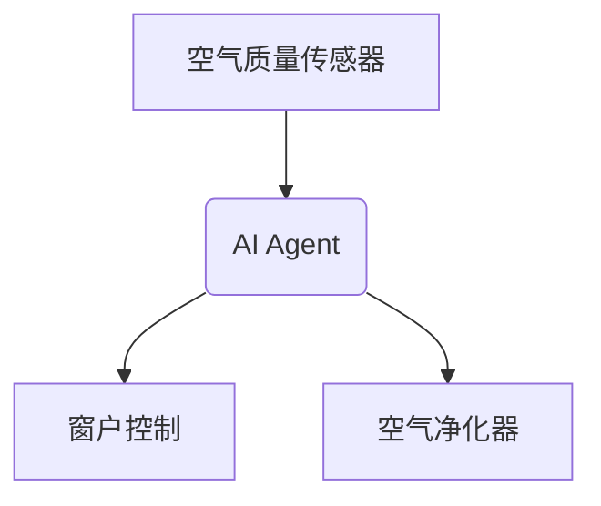

                 


# 智能窗台：AI Agent的室内空气净化

> 关键词：AI Agent，室内空气净化，智能窗台，空气质量监测，强化学习

> 摘要：本文探讨了AI Agent在室内空气净化中的应用，重点介绍智能窗台的设计与实现。通过分析空气质量监测、AI算法优化和系统架构，展示了如何利用AI技术提升室内空气质量。

---

# 第一部分: AI Agent与室内空气净化的背景与概念

## 第1章: AI Agent与室内空气净化的背景

### 1.1 AI Agent的基本概念
- **AI Agent的定义**：AI Agent是指能够感知环境并采取行动以实现目标的智能体。
- **特点**：自主性、反应性、目标导向。
- **在室内环境中的应用**：通过传感器和算法优化空气质量。

### 1.2 室内空气净化的背景与挑战
- **空气污染现状**：室内空气质量问题日益严重，传统净化方法效率低。
- **用户需求**：实时监测、自动调节、高效净化。

### 1.3 智能窗台的概念与目标
- **智能窗台**：结合AI Agent的窗户系统，通过传感器和算法优化室内空气质量。
- **目标**：实时监测、智能控制、提升空气质量。

---

## 第2章: 智能窗台的核心概念与系统模型

### 2.1 智能窗台的核心概念
- **空气质量监测**：通过传感器获取PM2.5、甲醛等数据。
- **AI代理决策**：基于传感器数据，AI Agent决定窗户和净化器的控制策略。

### 2.2 系统模型与功能模块
- **功能模块划分**：空气质量传感器、AI Agent、窗户控制、空气净化器。
- **系统模型**：Mermaid流程图展示系统各部分的交互。



---

# 第二部分: 智能窗台的算法原理与实现

## 第3章: AI Agent的核心算法

### 3.1 强化学习算法
- **强化学习**：通过奖励机制优化决策。
- **数学公式**：$ Q(s,a) = r + \gamma \max_{a'} Q(s',a') $

### 3.2 算法实现
- **Python代码示例**：展示强化学习算法的基本实现。

```python
class AI-Agent:
    def __init__(self):
        self.Q = {}
        self.alpha = 0.1
        self.gamma = 0.9

    def get_action(self, state):
        # 返回Q值最大的动作
        pass

    def update_Q(self, state, action, reward, next_state):
        # 更新Q值
        pass
```

---

## 第4章: 系统架构与设计

### 4.1 系统架构设计
- **系统架构图**：展示各模块的交互。


---

## 第5章: 项目实战

### 5.1 环境安装
- **安装传感器**：连接空气质量传感器到AI Agent。
- **配置系统**：安装必要的软件和库。

### 5.2 代码实现
- **空气质量监测**：编写代码读取传感器数据。
- **AI Agent决策**：根据数据生成控制指令。

### 5.3 案例分析
- **案例1**：PM2.5超标，AI Agent启动净化器。
- **案例2**：空气质量良好，AI Agent关闭净化器。

---

## 第6章: 总结与扩展

### 6.1 总结
- **核心内容回顾**：AI Agent优化室内空气质量，智能窗台提升舒适度。
- **注意事项**：传感器精度、算法优化、用户隐私。

### 6.2 扩展阅读
- **推荐书籍**：《强化学习入门》、《AI系统设计》。

---

# 作者：AI天才研究院 & 禅与计算机程序设计艺术

