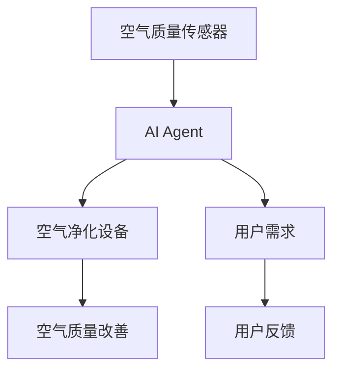
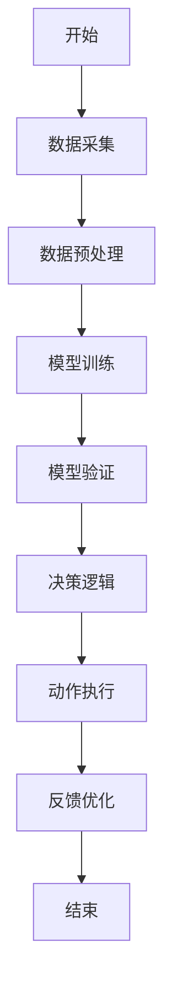
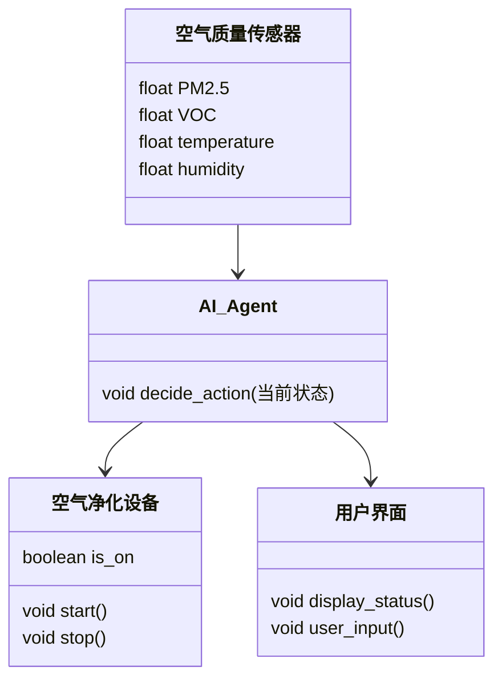
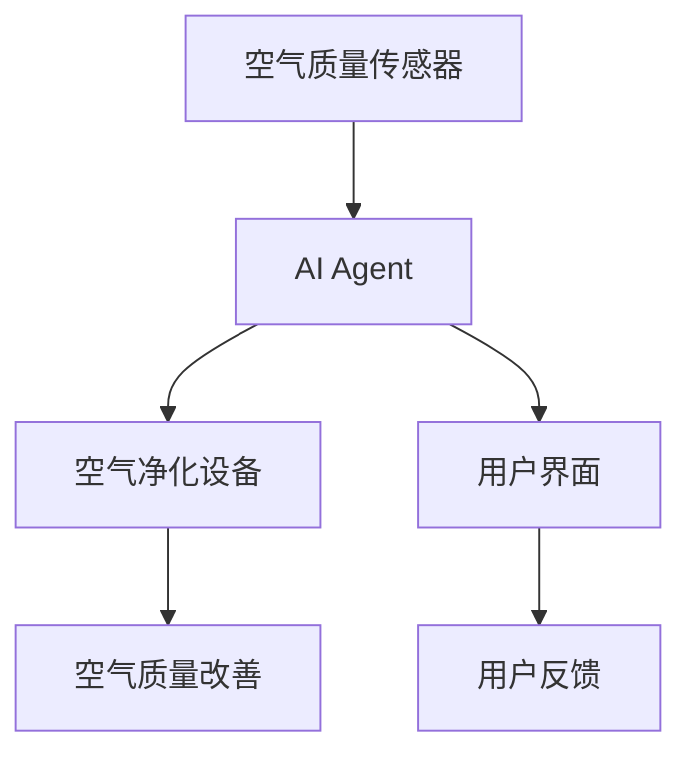
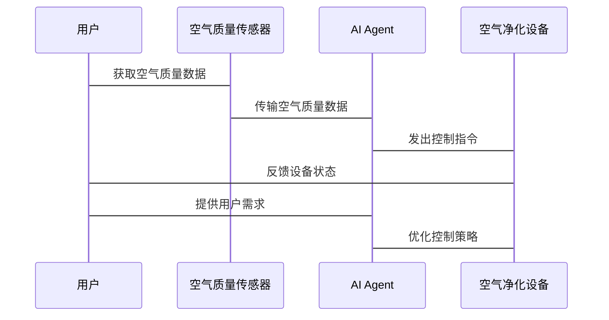

                 


# 智能窗台：AI Agent的室内空气净化控制

> 关键词：AI Agent，室内空气净化，智能窗台，空气质量优化，智能环境控制

> 摘要：随着室内空气质量问题的日益严重，传统的空气净化技术逐渐暴露出效率低下、能耗较高的缺点。本文提出了一种基于AI Agent的智能窗台系统，通过实时感知室内空气质量，结合智能决策算法，实现对空气净化设备的智能控制。本文从背景介绍、核心概念、算法原理、系统架构到项目实战，全面详细地阐述了智能窗台的实现过程与技术细节，为读者提供了一套完整的解决方案。

---

# 第一部分: 背景介绍

## 第1章: 智能窗台与AI Agent的背景

### 1.1 问题背景

#### 1.1.1 室内空气质量问题的现状
现代社会中，人们越来越关注室内空气质量问题。随着城市化进程的加快，室内空气污染问题日益严重。根据世界卫生组织的统计，全球约有90%的人生活在空气污染水平超标的环境中。传统的空气净化设备虽然能够有效去除空气中的有害物质，但其控制方式多为被动式的单一模式运行，无法根据实时空气质量进行智能调节，导致能源浪费和净化效率低下。

#### 1.1.2 空气净化技术的发展趋势
近年来，空气净化技术逐渐从单一的物理过滤向智能化、网络化方向发展。随着人工智能技术的快速发展，越来越多的智能设备开始融入空气净化领域。通过引入AI技术，空气净化设备能够实现对空气质量的实时感知、智能决策和自适应控制，从而提高净化效率，降低能耗。

#### 1.1.3 AI技术在环境控制中的应用潜力
AI技术在环境控制中的应用潜力巨大。通过机器学习算法，AI Agent能够根据室内空气质量数据、外部环境数据以及用户需求，实时优化空气净化策略。这种智能化的控制方式不仅能够提高净化效率，还能够显著降低能源消耗，为绿色建筑和可持续发展提供技术支持。

### 1.2 问题描述

#### 1.2.1 室内空气净化的核心问题
室内空气净化的核心问题在于如何实现对空气质量的实时监测、智能分析和动态控制。传统的空气净化设备多采用固定模式运行，无法根据实时环境变化进行调整，导致净化效率低下且能源浪费。

#### 1.2.2 智能窗台的定义与目标
智能窗台是一种基于AI技术的室内空气净化系统，其目标是通过实时感知室内空气质量，结合外部环境数据和用户需求，智能优化空气净化策略，实现高效净化和能源节约。

#### 1.2.3 AI Agent在空气净化中的角色
AI Agent在智能窗台中扮演着核心角色，负责数据采集、状态感知、决策制定和动作执行。通过AI Agent的智能决策，系统能够实现对空气净化设备的精准控制，从而达到最优的净化效果。

### 1.3 问题解决

#### 1.3.1 AI Agent如何实现空气净化控制
AI Agent通过实时采集室内空气质量数据，结合历史数据和外部环境信息，利用机器学习算法进行预测和优化，制定最优的空气净化策略，并通过执行机构实现对设备的智能控制。

#### 1.3.2 智能窗台的系统架构
智能窗台的系统架构主要包括数据采集模块、AI Agent决策模块、执行机构和用户界面四个部分。各模块协同工作，实现对室内空气质量的实时监测和智能控制。

#### 1.3.3 多目标优化与实时反馈机制
系统采用多目标优化算法，综合考虑空气质量改善、能源消耗和用户舒适度等多个目标，通过实时反馈机制不断优化净化策略，确保系统在多种约束条件下达到最优性能。

### 1.4 边界与外延

#### 1.4.1 智能窗台的适用场景
智能窗台适用于各种室内环境，包括家庭、办公室、学校等场所。特别适用于空气质量问题较为严重的区域，如交通繁忙区域、工业区附近的建筑。

#### 1.4.2 系统的边界条件
系统的边界条件包括室内空气质量数据、外部环境数据、设备状态数据和用户需求数据。系统通过这些数据进行分析和决策，实现对空气净化设备的智能控制。

#### 1.4.3 外延功能与扩展性
系统具有良好的扩展性，可以通过增加更多的传感器和执行机构，实现对更多环境参数的监测和控制。同时，系统支持与其他智能设备的联动，形成智能家居生态系统。

### 1.5 概念结构与核心要素

#### 1.5.1 核心概念的层次结构
智能窗台系统的层次结构包括感知层、决策层和执行层。感知层负责采集室内空气质量数据，决策层负责数据处理和策略制定，执行层负责设备控制和反馈。

#### 1.5.2 关键要素的定义与关系
- **感知层**：包括空气质量传感器、温湿度传感器等设备，负责采集室内环境数据。
- **决策层**：包括AI Agent和机器学习模型，负责对数据进行分析和决策。
- **执行层**：包括空气净化设备、智能窗户等执行机构，负责根据决策结果进行动作。

#### 1.5.3 系统的输入输出关系
- **输入**：室内空气质量数据、外部环境数据、用户需求数据。
- **输出**：空气净化策略、设备控制指令、系统反馈信息。

---

# 第二部分: 核心概念与联系

## 第2章: 核心概念与联系

### 2.1 AI Agent的基本原理

#### 2.1.1 AI Agent的定义与分类
AI Agent是一种能够感知环境、自主决策并执行任务的智能实体。根据应用场景的不同，AI Agent可以分为任务型Agent和反应型Agent两大类。

#### 2.1.2 状态感知与决策机制
AI Agent通过传感器获取环境数据，利用机器学习算法进行状态识别和预测，制定最优决策策略。

#### 2.1.3 多智能体协作与优化
在智能窗台系统中，多个AI Agent可以协作工作，实现对不同区域空气质量的优化控制。

### 2.2 室内空气净化的原理

#### 2.2.1 空气净化的基本原理
空气净化的基本原理包括过滤、吸附、分解和静电除尘等技术。通过这些技术，可以有效去除空气中的有害物质。

#### 2.2.2 常见空气净化技术的对比
常见的空气净化技术包括机械过滤、静电吸附、化学分解和负离子技术等。每种技术都有其优缺点，需要根据具体场景选择合适的方案。

#### 2.2.3 智能窗台的净化策略
智能窗台通过AI Agent的智能决策，动态调整空气净化设备的运行模式，实现对空气质量的精准控制。

### 2.3 核心概念的对比与联系

#### 2.3.1 AI Agent与传统控制系统的对比
| 对比维度 | AI Agent | 传统控制系统 |
|----------|-----------|--------------|
| 数据处理能力 | 强大，支持实时学习 | 有限，基于规则 |
| 决策能力 | 智能化，动态优化 | 刚性，固定模式 |
| 可扩展性 | 高，支持多设备协作 | 低，难以扩展 |

#### 2.3.2 系统的实体关系图（ER图）



---

# 第三部分: 算法原理讲解

## 第3章: AI Agent的算法原理

### 3.1 算法原理概述

#### 3.1.1 状态感知与数据处理
AI Agent通过空气质量传感器获取室内环境数据，利用数据预处理技术消除噪声，提取有效特征。

#### 3.1.2 决策模型的构建
基于机器学习算法，构建空气质量预测模型和净化策略优化模型。

#### 3.1.3 动作执行与反馈优化
AI Agent根据决策结果控制执行机构动作，并通过反馈机制不断优化模型参数。

### 3.2 算法实现流程

#### 3.2.1 数据采集与预处理
- 数据采集：通过空气质量传感器获取PM2.5、VOC、温湿度等数据。
- 数据预处理：去除噪声，归一化处理，提取特征。

#### 3.2.2 模型训练与优化
- 数据分割：将数据集分为训练集、验证集和测试集。
- 模型选择：选择合适的机器学习算法，如随机森林、支持向量机或神经网络。
- 模型训练：利用训练数据进行模型训练，优化参数。
- 模型验证：通过验证集评估模型性能，调整参数。

#### 3.2.3 动作决策与执行
- 决策逻辑：根据当前空气质量、设备状态和用户需求，制定最优净化策略。
- 动作执行：通过执行机构控制空气净化设备的动作。
- 反馈优化：收集执行结果，更新模型参数，优化决策策略。

### 3.3 算法流程图



### 3.4 算法实现代码

#### 3.4.1 数据预处理代码

```python
import pandas as pd
import numpy as np

# 数据加载
data = pd.read_csv('air_quality.csv')

# 数据清洗
data = data.dropna()
data = data.drop_duplicates()

# 数据标准化
from sklearn.preprocessing import StandardScaler
scaler = StandardScaler()
data_scaled = scaler.fit_transform(data[['PM2.5', 'VOC', 'temperature', 'humidity']])
```

#### 3.4.2 模型训练代码

```python
from sklearn.ensemble import RandomForestRegressor
from sklearn.metrics import mean_squared_error

# 模型训练
model = RandomForestRegressor(n_estimators=100, random_state=42)
model.fit(data_scaled, data['AQI'])

# 模型验证
预测值 = model.predict(data_scaled)
MSE = mean_squared_error(data['AQI'], 预测值)
print(f'MSE: {MSE}')
```

#### 3.4.3 决策逻辑代码

```python
# 决策逻辑
class AI_Agent:
    def __init__(self, model):
        self.model = model

    def decide_action(self, current_state):
        # 预测空气质量指数
        predicted_AQI = self.model.predict(current_state)
        # 判断是否需要开启净化设备
        if predicted_AQI > 100:
            return '开启净化设备'
        else:
            return '关闭净化设备'
```

---

# 第四部分: 系统分析与架构设计方案

## 第4章: 系统分析与架构设计

### 4.1 问题场景介绍

#### 4.1.1 系统目标
通过AI Agent实现室内空气质量的实时监测和智能控制，优化空气净化策略，降低能源消耗。

#### 4.1.2 系统范围
系统适用于家庭、办公室、学校等室内环境。

#### 4.1.3 系统约束
- 设备成本限制
- 数据采集频率
- 系统响应时间

### 4.2 系统功能设计

#### 4.2.1 领域模型类图



#### 4.2.2 系统架构图



#### 4.2.3 接口设计
- 空气质量传感器接口：提供PM2.5、VOC、温湿度等数据接口。
- AI Agent接口：提供决策逻辑接口和状态反馈接口。
- 空气净化设备接口：提供设备控制接口和状态反馈接口。
- 用户界面接口：提供人机交互接口和状态显示接口。

#### 4.2.4 交互流程图



---

## 总结

通过以上思考，我们可以看到，智能窗台系统的实现需要综合运用AI技术、传感器技术和控制技术。通过AI Agent的智能决策，系统能够实现对室内空气质量的实时监测和智能控制，从而达到高效净化和能源节约的目的。在实际应用中，系统需要根据具体场景进行优化和调整，以满足不同用户的需求。

---

作者：AI天才研究院/AI Genius Institute & 禅与计算机程序设计艺术/Zen And The Art of Computer Programming

