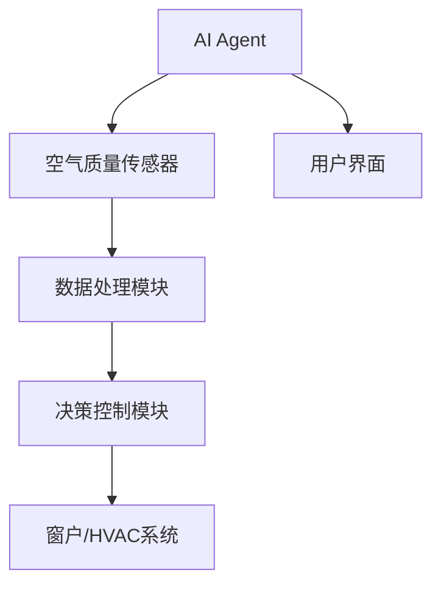

                 


# 智能窗台：AI Agent的室内空气质量监测

> 关键词：AI Agent，室内空气质量，智能窗台，算法原理，系统架构

> 摘要：本文详细探讨了智能窗台系统中AI Agent在室内空气质量监测中的应用，从背景介绍、核心概念、算法原理、系统架构到项目实战，全面解析了如何利用AI技术优化室内空气质量监测与管理。

---

## 第一部分: 背景介绍

### 第1章: 智能窗台与AI Agent概述

#### 1.1 问题背景与目标
- 1.1.1 室内空气质量问题的背景  
  - 随着城市化进程加快，室内空气质量问题日益严重，尤其是PM2.5、甲醛等污染物对人体健康的威胁。  
  - 传统空气质量监测设备存在数据采集不全面、反馈延迟等问题，无法满足实时优化的需求。  

- 1.1.2 智能窗台的概念与目标  
  - 智能窗台是一种结合物联网和人工智能技术的智能家居设备，通过实时监测室内空气质量，并利用AI Agent实现自动化调节。  
  - 目标是实现智能化、自动化、个性化的室内空气质量管理，提升居住舒适度和健康水平。  

- 1.1.3 AI Agent在智能窗台中的作用  
  - AI Agent（智能代理）是智能窗台的核心，负责数据采集、分析、决策和执行。  
  - 它能够根据室内空气质量数据，自动调整窗户开合、 HVAC（暖通空调）系统等，实现最优空气质量控制。  

#### 1.2 问题描述与解决思路
- 1.2.1 室内空气质量监测的挑战  
  - 数据采集：传感器种类繁多，数据准确性与稳定性是关键。  
  - 数据分析：空气质量数据复杂，需要实时分析并做出决策。  
  - 系统集成：需要与智能家居系统（如窗户、空调）无缝对接，实现自动化控制。  

- 1.2.2 AI Agent如何优化空气质量  
  - AI Agent通过机器学习模型实时分析空气质量数据，预测未来趋势，并根据预设规则或用户偏好调整窗户和 HVAC 系统。  
  - 通过历史数据积累，AI Agent能够不断优化算法，提高预测精度和控制效率。  

- 1.2.3 智能窗台的系统架构与实现  
  - 系统架构：传感器-数据处理-决策控制-执行机构的闭环架构。  
  - 实现步骤：硬件选型、数据采集、算法开发、系统集成与测试。  

---

## 第二部分: 核心概念与联系

### 第2章: AI Agent的基本原理

#### 2.1 AI Agent的定义与属性
- AI Agent：智能代理，是一种能够感知环境、自主决策并执行任务的计算机系统。  
- 核心属性：感知能力（数据采集）、决策能力（算法分析）、执行能力（控制输出）、学习能力（优化算法）。  

#### 2.2 智能窗台中的AI Agent功能
- 数据采集：通过传感器获取室内空气质量参数（如PM2.5、CO2、温度、湿度）。  
- 数据分析：利用机器学习模型对空气质量进行分类、预测和评估。  
- 自动控制：根据分析结果，决策是否开启窗户或调整 HVAC 系统。  
- 优化学习：通过历史数据不断优化空气质量预测和控制策略。  

#### 2.3 AI Agent与室内空气质量的关系
- AI Agent通过实时监测和分析空气质量数据，能够快速响应空气质量变化，确保室内环境始终处于健康、舒适的水平。  
- 通过与智能家居系统的结合，AI Agent实现了室内空气质量的智能化管理，减少了人工干预，提高了效率。  

---

## 第三部分: 算法原理讲解

### 第3章: AI Agent的核心算法

#### 3.1 数据分析算法
- 机器学习模型：使用回归分析或分类算法对空气质量数据进行建模。  
- 示例：基于PM2.5、CO2浓度的线性回归模型，预测空气质量指数（AQI）。  

#### 3.2 决策算法
- 基于规则的决策：根据AQI指数，决定是否开启窗户或调整 HVAC 系统。  
- 基于强化学习的决策：通过奖励机制优化决策策略，减少能耗同时保证空气质量。  

#### 3.3 算法实现代码
```python
import numpy as np
from sklearn.linear_model import LinearRegression

# 示例：基于PM2.5和CO2浓度的线性回归模型
def train_model(X, y):
    model = LinearRegression()
    model.fit(X, y)
    return model

# 示例：空气质量预测
def predict_aqi(pm25, co2, model):
    return model.predict([[pm25, co2]])[0][0]

# 示例：决策逻辑
def decide_action(aqi):
    if aqi > 100:
        return 'open_window'
    else:
        return 'close_window'
```

---

## 第四部分: 系统分析与架构设计

### 第4章: 系统架构设计

#### 4.1 系统功能设计
- 数据采集模块：通过传感器获取空气质量数据。  
- 数据处理模块：对数据进行清洗、分析和预测。  
- 决策控制模块：根据分析结果，生成控制指令。  
- 执行模块：通过智能家居系统执行窗户或 HVAC 系统的调整。  

#### 4.2 系统架构图（Mermaid）


---

## 第五部分: 项目实战

### 第5章: 实践与案例分析

#### 5.1 环境安装与配置
- 硬件：PM2.5传感器、CO2传感器、窗户电机、HVAC系统。  
- 软件：Python编程环境、机器学习库（如scikit-learn）、智能家居API。  

#### 5.2 核心功能实现
- 数据采集：编写代码读取传感器数据。  
- 数据分析：训练机器学习模型，预测AQI。  
- 自动控制：根据AQI结果，调用智能家居API控制窗户或 HVAC 系统。  

#### 5.3 案例分析
- 案例1：PM2.5浓度超标，AI Agent自动开启窗户，改善空气质量。  
- 案例2：CO2浓度过高，AI Agent调整 HVAC 系统，降低室内污染物浓度。  

---

## 第六部分: 最佳实践与总结

### 第6章: 最佳实践

#### 6.1 小结
- 智能窗台通过AI Agent实现了室内空气质量的智能化管理，显著提升了居住舒适度和健康水平。  
- AI Agent的核心在于算法优化和系统集成，未来可以通过边缘计算进一步提升效率。  

#### 6.2 注意事项
- 数据采集的准确性直接影响算法效果，需要选择可靠的传感器。  
- 系统集成时，需确保各模块之间的兼容性和稳定性。  
- 用户隐私保护：空气质量数据可能包含用户信息，需注意数据安全。  

#### 6.3 拓展阅读
- 推荐阅读《机器学习实战》（Hands-On Machine Learning with Scikit-Learn, Keras, and TensorFlow）  
- 参考智能家居相关技术文档，了解更复杂的系统集成方案。  

---

## 作者：AI天才研究院 & 禅与计算机程序设计艺术

