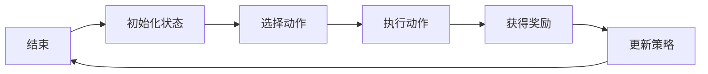
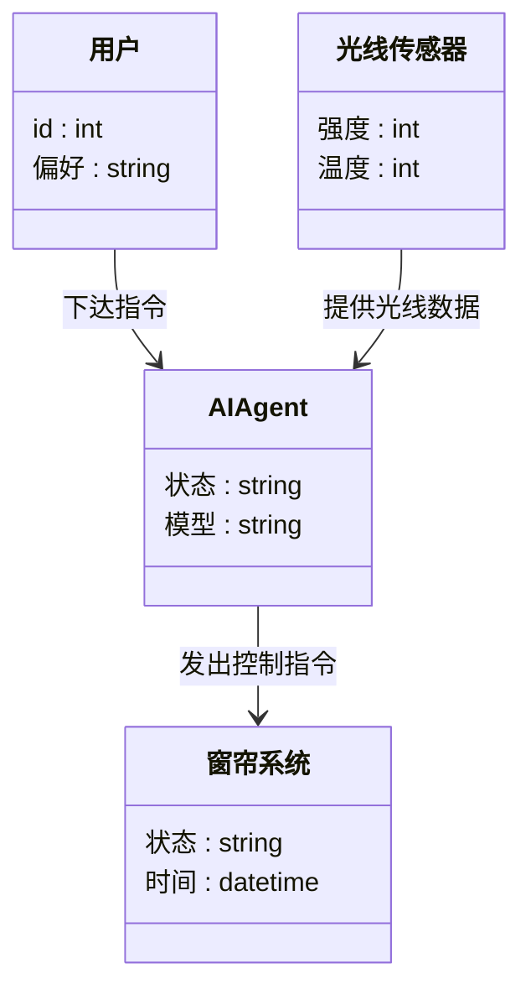
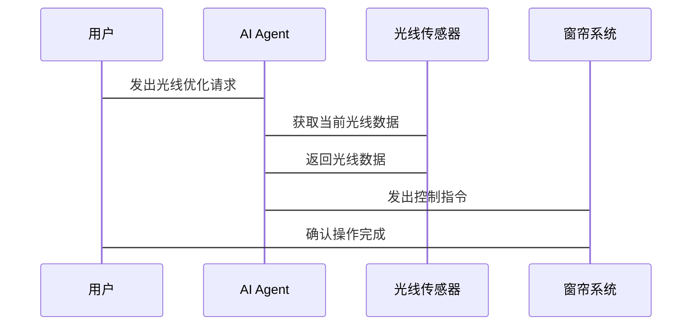

                 


# 智能窗帘：AI Agent的室内光线优化

## 关键词：
智能窗帘，AI Agent，室内光线优化，强化学习，物联网，智能家居

## 摘要：
本文探讨了如何利用AI Agent优化智能窗帘的室内光线调节。通过分析AI Agent的核心原理、算法实现、系统架构及项目实战，详细讲解了智能窗帘在优化室内光线中的应用。本文还提供了实际案例和最佳实践，帮助读者全面理解并应用相关技术。

---

# 第1章 智能窗帘与AI Agent的背景

## 1.1 问题背景与描述

### 1.1.1 室内光线优化的重要性
室内光线的合理调节对人们的舒适度和健康至关重要。充足的自然光可以提升情绪，减少能源消耗，降低电费开支。然而，传统窗帘无法根据光线变化自动调整，这使得光线优化变得困难。

### 1.1.2 智能窗帘的发展历程
智能窗帘经历了从手动到自动化的演变。早期的智能窗帘可以通过手机APP控制开关，但缺乏智能化的光线调节功能。随着AI技术的发展，智能窗帘逐渐具备了自动优化光线的能力。

### 1.1.3 AI Agent在智能窗帘中的应用
AI Agent（智能体）是一种能够感知环境并采取行动以实现目标的实体。在智能窗帘中，AI Agent负责收集光线数据，分析用户偏好，并调整窗帘的开合程度，以达到最优的光线效果。

## 1.2 问题解决与边界

### 1.2.1 室内光线优化的解决方案
AI Agent通过实时监测室内光线强度、颜色温度和用户习惯，优化窗帘的开合，以提供舒适且节能的室内环境。

### 1.2.2 智能窗帘系统的边界与外延
智能窗帘系统主要关注光线调节，与其他家居系统（如温度控制、安防系统）通过物联网进行联动，提供更全面的家居体验。

### 1.2.3 核心概念与组成要素
智能窗帘系统由传感器、执行器、AI Agent和用户界面组成。传感器负责收集数据，执行器调整窗帘，AI Agent进行决策，用户界面提供交互。

---

# 第2章 AI Agent与智能窗帘的核心概念

## 2.1 核心概念原理

### 2.1.1 AI Agent的基本原理
AI Agent通过感知环境、分析数据、做出决策并执行动作。在智能窗帘中，AI Agent接收光线传感器的数据，分析用户偏好，并通过电机调整窗帘位置。

### 2.1.2 智能窗帘的工作原理
智能窗帘通过光线传感器监测室内光线强度，AI Agent分析数据，决定窗帘的开合程度，从而优化室内光线。

## 2.2 核心概念属性对比

| 特性        | AI Agent                     | 智能窗帘                     |
|-------------|----------------------------|-----------------------------|
| 输入         | 光线数据、用户指令          | 用户指令、传感器数据         |
| 输出         | 窗帘控制指令                | 光线优化结果                 |
| 目标         | 优化室内光线                | 提供舒适环境                 |

### 2.3 ER实体关系图
```mermaid
erDiagram
    user {
        id : int
        username : string
        role : string
    }
   窗帘系统 {
        id : int
        status : string
        time : datetime
    }
    AI Agent {
        id : int
        model : string
        version : string
    }
    user -> 窗帘系统 : 控制
    AI Agent -> 窗帘系统 : 优化
```

---

# 第3章 基于强化学习的光线优化算法

## 3.1 强化学习算法概述

### 3.1.1 强化学习的基本概念
强化学习是一种通过试错学习的算法，智能体通过与环境互动，获得奖励或惩罚，从而学习最优策略。

### 3.1.2 状态、动作和奖励的定义
- **状态(S)**：当前光线强度和颜色温度。
- **动作(A)**：调整窗帘的开合程度。
- **奖励(R)**：用户满意度或节能效果。

## 3.2 算法流程



## 3.3 数学模型与公式

### 3.3.1 状态空间定义
$$ S = \{0, 1\} $$
- 0表示窗帘关闭，1表示窗帘打开。

### 3.3.2 动作空间定义
$$ A = \{0, 1\} $$
- 0表示关闭窗帘，1表示打开窗帘。

### 3.3.3 奖励函数
$$ R(s, a) = r_1 \times s_{next} + r_2 \times (1 - s_{current}) $$
其中，$r_1$和$r_2$是奖励权重。

---

# 第4章 系统分析与架构设计

## 4.1 问题场景介绍

### 4.1.1 问题场景描述
用户希望智能窗帘能够根据光线变化和生活习惯，自动调整窗帘开合，优化室内光线。

## 4.2 系统功能设计

### 4.2.1 领域模型类图


## 4.3 系统架构设计

### 4.3.1 整体架构图


## 4.4 系统接口设计

### 4.4.1 系统交互序列图


---

# 第5章 项目实战

## 5.1 环境安装

### 5.1.1 环境要求
- Python 3.8+
- 窗帘电机驱动模块
- 光线传感器模块
- IoT平台（如MQTT）

## 5.2 核心代码实现

### 5.2.1 AI Agent核心代码
```python
import numpy as np

class AI-Agent:
    def __init__(self):
        self.state = 0  # 0: 关闭，1: 打开
        self.reward = 0

    def receive_data(self, light_intensity, light_temp):
        # 处理光线数据
        pass

    def decide_action(self):
        # 基于当前状态和数据，选择动作
        action = np.random.randint(0, 2)
        return action

    def update_policy(self, reward):
        # 更新策略
        self.reward += reward
```

### 5.2.2 窗帘系统实现
```python
import RPi.GPIO as GPIO

class Curtain_System:
    def __init__(self, motor_pin):
        self.motor_pin = motor_pin
        GPIO.setup(motor_pin, GPIO.OUT)

    def open(self):
        GPIO.output(self.motor_pin, GPIO.HIGH)

    def close(self):
        GPIO.output(self.motor_pin, GPIO.LOW)
```

## 5.3 代码应用解读

### 5.3.1 AI Agent代码解读
AI Agent接收光线传感器的数据，根据强化学习算法决定窗帘的开合动作。奖励机制用于优化AI Agent的决策策略。

### 5.3.2 窗帘系统代码解读
窗帘系统通过GPIO控制电机，接收AI Agent的指令，执行开合动作。

## 5.4 实际案例分析

### 5.4.1 案例背景
用户希望在早晨8点自动开启窗帘，当光线过强时自动调节窗帘开合度。

### 5.4.2 优化过程
AI Agent根据光线传感器数据，调整窗帘开合，优化室内光线，同时考虑用户的作息习惯。

---

# 第6章 最佳实践与小结

## 6.1 优化策略总结
1. 根据用户习惯和光线数据，动态调整窗帘开合。
2. 结合物联网平台，实现与其他家居设备的联动。

## 6.2 注意事项
- 确保数据采集的准确性。
- 定期更新AI Agent的模型，以适应用户需求的变化。
- 考虑隐私和数据安全问题。

## 6.3 拓展阅读
建议深入学习强化学习和物联网技术，探索更多智能家居的创新应用。

---

# 作者：AI天才研究院/AI Genius Institute & 禅与计算机程序设计艺术 /Zen And The Art of Computer Programming

---

以上是《智能窗帘：AI Agent的室内光线优化》的完整目录和内容概要。按照这个结构，你可以逐步展开每一部分的具体内容，确保文章的深度和广度，帮助读者全面理解智能窗帘与AI Agent的结合及其在优化室内光线中的应用。

