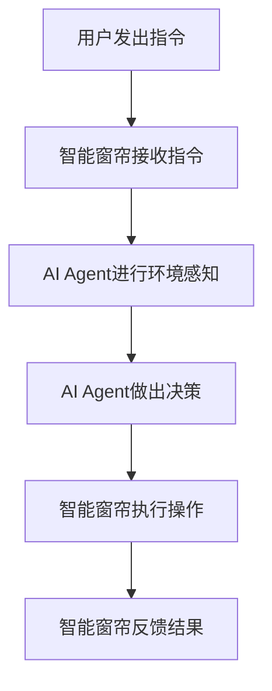
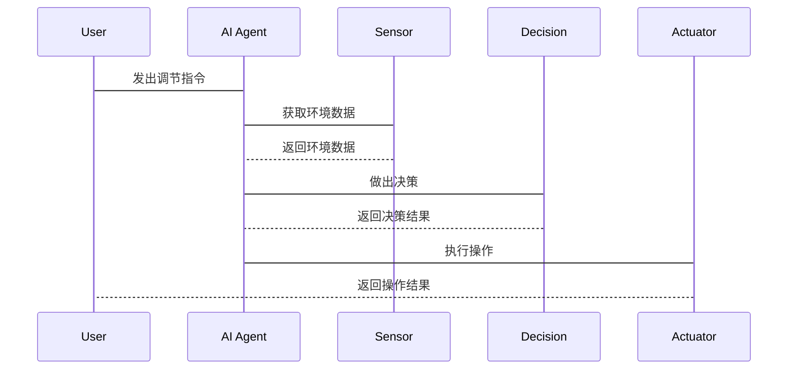

                 


# 智能窗帘：AI Agent的室内环境全面调节

## 关键词：智能窗帘，AI Agent，室内环境，智能家居，物联网，人工智能

## 摘要：  
本文深入探讨了智能窗帘与AI Agent的结合，分析了其在室内环境调节中的应用。文章从背景介绍、核心概念、算法原理、系统架构、项目实战到最佳实践，全面解析了智能窗帘如何通过AI技术实现智能化调节。通过详细的技术分析和实际案例，展示了AI Agent在智能窗帘中的核心作用，为智能家居的发展提供了新的思路。

---

# 第一部分：智能窗帘与AI Agent的背景介绍

## 第1章：智能窗帘的发展与应用

### 1.1 智能窗帘的概念与发展

#### 1.1.1 窗帘的历史演变  
窗帘作为人类生活中的重要家居产品，经历了从手动操作到半自动化，再到完全智能化的演变过程。随着科技的进步，智能窗帘逐渐成为智能家居的重要组成部分。

#### 1.1.2 智能窗帘的定义与特征  
智能窗帘是指通过物联网技术、人工智能算法和自动化控制系统实现智能化操作的窗帘。其核心特征包括远程控制、环境感知、智能调节和能源节约。

#### 1.1.3 智能窗帘的应用场景与优势  
智能窗帘广泛应用于家庭、办公室、酒店等多种场景。其优势在于能够根据室内环境和用户需求自动调节窗帘的开合状态，从而优化室内光线、温度和空气质量。

### 1.2 AI Agent的基本概念与作用

#### 1.2.1 AI Agent的定义与核心功能  
AI Agent（智能代理）是指能够感知环境、自主决策并执行任务的智能实体。其核心功能包括感知、决策和执行。

#### 1.2.2 AI Agent在智能窗帘中的应用  
AI Agent在智能窗帘中的应用主要体现在环境感知、智能决策和自动化控制。例如，AI Agent可以根据室内温度、光线强度和用户习惯自动调节窗帘的开合状态。

#### 1.2.3 AI Agent与其他智能家居设备的协同  
AI Agent可以与其他智能家居设备（如智能音箱、智能灯泡等）协同工作，形成一个完整的智能家居生态系统。

### 1.3 智能窗帘的市场现状与未来趋势

#### 1.3.1 智能窗帘的市场现状分析  
当前，智能窗帘市场增长迅速，主要驱动因素包括智能家居的普及和物联网技术的发展。

#### 1.3.2 未来发展趋势与挑战  
未来，智能窗帘将更加智能化和个性化，同时需要克服技术瓶颈和成本问题。

#### 1.3.3 技术创新对智能窗帘的影响  
技术创新（如AI算法优化和传感器技术进步）将进一步提升智能窗帘的功能和用户体验。

---

# 第二部分：智能窗帘与AI Agent的核心概念与联系

## 第2章：AI Agent在智能窗帘中的核心原理

### 2.1 AI Agent的基本原理

#### 2.1.1 AI Agent的感知与决策机制  
AI Agent通过传感器获取环境数据（如光线强度、温度、湿度等），并基于这些数据进行决策。

#### 2.1.2 AI Agent的执行与反馈机制  
AI Agent根据决策结果执行动作（如开启或关闭窗帘），并根据反馈信息调整后续操作。

#### 2.1.3 AI Agent的自适应与学习能力  
AI Agent可以通过机器学习算法不断优化自身的决策模型，提高调节的精准度。

### 2.2 智能窗帘与AI Agent的实体关系分析

#### 2.2.1 实体关系图（ER图）  
以下是智能窗帘与AI Agent的实体关系图：

```mermaid
erDiagram
    actor User {
        string name
        string userid
    }
    smart_curtain "智能窗帘" {
        string curtain_id
        int position
        status status
    }
    ai_agent "AI Agent" {
        string agent_id
        algorithm algorithm
    }
    User --> smart_curtain: 控制
    smart_curtain --> ai_agent: 调节
    ai_agent --> smart_curtain: 反馈
```

#### 2.2.2 AI Agent与智能窗帘的交互流程  
以下是AI Agent与智能窗帘的交互流程图：



---

# 第三部分：智能窗帘的系统架构与算法原理

## 第3章：智能窗帘的系统架构设计

### 3.1 系统架构概述

#### 3.1.1 系统整体架构图  
以下是智能窗帘系统的整体架构图：


#### 3.1.2 系统功能模块划分  
智能窗帘系统主要由传感器模块、AI Agent模块和执行机构模块组成。

#### 3.1.3 系统的分层架构设计  
智能窗帘系统采用分层架构，包括数据层、服务层和应用层。

### 3.2 系统功能设计

#### 3.2.1 用户需求分析  
用户需求包括远程控制、智能调节和节能环保。

#### 3.2.2 系统功能模块设计  
系统功能模块包括环境感知模块、决策模块和执行模块。

#### 3.2.3 系统的交互流程  
以下是系统的交互流程图：



---

## 第4章：智能窗帘的算法原理与实现

### 4.1 算法原理

#### 4.1.1 环境感知算法  
环境感知算法包括光线强度检测和温度检测。

#### 4.1.2 智能决策算法  
智能决策算法采用模糊控制和机器学习模型。

#### 4.1.3 自动化调节算法  
自动化调节算法包括位置控制和力度控制。

### 4.2 算法实现

#### 4.2.1 模糊控制算法  
以下是模糊控制算法的Python实现示例：

```python
def fuzzy_control(light_intensity, temperature):
    # 定义模糊规则
    if light_intensity < 50 and temperature < 20:
        return "close"
    elif light_intensity > 80 or temperature > 25:
        return "open"
    else:
        return "adjust"
```

#### 4.2.2 机器学习模型  
以下是基于机器学习的窗帘调节模型：

```python
import numpy as np
from sklearn import tree

# 数据准备
X = np.array([[80, 22], [60, 20], [90, 25], [70, 23]])
y = np.array(["open", "close", "open", "adjust"])

# 训练决策树模型
model = tree.DecisionTreeClassifier()
model.fit(X, y)

# 预测新数据
new_data = np.array([[75, 22]])
prediction = model.predict(new_data)
print("预测结果：", prediction)
```

---

## 第5章：智能窗帘的系统实现与测试

### 5.1 系统实现

#### 5.1.1 环境搭建  
环境搭建包括硬件设备和软件环境的配置。

#### 5.1.2 核心代码实现  
以下是核心代码实现：

```python
import RPi.GPIO as GPIO
import time

# 设置GPIO模式
GPIO.setmode(GPIO.BCM)

# 定义窗帘控制引脚
curtain_pin = 17

# 初始化窗帘状态
curtain_state = "close"

# 定义窗帘控制函数
def control_curtain(action):
    global curtain_state
    if action == "open":
        GPIO.output(curtain_pin, GPIO.HIGH)
        time.sleep(2)
        curtain_state = "open"
    elif action == "close":
        GPIO.output(curtain_pin, GPIO.LOW)
        time.sleep(2)
        curtain_state = "close"
    elif action == "adjust":
        # 部分打开窗帘
        pass

# 调用控制函数
control_curtain("open")
```

#### 5.1.3 系统测试与优化  
系统测试包括功能测试和性能测试。

---

## 第6章：智能窗帘的应用案例与总结

### 6.1 实际应用案例

#### 6.1.1 案例分析  
以下是智能窗帘在家庭环境中的实际应用案例。

#### 6.1.2 案例效果  
案例结果显示，智能窗帘能够有效调节室内环境，提升用户体验。

### 6.2 项目总结

#### 6.2.1 项目成功经验  
项目的成功经验包括技术创新和团队协作。

#### 6.2.2 项目不足与改进方向  
项目在成本控制和用户体验方面还有改进空间。

---

# 第四部分：智能窗帘的未来展望与最佳实践

## 第7章：智能窗帘的未来展望

### 7.1 技术创新与发展趋势  
未来，智能窗帘将更加智能化和个性化。

### 7.2 市场前景与投资机会  
智能窗帘市场前景广阔，具有较大的投资机会。

---

## 第8章：智能窗帘的最佳实践

### 8.1 最佳实践 tips  
- 定期维护设备
- 及时更新软件
- 注意数据安全

### 8.2 小结  
智能窗帘通过AI Agent的调节，能够显著提升室内环境的舒适度。

### 8.3 注意事项  
- 确保设备安全
- 遵守使用规范
- 处理好隐私问题

### 8.4 拓展阅读  
推荐阅读相关书籍和文献，进一步了解智能窗帘和AI Agent的技术细节。

---

# 结语

智能窗帘作为智能家居的重要组成部分，通过AI Agent的调节，能够实现室内环境的全面优化。未来，随着技术的进步，智能窗帘将更加智能化和个性化，为用户带来更好的体验。

---

# 作者：AI天才研究院（AI Genius Institute） & 禅与计算机程序设计艺术（Zen And The Art of Computer Programming）

