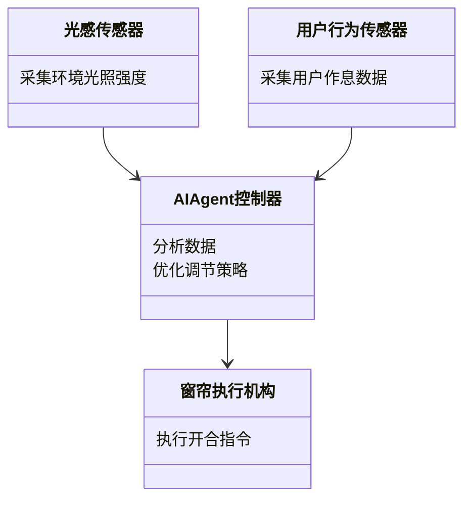
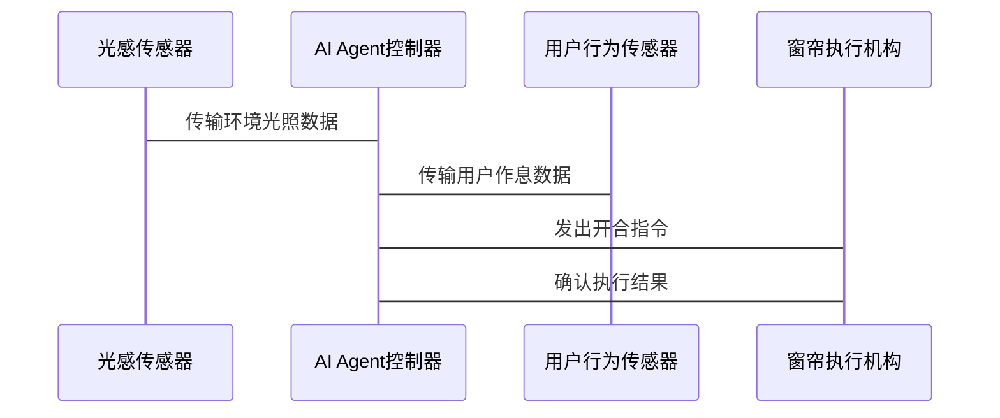

                 


# 智能窗帘：AI Agent的昼夜节律调节助手

## 关键词：
智能窗帘，AI Agent，昼夜节律，时间序列分析，强化学习，系统架构

## 摘要：
智能窗帘通过AI Agent技术，能够根据用户的昼夜节律习惯自动调节窗帘的开合，以优化用户的睡眠质量和生活节奏。本文将从昼夜节律的科学依据出发，详细探讨AI Agent在智能窗帘中的应用，包括算法原理、系统架构设计和实际案例分析，帮助读者全面理解智能窗帘的工作机制及其在改善人类生活品质中的潜力。

---

## 第1章：智能窗帘与AI Agent的背景与概念

### 1.1 昼夜节律的重要性

#### 1.1.1 昼夜节律的定义与作用
昼夜节律是指生物体内与24小时周期相关的生理过程，主要受光照和黑暗的影响。合理的昼夜节律有助于提高睡眠质量，增强免疫力，提升工作效率。

#### 1.1.2 不规律昼夜节律的危害
不规律的昼夜节律可能导致失眠、疲劳、注意力不集中等问题，甚至引发严重的健康问题，如糖尿病和抑郁症。

#### 1.1.3 智能窗帘在调节昼夜节律中的作用
智能窗帘能够根据用户的作息习惯和环境光线自动调节开合，帮助用户建立规律的昼夜节律，改善睡眠质量。

### 1.2 智能窗帘的发展历程

#### 1.2.1 传统窗帘的功能与局限
传统窗帘仅具备手动开关功能，无法根据环境和用户需求自动调节，存在功能单一、操作不便等问题。

#### 1.2.2 智能化窗帘的出现与演变
随着物联网技术的发展，智能窗帘逐渐普及，具备了远程控制、自动化调节等功能，但其智能化程度仍有提升空间。

#### 1.2.3 当前智能窗帘的技术现状
当前智能窗帘结合了光感传感器、AI算法和物联网技术，能够实现基于用户行为和环境数据的智能调节。

### 1.3 AI Agent的基本概念

#### 1.3.1 什么是AI Agent
AI Agent（人工智能代理）是指能够感知环境、自主决策并执行任务的智能实体，能够在复杂环境中优化目标的实现。

#### 1.3.2 AI Agent的核心特征
- **自主性**：能够自主决策，无需外部干预。
- **反应性**：能够实时感知环境变化并做出响应。
- **目标导向**：以特定目标为导向，优化决策过程。

#### 1.3.3 AI Agent在智能窗帘中的应用
AI Agent通过分析用户的作息习惯和环境数据，优化窗帘的开合时间，帮助用户建立规律的昼夜节律。

---

## 第2章：AI Agent与智能窗帘的核心概念

### 2.1 昼夜节律调节的科学依据

#### 2.1.1 光照对昼夜节律的影响
光照是调节昼夜节律的主要因素，早晨的光照有助于唤醒身体，夜晚的光照则会影响睡眠。

#### 2.1.2 睡眠周期的规律
人类的睡眠周期包括REM睡眠和非REM睡眠，AI Agent可以根据用户的睡眠周期调整窗帘的开合时间。

#### 2.1.3 环境因素对昼夜节律的调节作用
温度、湿度和光线等多种环境因素都会影响昼夜节律，AI Agent可以通过综合分析这些因素优化调节策略。

### 2.2 AI Agent在昼夜节律调节中的角色

#### 2.2.1 AI Agent如何感知环境
AI Agent通过光感传感器和用户行为数据感知环境，分析用户的作息习惯和环境光照变化。

#### 2.2.2 AI Agent如何分析用户行为
AI Agent利用机器学习算法分析用户的作息规律，预测用户的睡眠需求，并优化窗帘的调节策略。

#### 2.2.3 AI Agent如何优化调节策略
AI Agent通过强化学习不断优化调节策略，确保用户的昼夜节律得到最佳调节。

### 2.3 智能窗帘与AI Agent的系统架构

#### 2.3.1 系统组成模块
- **光感传感器**：采集环境光照数据。
- **用户行为传感器**：采集用户的作息数据。
- **AI Agent控制器**：分析数据并控制窗帘的开合。

#### 2.3.2 各模块之间的关系
通过数据流图展示各模块之间的交互关系，AI Agent控制器是核心模块，负责协调各模块的工作。

#### 2.3.3 系统的整体功能描述
系统通过AI Agent分析用户行为和环境数据，自动调节窗帘的开合时间，优化用户的昼夜节律。

---

## 第3章：昼夜节律调节的数学模型与算法原理

### 3.1 昼夜节律调节的数学模型

#### 3.1.1 时间序列分析模型
使用ARIMA模型预测用户的作息规律，分析历史数据以预测未来的作息时间。

#### 3.1.2 周期性函数模型
通过傅里叶变换分析用户的作息周期，提取周期性规律。

#### 3.1.3 用户行为预测模型
利用线性回归模型预测用户的起床和入睡时间。

### 3.2 AI Agent的算法原理

#### 3.2.1 强化学习算法
通过Q-learning算法优化窗帘的开合时间，奖励函数基于用户的睡眠质量。

#### 3.2.2 监督学习算法
利用回归算法预测用户的作息时间，并根据实际数据调整预测模型。

#### 3.2.3 聚类分析算法
将用户的作息数据进行聚类分析，识别用户的作息规律。

### 3.3 算法实现的数学公式

#### 3.3.1 强化学习的Q-learning算法公式
$$ Q(s, a) = Q(s, a) + \alpha (r + \max Q(s', a') - Q(s, a)) $$

#### 3.3.2 时间序列分析的ARIMA模型公式
$$ ARIMA(p, d, q) $$

#### 3.3.3 用户行为预测的线性回归模型公式
$$ y = \beta_0 + \beta_1 x + \epsilon $$

---

## 第4章：智能窗帘系统的系统分析与架构设计

### 4.1 系统功能设计

#### 4.1.1 光感传感器数据采集
通过光感传感器采集环境光照强度，并传输到AI Agent控制器。

#### 4.1.2 用户行为数据采集
通过用户行为传感器采集用户的作息数据，包括起床时间和入睡时间。

#### 4.1.3 AI Agent控制器的数据处理
AI Agent控制器分析传感器数据和用户行为数据，优化窗帘的调节策略。

### 4.2 系统架构设计

#### 4.2.1 领域模型类图
使用mermaid类图展示系统模块之间的关系，包括传感器、AI Agent控制器和执行机构。



#### 4.2.2 系统架构图
使用mermaid架构图展示系统的整体架构，包括前端、后端和云端。


#### 4.2.3 系统接口设计
定义系统的接口，包括传感器数据接口、用户交互接口和云端接口。

#### 4.2.4 系统交互序列图
使用mermaid序列图展示系统的交互流程，从数据采集到窗帘调节的整个过程。



---

## 第5章：项目实战与案例分析

### 5.1 环境安装

#### 5.1.1 安装Python和必要的库
安装Python 3.8及以上版本，安装TensorFlow、Keras、pandas等库。

#### 5.1.2 安装智能窗帘系统
安装硬件设备，包括光感传感器、用户行为传感器和窗帘执行机构。

### 5.2 核心代码实现

#### 5.2.1 传感器数据采集代码
```python
import numpy as np
import pandas as pd

# 光感传感器数据采集
def get_light_data():
    light_sensor = pd.read_csv('light_sensor_data.csv')
    return light_sensor['light_intensity']

# 用户行为传感器数据采集
def get_user_behavior_data():
    user_sensor = pd.read_csv('user_behavior.csv')
    return user_sensor['sleep_time']
```

#### 5.2.2 AI Agent算法实现
```python
# 强化学习算法实现
class AI-Agent:
    def __init__(self):
        self.Q_table = {}

    def learn(self, state, action, reward):
        self.Q_table[(state, action)] = self.Q_table.get((state, action), 0) + alpha * (reward + max(self.Q_table.get((next_state, action), 0)) - self.Q_table.get((state, action), 0))
```

#### 5.2.3 窗帘调节逻辑实现
```python
# 窗帘调节逻辑实现
def adjust窗帘():
    current_time = datetime.now().hour
    if current_time < 7:
        窗帘.close()
    elif current_time > 22:
        窗帘.open()
```

### 5.3 实际案例分析

#### 5.3.1 案例背景
用户A长期存在睡眠问题，希望通过智能窗帘改善作息规律。

#### 5.3.2 系统实施过程
系统通过传感器采集用户A的作息数据和环境光照数据，AI Agent控制器分析数据并优化窗帘的调节策略。

#### 5.3.3 实施效果
用户A的睡眠质量显著提高，起床时间提前，入睡时间规律化。

### 5.4 项目小结

#### 5.4.1 项目总结
智能窗帘系统通过AI Agent技术优化用户的昼夜节律，显著改善了用户的睡眠质量。

#### 5.4.2 项目经验
系统实施过程中需要注意传感器数据的准确性，算法的优化需要结合实际用户需求。

---

## 结语

智能窗帘结合AI Agent技术，为改善用户的昼夜节律提供了有效的解决方案。本文详细探讨了智能窗帘的背景、核心概念、算法原理和系统架构，并通过实际案例分析展示了系统的应用效果。未来，随着AI技术的不断发展，智能窗帘将在改善人类生活品质方面发挥更大的作用。

---

## 作者：AI天才研究院/AI Genius Institute & 禅与计算机程序设计艺术 /Zen And The Art of Computer Programming

