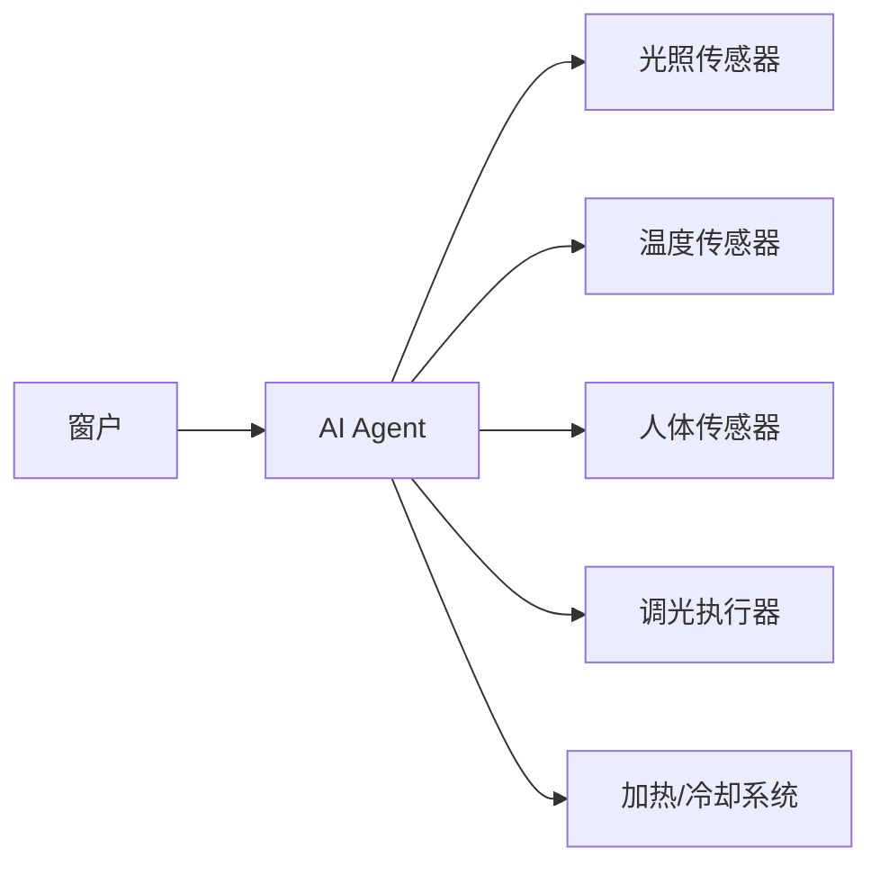
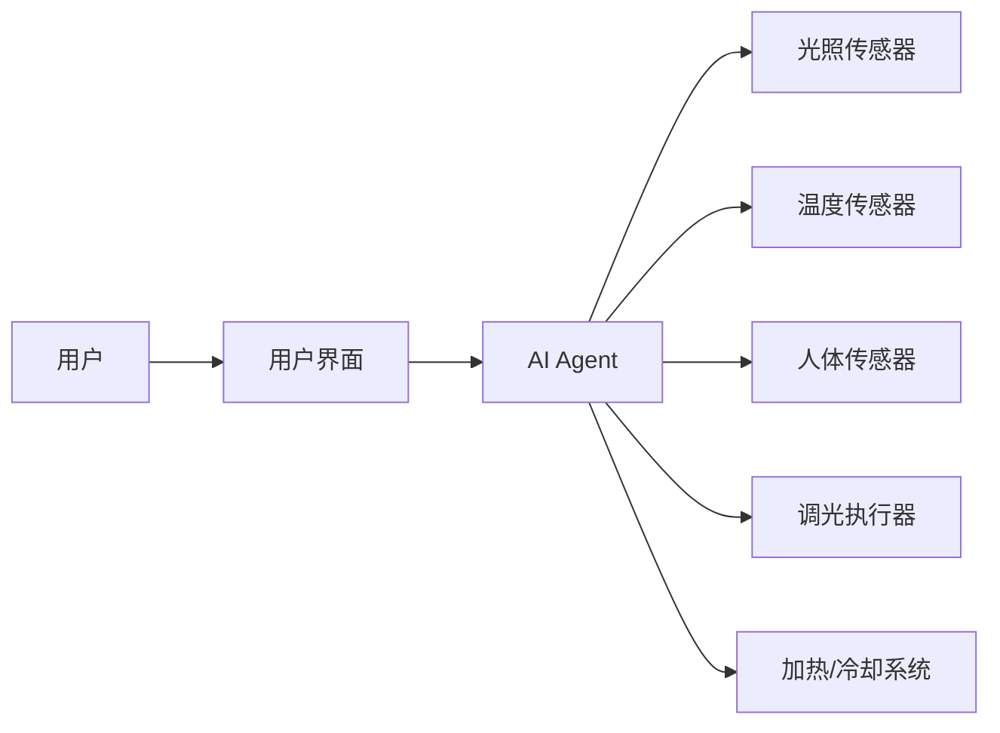
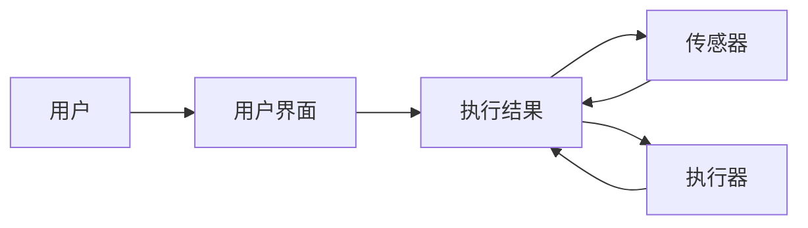

                 


# 智能窗户：AI Agent的自动调光系统

**关键词**：智能窗户, AI Agent, 自动调光, 物联网, 智能家居, 机器学习

**摘要**：本文探讨了智能窗户与AI代理结合的自动调光系统，从背景介绍到系统架构设计，详细分析了AI代理在智能窗户中的应用。通过算法原理、系统设计和项目实现，展示了如何利用AI技术提升窗户的功能，为智能家居的发展提供了新思路。

---

# 第1章: 智能窗户与AI Agent的概述

## 1.1 智能窗户的定义与特点

### 1.1.1 智能窗户的定义
智能窗户是一种集成传感器、执行器和AI技术的窗户系统，能够根据环境条件和用户需求自动调节透光率、温度和隐私保护。

### 1.1.2 智能窗户的核心特点
- **智能感知**：内置传感器实时监测光照、温度和人体存在。
- **自动化控制**：AI代理根据数据调整窗户状态。
- **隐私保护**：动态调节透光率，保护用户隐私。

### 1.1.3 智能窗户与传统窗户的区别
传统窗户依赖手动操作，而智能窗户通过AI代理实现自动化和智能化，具备更高的舒适性和安全性。

## 1.2 AI Agent在智能窗户中的应用

### 1.2.1 AI Agent的定义
AI Agent是能够感知环境、执行任务并做出决策的智能实体，用于处理复杂任务。

### 1.2.2 AI Agent在智能窗户中的作用
AI Agent负责数据处理、决策制定和系统控制，优化窗户性能，提升用户体验。

### 1.2.3 AI Agent与其他智能设备的对比
AI Agent具备学习和自适应能力，优于传统传感器和简单执行器，能处理复杂场景。

## 1.3 智能窗户的市场需求与发展趋势

### 1.3.1 智能窗户的市场需求分析
- 高生活质量需求：用户希望舒适、节能和安全。
- 智能家居普及：智能窗户是智能家居的重要组成部分。
- 节能环保要求：智能窗户通过优化采光减少能耗。

### 1.3.2 智能窗户的技术发展趋势
- AI技术深度应用：增强AI代理的学习和决策能力。
- 物联网整合：实现智能窗户与家居设备的协同工作。
- 用户体验优化：提升交互性和舒适性。

### 1.3.3 AI Agent在智能窗户中的未来前景
随着技术进步，AI Agent将更智能化，智能窗户将成为智能家居的核心设备，市场潜力巨大。

---

# 第2章: 智能窗户AI Agent的核心概念与联系

## 2.1 AI Agent的核心原理

### 2.1.1 AI Agent的基本原理
AI Agent通过感知环境数据，利用算法做出决策，并通过执行器执行操作。

### 2.1.2 AI Agent的感知与决策机制
AI Agent使用传感器数据进行状态识别和预测，结合上下文做出决策。

### 2.1.3 AI Agent的学习与优化算法
采用强化学习和机器学习算法，通过反馈优化决策模型。

## 2.2 智能窗户系统的概念结构

### 2.2.1 智能窗户系统的组成要素
- 窗户结构：包括玻璃和框架。
- 传感器：光照、温度、人体传感器。
- AI Agent：处理数据并控制执行器。
- 执行器：调节透光率和温度。
- 用户界面：提供交互功能。

### 2.2.2 系统的核心功能模块
- 数据采集：传感器收集环境数据。
- 数据处理：AI Agent分析数据。
- 决策控制：根据数据做出决策。
- 用户交互：提供反馈和控制界面。

### 2.2.3 系统的边界与外延
智能窗户系统与智能家居系统相连，与其他设备协同工作，属于智能家居的一部分。

## 2.3 AI Agent与智能窗户的实体关系图



---

# 第3章: 智能窗户AI Agent的算法原理

## 3.1 算法原理概述

AI Agent使用强化学习算法，通过状态、动作和奖励机制优化决策策略。

## 3.2 强化学习算法实现

### 3.2.1 算法流程
1. 状态感知：获取环境数据。
2. 状态评估：计算当前状态价值。
3. 动作选择：基于策略选择动作。
4. 执行动作：调整窗户状态。
5. 奖励反馈：评估决策效果。
6. 策略优化：更新决策模型。

### 3.2.2 数学模型
状态价值函数：
$$ V(s) = \max_{a} [ r + V(s') ] $$
其中，\( r \) 是奖励，\( s' \) 是下一个状态。

### 3.2.3 算法实现代码

```python
class AI-Agent:
    def __init__(self):
        self.states = {}
        self.actions = ['open', 'close', 'dim']
    
    def感知环境(self):
        # 获取传感器数据
        return current_state
    
    def决策(self, state):
        # 基于当前状态选择动作
        return self.actions[np.argmax(self.value(state))]
    
    def学习(self, state, action, reward, next_state):
        # 更新价值函数
        self.states[state] = self.states.get(state, 0) + reward
```

## 3.3 算法优化与调优

### 3.3.1 算法优化
- 使用Q-learning算法，通过经验回放提升学习效率。
- 引入epsilon-greedy策略，平衡探索与利用。

### 3.3.2 算法调优
- 调整学习率和折扣因子，优化奖励机制，提高决策准确性。

---

# 第4章: 智能窗户AI Agent的系统分析与架构设计

## 4.1 系统分析

### 4.1.1 项目介绍
智能窗户AI Agent系统旨在通过AI技术实现窗户的智能调节，提升用户舒适度和节能效果。

### 4.1.2 系统功能设计
- 环境感知：实时监测光照、温度和人体存在。
- 自动调节：根据数据优化窗户状态。
- 用户交互：提供控制界面和反馈信息。

## 4.2 系统架构设计

### 4.2.1 系统架构图


### 4.2.2 关键模块设计
- 用户界面：接收用户指令，显示系统状态。
- AI Agent：处理数据，做出决策。
- 传感器：采集环境数据。
- 执行器：调节窗户状态。

## 4.3 接口设计与交互流程

### 4.3.1 接口设计
- 用户界面与AI Agent交互接口。
- 传感器与AI Agent数据接口。
- 执行器与AI Agent控制接口。

### 4.3.2 交互流程图


---

# 第5章: 智能窗户AI Agent的项目实现

## 5.1 环境安装与配置

### 5.1.1 开发环境
- 操作系统：Linux/Windows/MacOS
- 开发工具：Python, PyTorch, TensorFlow
- 传感器：光照、温度、人体传感器
- 执行器：调光膜、加热元件

### 5.1.2 依赖库安装
```bash
pip install numpy matplotlib scikit-learn
pip install tensorflow
```

## 5.2 核心代码实现

### 5.2.1 AI Agent类实现
```python
import numpy as np
import random

class AIAgent:
    def __init__(self, actions):
        self.actions = actions
        self.states = {}
        self.alpha = 0.1
        self.gamma = 0.9
    
    def感知环境(self, state):
        return state
    
    def决策(self, state):
        q_values = {a: 0 for a in self.actions}
        if state in self.states:
            q_values = self.states[state]
        # epsilon-greedy策略
        epsilon = 0.1
        if random.random() < epsilon:
            return random.choice(self.actions)
        max_action = max(q_values.items(), key=lambda x: x[1])[0]
        return max_action
    
    def学习(self, state, action, reward, next_state):
        current_q = self.states.get(state, {}).get(action, 0)
        next_max_q = max(self.states.get(next_state, {}).values(), default=0)
        new_q = current_q + self.alpha * (reward + self.gamma * next_max_q - current_q)
        self.states[state][action] = new_q
```

### 5.2.2 系统集成与测试
集成传感器、AI Agent和执行器，进行功能测试，确保系统正常运行。

## 5.3 代码解读与分析

### 5.3.1 代码结构
AI Agent类包含感知环境、决策和学习方法，使用Q-learning算法。

### 5.3.2 核心算法
- 感知环境：获取当前状态。
- 决策：基于策略选择动作。
- 学习：更新Q值，优化决策模型。

## 5.4 实际案例分析

### 5.4.1 案例场景
- 光线过强：AI Agent自动调节调光膜，降低透光率。
- 人体靠近：AI Agent启动加热系统，调节温度。
- 低温环境：AI Agent调整窗户状态以保持温暖。

### 5.4.2 系统表现
- 快速响应环境变化，提升舒适性。
- 减少能耗，实现节能目标。
- 提供良好的隐私保护。

---

# 第6章: 总结与展望

## 6.1 总结

智能窗户AI Agent系统通过先进的AI技术实现窗户的智能化管理，显著提升了用户体验和节能效果，为智能家居的发展注入了新活力。

## 6.2 展望

未来，AI Agent将更加智能化，智能窗户将与其他家居设备协同工作，推动智能家居进入新时代。

---

# 最佳实践与注意事项

- **定期维护**：确保传感器和执行器正常工作。
- **数据安全**：保护用户隐私，防止数据泄露。
- **系统兼容性**：确保与不同设备和平台兼容。

---

**作者：AI天才研究院 & 禅与计算机程序设计艺术**

---

**摘要**：本文详细探讨了智能窗户与AI Agent结合的自动调光系统，从背景介绍到系统架构设计，深入分析了AI代理的应用，展示了如何利用AI技术提升窗户的功能，为智能家居的发展提供了新思路。

