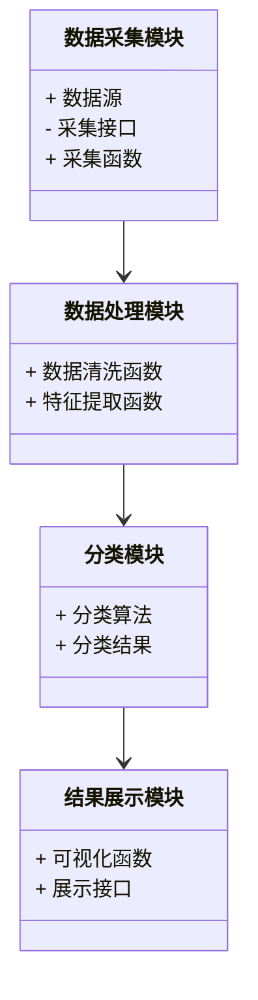
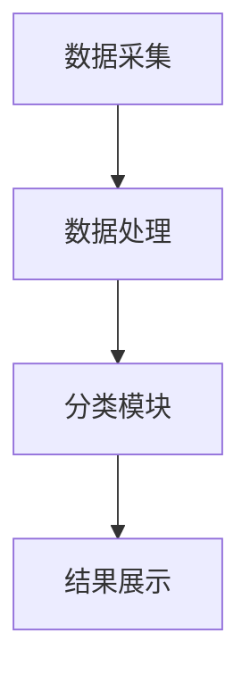

                 


# 智能算法构建动态行业分类体系

> 关键词：智能算法、行业分类、动态分类、机器学习、数据挖掘

> 摘要：本文详细探讨了如何利用智能算法构建动态行业分类体系，从背景介绍、核心概念、算法原理、系统架构到项目实战，全面分析了该体系的构建过程与实现方法。文章结合理论与实践，通过具体案例分析，深入剖析了智能算法在动态行业分类中的应用及其优势。

---

# 第一章：背景介绍与核心概念

## 1.1 问题背景与行业需求

### 1.1.1 行业分类的传统方法与局限性

传统的行业分类方法主要依赖于人工经验与静态标准，存在分类结果僵化、更新周期长、适应性差等问题。例如，行业代码和分类标准往往多年不变，无法应对市场变化和新兴行业的涌现。

### 1.1.2 动态行业分类的必要性

随着经济全球化和市场环境的快速变化，企业需要实时或定期更新行业分类体系，以更好地进行市场分析、投资决策和资源配置。动态行业分类能够帮助企业及时捕捉行业变化，提高决策的精准性和前瞻性。

### 1.1.3 智能算法在行业分类中的应用前景

智能算法（如机器学习、深度学习）具有数据驱动、自适应性强的特点，能够有效解决传统行业分类中的痛点，为动态行业分类提供了新的技术手段。

---

## 1.2 核心概念与问题描述

### 1.2.1 智能算法的定义与特点

智能算法是指能够通过数据学习、模式识别和自适应调整来完成特定任务的算法。其特点是数据驱动、非线性建模、自适应性强。

### 1.2.2 动态行业分类体系的构建目标

动态行业分类体系旨在根据实时数据和市场变化，动态调整行业分类标准，实现行业划分的自动化、智能化和实时化。

### 1.2.3 问题的边界与外延

动态行业分类的核心问题是如何根据实时数据，动态调整分类标准，同时保持分类结果的准确性和稳定性。其外延包括数据源的选择、分类算法的优化、分类结果的评估与反馈等。

---

## 1.3 核心要素与概念结构

### 1.3.1 数据源的获取与处理

数据源包括企业公开数据、市场调研数据、政府统计等。数据处理包括数据清洗、特征提取和数据归一化。

### 1.3.2 分类算法的选择与优化

选择适合的分类算法（如决策树、随机森林、支持向量机等）并进行参数优化，以提高分类准确率。

### 1.3.3 行业分类标准的动态更新机制

动态更新机制包括实时数据采集、分类模型的训练与更新、分类结果的验证与反馈。

---

## 1.4 本章小结

本章从行业分类的传统方法出发，分析了动态行业分类的必要性，明确了智能算法的核心作用，并提出了构建动态行业分类体系的目标和关键要素。下文将从核心概念、算法原理、系统架构等方面展开详细讨论。

---

# 第二章：智能算法的核心原理

## 2.1 机器学习算法的基本原理

### 2.1.1 监督学习与无监督学习

监督学习（如决策树、随机森林）适用于有标签的数据，无监督学习（如聚类）适用于无标签的数据。

### 2.1.2 分类算法的数学基础

分类算法依赖于概率论、统计学和线性代数等数学工具。例如，支持向量机（SVM）通过构建超平面实现数据分类。

### 2.1.3 算法的可解释性与可扩展性

选择算法时需要考虑其可解释性和扩展性。例如，决策树具有较高的可解释性，而随机森林适合处理高维数据。

---

## 2.2 动态分类的核心机制

### 2.2.1 实时数据流处理

动态分类需要处理实时数据流，采用流数据处理算法（如在线学习）。

### 2.2.2 分类模型的自适应更新

通过在线学习或增量学习方法，实时更新分类模型，确保分类结果的动态性。

### 2.2.3 多维度特征分析

动态行业分类需要考虑行业特征的多维性，如市场规模、增长率、竞争程度等。

---

## 2.3 核心概念属性特征对比

| 核心概念 | 特征1：分类精度 | 特征2：实时性 | 特征3：可扩展性 |
|----------|----------------|--------------|---------------|
| 监督学习  | 高             | 中           | 中             |
| 无监督学习 | 中             | 高           | 高             |

---

## 2.4 本章小结

本章详细介绍了智能算法的核心原理，分析了不同算法的特点及其适用场景。下文将从算法实现的角度，探讨动态行业分类的具体方法。

---

# 第三章：算法实现与数学模型

## 3.1 分类算法的选择与实现

### 3.1.1 支持向量机（SVM）实现

支持向量机通过构建最大边距超平面实现分类。数学模型如下：

$$ \text{目标函数} = \min_{w, b, \xi} \frac{1}{2}||w||^2 + C\sum_{i=1}^n \xi_i $$
$$ \text{约束条件} = y_i(w \cdot x_i + b) \geq 1 - \xi_i, \xi_i \geq 0 $$

### 3.1.2 随机森林（RF）实现

随机森林通过集成学习提高分类精度，适用于高维数据。

---

## 3.2 动态更新机制的实现

### 3.2.1 在线学习算法

在线学习算法（如SGD）适用于实时数据流处理：

$$ w_{t+1} = w_t - \eta \cdot \nabla J(w_t) $$

### 3.2.2 分类模型的评估与反馈

通过AUC、F1等指标评估分类效果，并根据反馈实时调整模型参数。

---

## 3.3 本章小结

本章详细探讨了分类算法的实现方法，并分析了动态更新机制的具体实现。下文将从系统架构的角度，探讨动态行业分类体系的实现框架。

---

# 第四章：系统架构与功能设计

## 4.1 问题场景介绍

动态行业分类系统需要处理实时数据流，支持多用户访问，提供动态分类结果。

---

## 4.2 系统功能设计

### 4.2.1 数据采集模块

负责采集实时数据，包括企业数据、市场数据等。

### 4.2.2 数据处理模块

负责数据清洗、特征提取和数据归一化。

### 4.2.3 分类模块

实现行业分类，包括监督学习和无监督学习算法。

### 4.2.4 结果展示模块

提供直观的分类结果展示，支持可视化分析。

---

## 4.3 系统架构设计

### 4.3.1 类图设计



### 4.3.2 架构图设计



---

## 4.4 本章小结

本章从系统架构的角度，探讨了动态行业分类体系的实现框架，包括功能模块设计和架构图设计。下文将从项目实战的角度，提供具体的实现代码和案例分析。

---

# 第五章：项目实战与案例分析

## 5.1 环境安装与配置

### 5.1.1 安装Python环境

使用Anaconda安装Python 3.8以上版本。

### 5.1.2 安装依赖库

安装scikit-learn、pandas、numpy等库。

---

## 5.2 核心代码实现

### 5.2.1 数据采集与处理

```python
import pandas as pd
import numpy as np

# 数据采集
data = pd.read_csv('industry_data.csv')

# 数据处理
data = data.dropna()
X = data.iloc[:, :-1].values
y = data.iloc[:, -1].values
```

### 5.2.2 分类算法实现

```python
from sklearn.svm import SVC
from sklearn.ensemble import RandomForestClassifier
from sklearn.metrics import accuracy_score

# 模型训练
svm_model = SVC().fit(X_train, y_train)
rf_model = RandomForestClassifier().fit(X_train, y_train)

# 模型预测
svm_pred = svm_model.predict(X_test)
rf_pred = rf_model.predict(X_test)

# 模型评估
print(accuracy_score(y_test, svm_pred))
print(accuracy_score(y_test, rf_pred))
```

---

## 5.3 案例分析

### 5.3.1 案例背景

以某个行业的动态分类为例，分析模型的分类效果。

### 5.3.2 分类结果分析

通过混淆矩阵和分类报告，分析模型的性能。

---

## 5.4 本章小结

本章通过具体案例，展示了动态行业分类体系的实现过程，包括环境配置、代码实现和案例分析。下文将从总结与展望的角度，探讨该体系的应用前景。

---

# 第六章：总结与展望

## 6.1 最佳实践与小结

动态行业分类体系的成功实施依赖于高质量的数据、合适的算法选择和高效的系统架构设计。

---

## 6.2 注意事项与建议

在实际应用中，需要注意数据的质量、模型的可解释性和系统的可扩展性。

---

## 6.3 未来研究方向

未来的研究方向包括更高效的在线学习算法、多模态数据融合、动态分类结果的实时反馈等。

---

# 作者信息

作者：AI天才研究院/AI Genius Institute & 禅与计算机程序设计艺术 /Zen And The Art of Computer Programming

