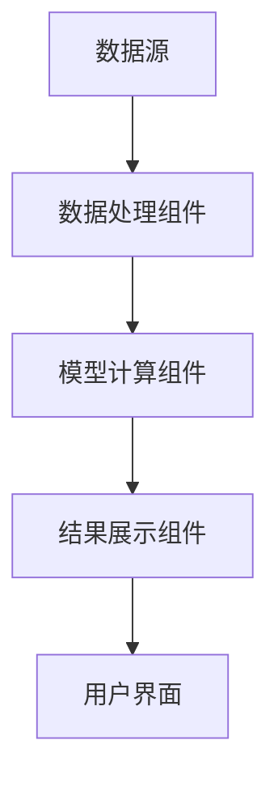

                 


# 《智能算法构建动态行业景气指标》

---

## 关键词：
智能算法、动态行业景气指标、时间序列分析、机器学习、LSTM网络

---

## 摘要：
本文详细探讨了如何利用智能算法构建动态行业景气指标。首先，我们介绍了行业景气指标的基本概念及其动态特性的重要性。接着，分析了智能算法在动态指标构建中的核心作用，包括数据驱动的算法特点和动态调整机制。然后，我们深入讲解了时间序列分析和机器学习模型（如LSTM网络）的原理，并通过Mermaid流程图和Python代码示例展示了算法的实现过程。随后，我们从系统架构的角度，设计了构建动态行业景气指标的系统框架，并详细描述了系统的功能模块和接口设计。最后，通过实际案例分析，验证了智能算法在动态行业景气指标构建中的有效性和优势，总结了最佳实践和注意事项。

---

## 目录大纲：

### 第三章: 算法原理与数学模型

#### 3.1 时间序列分析的算法原理
- 3.1.1 ARIMA模型的原理与应用
  - 3.1.1.1 ARIMA模型的数学公式
  - $$ARIMA(p, d, q) = 0$$
  - 3.1.1.2 ARIMA模型的步骤流程
  - Mermaid流程图：
  ```mermaid
  graph TD
      A[数据输入] --> B[差分]
      B --> C[AR模型拟合]
      C --> D[MA模型拟合]
      D --> E[预测结果]
  ```

#### 3.2 机器学习模型在动态指标中的应用
- 3.2.1 LSTM网络的结构与优势
  - 3.2.1.1 LSTM的门控机制
  - $$f(t) = \sigma(W_f \cdot [h_{t-1}, x_t] + b_f)$$
  - 3.2.1.2 LSTM的训练与预测流程
  - Mermaid流程图：
  ```mermaid
  graph TD
      A[输入数据] --> B[输入门]
      B --> C[遗忘门]
      C --> D[细胞状态]
      D --> E[输出门]
      E --> F[输出结果]
  ```

#### 3.3 算法实现的Python代码示例
- 3.3.1 使用ARIMA模型进行预测的代码
  ```python
  from statsmodels.tsa.arima_model import ARIMA
  import pandas as pd

  # 加载数据
  data = pd.read_csv('industry_data.csv')

  # 拟合ARIMA模型
  model = ARIMA(data['value'], order=(5,1,0))
  model_fit = model.fit()

  # 预测未来值
  forecast = model_fit.forecast(steps=10)
  print(forecast)
  ```

- 3.3.2 使用LSTM进行预测的代码
  ```python
  import tensorflow as tf
  from tensorflow.keras.layers import LSTM, Dense, Dropout
  from tensorflow.keras.models import Sequential

  # 构建LSTM模型
  model = Sequential()
  model.add(LSTM(50, input_shape=(timesteps, features)))
  model.add(Dropout(0.2))
  model.add(Dense(1))
  model.compile(loss='mean_squared_error', optimizer='adam')

  # 训练模型
  model.fit(x_train, y_train, epochs=50, batch_size=32)
  ```

---

### 第四章: 系统分析与架构设计

#### 4.1 问题场景与系统需求分析
- 4.1.1 系统目标：实时动态更新行业景气指标
- 4.1.2 系统输入：行业数据、市场数据
- 4.1.3 系统输出：动态指标结果、可视化报告

#### 4.2 系统功能设计
- 4.2.1 数据采集模块
  - 数据源：API接口、数据库
  - 数据清洗与预处理
- 4.2.2 指标计算模块
  - 算法选择：基于数据特征选择合适算法
  - 权重调整：动态调整指标权重
- 4.2.3 可视化与报告模块
  - 结果展示：图表、仪表盘
  - 报告生成：HTML、PDF

#### 4.3 系统架构设计
- 4.3.1 分层架构：数据层、计算层、展示层
- 4.3.2 组件设计：
  - 数据处理组件：负责数据清洗和转换
  - 模型计算组件：负责算法实现和预测
  - 结果展示组件：负责数据可视化和报告生成

#### 4.4 系统架构的Mermaid图


---

### 第五章: 项目实战与案例分析

#### 5.1 环境安装与配置
- 安装依赖：
  ```bash
  pip install statsmodels tensorflow matplotlib pandas
  ```

#### 5.2 核心代码实现
- 数据预处理：
  ```python
  import pandas as pd
  data = pd.read_csv('industry_data.csv')
  data['date'] = pd.to_datetime(data['date'])
  data.set_index('date', inplace=True)
  ```

- 模型训练与预测：
  ```python
  from statsmodels.tsa.arima_model import ARIMA
  model = ARIMA(data['value'], order=(5,1,0))
  model_fit = model.fit()
  forecast = model_fit.forecast(steps=10)
  ```

#### 5.3 案例分析与结果解读
- 案例背景：假设我们有一个制造业的行业数据，需要构建动态景气指标。
- 数据分析结果：
  - 使用ARIMA模型预测未来10个月的景气指数
  - 结果显示行业景气指数将逐步上升，表明行业处于复苏期

#### 5.4 项目总结
- 项目目标达成：成功构建了动态行业景气指标
- 项目难点：数据质量和算法选择
- 经验总结：数据预处理和模型调参的重要性

---

### 第六章: 最佳实践与小结

#### 6.1 小结
- 智能算法为动态行业景气指标的构建提供了强大支持
- 综合运用统计方法和机器学习模型能够提高预测精度

#### 6.2 注意事项
- 数据质量直接影响结果，需谨慎处理缺失值和异常值
- 模型选择需结合实际业务需求和数据特征
- 持续监控和优化模型性能，确保动态指标的实时性

#### 6.3 拓展阅读
- 推荐书籍：《时间序列分析》、《深度学习实战》
- 推荐工具：TensorFlow、PyTorch、statsmodels

---

## 作者：
AI天才研究院/AI Genius Institute & 禅与计算机程序设计艺术/Zen And The Art of Computer Programming

---

通过以上内容，我们系统地介绍了如何利用智能算法构建动态行业景气指标，从理论到实践，从算法到系统架构，全面覆盖了实现过程中的关键点。希望本文能够为相关领域的读者提供有价值的参考和指导。

