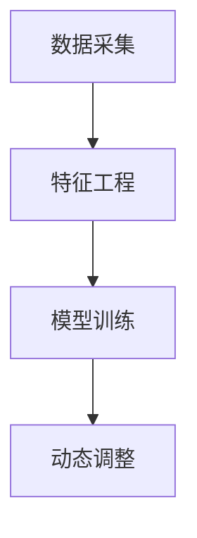
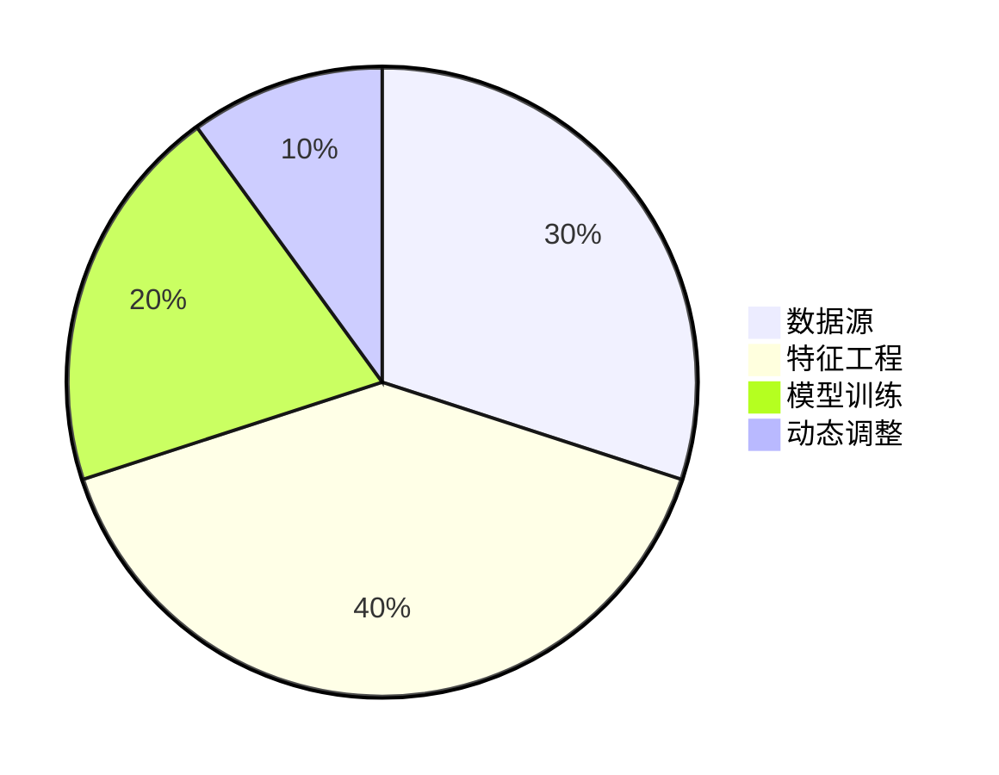
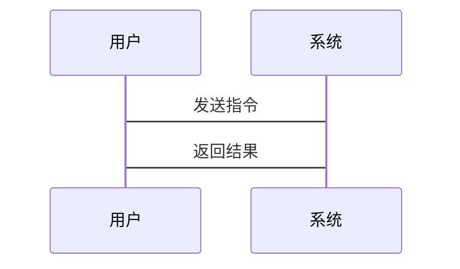

                 


# 智能算法构建动态资产配置模型

> 关键词：智能算法，动态资产配置，机器学习，优化算法，时间序列分析

> 摘要：本文将详细探讨如何利用智能算法构建动态资产配置模型。通过逐步分析，从基础概念到算法实现，再到系统设计与优化，本文旨在为读者提供一个全面的技术视角。我们将涵盖机器学习、强化学习、时间序列分析等核心知识点，并通过实际案例展示如何将这些算法应用于资产配置中。

---

## 第1章 动态资产配置模型的背景与意义

### 1.1 动态资产配置的基本概念

#### 1.1.1 资产配置的定义与分类
资产配置是指根据投资目标，将资金分配到不同资产类别（如股票、债券、商品等）中，以实现风险与收益的最佳平衡。动态资产配置是一种根据市场变化和投资者目标调整资产比例的方法。

#### 1.1.2 动态资产配置的核心理念
动态资产配置的核心在于实时调整资产组合，以适应市场波动和投资者需求的变化。其优势在于能够灵活应对市场变化，优化投资收益。

#### 1.1.3 智能算法在资产配置中的作用
智能算法通过数据驱动的方式，帮助投资者做出更科学的决策。例如，使用机器学习模型预测市场趋势，从而优化资产配置策略。

### 1.2 智能算法的基本原理

#### 1.2.1 算法驱动投资的背景
随着科技的发展，传统的人工资产配置逐渐被算法驱动的投资所取代。智能算法能够快速处理大量数据，提供实时决策支持。

#### 1.2.2 智能算法的核心优势
智能算法的优势在于其高效性、准确性和适应性。通过机器学习和优化算法，能够实现对市场的精准预测和动态调整。

#### 1.2.3 动态资产配置的数学模型
动态资产配置的数学模型通常包括目标函数和约束条件。例如，目标函数可以是最大化收益或最小化风险，约束条件则包括资产比例的限制。

### 1.3 本书的核心内容与目标

#### 1.3.1 本书的研究范围
本书将涵盖智能算法、时间序列分析、强化学习等技术，并探讨其在动态资产配置中的应用。

#### 1.3.2 本书的主要目标
通过理论与实践相结合的方式，帮助读者掌握智能算法在动态资产配置中的应用方法。

#### 1.3.3 本书的结构安排
本书将分为七章，从基础概念到算法实现，再到系统设计与优化，层层深入。

---

## 第2章 智能算法的基础知识

### 2.1 机器学习与优化算法

#### 2.1.1 机器学习的基本概念
机器学习是一种通过数据训练模型的技术。在动态资产配置中，机器学习常用于预测市场趋势和优化资产组合。

#### 2.1.2 常见优化算法简介
优化算法是动态资产配置的核心工具。常见的优化算法包括遗传算法、模拟退火、梯度下降等。

#### 2.1.3 算法在资产配置中的应用
通过优化算法，可以实现资产组合的最优配置。例如，使用遗传算法寻找最优的资产分配比例。

### 2.2 时间序列分析与预测

#### 2.2.1 时间序列的基本特征
时间序列数据具有趋势性、周期性和随机性。在动态资产配置中，时间序列分析常用于预测资产价格和市场趋势。

#### 2.2.2 常见的时间序列模型
常见的时间序列模型包括ARIMA、GARCH、LSTM等。这些模型能够捕捉市场的动态变化，帮助投资者做出决策。

#### 2.2.3 时间序列在资产配置中的应用
通过时间序列分析，可以预测资产价格的未来走势，从而优化资产配置策略。

### 2.3 动态优化与风险管理

#### 2.3.1 动态优化的基本原理
动态优化是一种实时调整优化策略的方法。在动态资产配置中，动态优化能够帮助投资者快速响应市场变化。

#### 2.3.2 风险管理的核心方法
风险管理是动态资产配置的重要组成部分。常见的风险管理方法包括风险中性化、风险对冲等。

#### 2.3.3 动态优化与风险管理的结合
通过结合动态优化和风险管理，可以实现资产配置的稳健性和收益性。

---

## 第3章 动态资产配置模型的构建

### 3.1 数据采集与预处理

#### 3.1.1 数据来源与特征
数据来源包括金融市场数据、经济指标、新闻舆情等。数据特征包括价格、成交量、波动率等。

#### 3.1.2 数据清洗与标准化
数据清洗包括去除缺失值、异常值等。数据标准化是将数据归一化，以便模型训练。

#### 3.1.3 数据分割与验证
将数据分为训练集、验证集和测试集，以便评估模型的性能。

### 3.2 特征工程与模型训练

#### 3.2.1 特征选择与构建
特征工程是通过选择和构建合适的特征，提高模型的性能。例如，使用技术指标作为特征。

#### 3.2.2 模型训练与调优
通过训练模型并调整参数，可以提高模型的预测精度。例如，使用网格搜索调优模型参数。

#### 3.2.3 模型评估与验证
通过验证集评估模型的性能，例如使用均方误差、准确率等指标。

### 3.3 动态调整与策略优化

#### 3.3.1 动态调整的实现方法
动态调整可以通过实时预测市场变化，调整资产组合。例如，使用强化学习进行动态调整。

#### 3.3.2 策略优化的数学模型
策略优化的数学模型通常包括目标函数和约束条件。例如，最大化收益，同时控制风险。

#### 3.3.3 动态调整的实际应用
通过动态调整，可以实现资产配置的实时优化。例如，在市场下跌时减少股票持仓。

---

## 第4章 智能算法的实现与优化

### 4.1 强化学习在资产配置中的应用

#### 4.1.1 强化学习的基本原理
强化学习是一种通过与环境交互，学习最优策略的技术。在动态资产配置中，强化学习可以用于实时调整资产组合。

#### 4.1.2 强化学习在资产配置中的实现
通过定义状态、动作和奖励，构建强化学习模型。例如，状态可以是市场状况，动作可以是调整资产比例，奖励可以是收益。

#### 4.1.3 强化学习的优化策略
通过优化算法，可以提高强化学习模型的性能。例如，使用深度强化学习提高模型的泛化能力。

### 4.2 集成学习与模型融合

#### 4.2.1 集成学习的基本概念
集成学习是通过组合多个模型，提高整体性能的技术。在动态资产配置中，集成学习可以用于多模型预测。

#### 4.2.2 集成学习在资产配置中的应用
例如，使用多个时间序列模型进行预测，并通过投票或加权的方式融合结果。

#### 4.2.3 模型融合的优化策略
通过优化融合方式，可以提高模型的预测精度。例如，使用堆叠模型进行融合。

---

## 第5章 系统设计与架构方案

### 5.1 系统功能设计

#### 5.1.1 系统功能模块
系统功能模块包括数据采集、特征工程、模型训练、动态调整等。

#### 5.1.2 系统功能流程
数据采集模块负责获取市场数据，特征工程模块进行数据处理，模型训练模块训练预测模型，动态调整模块实时调整资产组合。

#### 5.1.3 系统功能流程图


### 5.2 系统架构设计

#### 5.2.1 系统架构图


#### 5.2.2 系统架构组件
系统架构组件包括数据层、特征层、模型层和调整层。

#### 5.2.3 系统架构优化策略
通过优化架构设计，可以提高系统的性能和可扩展性。

### 5.3 系统接口设计

#### 5.3.1 系统接口模块
系统接口模块包括数据接口、模型接口和调整接口。

#### 5.3.2 系统接口协议
使用RESTful API进行接口设计，例如，使用HTTP协议。

#### 5.3.3 系统接口实现
通过编写API接口，实现系统各模块之间的通信。

### 5.4 系统交互设计

#### 5.4.1 系统交互流程
用户输入指令，系统接收指令并执行操作，返回结果。

#### 5.4.2 系统交互流程图


---

## 第6章 项目实战与案例分析

### 6.1 项目环境配置

#### 6.1.1 环境需求
项目需要安装Python、机器学习库（如scikit-learn、TensorFlow）等。

#### 6.1.2 环境安装步骤
通过pip安装所需库，例如，`pip install scikit-learn`。

### 6.2 核心实现代码

#### 6.2.1 数据处理代码
```python
import pandas as pd

# 数据加载
data = pd.read_csv('market_data.csv')

# 数据清洗
data.dropna(inplace=True)

# 数据标准化
from sklearn.preprocessing import StandardScaler
scaler = StandardScaler()
scaled_data = scaler.fit_transform(data)
```

#### 6.2.2 模型训练代码
```python
from sklearn.ensemble import RandomForestRegressor
model = RandomForestRegressor()
model.fit(scaled_data, target)
```

#### 6.2.3 动态调整代码
```python
def dynamic_adjustment(current_portfolio, prediction):
    # 根据预测结果调整资产比例
    new_portfolio = ...
    return new_portfolio
```

### 6.3 案例分析与结果解读

#### 6.3.1 案例背景
以股票和债券为例，构建动态资产配置模型。

#### 6.3.2 案例实现
通过机器学习模型预测股票和债券的收益，动态调整资产比例。

#### 6.3.3 案例结果
展示模型的预测结果和实际调整效果。

### 6.4 项目小结

#### 6.4.1 项目总结
通过项目实战，验证了智能算法在动态资产配置中的有效性。

#### 6.4.2 项目经验
在实际应用中，需要注意数据质量和模型调优。

---

## 第7章 优化与展望

### 7.1 模型优化策略

#### 7.1.1 模型优化方法
通过交叉验证、超参数调优等方法优化模型性能。

#### 7.1.2 模型优化效果
优化后的模型在预测精度和稳定性方面均有提升。

### 7.2 实际应用中的注意事项

#### 7.2.1 数据质量问题
数据的质量直接影响模型的性能，需注意数据清洗和特征工程。

#### 7.2.2 模型鲁棒性
在实际应用中，需考虑模型的鲁棒性和适应性。

#### 7.2.3 风险管理
动态资产配置需结合风险管理，确保投资的安全性。

### 7.3 未来研究方向

#### 7.3.1 新算法研究
探索新的智能算法，如深度学习、强化学习等。

#### 7.3.2 多目标优化
研究多目标优化在动态资产配置中的应用。

#### 7.3.3 实际应用场景
扩展动态资产配置的应用场景，如机构投资、量化交易等。

---

## 作者信息

作者：AI天才研究院/AI Genius Institute & 禅与计算机程序设计艺术 /Zen And The Art of Computer Programming

---

本文通过系统地介绍智能算法在动态资产配置中的应用，从基础概念到实际案例，全面解析了动态资产配置模型的构建与优化过程。希望读者通过本文能够掌握智能算法的核心思想，并能够在实际中灵活应用。

