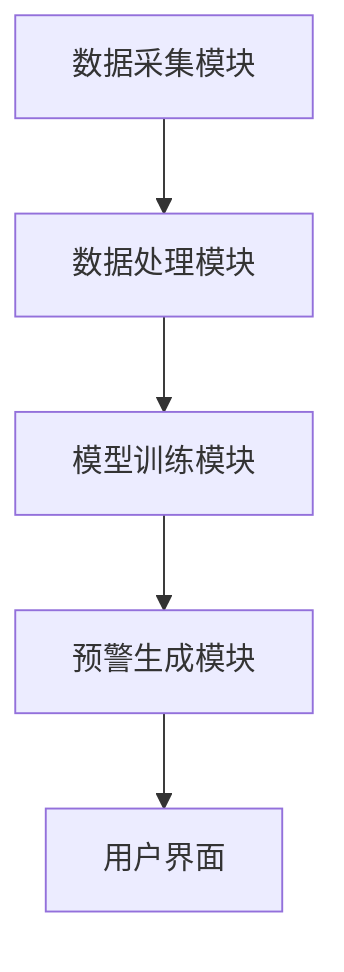
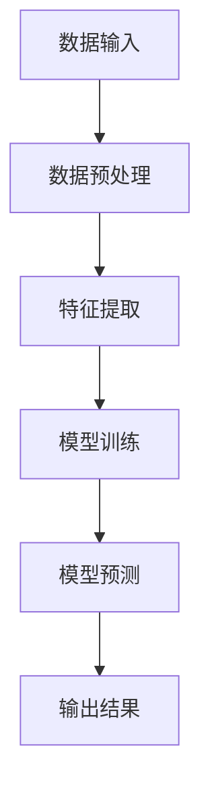

                 


# 智能算法构建动态风险预警系统

---

## 关键词：  
智能算法、风险预警、动态风险、机器学习、深度学习、时间序列分析

---

## 摘要：  
本文详细探讨了如何利用智能算法构建动态风险预警系统。从背景介绍到核心算法原理，从数学模型到系统架构设计，再到项目实战，全面解析了动态风险预警系统的核心要素和实现方法。文章通过具体的案例分析和代码实现，帮助读者理解如何利用机器学习、深度学习和时间序列分析等算法，构建高效、可靠的动态风险预警系统。  

---

# 第一部分：动态风险预警系统背景

## 第1章：动态风险预警系统概述

### 1.1 问题背景与描述  
动态风险预警系统是一种能够实时监测和预测潜在风险的系统，广泛应用于金融、医疗、交通等领域。随着数据量的爆炸式增长和复杂性增加，传统的静态风险评估方法已无法满足需求，智能算法的引入为动态风险预警提供了新的解决方案。  

#### 1.1.1 风险预警的定义与重要性  
风险预警是指通过分析数据，提前识别潜在风险并发出预警信号的过程。其重要性体现在：  
- **预防损失**：通过提前预警，减少潜在风险对企业或个人造成的损失。  
- **提高效率**：实时监测和预警能够快速响应，避免问题扩大化。  
- **数据驱动决策**：基于数据的预警系统能够提供更精准的决策支持。  

#### 1.1.2 动态风险的特性与挑战  
动态风险具有以下特性：  
- **实时性**：风险可能随时变化，需要实时监测和预警。  
- **不确定性**：风险的发生往往受到多种复杂因素的影响，具有不确定性。  
- **动态性**：风险的特征和影响可能随时间变化而变化。  

#### 1.1.3 智能算法在风险预警中的作用  
智能算法（如机器学习、深度学习）能够处理海量数据，发现数据中的隐含规律，从而实现对动态风险的精准预测和预警。  

### 1.2 问题解决与边界  
动态风险预警系统的核心目标是通过智能算法，实现对潜在风险的实时监测、预测和预警。  

#### 1.2.1 系统的边界与外延  
- **边界**：系统仅关注动态风险的监测和预警，不涉及具体的风险应对措施。  
- **外延**：系统可能与其他系统（如应急响应系统）进行交互，提供预警信号。  

#### 1.2.2 核心要素与组成结构  
动态风险预警系统的核心要素包括：  
1. **数据源**：提供实时数据输入。  
2. **算法模块**：负责数据处理和风险预测。  
3. **预警模块**：根据预测结果发出预警信号。  
4. **用户界面**：供用户查看预警信息和系统状态。  

### 1.3 核心概念与联系  
动态风险预警系统的核心概念包括智能算法和动态风险。  

#### 1.3.1 智能算法的原理与特点  
智能算法通过学习数据中的模式和规律，实现对风险的预测和分类。其特点包括：  
- **自适应性**：能够根据数据变化自动调整模型参数。  
- **高精度**：通过复杂模型实现对风险的精准预测。  
- **实时性**：能够处理实时数据，快速生成预警信号。  

#### 1.3.2 动态风险预警系统的组成  
动态风险预警系统由以下部分组成：  
1. **数据采集模块**：负责收集实时数据。  
2. **数据处理模块**：对数据进行清洗和预处理。  
3. **模型训练模块**：利用智能算法训练风险预警模型。  
4. **预警生成模块**：根据模型预测结果生成预警信号。  

#### 1.3.3 算法与系统的实体关系图  



---

## 第2章：智能算法原理  

### 2.1 核心算法原理  

#### 2.1.1 机器学习算法  
机器学习算法通过训练数据学习特征，实现对风险的分类和预测。常用的机器学习算法包括：  
- **线性回归**：用于预测连续型变量（如风险值）。  
- **支持向量机（SVM）**：用于分类问题（如高风险或低风险）。  
- **随机森林**：用于分类和回归问题，具有高精度和良好的抗过拟合能力。  

#### 2.1.2 深度学习算法  
深度学习算法通过多层神经网络提取数据的深层特征，适用于复杂场景的风险预测。常用的深度学习算法包括：  
- **LSTM（长短期记忆网络）**：适用于时间序列数据的预测。  
- **Transformer**：用于处理序列数据，如自然语言处理和时间序列分析。  
- **卷积神经网络（CNN）**：适用于图像和时空数据的分析。  

#### 2.1.3 时间序列分析算法  
时间序列分析算法专注于处理时间相关数据，适用于动态风险预警。常用的算法包括：  
- **ARIMA**：自回归积分滑动平均模型，适用于线性时间序列预测。  
- **GARCH**：广义自回归条件异方差模型，适用于金融时间序列的波动预测。  
- **Prophet**：Facebook开源的时间序列预测模型，简单易用且效果良好。  

### 2.2 算法对比与选择  

#### 2.2.1 不同算法的优缺点对比  

| 算法类型       | 优点                                   | 缺点                                   |
|----------------|--------------------------------------|--------------------------------------|
| 机器学习       | 简单易用，计算效率高                   | 对复杂模式的捕捉能力有限               |
| 深度学习       | 模型表达能力强，适用于复杂场景         | 计算资源消耗大，训练时间长               |
| 时间序列分析   | 专门针对时间数据，预测精度高           | 对数据的依赖性较强，模型鲁棒性较差       |

#### 2.2.2 算法选择的依据与策略  
- **数据类型**：根据数据类型选择合适的算法（如时间序列数据选择LSTM或Prophet）。  
- **计算资源**：深度学习算法需要较高的计算资源，适合大型项目。  
- **模型复杂度**：简单场景选择机器学习算法，复杂场景选择深度学习算法。  

#### 2.2.3 实际案例中的算法应用  
例如，在金融领域，使用LSTM模型对股票价格进行预测，利用其对时间序列数据的捕捉能力，实现对市场波动的预警。  

### 2.3 算法流程图  

#### 2.3.1 机器学习算法流程图  



#### 2.3.2 深度学习算法流程图  


---

## 第3章：数学模型与公式  

### 3.1 机器学习模型  

#### 3.1.1 线性回归模型  
线性回归用于预测连续型变量，其数学公式为：  
$$ y = \beta_0 + \beta_1x + \epsilon $$  
其中，$y$ 是目标变量，$x$ 是自变量，$\beta_0$ 和 $\beta_1$ 是回归系数，$\epsilon$ 是误差项。  

#### 3.1.2 支持向量机模型  
支持向量机用于分类问题，其目标是最小化经验风险并最大化几何间隔。  

### 3.2 深度学习模型  

#### 3.2.1 LSTM网络模型  
LSTM（长短期记忆网络）用于时间序列分析，其核心是记忆单元和遗忘门。  

#### 3.2.2 Transformer模型  
Transformer模型通过自注意力机制捕捉数据中的长距离依赖关系。  

#### 3.2.3 卷积神经网络模型  
CNN模型通过卷积操作提取数据的局部特征。  

### 3.3 时间序列模型  

#### 3.3.1 ARIMA模型  
ARIMA（自回归积分滑动平均模型）用于线性时间序列预测，其数学公式为：  
$$ y_t = \phi_1 y_{t-1} + \phi_2 y_{t-2} + \theta_1 \epsilon_{t-1} + \epsilon_t $$  

#### 3.3.2 GARCH模型  
GARCH模型用于金融时间序列的波动预测，其数学公式为：  
$$ r_t = \alpha_0 + \alpha_1 r_{t-1} + \beta_1 h_{t-1} + \epsilon_t $$  
其中，$h_t$ 是条件方差。  

#### 3.3.3 Prophet模型  
Prophet模型由Facebook开源，适用于非周期性时间序列数据的预测。  

---

## 第4章：系统架构设计  

### 4.1 问题场景分析  

#### 4.1.1 数据来源  
动态风险预警系统的数据来源包括实时数据流和历史数据。  

#### 4.1.2 系统用户  
用户包括数据工程师、风险分析师和决策者。  

#### 4.1.3 系统环境  
系统运行环境包括云服务器、本地服务器和边缘设备。  

### 4.2 功能设计  

#### 4.2.1 数据采集模块  
负责实时采集和存储数据。  

#### 4.2.2 风险评估模块  
利用智能算法对风险进行评估和预测。  

#### 4.2.3 预警通知模块  
根据预测结果生成预警信号并通知相关人员。  

### 4.3 系统架构图  


### 4.4 接口与交互设计  

#### 4.4.1 API接口设计  
系统提供RESTful API接口，用于数据输入和预警信号输出。  

#### 4.4.2 用户交互流程  
用户通过图形界面查看预警信息和系统状态。  

#### 4.4.3 通信协议  
系统采用HTTP协议进行数据传输和交互。  

---

## 第5章：项目实战  

### 5.1 环境安装与配置  

#### 5.1.1 Python环境搭建  
安装Python 3.8及以上版本，并配置虚拟环境。  

#### 5.1.2 库的安装与配置  
安装必要的库，如NumPy、Pandas、Scikit-learn、Keras、TensorFlow等。  

#### 5.1.3 数据库的安装与配置  
选择合适的数据库（如MySQL、PostgreSQL）并配置连接。  

### 5.2 核心代码实现  

#### 5.2.1 数据预处理代码  
```python
import pandas as pd
import numpy as np

# 读取数据
data = pd.read_csv('data.csv')

# 数据清洗
data.dropna(inplace=True)
data = data[~data.duplicated()]
```

#### 5.2.2 模型训练代码  
```python
from sklearn.model_selection import train_test_split
from sklearn.linear_model import LinearRegression

# 划分训练集和测试集
X_train, X_test, y_train, y_test = train_test_split(data.drop('target', axis=1), data['target'], test_size=0.2)

# 训练模型
model = LinearRegression()
model.fit(X_train, y_train)
```

#### 5.2.3 系统部署代码  
```python
from flask import Flask, request, jsonify

app = Flask(__name__)

@app.route('/predict', methods=['POST'])
def predict():
    data = request.json['data']
    prediction = model.predict(data)
    return jsonify({'prediction': prediction.tolist()})

if __name__ == '__main__':
    app.run(debug=True)
```

### 5.3 实际案例分析  

#### 5.3.1 案例背景  
以金融市场的股票价格预测为例，利用LSTM模型实现对股票价格波动的预警。  

#### 5.3.2 数据分析与处理  
对历史股价数据进行清洗和预处理，提取相关特征（如开盘价、收盘价、成交量等）。  

#### 5.3.3 模型训练与评估  
训练LSTM模型，评估模型的准确性和稳定性。  

### 5.4 代码解读与分析  
通过具体的代码实现，展示如何利用智能算法构建动态风险预警系统。  

---

## 第6章：总结与展望  

### 6.1 总结  
本文详细介绍了智能算法在动态风险预警系统中的应用，从算法原理到系统架构设计，再到项目实战，全面解析了动态风险预警系统的构建过程。  

### 6.2 展望  
未来，随着人工智能技术的不断发展，动态风险预警系统将更加智能化和精准化，应用场景也将更加广泛。  

---

## 附录  

### 附录A：工具安装指南  
指导读者如何安装和配置开发环境。  

### 附录B：术语表  
列出文章中涉及的专业术语及其定义。  

---

## 作者：AI天才研究院/AI Genius Institute & 禅与计算机程序设计艺术 /Zen And The Art of Computer Programming

