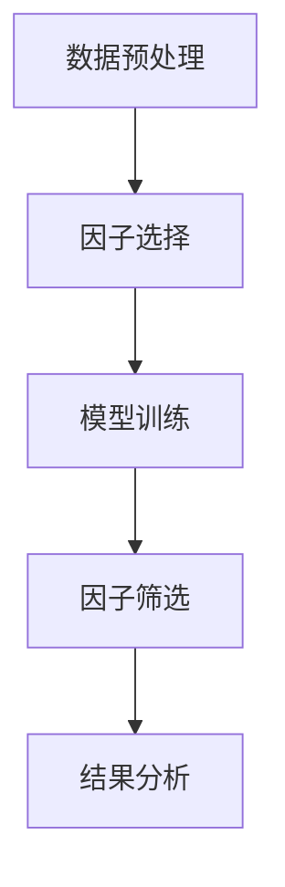
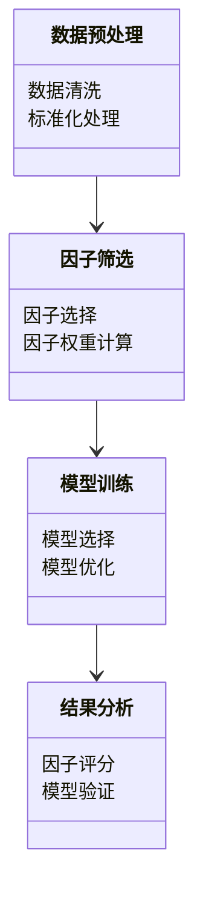
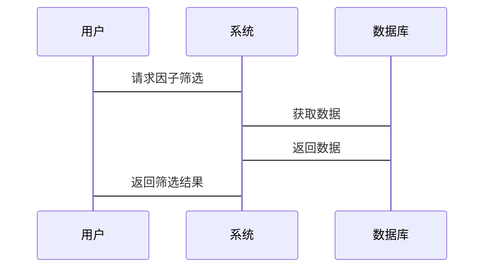

                 


# 智能算法构建多因子选股模型

> 关键词：智能算法、多因子选股模型、机器学习、金融数据分析、Python实现

> 摘要：本文详细介绍了如何利用智能算法构建多因子选股模型，涵盖了从背景介绍、核心概念、算法原理到系统架构设计、项目实战以及最佳实践的全过程。通过使用机器学习和深度学习技术，结合数学模型和系统架构设计，本文展示了如何有效地进行因子筛选和优化，帮助投资者做出更科学的投资决策。

---

## 第一部分：背景介绍

### 第1章：智能算法与多因子选股模型概述

#### 1.1 智能算法的背景与意义
- **传统选股方法的局限性**：传统选股方法依赖于经验分析，难以处理大量数据和复杂关系。
- **智能算法在金融领域的应用**：机器学习和深度学习技术为金融数据分析提供了新的工具，能够捕捉数据中的复杂模式。
- **多因子选股模型的优势**：通过多个因子的综合分析，提高选股的准确性和稳定性。

#### 1.2 多因子选股模型的定义与特点
- **多因子模型的基本概念**：多因子模型通过多个因子（如市盈率、市值、收益波动率等）来评估股票的投资价值。
- **多因子模型的核心特点**：综合考虑多个因子，避免单一因子的片面性，提高模型的鲁棒性。
- **多因子模型与单因子模型的区别**：单因子模型仅依赖一个因子进行评估，而多因子模型综合多个因子。

#### 1.3 本书的核心目标与内容
- **核心目标**：通过智能算法构建一个多因子选股模型，帮助投资者做出科学的投资决策。
- **主要内容**：涵盖背景介绍、核心概念、算法原理、数学模型、系统架构设计、项目实战以及最佳实践。
- **结构安排**：文章分为多个章节，逐步深入讲解智能算法在多因子选股模型中的应用。

---

## 第二部分：核心概念与联系

### 第2章：智能算法与多因子模型的核心概念

#### 2.1 智能算法的核心原理
- **机器学习的基本概念**：通过数据训练模型，使其能够识别数据中的模式和关系。
- **深度学习的基本概念**：通过多层神经网络提取数据的高层次特征。
- **智能算法在金融中的应用**：用于股票预测、风险评估、因子筛选等领域。

#### 2.2 多因子模型的数学基础
- **多因子模型的数学表达**：因子模型通常表示为线性回归的形式，如CAPM模型。
- **因子的定义与选择**：选择能够解释股票收益的多个因子，如市值、价值因子、动量因子等。
- **因子权重的计算方法**：通过回归分析或机器学习方法确定每个因子的权重。

#### 2.3 智能算法与多因子模型的联系
- **智能算法在因子筛选中的应用**：使用机器学习算法自动筛选出重要的因子。
- **智能算法在因子权重优化中的应用**：通过优化算法确定因子的最优权重。

---

### 图2-1：智能算法与多因子模型的核心概念对比表

| 属性 | 智能算法 | 多因子模型 |
|------|---------|------------|
| 核心目标 | 数据模式识别 | 股票收益预测 |
| 输入 | 大量数据 | 多个因子 |
| 输出 | 模型预测结果 | 综合因子评分 |
| 应用 | 股票预测、风险评估 | 因子筛选、权重优化 |

---

### 图2-2：多因子模型的ER实体关系图

```mermaid
erDiagram
    投资者 [投资者ID, 名称] {
        投资者ID
        名称
    }
    股票 [股票ID, 名称, 市值, 收益率] {
        股票ID
        名称
        市值
        收益率
    }
    因子 [因子ID, 名称, 计算公式] {
        因子ID
        名称
        计算公式
    }
    投资组合 [投资组合ID, 名称, 总收益] {
        投资组合ID
        名称
        总收益
    }
    投资者 --> 因子 : 使用因子进行筛选
    因子 --> 股票 : 影响股票收益
    股票 --> 投资组合 : 构成投资组合
```

---

## 第三部分：算法原理讲解

### 第3章：智能算法的数学模型与公式

#### 3.1 线性回归模型
- **线性回归的基本公式**：$y = \beta_0 + \beta_1x_1 + \beta_2x_2 + ... + \beta_nx_n + \epsilon$
  其中，$y$ 是目标变量，$x_i$ 是因子，$\beta_i$ 是因子的系数，$\epsilon$ 是误差项。
- **最小二乘法的优化目标**：最小化预测值与实际值的平方差之和。
  $$ \min \sum_{i=1}^{n}(y_i - \hat{y_i})^2 $$

#### 3.2 逻辑回归模型
- **逻辑回归的sigmoid函数**：$P(y=1|x) = \frac{1}{1 + e^{-(\beta_0 + \beta_1x_1 + ... + \beta_nx_n)}}$
- **对数损失函数**：$$ \min \sum_{i=1}^{n} -y_i \ln(p_i) - (1 - y_i)\ln(1 - p_i) $$

#### 3.3 支持向量机模型
- **SVM的线性分类器**：$$ y = \text{sign}(\beta_0 + \beta_1x_1 + ... + \beta_nx_n) $$
- **软间隔最大化**：$$ \min \frac{1}{2}||\beta||^2 + C \sum_{i=1}^{n} \xi_i $$
  其中，$\xi_i$ 是松弛变量。

---

### 图3-1：智能算法的流程图



---

### 第4章：Python代码实现

#### 4.1 数据加载与预处理
```python
import pandas as pd
import numpy as np

# 加载数据
data = pd.read_csv('stock_data.csv')

# 数据清洗
data.dropna(inplace=True)
data = data.drop(columns=['date'])
```

#### 4.2 因子选择与模型训练
```python
from sklearn.linear_model import LinearRegression
from sklearn.model_selection import train_test_split

# 选择因子
X = data[['市盈率', '市值', '收益波动率']]
y = data['收益']

# 划分训练集和测试集
X_train, X_test, y_train, y_test = train_test_split(X, y, test_size=0.2)

# 训练线性回归模型
model = LinearRegression()
model.fit(X_train, y_train)
```

#### 4.3 因子筛选与权重优化
```python
# 输出因子系数
coefficients = pd.DataFrame({'因子': X.columns, '系数': model.coef_})
print(coefficients)
```

---

## 第四部分：系统分析与架构设计

### 第5章：系统架构设计

#### 5.1 项目场景介绍
- **项目目标**：构建一个多因子选股模型，帮助投资者筛选出具有高收益潜力的股票。
- **数据来源**：包括历史股价、财务数据、市场指标等。
- **系统功能模块**：数据预处理、因子筛选、模型训练、结果分析。

#### 5.2 系统功能设计



#### 5.3 系统架构设计


#### 5.4 接口设计与交互流程



---

## 第五部分：项目实战

### 第6章：环境安装与代码实现

#### 6.1 环境安装
```bash
pip install pandas numpy scikit-learn
```

#### 6.2 代码实现
```python
import pandas as pd
from sklearn.ensemble import RandomForestRegressor

# 加载数据
data = pd.read_csv('stock_data.csv')

# 数据预处理
data = data.dropna()

# 选择因子
X = data[['市盈率', '市值', '收益波动率']]
y = data['收益']

# 划分训练集和测试集
X_train, X_test, y_train, y_test = train_test_split(X, y, test_size=0.2)

# 训练随机森林模型
model = RandomForestRegressor()
model.fit(X_train, y_train)

# 预测测试集结果
y_pred = model.predict(X_test)
```

#### 6.3 案例分析
- **因子选择**：选择市盈率、市值和收益波动率为因子。
- **模型训练**：使用随机森林回归模型进行训练。
- **结果分析**：预测结果与实际结果进行对比，评估模型的准确性。

---

## 第六部分：最佳实践与注意事项

### 第7章：最佳实践与总结

#### 7.1 最佳实践
- **数据清洗**：确保数据的完整性和准确性。
- **模型调参**：通过网格搜索等方法优化模型参数。
- **结果验证**：使用回测等方式验证模型的有效性。

#### 7.2 小结
- 智能算法在多因子选股模型中的应用显著提高了选股的准确性和稳定性。
- 通过机器学习和深度学习技术，能够更好地捕捉数据中的复杂模式，帮助投资者做出科学的投资决策。

#### 7.3 注意事项
- **过拟合问题**：避免模型过拟合，确保模型的泛化能力。
- **数据泄漏**：注意数据泄漏问题，确保训练数据和测试数据的独立性。
- **模型解释性**：选择具有较高解释性的模型，便于分析因子的作用。

#### 7.4 拓展阅读
- 推荐书籍：《机器学习实战》、《深入浅出机器学习》。
- 推荐资源：Kaggle上的金融数据分析项目。

---

## 结论

智能算法通过结合多因子模型，为选股提供了更科学和高效的方法。通过本文的详细介绍，读者可以系统地了解如何利用智能算法构建多因子选股模型，并在实际项目中进行应用。未来，随着人工智能技术的不断发展，多因子选股模型将变得更加精准和高效，为投资者提供更有力的支持。

---

## 作者信息

作者：AI天才研究院/AI Genius Institute & 禅与计算机程序设计艺术/Zen And The Art of Computer Programming

---

