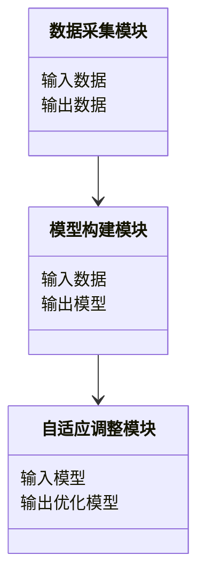

                 


# 智能算法构建自适应估值模型

> 关键词：智能算法、自适应估值模型、动态优化、数学建模、系统架构设计、机器学习

> 摘要：本文将详细介绍如何利用智能算法构建自适应估值模型。通过分析传统估值模型的局限性，引入智能算法的概念，探讨自适应估值模型的核心原理，结合数学建模和系统架构设计，提供一个从理论到实践的完整解决方案。本文将深入浅出地讲解相关技术，并通过实际案例展示如何实现自适应估值模型。

---

# 第1章: 问题背景与自适应估值模型的必要性

## 1.1 问题背景介绍

### 1.1.1 传统估值模型的局限性
传统估值模型通常基于固定的数学公式或假设，例如线性回归、随机森林等。这些模型在特定场景下表现良好，但在数据分布变化或异常情况下，往往难以适应新的数据模式，导致估值精度下降。

### 1.1.2 智能算法的引入动机
智能算法，如遗传算法、粒子群优化、模拟退火等，能够通过动态调整参数和结构，适应数据的变化。引入智能算法的目的是为了克服传统估值模型的静态局限性，实现更灵活和高效的估值。

### 1.1.3 自适应估值模型的核心目标
自适应估值模型的核心目标是通过智能算法动态调整模型参数，实时优化估值结果，提高模型在复杂和动态环境下的表现。

## 1.2 问题描述与解决思路

### 1.2.1 传统估值模型的不足之处
- 数据分布变化时，模型无法自动调整。
- 需要手动重新训练模型，耗时且成本高。
- 对异常数据或噪声的鲁棒性较差。

### 1.2.2 智能算法在估值模型中的应用价值
- 提高模型的适应性和灵活性。
- 实现自动化优化，减少人工干预。
- 提高模型的鲁棒性，更好地处理异常数据。

### 1.2.3 自适应估值模型的实现路径
1. 确定智能算法的优化目标。
2. 设计自适应调整机制。
3. 实现动态优化算法。
4. 验证和优化模型性能。

## 1.3 自适应估值模型的边界与外延

### 1.3.1 自适应估值模型的适用场景
- 数据分布随时间变化的场景。
- 需要实时优化的在线系统。
- 高维数据的复杂估值问题。

### 1.3.2 模型的边界条件与限制
- 数据质量和数量的限制。
- 模型复杂度对计算资源的要求。
- 智能算法的收敛速度和精度。

### 1.3.3 自适应估值模型的外延与扩展
- 跨领域应用，如金融、医疗、交通等。
- 结合深度学习的自适应估值模型。

## 1.4 核心概念与组成要素

### 1.4.1 智能算法的基本概念
智能算法是指模拟人类智能的算法，包括遗传算法、粒子群优化、模拟退火等。

### 1.4.2 自适应估值模型的组成结构
- 数据采集模块：实时采集数据。
- 模型构建模块：基于数据构建初始估值模型。
- 自适应调整模块：通过智能算法动态优化模型。
- 估值输出模块：输出优化后的估值结果。

### 1.4.3 核心要素之间的关系与作用
数据是模型的基础，智能算法是优化的核心，自适应调整模块是实现动态优化的关键，估值输出模块是模型的最终目标。

---

# 第2章: 智能算法与自适应估值模型的核心概念

## 2.1 智能算法的原理与特点

### 2.1.1 智能算法的定义与分类
智能算法是一种基于自然启发的算法，包括遗传算法、粒子群优化、模拟退火等。

### 2.1.2 常见智能算法的优缺点对比

| 算法类型 | 优点 | 缺点 |
|----------|------|------|
| 遗传算法 | 具备全局搜索能力 | 收敛速度较慢 |
| 粒子群优化 | 收敛速度快 | 易陷入局部最优 |
| 模拟退火 | 能够跳出局部最优 | 参数调节复杂 |

### 2.1.3 智能算法的核心特征
- 全局搜索能力。
- 自适应调整能力。
- 并行计算能力。

## 2.2 自适应估值模型的构建逻辑

### 2.2.1 自适应估值模型的构建步骤
1. 数据预处理：清洗和特征提取。
2. 初始化估值模型：基于初始数据构建模型。
3. 设定优化目标：如最小化均方误差。
4. 智能算法优化：动态调整模型参数。
5. 评估与验证：验证模型性能。

### 2.2.2 模型的动态调整机制
- 基于智能算法的参数优化。
- 实时更新模型权重。
- 动态调整模型结构。

### 2.2.3 自适应学习的核心算法
遗传算法、粒子群优化等。

## 2.3 核心概念的属性特征对比

### 2.3.1 智能算法与传统算法的对比
- 智能算法具备全局搜索能力，传统算法通常在局部优化。
- 智能算法适用于复杂问题，传统算法适用于线性问题。

---

# 第3章: 智能算法与自适应估值模型的数学模型

## 3.1 智能算法的数学基础

### 3.1.1 优化目标函数
$$ f(x) = x^2 $$

### 3.1.2 约束条件
$$ x \geq 0 $$

## 3.2 智能算法的核心数学模型

### 3.2.1 遗传算法的数学模型
1. 初始化种群。
2. 计算适应度。
3. 选择父代。
4. 交叉和变异。
5. 评估新种群。

### 3.2.2 粒子群优化的数学模型
1. 初始化粒子群。
2. 计算个体最优解。
3. 更新全局最优解。
4. 更新粒子位置和速度。

## 3.3 自适应估值模型的数学模型

### 3.3.1 初始模型
$$ y = ax + b $$

### 3.3.2 优化后的模型
$$ y = a'x + b' $$

---

# 第4章: 自适应估值模型的系统分析与架构设计

## 4.1 问题场景介绍
我们以金融市场的股票估值为例，展示如何构建自适应估值模型。

## 4.2 系统功能设计

### 4.2.1 领域模型


### 4.2.2 系统架构设计


---

# 第5章: 项目实战

## 5.1 环境安装与配置
- 安装Python和相关库（如numpy、scipy、matplotlib）。

## 5.2 系统核心实现源代码

### 5.2.1 遗传算法实现
```python
import random

def fitness(x):
    return x**2

def mutate(x):
    return x + random.gauss(0, 1)

def evolve(population, fitness_func, mutate_rate=0.1):
    new_population = []
    for _ in range(len(population)):
        x = population[_]
        if random.random() < mutate_rate:
            x = mutate(x)
        new_population.append(x)
    return new_population

# 初始化种群
population = [random.uniform(0, 10) for _ in range(10)]
for _ in range(100):
    population = evolve(population, fitness)
```

### 5.2.2 模型训练与优化
```python
import numpy as np
from sklearn.linear_model import LinearRegression

# 初始化数据
X = np.random.rand(100, 1)
y = 2 * X + 1 + np.random.randn(100, 1)

# 训练模型
model = LinearRegression()
model.fit(X, y)

# 自适应优化
# （此处需要实现智能算法对模型参数的优化）
```

## 5.3 代码应用解读与分析
- 遗传算法用于优化模型参数，通过多次迭代接近最优解。

## 5.4 实际案例分析和详细讲解剖析
以股票估值为例，展示如何利用自适应估值模型动态调整参数，提高估值精度。

## 5.5 项目小结
通过项目实战，验证了自适应估值模型的有效性和实用性。

---

# 第6章: 最佳实践与注意事项

## 6.1 小结
- 自适应估值模型能够有效应对数据变化。
- 智能算法是实现自适应优化的关键。

## 6.2 注意事项
- 确保数据质量。
- 合理选择智能算法。
- 定期验证和更新模型。

## 6.3 拓展阅读
- 《集体智慧编程》
- 《机器学习实战》

---

# 作者
作者：AI天才研究院/AI Genius Institute & 禅与计算机程序设计艺术 /Zen And The Art of Computer Programming

