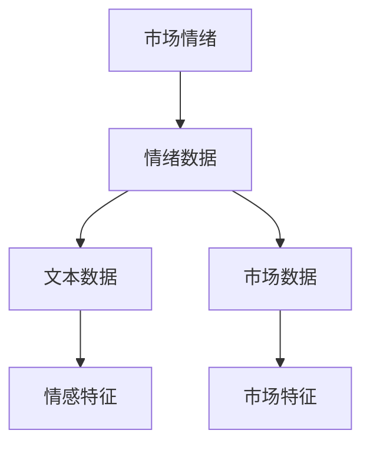
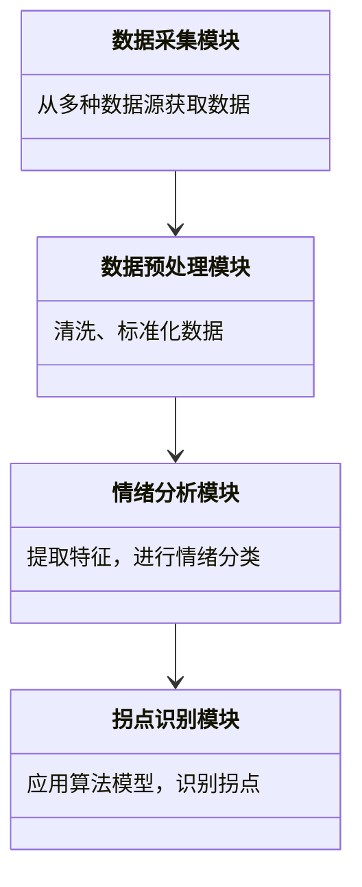
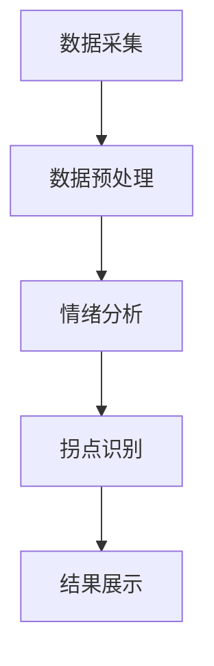

                 


# 智能算法识别市场情绪拐点

> 关键词：市场情绪拐点，智能算法，情绪分析，时间序列分析，金融数据分析，深度学习

> 摘要：本文详细探讨了如何利用智能算法识别市场情绪拐点。通过分析情绪数据的来源、特征提取、算法原理及系统架构，结合实际案例和代码实现，展示了如何通过技术手段捕捉市场情绪变化，为投资者提供决策支持。

---

## 第一部分: 市场情绪拐点的背景与核心概念

### 第1章: 市场情绪拐点的定义与重要性

#### 1.1 市场情绪的概念与作用
- **市场情绪的定义**：市场情绪是指投资者在金融市场中的情感倾向，通常表现为乐观、悲观或中立。
- **市场情绪的重要性**：情绪波动会影响市场走势，是分析市场趋势的重要因素。
- **情绪拐点的定义**：情绪拐点是指市场情绪从一个状态转向另一个状态的关键时刻。

#### 1.2 情绪拐点识别的背景与问题描述
- **传统市场分析的局限性**：传统方法依赖技术指标和历史数据分析，难以捕捉情绪变化。
- **情绪拐点识别的必要性**：及时识别拐点有助于投资者做出更明智的决策。
- **问题解决的思路与目标**：通过智能算法分析情绪数据，准确识别拐点。

#### 1.3 情绪拐点的核心特征
- **突变性**：情绪变化突然，导致市场趋势反转。
- **周期性**：情绪波动具有一定的周期性规律。
- **复杂性**：情绪受多种因素影响，难以预测。

### 第2章: 智能算法的核心概念与联系

#### 2.1 情绪数据的来源与分类
- **文本数据**：社交媒体、新闻文章中的投资者情绪。
- **市场数据**：股票价格、成交量等反映市场行为的数据。
- **情绪数据的多模态特征**：结合文本、价格等多种数据进行分析。

#### 2.2 情绪分析与算法的关系
- **情绪分析的基本原理**：通过自然语言处理技术分析文本中的情绪倾向。
- **智能算法的应用**：利用机器学习和深度学习模型预测情绪变化。
- **情绪拐点识别的核心算法**：时间序列分析、深度学习模型。

#### 2.3 核心概念的ER实体关系图


---

## 第二部分: 情绪拐点识别的算法原理与数学模型

### 第3章: 数据预处理与特征提取

#### 3.1 数据清洗与标准化
- **文本数据的清洗流程**：去除停用词、标点符号，进行分词处理。
- **市场数据的标准化方法**：归一化处理，消除量纲影响。
- **数据增强技术**：通过数据扩展增加样本多样性。

#### 3.2 特征提取的数学模型
- **TF-IDF特征提取**：基于词频-逆文档频率的特征提取方法。
- **Word2Vec与BERT特征提取**：将文本转化为向量表示，捕捉语义信息。
- **统计特征与技术指标**：成交量、波动率等市场指标的特征提取。

### 第4章: 情绪分析与拐点预测的算法

#### 4.1 时间序列分析
- **ARIMA模型**：用于预测未来的市场情绪。
- **LSTM网络**：适合处理时间序列数据，捕捉长期依赖关系。
- **GARCH模型**：用于预测市场波动性。

#### 4.2 基于机器学习的情绪分类
- **SVM分类器**：用于情绪分类，具有较高的准确率。
- **随机森林与梯度提升树**：通过集成学习提高分类性能。
- **深度学习模型**：如卷积神经网络（CNN）用于文本情绪分类。

### 第5章: 情绪拐点识别的数学模型

#### 5.1 情绪指数计算公式
$$ E = \sum_{i=1}^{n} w_i \cdot s_i $$
其中，$w_i$ 是第i个特征的权重，$s_i$ 是第i个特征的得分。

#### 5.2 基于时间序列的拐点检测
$$ P(t) = \alpha \cdot E(t) + \beta \cdot P(t-1) $$
其中，$\alpha$ 和 $\beta$ 是模型参数，$P(t)$ 是当前时刻的情绪预测值。

---

## 第三部分: 情绪拐点识别的系统架构与项目实战

### 第6章: 系统架构设计

#### 6.1 问题场景介绍
- **数据来源**：社交媒体、新闻网站、市场数据接口。
- **系统功能**：数据采集、情绪分析、拐点识别、结果展示。

#### 6.2 系统功能设计


#### 6.3 系统架构设计


### 第7章: 项目实战

#### 7.1 环境安装
- **Python环境**：安装Python 3.8及以上版本。
- **依赖库安装**：使用pip安装numpy、pandas、scikit-learn、tensorflow等库。

#### 7.2 核心实现代码
```python
import numpy as np
from sklearn.svm import SVC
from sklearn.model_selection import train_test_split
from tensorflow.keras.models import Sequential
from tensorflow.keras.layers import LSTM, Dense

# 示例数据加载
def load_data():
    # 加载文本数据和市场数据
    return X, y

# 数据预处理
def preprocess_data(X):
    # 文本数据清洗和向量化
    # 市场数据标准化
    return processed_X

# 情绪分类模型
def build_classifier():
    model = Sequential()
    model.add(LSTM(64, input_shape=(None, 100)))
    model.add(Dense(1, activation='sigmoid'))
    model.compile(loss='binary_crossentropy', optimizer='adam')
    return model

# 训练模型
X, y = load_data()
X_train, X_test, y_train, y_test = train_test_split(X, y)
classifier = build_classifier()
classifier.fit(X_train, y_train, epochs=10, batch_size=32)
```

#### 7.3 案例分析
- **案例选择**：使用Twitter数据集进行情绪分析。
- **模型训练**：训练LSTM模型，识别情绪拐点。
- **结果分析**：分析模型预测结果，验证准确性。

---

## 第四部分: 最佳实践与总结

### 第8章: 最佳实践与注意事项

#### 8.1 小结
- **算法选择**：根据数据类型选择合适的算法。
- **数据质量**：确保数据清洗和预处理到位。
- **模型调优**：通过超参数优化提升模型性能。

#### 8.2 注意事项
- **数据隐私**：注意数据来源的合法性和隐私保护。
- **模型解释性**：选择具有可解释性的模型，便于分析结果。
- **实时性**：考虑系统的实时性，优化计算效率。

#### 8.3 拓展阅读
- **推荐书籍**：《Python机器学习实战》、《深度学习》。
- **在线资源**：Coursera上的相关课程。

---

## 作者

作者：AI天才研究院/AI Genius Institute  
禅与计算机程序设计艺术 /Zen And The Art of Computer Programming

