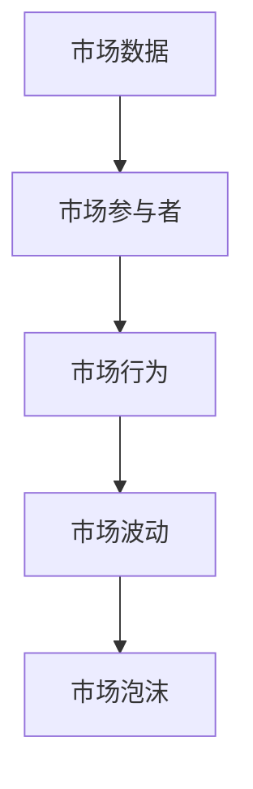
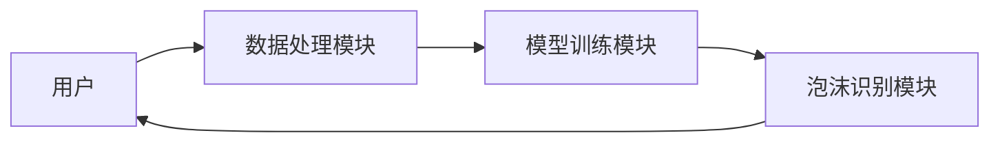

                 


# 智能算法识别市场泡沫形成

## 关键词
智能算法, 市场泡沫, 机器学习, 时间序列分析, LSTM, 经济预测

## 摘要
智能算法在识别市场泡沫方面展现出巨大潜力。通过机器学习和深度学习技术，分析市场数据的时间序列特征，构建数学模型进行预测和识别。本文详细讲解了市场泡沫的形成机制、智能算法的原理，以及如何结合数学模型和系统架构设计，实现市场泡沫的有效识别。通过实际案例分析和代码实现，展示了智能算法在金融市场的应用前景。

---

# 第1章 市场泡沫与智能算法概述

## 1.1 市场泡沫的基本概念
### 1.1.1 市场泡沫的定义与特征
市场泡沫是指资产价格在短时间内急剧上涨，随后迅速下跌的现象。其特征包括价格偏离实际价值、投资者情绪化、市场波动剧烈等。

### 1.1.2 市场泡沫的形成机制
市场泡沫的形成通常由投资者情绪、信息不对称、市场操纵等因素驱动。常见的泡沫形成阶段包括积累、膨胀、破裂三个阶段。

### 1.1.3 市场泡沫对经济的影响
市场泡沫的破裂可能导致金融市场的剧烈波动，引发金融危机，影响经济发展。因此，识别和预测市场泡沫对经济稳定至关重要。

## 1.2 智能算法的基本原理
### 1.2.1 机器学习与深度学习的定义
机器学习是通过数据训练模型，使其能够自动学习和预测；深度学习是基于人工神经网络的机器学习方法，能够处理复杂的非线性关系。

### 1.2.2 时间序列分析的定义
时间序列分析是通过对历史数据的研究，预测未来趋势的方法。常用模型包括ARIMA、LSTM等。

## 1.3 智能算法在市场泡沫识别中的应用
### 1.3.1 市场数据的特征分析
市场数据包括价格、成交量、波动率等，这些数据可以通过时间序列分析提取特征。

### 1.3.2 机器学习算法的选择
根据市场数据的特征，选择适合的算法，如随机森林、支持向量机等。

### 1.3.3 深度学习模型的优势
深度学习模型（如LSTM）能够捕捉市场数据中的非线性关系，提高预测精度。

## 1.4 本章小结
本章介绍了市场泡沫的基本概念、智能算法的原理及其在市场泡沫识别中的应用，为后续章节奠定了基础。

---

# 第2章 市场泡沫识别的核心概念与联系

## 2.1 市场数据的特征提取
### 2.1.1 时间序列数据的特征提取
时间序列数据的特征包括趋势、周期性、突变点等，可以通过统计方法提取。

### 2.1.2 市场参与者的行为模式
投资者的行为受情绪驱动，可以通过分析交易数据识别异常行为。

## 2.2 智能算法的核心原理
### 2.2.1 机器学习算法的分类与选择
根据数据类型和任务选择合适的算法，如监督学习、无监督学习等。

### 2.2.2 深度学习模型的结构与特点
深度学习模型（如LSTM）能够处理复杂的时间序列数据，捕捉长期依赖关系。

## 2.3 核心概念的ER实体关系图


## 2.4 本章小结
本章通过ER实体关系图展示了市场泡沫识别的核心概念及其相互联系。

---

# 第3章 智能算法识别市场泡沫的数学模型与公式

## 3.1 市场数据的特征提取
### 3.1.1 时间序列数据的特征提取方法
常用方法包括移动平均、指数平滑等。

### 3.1.2 市场波动的统计特征分析
统计特征包括均值、方差、自相关性等。

## 3.2 市场泡沫识别的数学模型
### 3.2.1 基于回归分析的市场预测模型
$$y = \beta_0 + \beta_1x + \epsilon$$

### 3.2.2 基于神经网络的市场预测模型


### 3.2.3 基于LSTM的时间序列预测模型
$$LSTM(t) = \sigma(W_{f} \cdot [h(t-1), x(t)] + b_f)$$

## 3.3 算法原理的详细讲解与举例
### 3.3.1 机器学习算法的训练过程
包括数据预处理、模型训练、参数优化等步骤。

### 3.3.2 深度学习模型的优化策略
如Adam优化器、学习率调整等。

### 3.3.3 时间序列分析的实际案例
通过实际市场数据，展示模型的应用效果。

## 3.4 本章小结
本章详细讲解了数学模型与公式，并通过实例展示了算法的应用。

---

# 第4章 智能算法识别市场泡沫的系统架构设计

## 4.1 系统功能设计
### 4.1.1 数据采集模块
从金融市场获取实时数据。

### 4.1.2 数据处理模块
对数据进行清洗、标准化处理。

### 4.1.3 模型训练模块
训练机器学习或深度学习模型。

### 4.1.4 泡沫识别模块
基于模型预测市场泡沫。

## 4.2 系统架构设计


## 4.3 系统接口设计
定义各模块之间的接口，确保数据流畅通。

## 4.4 系统交互设计


## 4.5 本章小结
本章通过系统架构设计，展示了智能算法识别市场泡沫的整体框架。

---

# 第5章 智能算法识别市场泡沫的项目实战

## 5.1 环境安装
### 5.1.1 Python环境的安装
安装Python、Jupyter Notebook等工具。

### 5.1.2 依赖库的安装
安装TensorFlow、Keras、Pandas等库。

## 5.2 系统核心实现源代码
### 5.2.1 数据采集模块
```python
import pandas as pd
data = pd.read_csv('market_data.csv')
```

### 5.2.2 数据处理模块
```python
from sklearn.preprocessing import StandardScaler
scaler = StandardScaler()
data_scaled = scaler.fit_transform(data)
```

### 5.2.3 模型训练模块
```python
from tensorflow.keras.models import Sequential
from tensorflow.keras.layers import LSTM, Dense
model = Sequential()
model.add(LSTM(64, input_shape=(timesteps, features)))
model.add(Dense(1))
model.compile(optimizer='adam', loss='mse')
model.fit(X_train, y_train, epochs=100, batch_size=32)
```

### 5.2.4 泡沫识别模块
```python
y_pred = model.predict(X_test)
threshold = 0.5
predicted_bubbles = y_pred > threshold
```

## 5.3 代码应用解读与分析
### 5.3.1 数据预处理的详细步骤
包括数据清洗、缺失值处理、标准化等。

### 5.3.2 模型训练的具体过程
包括数据分块、模型编译、训练循环等。

### 5.3.3 模型评估与优化
通过回测、调整超参数优化模型性能。

## 5.4 实际案例分析
### 5.4.1 数据来源与特征
选择某金融市场的历史数据，提取价格、成交量等特征。

### 5.4.2 模型训练与预测
训练LSTM模型，预测市场泡沫。

### 5.4.3 模型结果分析
通过混淆矩阵、精确率、召回率等指标评估模型性能。

## 5.5 本章小结
本章通过实际项目案例，展示了智能算法识别市场泡沫的具体实现过程。

---

# 第6章 智能算法识别市场泡沫的总结与展望

## 6.1 本章总结
总结智能算法在识别市场泡沫中的应用，包括核心概念、算法原理、系统架构设计和项目实战。

## 6.2 未来展望
未来的研究方向包括更复杂的模型、多模态数据融合、实时预测等。

## 6.3 最佳实践 tips
- 数据预处理是关键。
- 选择合适的算法和模型。
- 模型调优和评估不可忽视。

## 6.4 本章小结
本章总结了全文，并展望了未来的研究方向。

---

# 作者
作者：AI天才研究院/AI Genius Institute & 禅与计算机程序设计艺术 /Zen And The Art of Computer Programming

