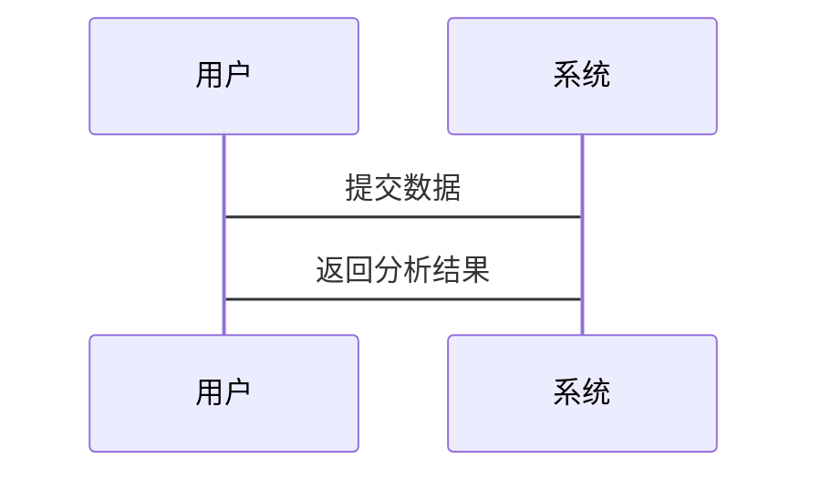

                 


# 智能算法识别市场结构性变化

## 关键词：智能算法、市场结构性变化、时间序列分析、机器学习、数据驱动决策

## 摘要：本文详细探讨了智能算法在识别市场结构性变化中的应用，结合数学模型和实际案例，分析了算法的工作原理及其在市场分析中的优势，为读者提供了一套完整的理论与实践框架。

---

# 第1章: 智能算法与市场结构性变化概述

## 1.1 问题背景与描述

### 1.1.1 传统市场分析的局限性
传统的市场分析方法依赖于人工经验判断和简单的统计分析，难以捕捉复杂市场环境中的隐含规律。金融市场中的价格波动、经济指标变化等复杂现象，往往需要更 sophisticated 的分析方法。

### 1.1.2 数据驱动的市场分析需求
随着大数据技术的普及，市场数据的规模和复杂性急剧增加，传统的分析方法已无法满足需求。数据驱动的市场分析方法能够从海量数据中提取有价值的信息，为决策者提供更精准的支持。

### 1.1.3 智能算法的引入与目标
智能算法（如机器学习、深度学习等）能够自动从数据中学习特征，并发现传统方法难以察觉的模式和规律。其目标是通过自动化分析，帮助市场参与者识别结构性变化，优化决策过程。

## 1.2 问题解决与边界

### 1.2.1 智能算法的核心作用
智能算法能够从非结构化数据中提取特征，识别潜在的市场变化模式，为决策提供支持。例如，在金融领域，智能算法可以识别价格波动的拐点，预测市场趋势。

### 1.2.2 市场结构性变化的定义与范围
市场结构性变化指的是市场中某些关键因素的变化，如供需关系、政策变化等，导致市场整体或局部发生显著变化。本文重点关注时间序列数据中的结构性变化识别。

### 1.2.3 解决方案的边界与外延
本文主要探讨如何通过智能算法识别时间序列数据中的结构性变化，解决方案的边界包括数据预处理、特征提取、模型训练和结果验证。外延则包括将算法应用于不同领域的可能性。

## 1.3 核心概念与组成

### 1.3.1 智能算法的构成要素
智能算法由数据输入、特征提取、模型训练、结果输出等部分组成。其核心是通过数据驱动的方式，自动学习市场变化的特征。

### 1.3.2 市场结构性变化的特征
结构性变化通常表现为时间序列数据中的突变点、趋势变化等。这些特征可以通过算法提取并分类。

### 1.3.3 核心概念的关联与结构
智能算法通过分析市场数据，提取结构性变化的特征，帮助识别市场中的关键变化点。

## 1.4 本章小结
本章介绍了智能算法在市场分析中的作用，明确了市场结构性变化的定义和范围，为后续章节的分析奠定了基础。

---

# 第2章: 智能算法的概念与原理

## 2.1 智能算法的核心原理

### 2.1.1 数据驱动的特征提取
智能算法通过数据预处理和特征工程，从原始数据中提取有用的特征，例如均值、方差、自相关系数等。

### 2.1.2 模型训练与优化
通过训练机器学习模型（如LSTM、ARIMA等），智能算法能够自动学习市场数据中的模式。

### 2.1.3 结果预测与反馈机制
算法根据训练好的模型，预测未来的市场变化，并通过反馈机制优化模型性能。

## 2.2 市场结构性变化的特征分析

### 2.2.1 时间序列数据的特征
时间序列数据具有趋势性、周期性、随机性等特征。结构性变化通常表现为趋势或周期的变化。

### 2.2.2 市场波动的模式识别
通过分析波动幅度、频率等指标，智能算法能够识别市场波动的模式。

### 2.2.3 异常点与转折点的检测
智能算法能够识别时间序列中的异常点和转折点，这些点可能是结构性变化的信号。

## 2.3 智能算法与市场变化的关联

### 2.3.1 算法的输入与输出关系
输入为时间序列数据，输出为结构性变化的标签或概率。

### 2.3.2 市场变化的多维度分析
市场变化可能涉及多个维度，如价格、成交量、情绪指标等。智能算法能够综合分析这些维度。

### 2.3.3 算法的可解释性与局限性
尽管智能算法能够识别市场变化，但其可解释性较差，且可能存在过拟合等问题。

## 2.4 核心概念的ER实体关系图

```mermaid
er
actor: 用户
smart_algorithm: 智能算法
market_data: 市场数据
change_pattern: 市场变化模式
```

## 2.5 本章小结
本章详细介绍了智能算法的核心原理和市场结构性变化的特征，为后续章节的算法设计奠定了基础。

---

# 第3章: 智能算法的数学模型与原理

## 3.1 算法原理的数学模型

### 3.1.1 时间序列模型
时间序列模型（如ARIMA）用于分析数据的自相关性，预测未来值。

### 3.1.2 LSTM网络
LSTM（长短期记忆网络）能够捕捉时间序列中的长期依赖关系，适合处理复杂的时间序列数据。

### 3.1.3 结合注意力机制的模型
注意力机制能够聚焦时间序列中的关键时间点，提升模型的性能。

## 3.2 算法流程


## 3.3 算法实现的Python代码示例

### 3.3.1 数据预处理
```python
import pandas as pd
import numpy as np

# 示例数据加载
data = pd.read_csv('market_data.csv')
data.head()
```

### 3.3.2 模型训练
```python
from sklearn.model_selection import train_test_split
from keras.layers import LSTM, Dense
from keras.models import Sequential

# 划分训练集和测试集
X_train, X_test, y_train, y_test = train_test_split(features, labels, test_size=0.2)

# 模型构建
model = Sequential()
model.add(LSTM(50, input_shape=(timesteps, features)))
model.add(Dense(1))
model.compile(optimizer='adam', loss='mean_squared_error')
model.fit(X_train, y_train, epochs=10, batch_size=32)
```

## 3.4 算法的数学公式

### 3.4.1 LSTM的遗忘门公式
$$ f_t = \sigma(W_f \cdot [h_{t-1}, x_t] + b_f) $$

### 3.4.2 LSTM的输出门公式
$$ o_t = \sigma(W_o \cdot [h_{t-1}, x_t] + b_o) $$

### 3.4.3 LSTM的细胞状态更新公式
$$ c_t = f_t \cdot c_{t-1} + i_t \cdot tanh(W_c \cdot [h_{t-1}, x_t] + b_c) $$

### 3.4.4 LSTM的隐藏状态更新公式
$$ h_t = o_t \cdot tanh(c_t) $$

## 3.5 本章小结
本章通过数学公式和代码示例，详细讲解了智能算法的原理和实现方法，为后续章节的系统设计奠定了基础。

---

# 第4章: 系统分析与架构设计

## 4.1 问题场景介绍
本系统旨在通过智能算法识别市场结构性变化，帮助市场参与者做出更明智的决策。

## 4.2 系统功能设计

### 4.2.1 数据采集模块
从多种数据源采集市场数据，如金融数据、经济指标等。

### 4.2.2 数据预处理模块
对采集的数据进行清洗、归一化等预处理，确保数据质量。

### 4.2.3 模型训练模块
使用训练好的智能算法模型，对数据进行分析，识别结构性变化。

### 4.2.4 结果展示模块
将分析结果以可视化的方式展示，帮助用户理解。

## 4.3 系统架构设计


## 4.4 系统接口设计
系统提供RESTful API接口，方便与其他系统集成。

## 4.5 系统交互设计



## 4.6 本章小结
本章详细描述了系统的功能设计和架构，为后续章节的项目实现提供了指导。

---

# 第5章: 项目实战

## 5.1 环境安装

### 5.1.1 安装Python环境
```bash
python --version
pip install numpy pandas matplotlib keras
```

### 5.1.2 安装深度学习框架
```bash
pip install tensorflow
```

## 5.2 系统核心实现源代码

### 5.2.1 数据预处理
```python
import pandas as pd
import numpy as np

# 数据加载与预处理
data = pd.read_csv('market_data.csv')
data = data.dropna()
data = data.iloc[:, 1:]  # 去除时间列
```

### 5.2.2 模型训练
```python
from keras.models import Sequential
from keras.layers import LSTM, Dense

# 模型构建
model = Sequential()
model.add(LSTM(50, input_shape=(timesteps, features)))
model.add(Dense(1))
model.compile(optimizer='adam', loss='mean_squared_error')
model.fit(X_train, y_train, epochs=10, batch_size=32)
```

## 5.3 代码应用解读与分析
通过代码实现，我们可以看到智能算法如何从数据中学习特征，并识别市场结构性变化。

## 5.4 实际案例分析
以金融数据为例，展示算法如何识别价格波动的拐点。

## 5.5 项目小结
本章通过实际项目展示了智能算法的应用，帮助读者理解理论与实践的结合。

---

# 第6章: 总结与扩展

## 6.1 最佳实践 tips
- 数据预处理是关键，确保数据质量。
- 模型选择要结合实际场景，选择合适的算法。

## 6.2 本章小结
本文详细探讨了智能算法在识别市场结构性变化中的应用，从理论到实践，为读者提供了一套完整的解决方案。

## 6.3 注意事项
- 智能算法的结果仅供参考，需结合实际市场情况。
- 注意数据隐私和安全问题。

## 6.4 拓展阅读
建议读者进一步学习时间序列分析、深度学习等领域的知识。

---

# 作者：AI天才研究院/AI Genius Institute & 禅与计算机程序设计艺术 /Zen And The Art of Computer Programming

