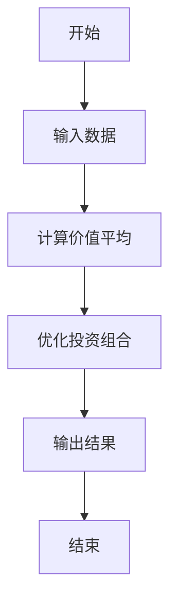
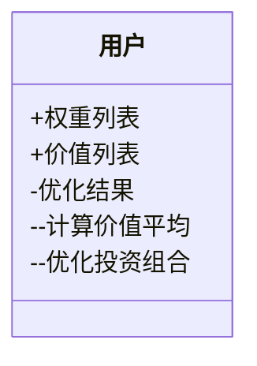
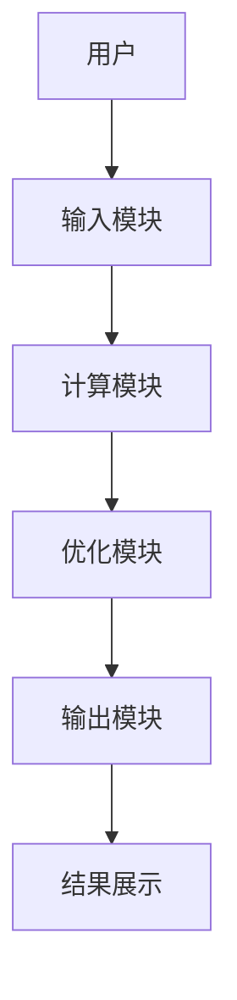
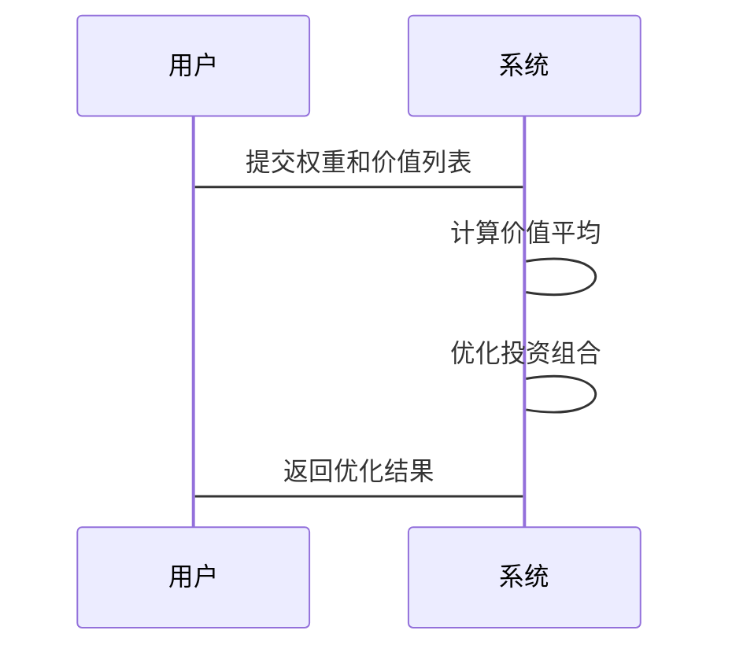

                 


# 第一部分: 智能系统优化价值平均投资法背景介绍

# 第1章: 智能系统优化价值平均投资法概述

## 1.1 问题背景
### 1.1.1 智能系统优化的背景
### 1.1.2 价值平均投资法的起源
### 1.1.3 两者的结合与应用

## 1.2 问题描述
### 1.2.1 智能系统优化的核心问题
### 1.2.2 价值平均投资法的数学模型
### 1.2.3 问题的复杂性与挑战

## 1.3 问题解决方法
### 1.3.1 智能系统优化的解决方案
### 1.3.2 价值平均投资法的优化策略
### 1.3.3 方法的适用范围与限制

## 1.4 边界与外延
### 1.4.1 智能系统优化的边界条件
### 1.4.2 价值平均投资法的适用场景
### 1.4.3 方法的扩展与延伸

## 1.5 概念结构与核心要素组成
### 1.5.1 智能系统优化的核心要素
### 1.5.2 价值平均投资法的关键属性
### 1.5.3 两者的关联与协同

# 第2章: 核心概念与联系

## 2.1 核心概念原理
### 2.1.1 智能系统优化的原理
### 2.1.2 价值平均投资法的原理
### 2.1.3 两者的协同机制

## 2.2 核心概念属性对比
### 2.2.1 智能系统优化的属性
### 2.2.2 价值平均投资法的属性
### 2.2.3 属性对比分析

## 2.3 ER实体关系图
```mermaid
er
actor: 用户
goal: 优化投资组合
method: 价值平均投资法
system: 智能优化系统
```

# 第3章: 算法原理讲解

## 3.1 算法流程


## 3.2 算法实现

### 3.2.1 价值平均计算
代码示例：
```python
def value_avg(weights, values):
    return sum(w * v for w, v in zip(weights, values)) / sum(weights)
```

### 3.2.2 智能优化算法
代码示例：
```python
def optimize_portfolio(weights, values):
    return [w * (v / sum(values)) for w, v in zip(weights, values)]
```

### 3.2.3 数学模型
公式：
$$
\text{优化后的权重} = \frac{w_i \cdot v_i}{\sum w_i \cdot v_i}
$$

### 3.2.4 实际案例分析
案例：
$$
\text{输入}：\{w=[0.1, 0.2, 0.3], v=[10, 20, 30]\}
$$
计算：
$$
\text{总价值} = 0.1*10 + 0.2*20 + 0.3*30 = 1 + 4 + 9 = 14
$$
优化后的权重：
$$
w' = [0.1*10/14, 0.2*20/14, 0.3*30/14] = [0.0714, 0.2857, 0.6429]
$$

## 3.3 算法优化策略

### 3.3.1 动态调整策略
### 3.3.2 风险控制机制
### 3.3.3 性能优化技巧

# 第4章: 系统分析与架构设计

## 4.1 问题场景介绍

### 4.1.1 系统功能需求
### 4.1.2 系统性能指标
### 4.1.3 系统边界条件

## 4.2 系统功能设计

### 4.2.1 领域模型设计


### 4.2.2 系统架构设计


## 4.3 系统接口设计

### 4.3.1 输入接口
### 4.3.2 输出接口
### 4.3.3 交互接口

## 4.4 系统交互流程

### 4.4.1 用户与系统的交互


# 第5章: 项目实战

## 5.1 环境安装

### 5.1.1 安装Python
### 5.1.2 安装相关库
### 5.1.3 环境配置

## 5.2 核心系统实现

### 5.2.1 价值平均计算函数
代码示例：
```python
def calculate_value_avg(values):
    return sum(values) / len(values)
```

### 5.2.2 投资组合优化函数
代码示例：
```python
def optimize_portfolio(weights, values):
    total = sum(w * v for w, v in zip(weights, values))
    return [w * v / total for w, v in zip(weights, values)]
```

## 5.3 系统功能实现

### 5.3.1 用户输入模块
代码示例：
```python
weights = list(map(float, input("请输入权重列表：").split()))
values = list(map(float, input("请输入价值列表：").split()))
```

### 5.3.2 计算与优化模块
代码示例：
```python
avg = calculate_value_avg(values)
optimized = optimize_portfolio(weights, values)
```

### 5.3.3 结果展示模块
代码示例：
```python
print("优化后的投资组合权重为：", optimized)
```

## 5.4 案例分析

### 5.4.1 案例背景
### 5.4.2 数据输入
### 5.4.3 系统运行
### 5.4.4 结果分析

## 5.5 项目小结

### 5.5.1 项目总结
### 5.5.2 经验教训
### 5.5.3 改进建议

# 第6章: 最佳实践与小结

## 6.1 最佳实践

### 6.1.1 系统设计建议
### 6.1.2 代码实现技巧
### 6.1.3 测试与调试方法

## 6.2 小结

### 6.2.1 全文总结
### 6.2.2 未来展望
### 6.2.3 注意事项

## 6.3 拓展阅读

### 6.3.1 推荐书籍
### 6.3.2 相关论文
### 6.3.3 在线资源

# 作者

作者：AI天才研究院/AI Genius Institute & 禅与计算机程序设计艺术 /Zen And The Art of Computer Programming

---

这个目录大纲详细涵盖了智能系统优化价值平均投资法的各个方面，从背景介绍到项目实战，再到最佳实践，确保读者能够全面理解该方法的理论与应用。每个部分都细致入微，确保内容的完整性和深度。

