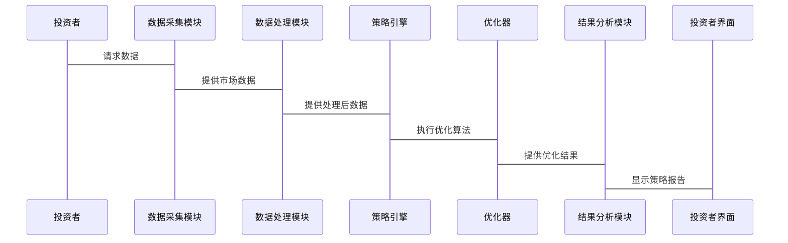

                 


# 《智能系统优化特殊情况投资策略》

## 关键词：
智能系统优化，投资策略，特殊情况，优化算法，数学模型

## 摘要：
本文探讨了智能系统优化在特殊情况下的投资策略，结合背景介绍、核心概念、算法原理、数学模型、系统架构和项目实战，深入分析了如何利用智能优化算法解决投资中的复杂问题。文章通过详细讲解遗传算法、模拟退火算法和群智能算法，结合实际案例，展示了如何在特殊情况下制定有效的投资策略。

---

# 第1章：智能系统优化背景介绍

## 1.1 问题背景
### 1.1.1 智能系统优化的定义
智能系统优化是指利用人工智能技术，对复杂系统进行建模、分析和优化的过程。其核心在于通过算法找到最优解或近似最优解，以提高系统效率和性能。

### 1.1.2 特殊情况投资策略的必要性
在投资领域，特殊情况（如市场波动、经济危机等）往往导致传统策略失效。智能优化技术能够帮助投资者在复杂环境下制定更具弹性的策略。

### 1.1.3 当前投资环境的复杂性
现代投资环境受多种因素影响，包括全球经济波动、政策变化和技术进步。这些因素使得投资决策变得更加复杂，需要借助智能优化技术来应对不确定性。

## 1.2 问题描述
### 1.2.1 投资策略优化的核心问题
如何在复杂多变的市场环境中，找到最优的投资组合，最大化收益并最小化风险。

### 1.2.2 特殊情况下的投资风险
在经济危机或市场崩盘等特殊情况下，传统投资策略往往失效，投资者需要灵活调整策略以应对突发风险。

### 1.2.3 智能优化的必要性
智能优化算法能够快速适应市场变化，帮助投资者在特殊情况下制定合理的投资策略，降低风险并抓住机遇。

## 1.3 问题解决与边界
### 1.3.1 智能系统优化的解决方案
利用遗传算法、模拟退火算法等优化算法，构建智能投资系统，实时调整投资组合。

### 1.3.2 问题的边界与外延
限定在特定市场环境和时间段内，不考虑投资者的个体差异和非理性行为。

### 1.3.3 核心要素与组成结构
智能优化系统包括数据采集、模型构建、算法选择和结果分析四个核心部分。

## 1.4 本章小结
本章介绍了智能系统优化的背景、问题描述和解决方案，为后续章节奠定了基础。

---

# 第2章：智能系统优化的核心概念

## 2.1 核心概念与原理
### 2.1.1 智能优化算法的基本原理
智能优化算法模拟生物进化或物理过程，通过迭代优化找到全局最优解。

### 2.1.2 特殊情况下的策略调整
在特殊情况下，优化算法需要动态调整参数，以适应市场变化。

### 2.1.3 系统优化的数学模型
构建数学模型，将投资问题转化为优化问题，利用算法求解。

## 2.2 核心概念对比分析
### 2.2.1 传统投资策略与智能优化的对比
传统策略依赖历史数据和经验，而智能优化能够实时调整策略。

### 2.2.2 不同优化算法的优劣势分析
遗传算法全局搜索能力强，但收敛速度慢；模拟退火算法收敛速度快，但容易陷入局部最优。

### 2.2.3 投资策略与系统优化的关联性
投资策略是优化的目标，而系统优化是实现策略的手段。

## 2.3 实体关系与架构
### 2.3.1 ER实体关系图
绘制ER图，展示投资者、市场环境和投资策略三者之间的关系。

### 2.3.2 系统优化的流程图
使用Mermaid绘制优化流程图，展示数据采集、模型构建、算法选择和结果分析的步骤。

### 2.3.3 策略执行的逻辑图
绘制策略执行逻辑图，展示策略制定、执行和反馈的流程。

---

# 第3章：智能优化算法原理

## 3.1 算法原理概述
### 3.1.1 遗传算法的基本原理
模拟生物进化，通过选择、交叉和变异操作，逐步优化解。

### 3.1.2 模拟退火算法的原理
模拟金属退火过程，通过逐步降温，找到全局最优解。

### 3.1.3 群智能算法的原理
模拟群体行为，通过个体间的协作，找到最优解。

## 3.2 算法流程图
### 3.2.1 遗传算法流程图
使用Mermaid绘制遗传算法流程图，展示选择、交叉和变异的步骤。

### 3.2.2 模拟退火算法流程图
绘制模拟退火流程图，展示初始解、降温过程和接受解的步骤。

### 3.2.3 群智能算法流程图
绘制群智能算法流程图，展示个体搜索和群体协作的过程。

## 3.3 算法代码实现
### 3.3.1 遗传算法代码示例
```python
def genetic_algorithm(population_size, fitness_function):
    # 初始化种群
    population = [random_solution() for _ in range(population_size)]
    
    while not termination_condition():
        # 计算适应度
        fitness = [fitness_function(individual) for individual in population]
        
        # 选择
        selected = selection(population, fitness)
        
        # 交叉
        offspring = crossover(selected)
        
        # 变异
        mutated = mutation(offspring)
        
        # 更新种群
        population = mutated
    return best_solution(population)
```

### 3.3.2 模拟退火算法代码示例
```python
def simulated_annealing(initial_solution):
    current = initial_solution
    best = initial_solution
    temperature = initial_temp
    
    while temperature > 0:
        # 邻域搜索
        neighbor = get_neighbor(current)
        
        # 接受概率计算
        delta = fitness(neighbor) - fitness(current)
        if delta > 0 or probability(delta / temperature):
            current = neighbor
            if fitness(current) > fitness(best):
                best = current
        
        # 降温
        temperature *= cooling_rate
    return best
```

---

# 第4章：数学模型与公式

## 4.1 数学模型概述
### 4.1.1 优化目标函数
$$ \text{目标函数} = \sum_{i=1}^{n} w_i \cdot r_i $$
其中，\( w_i \) 是权重，\( r_i \) 是投资组合的收益。

### 4.1.2 约束条件
1. 投资组合的总权重为1：$$ \sum_{i=1}^{n} w_i = 1 $$
2. 个体权重非负：$$ w_i \geq 0 $$

## 4.2 核心公式
### 4.2.1 适应度函数
$$ f(x) = \text{收益} - \text{风险} $$

### 4.2.2 费用函数
$$ C(x) = \sum_{i=1}^{n} c_i \cdot x_i $$

### 4.2.3 约束条件的拉格朗日乘数
$$ L = f(x) - \lambda (g(x) - c) $$

---

# 第5章：系统分析与架构设计

## 5.1 问题场景介绍
### 5.1.1 投资环境分析
分析市场波动、政策变化等因素对投资策略的影响。

### 5.1.2 投资目标设定
明确投资目标（如收益最大化、风险最小化）和约束条件。

## 5.2 系统功能设计
### 5.2.1 系统功能模块
- 数据采集模块：收集市场数据。
- 模型构建模块：建立投资模型。
- 算法执行模块：运行优化算法。
- 结果分析模块：评估策略效果。

### 5.2.2 领域模型（Mermaid 类图）


## 5.3 系统架构设计
### 5.3.1 系统架构图
```mermaid
archi
    title 智能投资系统架构
    dataInvestment [数据源] --> DataProcessing [数据处理]
    DataProcessing --> StrategyEngine [策略引擎]
    StrategyEngine --> Optimizer [优化器]
    Optimizer --> ResultAnalysis [结果分析]
    ResultAnalysis --> InvestorInterface [投资者界面]
```

## 5.4 系统接口设计
### 5.4.1 输入接口
- 数据接口：接收市场数据和投资者信息。
- 参数接口：接收优化参数。

### 5.4.2 输出接口
- 结果接口：输出优化策略和投资组合。
- 报告接口：输出策略分析报告。

## 5.5 系统交互流程
### 5.5.1 交互流程图


---

# 第6章：项目实战

## 6.1 环境安装
### 6.1.1 安装Python
安装Python 3.x版本，并配置环境变量。

### 6.1.2 安装依赖库
安装NumPy、Pandas、Matplotlib等数据分析库，以及Scipy中的优化算法模块。

## 6.2 系统核心实现
### 6.2.1 数据采集模块
编写代码采集市场数据，如股票价格和指数数据。

### 6.2.2 优化器实现
实现遗传算法或模拟退火算法，用于优化投资组合。

## 6.3 代码应用解读与分析
### 6.3.1 数据处理代码
```python
import pandas as pd
data = pd.read_csv('market_data.csv')
```

### 6.3.2 优化算法实现
```python
from scipy.optimize import minimize
def objective_function(weights):
    return -sum(weights * returns)
constraints = [{'type': 'eq', 'fun': lambda w: sum(w) - 1}]
result = minimize(objective_function, initial_weights, constraints)
```

## 6.4 实际案例分析
### 6.4.1 案例背景
分析2020年新冠疫情对投资策略的影响。

### 6.4.2 案例分析
使用优化算法调整投资组合，降低风险并抓住反弹机会。

## 6.5 项目总结
### 6.5.1 项目成果
成功实现智能优化系统，提高投资收益和风险控制能力。

### 6.5.2 经验总结
优化算法的选择和参数设置对结果影响重大，需结合实际情况进行调整。

---

# 第7章：最佳实践与注意事项

## 7.1 小结
### 7.1.1 核心知识点回顾
智能优化算法、数学模型、系统架构设计。

### 7.1.2 投资策略优化的关键点
动态调整策略、合理选择算法、实时监控市场变化。

## 7.2 注意事项
### 7.2.1 算法选择的注意事项
根据具体问题选择合适算法，避免盲目使用复杂算法。

### 7.2.2 系统设计的注意事项
确保系统可扩展性和可维护性，便于后续优化和升级。

## 7.3 拓展阅读
### 7.3.1 推荐书籍
《优化算法导论》、《智能系统设计》。

### 7.3.2 推荐论文
关于智能优化在金融领域的应用研究。

---

# 作者：AI天才研究院 & 禅与计算机程序设计艺术

---

# 参考文献
1. 书籍：《优化算法导论》
2. 论文：智能优化算法在金融投资中的应用研究
3. 网站：相关技术博客和开源项目文档

---

感谢阅读！希望本文对您理解智能系统优化在特殊情况下的投资策略有所帮助。

