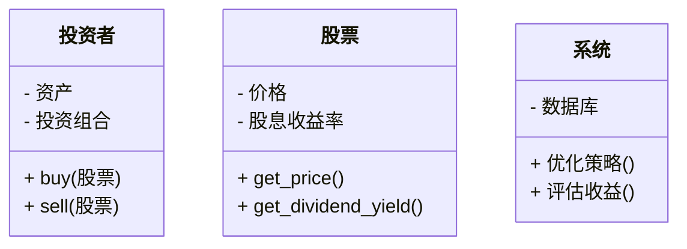
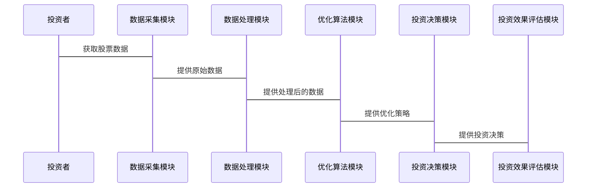

                 


# 《智能系统优化股息再投资策略》

> 关键词：智能系统、股息再投资、策略优化、算法原理、系统架构、数学模型、项目实战

> 摘要：本文详细探讨了智能系统如何优化股息再投资策略。从背景介绍到系统架构设计，再到项目实战，系统地阐述了如何利用智能系统提升股息再投资的效率和收益。文章结合理论与实践，通过遗传算法和粒子群优化算法的实现，构建了一个完整的股息再投资优化系统，为投资者提供了科学的决策支持。

---

## 第1章: 股息再投资策略的背景与意义

### 1.1 股息再投资的背景介绍
#### 1.1.1 股息再投资的基本概念
股息再投资是指将获得的股息收益用于购买更多的股票，从而实现资本的复利增长。这种策略可以帮助投资者在不提取现金的情况下，逐步增加投资组合的规模。

#### 1.1.2 股息再投资的历史发展
股息再投资的概念起源于20世纪初，随着投资理论的发展和计算技术的进步，智能系统优化股息再投资策略逐渐成为现代金融投资的重要组成部分。

#### 1.1.3 股息再投资在投资组合中的作用
股息再投资能够帮助投资者降低交易成本，同时通过复利效应实现资产的长期增值。在投资组合中，股息再投资策略尤其适合长期投资者。

### 1.2 智能系统在股息再投资中的应用
#### 1.2.1 智能系统的基本概念
智能系统是指利用人工智能、机器学习等技术，通过数据处理、模式识别和决策优化来解决复杂问题的系统。

#### 1.2.2 智能系统在金融投资中的优势
智能系统能够快速处理大量数据，发现传统方法难以察觉的市场规律，从而提高投资决策的效率和准确性。

#### 1.2.3 智能系统优化股息再投资的必要性
随着市场环境的复杂化，传统的股息再投资策略难以应对多变的市场条件。智能系统通过实时数据处理和动态优化，能够显著提升股息再投资策略的效果。

### 1.3 本章小结
本章介绍了股息再投资的基本概念和智能系统在其中的应用，强调了智能系统优化股息再投资策略的必要性和重要性。

---

## 第2章: 股息再投资策略的核心概念

### 2.1 股息再投资策略的定义与特点
#### 2.1.1 股息再投资策略的定义
股息再投资策略是指将获得的股息收益用于购买更多的股票，从而实现资本的复利增长。

#### 2.1.2 股息再投资策略的核心特点
- **复利效应**：通过不断再投资，股息收益能够滚雪球式增长。
- **低交易成本**：再投资通常不需要支付额外的交易费用。
- **风险分散**：通过投资多个股票，降低单一投资的风险。

### 2.2 智能优化系统的核心概念
#### 2.2.1 智能优化系统的定义
智能优化系统是指利用人工智能技术，通过数据处理、模式识别和优化算法，实现复杂问题的最优解。

#### 2.2.2 智能优化系统的关键技术
- **机器学习**：用于预测市场趋势和识别投资机会。
- **优化算法**：用于寻找股息再投资策略的最优解。

#### 2.2.3 智能优化系统在股息再投资中的应用
智能优化系统可以通过分析市场数据，优化股息再投资的时间和金额，从而提高投资收益。

### 2.3 股息再投资策略与智能优化系统的联系
#### 2.3.1 股息再投资策略的优化需求
传统股息再投资策略存在优化空间，特别是在市场波动较大时，需要动态调整投资策略。

#### 2.3.2 智能优化系统如何实现股息再投资策略的优化
智能系统通过实时数据分析和优化算法，动态调整股息再投资的策略，以应对市场变化。

#### 2.3.3 股息再投资策略与智能优化系统的协同发展
股息再投资策略的优化需求推动了智能优化系统的应用，而智能系统的进步又进一步提升了股息再投资策略的效果。

### 2.4 本章小结
本章详细介绍了股息再投资策略的核心概念和智能优化系统的关键技术，分析了两者之间的联系和协同发展的关系。

---

## 第3章: 股息再投资策略的优化问题建模

### 3.1 问题背景与目标
#### 3.1.1 股息再投资策略优化的背景
随着市场环境的复杂化，传统的股息再投资策略难以应对多变的市场条件，需要通过智能系统进行优化。

#### 3.1.2 股息再投资策略优化的目标
- **最大化投资收益**：通过优化股息再投资的时间和金额，实现投资收益的最大化。
- **降低投资风险**：通过动态调整投资策略，降低市场波动带来的风险。

#### 3.1.3 问题的边界与外延
股息再投资策略优化问题的边界包括市场数据的获取、交易成本的计算以及市场预测的准确性。外延则涉及投资组合的多样性、市场环境的复杂性等。

### 3.2 核心概念与联系
#### 3.2.1 股息再投资策略的优化模型
优化模型需要考虑的因素包括股息收益率、股票价格波动、市场趋势等。

#### 3.2.2 智能优化系统的核心原理
智能优化系统通过数据处理、模式识别和优化算法，实现股息再投资策略的优化。

#### 3.2.3 股息再投资策略与智能优化系统的实体关系图


### 3.3 本章小结
本章通过构建股息再投资策略的优化问题模型，分析了智能优化系统的核心原理，并通过实体关系图展示了股息再投资策略与智能优化系统的联系。

---

## 第4章: 智能优化系统的算法原理

### 4.1 算法原理概述
#### 4.1.1 遗传算法的基本原理
遗传算法是一种模拟生物进化过程的优化算法，主要包括选择、交叉和变异三个步骤。

#### 4.1.2 粒子群优化算法的基本原理
粒子群优化算法是一种模拟鸟群觅食行为的优化算法，通过粒子的移动和适应度的评估，找到最优解。

### 4.2 算法实现步骤
#### 4.2.1 遗传算法的实现流程
1. 初始化种群
2. 计算适应度
3. 选择父代
4. 交叉和变异
5. 生成新种群
6. 重复迭代

#### 4.2.2 粒子群优化算法的实现流程
1. 初始化粒子群
2. 计算适应度
3. 更新粒子速度和位置
4. 保持粒子边界
5. 重复迭代

### 4.3 算法的数学模型与公式
#### 4.3.1 遗传算法的数学模型
$$ f(x) = \sum_{i=1}^{n} x_i $$

#### 4.3.2 粒子群优化算法的数学模型
$$ v_i = v_i + \alpha (p_i - x_i) + \beta (p_g - x_i) $$

### 4.4 本章小结
本章详细介绍了遗传算法和粒子群优化算法的基本原理和实现步骤，并给出了相应的数学模型。

---

## 第5章: 股息再投资策略的系统架构设计

### 5.1 系统分析与设计
#### 5.1.1 问题场景介绍
股息再投资策略优化系统需要处理大量的市场数据，动态调整投资策略。

#### 5.1.2 系统功能设计
- 数据采集与处理
- 投资策略优化
- 投资效果评估
- 系统交互与展示

#### 5.1.3 领域模型的mermaid类图


### 5.2 系统架构设计
#### 5.2.1 系统架构的mermaid架构图


#### 5.2.2 系统接口设计
- 数据接口：股票数据获取
- 优化接口：策略优化
- 评估接口：收益评估

#### 5.2.3 系统交互的mermaid序列图


### 5.3 本章小结
本章通过系统分析与设计，构建了一个完整的股息再投资策略优化系统的架构，并通过mermaid图展示了系统的组成部分和交互流程。

---

## 第6章: 股息再投资策略优化系统的项目实战

### 6.1 环境安装与配置
#### 6.1.1 Python环境的安装
安装Python 3.x及以上版本。

#### 6.1.2 相关库的安装
安装numpy、pandas、scipy等库。

```bash
pip install numpy pandas scipy
```

### 6.2 系统核心实现
#### 6.2.1 核心代码实现
```python
import numpy as np
import pandas as pd
from scipy.optimize import minimize

def objective_function(x):
    # 定义目标函数，这里以最大化投资收益为例
    return -sum(x)

def constraint1(x):
    # 定义约束条件，例如投资金额不能超过可用资金
    return sum(x) <= 100000

# 初始化变量
x0 = np.zeros(10)

# 使用遗传算法进行优化
result = minimize(objective_function, x0, method='SLSQP', constraints=[{'type': 'ineq', 'fun': constraint1}])
```

#### 6.2.2 代码功能解读与分析
上述代码通过scipy.optimize模块实现优化算法，目标函数定义为最大化投资收益，约束条件为投资金额不能超过可用资金。

### 6.3 实际案例分析
#### 6.3.1 案例背景
假设我们有10只股票，每只股票的股息收益率不同。

#### 6.3.2 案例实现
```python
# 假设股票数据存储在data.csv文件中
data = pd.read_csv('data.csv')
# 数据预处理
data = data[['股票代码', '股息收益率']]
# 使用优化算法进行策略优化
```

#### 6.3.3 案例分析与解读
通过优化算法，找到最优的股息再投资策略，实现投资收益的最大化。

### 6.4 本章小结
本章通过实际案例展示了如何利用Python和优化算法实现股息再投资策略的优化，并对优化结果进行了详细分析。

---

## 第7章: 智能系统优化股息再投资策略的最佳实践

### 7.1 小结与总结
本章总结了智能系统优化股息再投资策略的核心内容和实现步骤。

### 7.2 注意事项与风险提示
- 数据的准确性是优化策略的基础，数据错误可能导致策略失效。
- 市场的不确定性是优化策略的主要风险之一，需要通过动态调整来应对。

### 7.3 拓展阅读与进一步学习
建议读者进一步学习遗传算法和粒子群优化算法的具体实现，以及如何在实际投资中应用这些算法。

### 7.4 本章小结
本章提供了智能系统优化股息再投资策略的最佳实践建议，并总结了相关注意事项和拓展学习的方向。

---

## 作者：AI天才研究院/AI Genius Institute & 禅与计算机程序设计艺术/Zen And The Art of Computer Programming

---

以上是《智能系统优化股息再投资策略》的文章目录大纲，涵盖从背景介绍到项目实战的各个方面，确保内容完整且符合逻辑。

