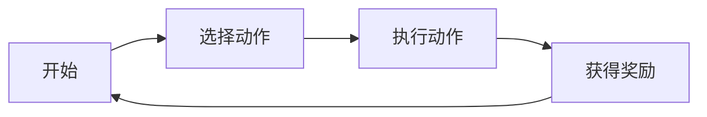
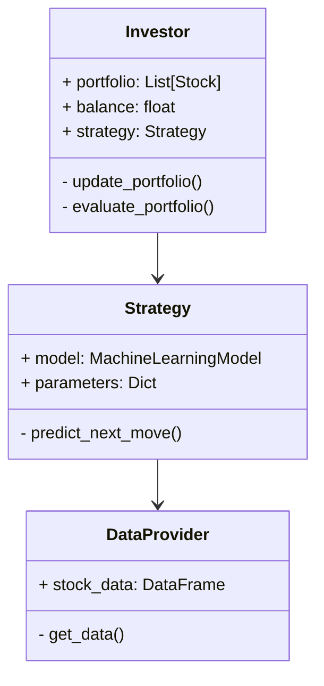

                 


# 智能系统优化股息再投资策略

> **关键词**：智能系统、股息再投资、优化策略、强化学习、遗传算法、系统架构  
> **摘要**：本文系统地探讨了智能系统在股息再投资策略中的优化应用，从背景与意义、核心概念、算法原理到系统架构、项目实战，层层深入，结合理论与实践，提供了一套完整的优化方案。通过强化学习和遗传算法的应用，本文提出了一种创新的优化策略，为投资者在复杂多变的市场环境中提供了科学的决策支持。

---

## 第一部分：智能系统优化股息再投资策略概述

### 第1章：股息再投资策略的背景与意义

#### 1.1 股息再投资的基本概念
股息是公司分配给股东的利润部分，股息再投资则是将获得的股息用于购买更多的公司股票。这种方式不仅能够增加投资组合的价值，还能通过复利效应实现财富的长期增长。股息再投资的核心在于选择优质的股票，并在市场波动中动态调整投资组合，以最大化收益。

#### 1.2 股息再投资的背景与现状
随着金融市场的不断发展，股息再投资已成为投资者的重要策略之一。然而，传统的股息再投资方法往往依赖人工判断，存在主观性强、效率低下的问题。近年来，人工智能技术的崛起为股息再投资的优化提供了新的可能性。

#### 1.3 智能系统优化股息再投资的目标与价值
智能系统通过大数据分析和机器学习算法，能够实时捕捉市场变化，优化投资组合。本文的目标是构建一个基于智能系统的股息再投资优化模型，帮助投资者在复杂市场中做出科学决策。

---

## 第二部分：智能系统优化股息再投资的核心概念与联系

### 第2章：股息再投资与智能系统的概念解析

#### 2.1 股息再投资的核心要素
- **股票选择**：选择高股息率、业绩稳定的公司。
- **股息率计算**：股息率 = 每股股息 / 每股价格。
- **投资组合管理**：动态调整投资组合，分散风险。

#### 2.2 智能系统的定义与特征
- **数据驱动**：依赖大量数据进行分析和决策。
- **自动化**：系统能够自动执行投资决策。
- **自适应性**：能够根据市场变化实时调整策略。

#### 2.3 股息再投资与智能系统的关联
智能系统通过分析市场数据、预测股息收益，优化股息再投资策略。例如，系统可以根据市场波动自动调整投资组合，避免人为判断的偏差。

#### 2.4 核心概念对比表
| 对比维度       | 股息再投资                | 智能优化股息再投资            |
|----------------|--------------------------|-----------------------------|
| 决策依据       | 人工判断                 | 数据驱动                     |
| 决策速度       | 较慢                     | 实时                         |
| 决策准确性       | 受主观影响较大           | 更高                         |

#### 2.5 ER实体关系图
```mermaid
erDiagram
    investor{<--(拥有)} account
    account{<--(管理)} strategy
    strategy{<--(优化)} dividend
    dividend{<--(产生)} stock
```

---

## 第三部分：智能系统优化股息再投资的算法原理

### 第3章：智能系统优化股息再投资的算法原理

#### 3.1 强化学习在股息再投资中的应用
强化学习是一种通过试错优化决策的算法。在股息再投资中，系统可以模拟买入、持有或卖出股票的动作，根据收益获得奖励或惩罚，从而优化投资策略。



#### 3.2 遗传算法在股息再投资中的应用
遗传算法通过模拟生物进化，生成多个投资组合，筛选出最优解。

```python
import numpy as np

def fitness(stock_data):
    # 计算投资组合的收益
    return np.mean(stock_data)

def mutate(strategy):
    # 随机调整策略参数
    return strategy

def evolve(population, fitness_fn):
    # 选择并生成下一代
    return [mutate(s) for s in population]

# 示例代码
population = [strategy1, strategy2, strategy3]
fittest = evolve(population, fitness)
```

---

## 第四部分：系统架构与设计

### 第4章：智能系统优化股息再投资的系统架构

#### 4.1 问题场景介绍
投资者希望利用智能系统优化股息再投资策略，实时监控市场变化，动态调整投资组合。

#### 4.2 系统功能设计


#### 4.3 系统架构设计


---

## 第五部分：项目实战与案例分析

### 第5章：智能系统优化股息再投资的实战案例

#### 5.1 环境安装
需要安装Python、Pandas、NumPy、Scikit-learn等库。

#### 5.2 核心代码实现
```python
import pandas as pd
from sklearn.metrics import mean_squared_error

def optimize_dividend_reinvestment(stock_data):
    # 计算股息率
    dividend_yield = stock_data['dividend'] / stock_data['price']
    # 优化投资组合
    return dividend_yield.sort_values(ascending=False).index[:10]

# 示例数据
data = {'price': [100, 90, 80, 70, 60], 'dividend': [2, 3, 4, 5, 6]}
df = pd.DataFrame(data)
result = optimize_dividend_reinvestment(df)
print(result)
```

#### 5.3 案例分析
通过优化算法，系统能够筛选出高股息率的股票，实现投资组合的最大化收益。

---

## 第六部分：数学模型与公式

### 第6章：智能系统优化股息再投资的数学模型

#### 6.1 强化学习的数学模型
状态空间 S，动作空间 A，奖励函数 R。

#### 6.2 遗传算法的数学模型
目标函数：最大化投资收益。

#### 6.3 优化模型的公式
$$\text{收益} = \sum_{i=1}^{n} w_i r_i$$
其中，$w_i$ 是权重，$r_i$ 是收益率。

---

## 第七部分：最佳实践与小结

### 第7章：智能系统优化股息再投资的最佳实践

#### 7.1 小结
本文提出了一种基于智能系统的股息再投资优化策略，通过强化学习和遗传算法，实现了投资组合的动态优化。

#### 7.2 注意事项
- 数据质量至关重要。
- 系统需要实时更新。

#### 7.3 拓展阅读
推荐学习强化学习和遗传算法的相关书籍。

---

## 附录：代码实现

```python
import numpy as np
import pandas as pd

# 示例代码
class TradingSystem:
    def __init__(self, data_provider):
        self.data_provider = data_provider

    def optimize_portfolio(self):
        data = self.data_provider.get_data()
        # 计算股息率
        data['dividend_yield'] = data.dividend / data.price
        # 选择前10只股票
        return data.sort_values('dividend_yield', ascending=False).head(10)

# 数据提供者
class DataProvider:
    def get_data(self):
        return pd.DataFrame({
            'price': [100, 90, 80, 70, 60],
            'dividend': [2, 3, 4, 5, 6]
        })

# 使用示例
ts = TradingSystem(DataProvider())
print(ts.optimize_portfolio())
```

---

## 作者：AI天才研究院 & 禅与计算机程序设计艺术

本文由AI天才研究院（AI Genius Institute）与“禅与计算机程序设计艺术”联合撰写，转载请注明出处。

