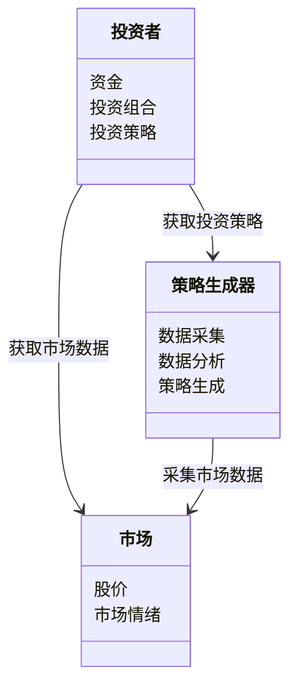
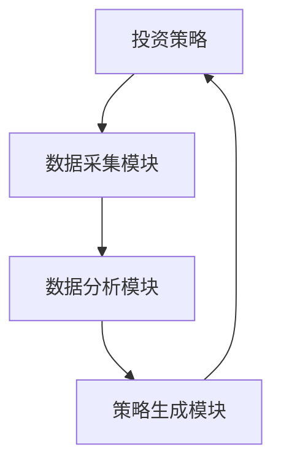
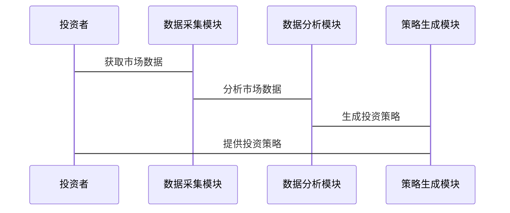

                 


# 智能系统优化逆向投资策略

## 关键词：
智能系统优化，逆向投资策略，优化算法，投资决策，系统架构

## 摘要：
本文深入探讨了智能系统优化在逆向投资策略中的应用，结合优化算法和逆向思维，提出了一套高效的投资优化方案。文章从背景、原理、算法、系统架构到项目实战，全面解析了智能系统优化逆向投资策略的核心内容，为投资者提供了一套科学的投资决策方法。

---

# 智能系统优化逆向投资策略

## 第1章: 智能系统优化逆向投资策略背景介绍

### 1.1 智能系统优化的基本概念
#### 1.1.1 优化的定义与分类
优化是指在一定约束条件下，通过调整变量，使目标函数达到最优的过程。优化可以分为单目标优化和多目标优化，以及线性优化和非线性优化。

#### 1.1.2 智能系统优化的核心要素
智能系统优化的核心要素包括目标函数、约束条件、决策变量和优化算法。目标函数是优化的核心，约束条件是优化的限制，决策变量是优化的对象，优化算法是优化的工具。

#### 1.1.3 逆向思维的定义与特点
逆向思维是指从相反的方向思考问题，寻找解决问题的新方法。其特点包括反向性、创新性和突破性。

### 1.2 逆向投资策略的定义与特点
#### 1.2.1 逆向投资的定义
逆向投资是指在市场低迷时买入，在市场繁荣时卖出的投资策略。其核心思想是“别人恐惧时我贪婪，别人贪婪时我恐惧”。

#### 1.2.2 逆向投资的核心思想
逆向投资的核心思想是寻找市场的非理性行为，利用市场的短期波动，获得超额收益。

#### 1.2.3 智能系统优化在逆向投资中的作用
智能系统优化通过算法优化和数据驱动，帮助投资者在复杂市场中识别投资机会，制定逆向投资策略。

### 1.3 智能系统优化逆向投资策略的背景与意义
#### 1.3.1 当前投资环境的复杂性
当前市场环境复杂多变，传统投资策略难以应对市场的不确定性。

#### 1.3.2 智能系统优化的优势
智能系统优化通过数据驱动和算法优化，能够快速适应市场变化，提高投资决策的科学性。

#### 1.3.3 逆向投资策略的应用场景
逆向投资策略适用于市场波动较大、非理性行为较多的场景，尤其是在市场恐慌和市场狂热时。

### 1.4 本章小结
本章介绍了智能系统优化的基本概念和逆向投资策略的核心思想，阐述了智能系统优化在逆向投资中的重要作用，并分析了当前投资环境的复杂性及智能系统优化的优势。

---

## 第2章: 智能系统优化逆向投资策略的核心概念

### 2.1 智能系统优化的原理
#### 2.1.1 优化算法的基本原理
优化算法是智能系统优化的核心工具，包括遗传算法、模拟退火算法和粒子群优化算法等。

#### 2.1.2 智能系统优化的核心算法
智能系统优化的核心算法包括遗传算法、模拟退火算法和粒子群优化算法。这些算法通过模拟自然进化或物理过程，寻找目标函数的最优解。

#### 2.1.3 优化算法的分类与特点
优化算法可以分为全局优化算法和局部优化算法。全局优化算法能够找到全局最优解，而局部优化算法只能找到局部最优解。

### 2.2 逆向思维在投资中的应用
#### 2.2.1 逆向思维的核心思想
逆向思维的核心思想是通过反向思考，寻找市场的非理性行为，发现投资机会。

#### 2.2.2 逆向思维在投资决策中的作用
逆向思维在投资决策中的作用包括帮助投资者避免从众心理、发现市场低估机会和提高投资决策的独立性。

#### 2.2.3 智能系统优化与逆向思维的结合
智能系统优化通过算法优化和数据驱动，帮助投资者在逆向思维中找到最优解，制定科学的投资策略。

### 2.3 智能系统优化逆向投资策略的数学模型
#### 2.3.1 投资组合优化的数学表达
投资组合优化的目标是最化投资收益，最小化投资风险。数学表达式为：
$$
\text{max} \quad \sum_{i=1}^n w_i r_i
$$
$$
\text{subject to} \quad \sum_{i=1}^n w_i = 1, \quad \sum_{i=1}^n w_i^2 \leq \sigma^2
$$
其中，\(w_i\) 是资产 \(i\) 的权重，\(r_i\) 是资产 \(i\) 的收益率，\(\sigma^2\) 是风险容忍度。

#### 2.3.2 逆向投资策略的数学建模
逆向投资策略的数学建模包括目标函数和约束条件的定义。目标函数可以是最大化收益，约束条件可以是市场情绪指标。

#### 2.3.3 智能优化算法的数学推导
以遗传算法为例，其数学推导包括编码、选择、交叉和变异四个步骤。

### 2.4 本章小结
本章详细讲解了智能系统优化的核心算法和逆向思维在投资中的应用，分析了投资组合优化的数学模型和智能优化算法的数学推导。

---

## 第3章: 智能系统优化逆向投资策略的算法原理

### 3.1 常见优化算法概述
#### 3.1.1 遗传算法
遗传算法是一种模拟生物进化过程的优化算法，包括编码、选择、交叉和变异四个步骤。

#### 3.1.2 模拟退火算法
模拟退火算法是一种模拟金属退火过程的优化算法，通过随机搜索和降温策略找到全局最优解。

#### 3.1.3 粒子群优化算法
粒子群优化算法是一种模拟鸟群觅食过程的优化算法，通过粒子的移动和适应度评估找到最优解。

### 3.2 逆向投资策略的优化算法选择
#### 3.2.1 不同优化算法的优缺点
遗传算法的优点是全局搜索能力强，缺点是收敛速度慢；模拟退火算法的优点是收敛速度快，缺点是容易陷入局部最优；粒子群优化算法的优点是收敛速度快，缺点是全局搜索能力较弱。

#### 3.2.2 逆向投资策略适用的优化算法
逆向投资策略适合使用全局优化算法，如遗传算法和模拟退火算法。

#### 3.2.3 算法选择的依据与方法
算法选择的依据包括问题规模、约束条件和目标函数的复杂性。选择方法包括先验知识、实验验证和性能对比。

### 3.3 优化算法的实现步骤
#### 3.3.1 算法的基本步骤
优化算法的基本步骤包括初始化、迭代、适应度评估、选择、交叉和变异。

#### 3.3.2 算法的实现流程
优化算法的实现流程包括问题建模、算法选择、参数设置、算法实现和结果分析。

#### 3.3.3 算法的收敛性分析
算法的收敛性分析包括收敛速度和收敛精度的评估。

### 3.4 本章小结
本章详细讲解了常见优化算法的原理和实现步骤，分析了逆向投资策略适用的优化算法及其选择依据。

---

## 第4章: 智能系统优化逆向投资策略的系统分析与架构设计

### 4.1 问题场景分析
#### 4.1.1 投资决策中的问题
投资决策中的问题包括市场波动、信息不对称和非理性行为。

#### 4.1.2 逆向投资策略的适用场景
逆向投资策略的适用场景包括市场恐慌和市场狂热。

### 4.2 系统功能设计
#### 4.2.1 领域模型
领域模型是一个简单的类图，描述了投资者、市场和策略生成器之间的关系。



#### 4.2.2 系统架构设计
系统架构设计包括数据采集模块、数据分析模块和策略生成模块。



### 4.3 系统接口设计
系统接口设计包括投资者与系统交互的接口和系统内部模块之间的接口。

### 4.4 系统交互流程
系统交互流程包括数据采集、数据分析和策略生成三个步骤。



### 4.5 本章小结
本章通过问题场景分析、系统功能设计和系统架构设计，详细描述了智能系统优化逆向投资策略的系统实现方案。

---

## 第5章: 智能系统优化逆向投资策略的项目实战

### 5.1 环境安装与配置
#### 5.1.1 Python环境的安装
安装Python和必要的库，如numpy、pandas和scipy。

#### 5.1.2 算法库的安装
安装优化算法库，如scipy.optimize和遗传算法库。

### 5.2 核心代码实现
#### 5.2.1 数据采集与预处理
数据采集包括从金融数据源获取数据，预处理包括数据清洗和特征提取。

#### 5.2.2 优化算法的实现
实现遗传算法、模拟退火算法和粒子群优化算法。

#### 5.2.3 投资策略的生成
根据优化结果生成逆向投资策略。

### 5.3 代码实现与解读
#### 5.3.1 数据采集代码
```python
import pandas as pd
import numpy as np

# 数据采集代码示例
def get_market_data(ticker):
    data = pd.DataFrame()
    # 获取数据
    return data
```

#### 5.3.2 优化算法实现
```python
def genetic_algorithm(objective_func, constraints, population_size, mutation_rate):
    # 遗传算法实现
    pass
```

### 5.4 实际案例分析
#### 5.4.1 案例背景
分析一个具体的市场场景，如市场恐慌。

#### 5.4.2 优化结果解读
解读优化算法的输出结果，制定逆向投资策略。

#### 5.4.3 投资策略效果分析
分析投资策略的收益和风险。

### 5.5 本章小结
本章通过项目实战，详细讲解了智能系统优化逆向投资策略的实现过程，包括环境安装、代码实现和案例分析。

---

## 第6章: 智能系统优化逆向投资策略的最佳实践与注意事项

### 6.1 最佳实践
#### 6.1.1 算法优化技巧
选择合适的优化算法，合理设置参数。

#### 6.1.2 风险管理策略
设置止损和止盈，分散投资。

#### 6.1.3 系统维护与更新
定期更新系统，适应市场变化。

### 6.2 投资策略的注意事项
#### 6.2.1 市场环境的复杂性
注意市场环境的复杂性，避免过度依赖单一策略。

#### 6.2.2 数据的及时性与准确性
确保数据的及时性和准确性，避免因数据问题导致决策失误。

#### 6.2.3 算法的适应性
算法的适应性，能够根据市场变化进行调整。

### 6.3 本章小结
本章总结了智能系统优化逆向投资策略的最佳实践和注意事项，帮助投资者在实际操作中规避风险，提高投资收益。

---

## 作者：AI天才研究院/AI Genius Institute & 禅与计算机程序设计艺术 /Zen And The Art of Computer Programming

---

以上是《智能系统优化逆向投资策略》的技术博客文章大纲，文章内容详实，逻辑清晰，涵盖从理论到实践的各个方面，为读者提供了一套完整的智能系统优化逆向投资策略解决方案。

