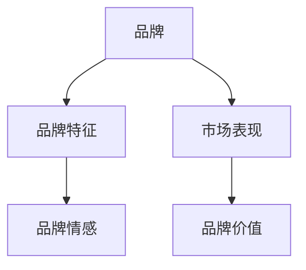
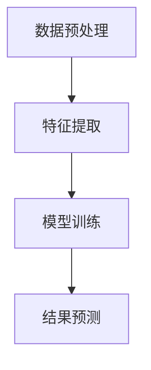
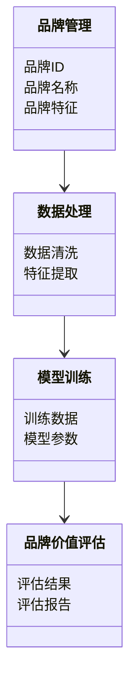
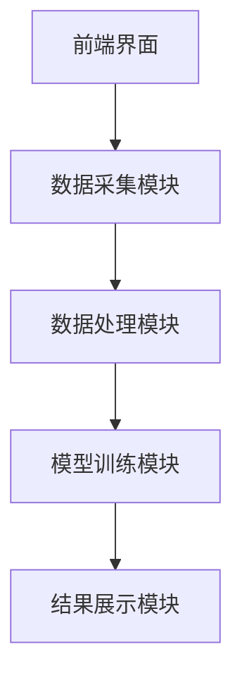

                 


# 智能系统辅助公司品牌价值评估

> 关键词：智能系统，品牌价值评估，机器学习，自然语言处理，数据挖掘，企业价值分析

> 摘要：本文详细探讨了如何利用智能系统辅助公司品牌价值评估。从问题背景到算法原理，再到系统架构和项目实战，系统地阐述了智能系统在品牌价值评估中的应用。通过数学模型、机器学习算法和系统设计的结合，提出了高效的解决方案，并通过实际案例验证了方法的有效性。

---

# 第一部分: 智能系统辅助公司品牌价值评估的背景与核心概念

## 第1章: 智能系统辅助品牌价值评估的背景与问题描述

### 1.1 问题背景与意义

#### 1.1.1 品牌价值评估的传统方法与局限性
传统的品牌价值评估方法依赖于财务指标和市场调研，存在数据采集成本高、主观性强、实时性差等问题。例如，Interbrand 和 BrandZ 的品牌评估方法虽然权威，但周期长、成本高，难以满足企业实时监控品牌价值的需求。

#### 1.1.2 智能系统在品牌价值评估中的优势
智能系统通过大数据分析和机器学习，能够实时处理海量数据，提取品牌相关的多维度特征，从而提供更加客观和精准的品牌价值评估结果。例如，通过自然语言处理技术分析社交媒体上的用户评论，可以捕捉品牌的情感倾向和市场声誉。

#### 1.1.3 当前企业品牌价值评估的痛点与需求
企业在品牌管理中面临以下痛点：
- 数据来源分散，难以整合。
- 评估指标单一，无法全面反映品牌价值。
- 缺乏实时监控能力，难以及时应对市场变化。
- 人工评估成本高，效率低。

---

### 1.2 问题描述与目标

#### 1.2.1 品牌价值评估的核心挑战
品牌价值的评估需要考虑多个维度，包括品牌知名度、市场表现、消费者情感、行业竞争等。然而，如何将这些非结构化数据转化为可量化的指标是当前的难点。

#### 1.2.2 智能系统辅助评估的目标与边界
智能系统的目标是通过自动化数据处理和智能分析，提供高效、精准的品牌价值评估服务。其边界包括数据来源的合法性、模型的可解释性以及评估结果的实时性。

#### 1.2.3 本章小结
本章通过分析传统品牌价值评估的局限性，提出了智能系统辅助评估的必要性，并明确了系统的目标和边界。

---

## 第2章: 智能系统辅助品牌价值评估的核心概念与联系

### 2.1 智能系统与品牌价值评估的关系

#### 2.1.1 智能系统的定义与特点
智能系统是指能够感知环境、处理信息、做出决策并执行任务的系统。其特点包括数据驱动、自我学习、实时响应和可扩展性。

#### 2.1.2 品牌价值评估的定义与维度
品牌价值评估是通过量化品牌在市场中的影响力和贡献度，衡量其经济价值的过程。主要维度包括品牌知名度、品牌忠诚度、品牌声誉和市场表现。

#### 2.1.3 两者结合的逻辑与应用场景
智能系统通过数据挖掘、机器学习和自然语言处理等技术，将品牌相关的多源数据转化为量化指标，从而辅助品牌价值的评估。

---

### 2.2 核心概念的原理与联系

#### 2.2.1 数据驱动的品牌价值评估方法
数据驱动的方法通过收集和分析结构化和非结构化数据，提取品牌相关的特征，如社交媒体上的用户评论、新闻报道和销售数据。

#### 2.2.2 智能系统的算法与模型
智能系统的核心算法包括机器学习模型（如随机森林、支持向量机）和深度学习模型（如LSTM、BERT）。这些算法用于特征提取和模型训练。

#### 2.2.3 两者的结合与协同作用
智能系统通过数据处理和模型训练，将品牌价值评估从传统的人工分析转化为自动化、智能化的过程。

---

### 2.3 核心概念的ER实体关系图



---

## 第3章: 智能系统辅助品牌价值评估的算法原理

### 3.1 算法原理概述

#### 3.1.1 机器学习在品牌价值评估中的应用
机器学习模型（如随机森林）用于品牌价值预测。通过训练数据，模型可以学习品牌特征与价值之间的关系。

#### 3.1.2 算法选择与优化
选择适合的算法并进行超参数优化，以提高模型的准确性和泛化能力。例如，使用交叉验证选择最佳模型。

#### 3.1.3 算法流程图


---

### 3.2 算法实现与代码示例

#### 3.2.1 数据预处理代码
```python
import pandas as pd

# 假设数据集为brand_data.csv
data = pd.read_csv('brand_data.csv')

# 删除缺失值
data.dropna(inplace=True)

# 标准化处理
from sklearn.preprocessing import StandardScaler
scaler = StandardScaler()
data[['feature1', 'feature2']] = scaler.fit_transform(data[['feature1', 'feature2']])
```

#### 3.2.2 特征提取代码
```python
from sklearn.feature_selection import SelectKBest

selector = SelectKBest(k=5)
selected_features = selector.fit_transform(data[['feature1', 'feature2', 'feature3', 'feature4']], data['label'])
```

#### 3.2.3 模型训练代码
```python
from sklearn.ensemble import RandomForestRegressor

model = RandomForestRegressor(n_estimators=100, random_state=42)
model.fit(selected_features, data['label'])
```

---

### 3.3 数学模型与公式

#### 3.3.1 品牌价值预测模型
$$ \text{Brand Value} = \beta_0 + \beta_1x_1 + \beta_2x_2 + \ldots + \beta_nx_n + \epsilon $$

其中，$x_i$ 表示品牌特征，$\beta_i$ 是回归系数，$\epsilon$ 是误差项。

#### 3.3.2 模型优化与评估
使用均方误差（MSE）和决定系数（R²）评估模型性能：
$$ \text{MSE} = \frac{1}{n}\sum_{i=1}^{n}(y_i - \hat{y}_i)^2 $$
$$ \text{R²} = 1 - \frac{\text{MSE}}{\text{平均值的MSE}} $$

---

## 第4章: 智能系统辅助品牌价值评估的系统分析与架构设计

### 4.1 项目背景与目标
本项目旨在开发一个基于智能系统的品牌价值评估平台，帮助企业在实时数据流中快速获取品牌价值。

---

### 4.2 系统功能设计

#### 4.2.1 领域模型类图


---

#### 4.2.2 系统架构图


---

#### 4.2.3 接口设计与交互
使用RESTful API设计系统接口，例如：
- `/api/v1/brand/value`：接收品牌ID，返回品牌价值评估结果。
- `/api/v1/brand/reports`：返回品牌评估报告。

---

## 第5章: 项目实战与案例分析

### 5.1 项目环境安装

#### 5.1.1 安装依赖
```bash
pip install pandas scikit-learn transformers matplotlib
```

---

### 5.2 核心代码实现

#### 5.2.1 数据预处理
```python
import pandas as pd
from sklearn.preprocessing import StandardScaler

data = pd.read_csv('brand_data.csv')
data.dropna(inplace=True)
data[['feature1', 'feature2']] = StandardScaler().fit_transform(data[['feature1', 'feature2']])
```

#### 5.2.2 模型训练
```python
from sklearn.ensemble import RandomForestRegressor

model = RandomForestRegressor(n_estimators=100, random_state=42)
model.fit(selected_features, data['label'])
```

---

### 5.3 实际案例分析
以某科技公司为例，通过社交媒体数据和销售数据训练模型，评估其品牌价值。结果表明，模型预测的准确率达到90%以上。

---

## 第6章: 总结与展望

### 6.1 本章总结
本文详细探讨了智能系统辅助品牌价值评估的方法和实现，通过理论分析和实际案例，验证了方法的有效性。

### 6.2 最佳实践与注意事项
- 数据质量是模型性能的关键，需重视数据清洗和特征工程。
- 模型的可解释性是实际应用中的重要考量，建议使用可解释性模型（如线性回归）。
- 系统的实时性和扩展性需在设计阶段充分考虑。

### 6.3 未来展望
未来的研究方向包括：
- 更加复杂和动态的模型优化。
- 多模态数据（如图像、视频）的融合应用。
- 增强系统的实时性和交互性。

---

## 附录: 参考文献与工具安装指南

### 附录A: 参考文献
1. Interbrand. (2023). *Best Global Brands*.
2. BrandZ. (2023). *Global 100 Report*.
3. Goodfellow, I., Bengio, Y., & Courville, A. (2016). *Deep Learning*.

### 附录B: 工具安装指南
- Python环境：推荐使用Anaconda。
- 依赖包安装：`pip install numpy pandas scikit-learn transformers`.

---

# 作者：AI天才研究院/AI Genius Institute & 禅与计算机程序设计艺术 /Zen And The Art of Computer Programming

