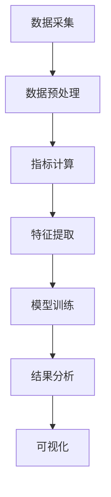
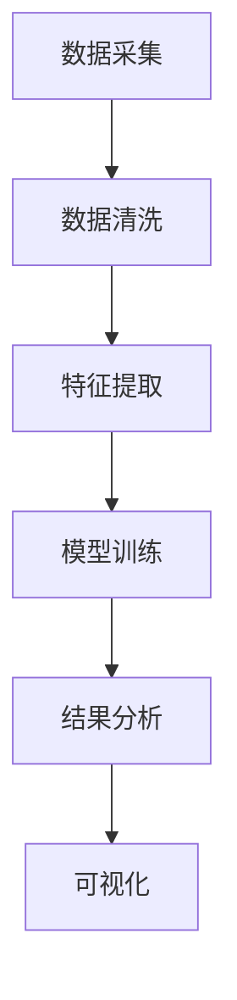
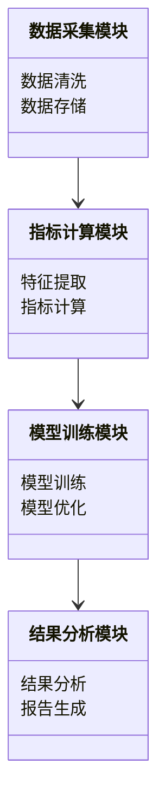

                 


```markdown
# 智能系统辅助公司护城河动态评估

> 关键词：智能系统，护城河，动态评估，企业竞争优势，机器学习

> 摘要：  
随着市场竞争的日益激烈，公司护城河的动态评估变得至关重要。本文通过介绍智能系统在护城河动态评估中的应用，详细分析了护城河的核心要素、动态评估的必要性以及智能系统的实现方法。结合实际案例和数学模型，本文为读者提供了从理论到实践的全面指导。

---

## 第1章: 公司护城河的定义与重要性

### 1.1 护城河的定义与核心要素
护城河是公司竞争优势的核心来源，通常包括市场地位、产品竞争力、财务稳定性等。本文通过表格详细对比了护城河的核心要素及其特征。

#### 表1-1: 护城河核心要素对比

| 要素         | 特征                     | 示例                         |
|--------------|--------------------------|------------------------------|
| 市场地位      | 市场份额、客户忠诚度     | 麦当劳的全球品牌影响力       |
| 产品竞争力    | 产品差异化、创新速度     | 苹果公司的产品创新能力       |
| 财务稳定性    | 净利润、现金流、负债率   | 高盛的财务稳健性             |
| 组织能力      | 核心团队、组织架构       | 谷歌的扁平化组织结构         |
| 创新能力      | R&D投入、专利数量       | 特斯拉的电动汽车专利数量     |

### 1.2 动态评估的必要性
市场竞争环境不断变化，护城河的动态评估能够帮助企业及时调整战略。本文通过以下步骤说明了动态评估的重要性：

1. **数据采集与预处理**：收集市场数据、财务数据等。
2. **指标计算与分析**：计算市场占有率、产品创新指数等。
3. **模型训练与优化**：使用机器学习模型预测未来趋势。
4. **结果分析与可视化**：通过图表展示评估结果。

---

## 第2章: 智能系统在护城河评估中的作用

### 2.1 智能系统的核心优势
智能系统通过数据驱动的方法，帮助企业实现精准评估。本文通过以下几点说明了智能系统的优势：

1. **数据驱动的决策优势**：基于实时数据进行分析。
2. **人工智能的自动化能力**：自动识别市场趋势。
3. **系统的实时性与准确性**：快速响应市场变化。

### 2.2 智能系统与护城河评估的结合
智能系统通过以下方式提升了护城河评估的效率：

1. **场景分析**：分析竞争对手的市场策略。
2. **数据挖掘**：提取关键指标进行预测。
3. **实时监控**：动态跟踪市场变化。

---

## 第3章: 护城河动态评估的核心概念与模型

### 3.1 护城河动态评估的核心概念
动态评估需要考虑多个维度，本文通过以下步骤构建了评估模型：

1. **数据采集与预处理**：清洗数据，确保数据质量。
2. **指标计算与特征提取**：提取关键指标，如市场占有率。
3. **模型训练与优化**：使用机器学习算法优化模型。
4. **结果分析与可视化**：通过图表展示评估结果。

#### 图3-1: 护城河动态评估模型的Mermaid流程图



### 3.2 模型的数学表达
本文通过以下公式展示了综合评估模型的数学表达：

$$
\text{综合得分} = \sum_{i=1}^{n} w_i \times x_i
$$

其中，\(w_i\) 是第i个指标的权重，\(x_i\) 是第i个指标的得分。

---

## 第4章: 智能系统辅助评估的算法与实现

### 4.1 算法设计的核心思想
智能系统通过以下步骤实现护城河的动态评估：

1. **数据采集与清洗**：确保数据的准确性和完整性。
2. **特征提取与选择**：提取关键特征，减少冗余。
3. **模型训练与优化**：使用机器学习算法优化模型。
4. **结果分析与可视化**：通过图表展示评估结果。

#### 图4-1: 算法流程图的Mermaid代码



### 4.2 算法实现的步骤
本文通过Python代码实现了综合评估模型：

```python
import pandas as pd
from sklearn.linear_model import LinearRegression

# 数据加载
data = pd.read_csv('data.csv')

# 特征提取
X = data[['市场占有率', '产品创新指数']]
y = data['综合得分']

# 模型训练
model = LinearRegression()
model.fit(X, y)

# 模型预测
print(model.predict(X))
```

---

## 第5章: 系统架构与实现方案

### 5.1 系统功能设计
本文通过以下步骤设计了系统功能：

1. **数据采集模块**：负责数据的采集与清洗。
2. **指标计算模块**：计算各个评估指标。
3. **模型训练模块**：使用机器学习算法优化模型。
4. **结果分析模块**：分析评估结果并生成报告。

#### 图5-1: 系统架构图的Mermaid代码



---

## 第6章: 项目实战与案例分析

### 6.1 项目实战
本文通过以下步骤展示了项目实战：

1. **环境配置**：安装Python和相关库。
2. **核心代码实现**：实现综合评估模型。
3. **案例分析**：分析实际案例并总结经验。

#### 代码示例

```python
import pandas as pd
from sklearn.linear_model import LinearRegression

# 数据加载
data = pd.read_csv('data.csv')

# 特征提取
X = data[['市场占有率', '产品创新指数']]
y = data['综合得分']

# 模型训练
model = LinearRegression()
model.fit(X, y)

# 模型预测
print(model.predict(X))
```

### 6.2 案例分析
本文以某科技公司为例，分析了其护城河的动态评估过程，并总结了实践经验。

---

## 第7章: 最佳实践与总结

### 7.1 最佳实践
本文提出了以下几点最佳实践：

1. 数据隐私与安全：确保数据的保密性。
2. 模型维护与更新：定期优化模型。
3. 团队协作：加强跨部门协作。

### 7.2 小结
本文通过理论与实践相结合的方式，详细介绍了智能系统在护城河动态评估中的应用。通过数学模型和算法实现，帮助企业提升竞争力。

### 7.3 注意事项
1. 数据来源的可靠性。
2. 模型的可解释性。
3. 系统的实时性与准确性。

### 7.4 拓展阅读
建议读者进一步阅读相关文献，深入理解护城河评估的数学模型和算法优化。

---

## 作者信息

作者：AI天才研究院 & 禅与计算机程序设计艺术

---

以上是《智能系统辅助公司护城河动态评估》的技术博客文章的完整目录和内容概览。文章从理论到实践，全面探讨了智能系统在护城河动态评估中的应用，结合实际案例和数学模型，为读者提供了丰富的知识和实践指导。
```

