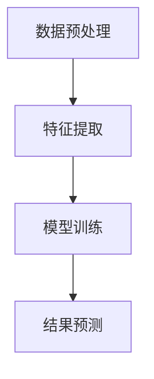
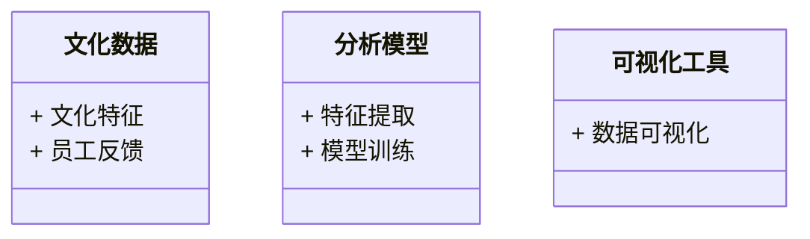
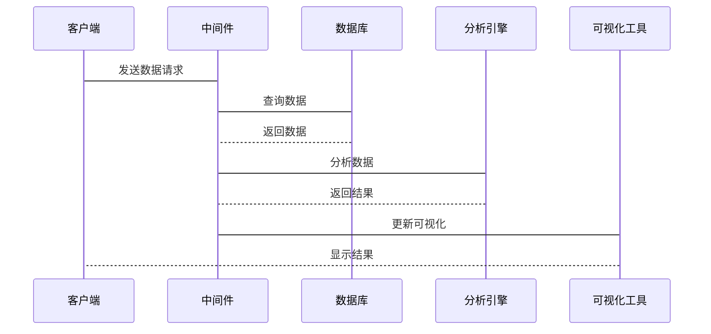

                 


# 智能系统辅助公司文化影响评估

## 关键词：智能系统、公司文化、影响评估、数据分析、机器学习、NLP、组织行为学

## 摘要：
本文探讨如何利用智能系统评估公司文化的影响，分析其核心概念、算法原理及系统架构。通过实际案例，展示如何使用机器学习和NLP技术量化文化特征，设计智能系统以改善组织管理。

# 第1章: 公司文化影响评估的背景与问题描述

## 1.1 问题背景
### 1.1.1 公司文化的定义与重要性
公司文化是指组织内部共享的价值观、信念和行为方式。它影响员工行为、决策和公司绩效，是企业成功的关键因素。

### 1.1.2 公司文化评估的传统方法与局限性
传统方法依赖问卷调查和主观分析，耗时且难以量化。分析结果受主观因素影响，缺乏客观性和准确性，难以动态跟踪文化变化。

### 1.1.3 智能系统在文化评估中的潜力
智能系统通过数据挖掘和机器学习，可从大量文本数据中提取文化特征，提供实时、动态的评估和预测，帮助管理者优化文化管理。

## 1.2 问题描述
### 1.2.1 公司文化影响的关键因素
文化凝聚力、创新性、员工满意度和价值观一致性等，这些因素影响公司绩效和员工行为。

### 1.2.2 智能系统辅助评估的必要性
传统方法的局限性限制了文化管理的优化，智能系统可提供科学、实时的评估手段。

### 1.2.3 评估的目标与范围
量化文化特征，动态跟踪文化变化，评估文化对业务的影响，识别文化风险和机会。

## 1.3 问题解决与边界
### 1.3.1 智能系统辅助评估的核心目标
构建智能系统，量化和分析文化特征，支持文化管理决策。

### 1.3.2 评估的边界与外延
系统聚焦于文化相关数据，不涉及财务或战略决策。外延包括文化趋势预测和文化管理优化。

### 1.3.3 核心要素与组成结构
包括数据源（如文档、员工反馈）、分析模型（如NLP、机器学习）和可视化工具。

## 1.4 本章小结
本章阐述了评估公司文化影响的重要性，分析了传统方法的局限性，介绍了智能系统在评估中的潜力和核心目标。

# 第2章: 智能系统与公司文化的关联

## 2.1 核心概念与联系
### 2.1.1 智能系统的核心原理
数据驱动、机器学习、自然语言处理和实时分析，通过技术手段量化和预测文化特征。

### 2.1.2 公司文化的关键属性
凝聚力、创新性、开放性、责任感和多样性，这些属性决定组织的行为和绩效。

### 2.1.3 两者之间的关系与影响
智能系统通过分析文化数据，揭示文化属性与组织绩效的关系，支持文化优化决策。

## 2.2 核心概念的对比分析
### 2.2.1 智能系统与传统评估方法的对比
智能系统优势：自动化、实时性、客观性。传统方法：主观性、耗时、静态。

### 2.2.2 不同公司文化的特征对比
通过案例对比，展示不同文化特征对组织行为的影响，如创新文化促进创造力，协作文化提升团队效率。

### 2.2.3 关键属性的特征表格
| 文化属性 | 描述 | 影响 |
|---------|------|------|
| 凝聚力   | 员工归属感 | 提高稳定性 |
| 创新性   | 创新能力   | 增强竞争力 |

## 2.3 ER实体关系图
```mermaid
er
actor: 公司文化
attributes: 文化特征、员工反馈、文化属性
relation: 文化特征与属性的关系
```

## 2.4 本章小结
本章分析了智能系统与公司文化的关系，对比了传统方法，展示了文化属性对组织行为的影响。

# 第3章: 智能系统辅助评估的算法原理

## 3.1 算法原理概述
### 3.1.1 评估模型的数学模型
构建多元回归模型，将文化特征与公司绩效相关联，分析各特征的权重。

### 3.1.2 算法流程的Mermaid图


### 3.1.3 算法实现的Python代码
```python
import pandas as pd
from sklearn.model import LinearRegression

data = pd.read_csv('culture.csv')
X = data[['凝聚力', '创新性']]
y = data['绩效']

model = LinearRegression()
model.fit(X, y)
print(model.coef_)
```

## 3.2 数学模型与公式
### 3.2.1 模型的输入与输出
输入：文化特征数据（X）
输出：预测的文化影响力（ŷ）

### 3.2.2 关键公式与推导
多元回归公式：
$$ŷ = \beta_0 + \beta_1x_1 + \beta_2x_2 + \ldots + \beta_nx_n$$

### 3.2.3 公式的数学意义
各β值表示各文化特征对绩效的影响程度，正β值表示正相关。

## 3.3 算法实现与代码解读
### 3.3.1 环境安装与配置
安装Python和相关库：pandas、scikit-learn。

### 3.3.2 核心代码实现
使用线性回归模型训练数据，提取特征系数，分析各特征的重要性。

### 3.3.3 代码示例
```python
import pandas as pd
from sklearn.linear_model import LinearRegression

# 数据加载
data = pd.read_csv('culture.csv')
# 特征与目标变量
X = data[['凝聚力', '创新性', '开放性']]
y = data['绩效']

# 模型训练
model = LinearRegression()
model.fit(X, y)

# 特征系数
print('Coefficients:', model.coef_)
```

## 3.4 本章小结
本章介绍了评估模型的数学基础，展示了算法流程和代码实现，解释了各文化特征对绩效的影响。

# 第4章: 系统分析与架构设计方案

## 4.1 系统分析
### 4.1.1 项目介绍
构建智能系统，辅助公司文化影响评估，提升组织管理能力。

### 4.1.2 系统功能设计
包括数据采集、分析、预测和可视化模块。

## 4.2 系统架构设计
### 4.2.1 领域模型的Mermaid类图


### 4.2.2 系统架构的Mermaid架构图
```mermaid
C4Context
    客户端 --> 中间件: 请求数据
    中间件 --> 数据库: 查询数据
    中间件 --> 分析引擎: 分析数据
    分析引擎 --> 数据库: 存储结果
    可视化工具 <-- 中间件: 返回结果
```

### 4.2.3 系统接口设计
RESTful API接口，用于数据采集和分析结果返回。

### 4.2.4 系统交互的Mermaid序列图


## 4.3 本章小结
本章设计了系统的架构，展示了各模块的交互和数据流，确保系统的高效运行。

# 第5章: 项目实战

## 5.1 项目环境安装
安装Python、Jupyter Notebook、pandas、scikit-learn和NLTK。

## 5.2 核心代码实现
### 5.2.1 数据预处理
清理和标准化数据，提取文化特征。

### 5.2.2 文本分析与情感计算
使用NLP技术分析员工反馈，计算情感倾向。

### 5.2.3 模型训练与评估
训练机器学习模型，评估模型性能，调整参数。

## 5.3 项目代码实现
### 5.3.1 数据加载与处理
```python
import pandas as pd
from sklearn.model import LinearRegression

# 加载数据
data = pd.read_csv('culture.csv')
# 数据清洗
data.dropna(inplace=True)
# 特征与目标变量
X = data[['凝聚力', '创新性', '开放性']]
y = data['绩效']

# 模型训练
model = LinearRegression()
model.fit(X, y)
```

### 5.3.2 文本分析
```python
from nltk.sentiment import SentimentAnalyzer
analyzer = SentimentAnalyzer()
feedback = '员工对公司文化感到满意'
sentiment = analyzer.polarity_scores(feedback)
print(sentiment)
```

## 5.4 案例分析与结果解读
### 5.4.1 案例介绍
某公司希望通过评估文化影响，优化组织管理。

### 5.4.2 数据分析
分析文化特征与绩效的关系，发现创新性对绩效影响最大。

### 5.4.3 智能系统实施效果
系统成功量化文化特征，提供实时反馈，帮助管理层优化文化管理。

## 5.5 本章小结
本章通过实战案例，展示了系统的安装、实现和应用，证明了智能系统在文化评估中的有效性。

# 第6章: 总结与展望

## 6.1 本章总结
### 6.1.1 核心内容回顾
智能系统通过数据分析和机器学习，量化文化特征，支持管理决策。

### 6.1.2 关键点总结
- 系统优势：实时、动态、客观
- 技术优势：NLP、机器学习、数据挖掘
- 实际价值：优化文化管理，提升组织绩效

## 6.2 注意事项与建议
### 6.2.1 数据隐私保护
确保员工反馈数据的隐私和安全。

### 6.2.2 模型选择与优化
根据不同场景选择合适的模型，并持续优化。

## 6.3 最佳实践 tips
- 数据收集：多渠道、多维度
- 模型部署：实时监控、动态调整
- 结果应用：结合业务、持续改进

## 6.4 未来展望
### 6.4.1 拓展方向
- 更复杂的文化特征分析
- 结合其他管理指标进行预测
- 进一步提升模型精度和解释性

### 6.4.2 人工智能与公司文化的深度融合
未来，智能系统将在文化管理中发挥更大作用，推动组织管理的智能化和数据化。

## 6.5 本章小结
总结了文章的核心内容，提出了未来的研究方向和实践建议。

# 结语
智能系统辅助公司文化影响评估是一个新兴而重要的领域，通过技术手段提升文化管理的科学性和效率，为企业创造更大价值。

# 作者
作者：AI天才研究院/AI Genius Institute  
联系：[禅与计算机程序设计艺术](https://github.com/Chenzongshu)

