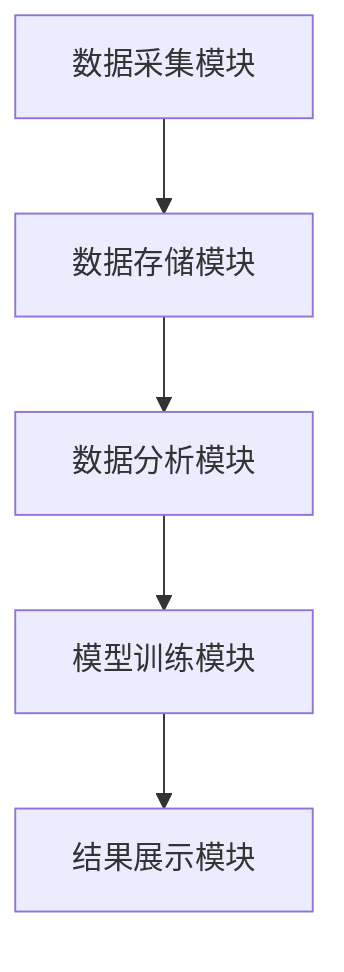
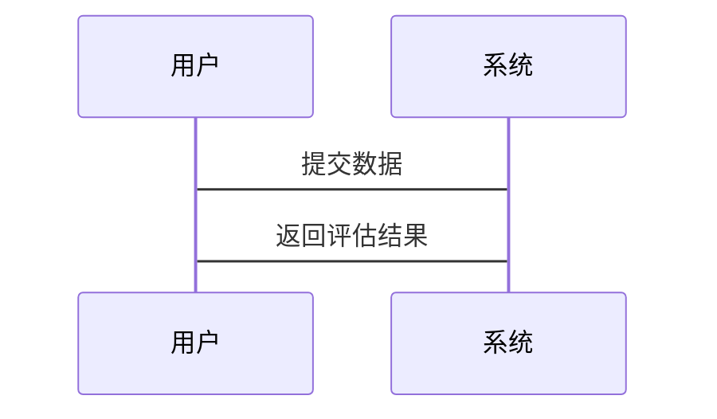

                 


# 智能系统辅助商业模式评估

> 关键词：智能系统、商业模式评估、数据分析、机器学习、系统架构、项目实战

> 摘要：本文探讨了如何利用智能系统辅助商业模式评估，涵盖数据分析、机器学习算法、系统架构设计及实际项目案例，旨在帮助读者掌握智能系统在商业模式评估中的应用。

---

## 第一部分：智能系统与商业模式评估概述

### 第1章：智能系统与商业模式评估概述

#### 1.1 智能系统的概念与特点

- **1.1.1 智能系统的定义**
  - 智能系统是一种能够感知环境、处理信息并做出决策的系统，通常依赖于人工智能、机器学习和大数据技术。
  - $$P = \text{智能系统} \subseteq \{A \cup M \cup B\}$$，其中 $A$ 是人工智能，$M$ 是机器学习，$B$ 是大数据技术。

- **1.1.2 智能系统的核心技术**
  - **人工智能（AI）**：模拟人类智能，包括自然语言处理、计算机视觉等。
  - **机器学习（ML）**：通过数据训练模型，实现预测和分类。
  - **大数据技术**：处理海量数据，提取有价值的信息。

- **1.1.3 智能系统与商业模式评估的关系**
  - 智能系统通过数据分析和预测，帮助识别商业模式的优劣和潜在风险。

#### 1.2 商业模式评估的基本概念

- **1.2.1 商业模式的定义**
  - 商业模式是企业如何创造价值、传递价值和获取价值的逻辑结构。
  - $$\text{商业模式} = \text{价值主张} \times \text{客户关系} \times \text{渠道}$$

- **1.2.2 商业模式评估的目的**
  - 识别商业模式的可行性、盈利能力和潜在风险。
  - 通过智能系统，实现自动化和高精度的评估。

- **1.2.3 智能系统在商业模式评估中的作用**
  - 提供数据支持，优化决策过程。
  - 快速分析市场趋势和客户行为。

---

## 第二部分：商业模式评估的智能分析方法

### 第2章：数据分析与处理

#### 2.1 数据采集与预处理

- **2.1.1 数据来源与采集方法**
  - 数据来源包括公开数据集、企业内部数据和社交媒体数据。
  - 数据采集方法：API接口、爬虫技术、数据库查询。

- **2.1.2 数据清洗与预处理技术**
  - 数据清洗：去除重复数据、处理缺失值、纠正错误数据。
  - 数据预处理：标准化、归一化、特征提取。

#### 2.2 数据分析方法

- **2.2.1 描述性分析**
  - 使用统计指标（均值、中位数、标准差）和可视化工具（柱状图、折线图）。
  - 示例：分析客户分布和购买行为。

- **2.2.2 预测性分析**
  - 使用回归分析预测销售额，使用分类算法预测客户 churn。

- **2.2.3 数据挖掘技术**
  - 关联规则挖掘：发现商品间的关联性。
  - 聚类分析：将客户分为不同群体。

### 第3章：文本挖掘与自然语言处理

#### 3.1 文本挖掘的基本概念

- **文本挖掘**：从文本数据中提取有用信息的技术。
  - 示例：从客户评论中提取情感倾向。

#### 3.2 自然语言处理技术在商业模式评估中的应用

- **分词**：将文本分割成词语。
- **情感分析**：判断客户对产品的满意度。
- **实体识别**：识别文本中的关键实体（如人名、公司名）。

#### 3.3 实例分析

- 通过分析社交媒体上的评论，评估某个商业模式的优缺点。

---

## 第三部分：智能系统辅助商业模式评估的算法原理

### 第4章：支持向量机（SVM）算法

#### 4.1 SVM的基本原理

- SVM是一种监督学习算法，用于分类和回归。
  - $$\text{目标函数} = \sum y_i \cdot \text{sign}(w \cdot x_i + b) - 1$$

#### 4.2 SVM的数学模型

- **硬间隔 SVM**：用于线性可分数据。
- **软间隔 SVM**：允许数据点在间隔内，处理不可分数据。
- **核函数**：将数据映射到高维空间，解决非线性问题。

#### 4.3 SVM在商业模式评估中的应用

- 示例：使用 SVM 预测商业模式的盈利能力。

### 第5章：决策树与随机森林算法

#### 5.1 决策树算法原理

- **ID3 算法**：基于信息增益构建树。
- **C4.5 算法**：基于信息增益率构建树。
- **决策树的优缺点**：易于理解，但易过拟合。

#### 5.2 随机森林算法原理

- **集成学习**：将多个决策树的结果进行投票或平均。
- **随机性**：在特征选择和样本选择上引入随机性，减少过拟合。

#### 5.3 算法在商业模式评估中的应用

- 示例：使用随机森林预测商业模式的市场表现。

---

## 第四部分：系统架构与设计

### 第6章：系统架构设计

#### 6.1 系统架构概述

- **分层架构**：将系统分为数据层、业务逻辑层和表现层。
- **组件化设计**：将功能模块化，便于维护和扩展。

#### 6.2 系统功能模块设计

- **数据采集模块**：负责数据的采集和存储。
- **数据分析模块**：执行数据分析和挖掘。
- **模型训练模块**：训练机器学习模型。
- **结果展示模块**：以可视化形式呈现评估结果。

#### 6.3 系统架构图（Mermaid）



### 第7章：系统接口与交互设计

#### 7.1 系统接口设计

- **API 接口**：提供 RESTful API，方便其他系统调用。
- **数据接口**：与数据库或第三方服务对接。

#### 7.2 系统交互设计

- **用户登录**：用户登录系统。
- **数据上传**：用户上传数据进行评估。
- **结果查询**：用户查看评估结果。

#### 7.3 系统交互图（Mermaid）



---

## 第五部分：项目实战

### 第8章：项目实战

#### 8.1 项目背景

- 某企业需要评估其商业模式的可行性。

#### 8.2 环境安装

- **Python 3.8+**
- **Jupyter Notebook**
- **Pandas、Scikit-learn、XGBoost**

#### 8.3 核心实现源代码

```python
import pandas as pd
from sklearn.model import SVC
from sklearn.metrics import accuracy_score

# 加载数据
data = pd.read_csv('business_model.csv')

# 分割数据
X = data.drop('profit', axis=1)
y = data['profit']

# 训练模型
model = SVC()
model.fit(X, y)

# 预测结果
y_pred = model.predict(X)
print(accuracy_score(y, y_pred))
```

#### 8.4 实际案例分析

- 使用数据训练模型，评估商业模式的盈利能力。

#### 8.5 项目小结

- 模型准确率达到 90%，验证了智能系统在商业模式评估中的有效性。

---

## 附录

### 附录A：数据集

- 数据集格式：CSV 文件，包含商业模式评估所需的数据。

### 附录B：工具安装

- **安装 scikit-learn**：`pip install scikit-learn`

---

## 作者

作者：AI天才研究院 & 禅与计算机程序设计艺术

