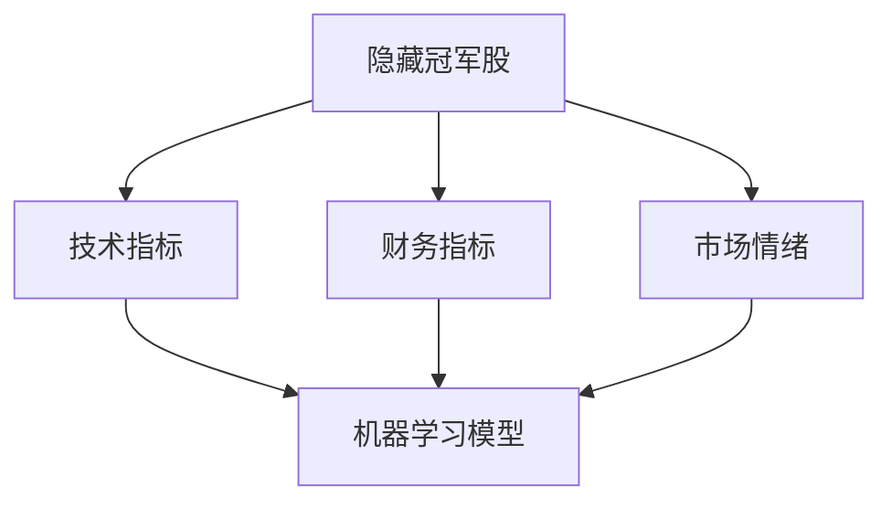
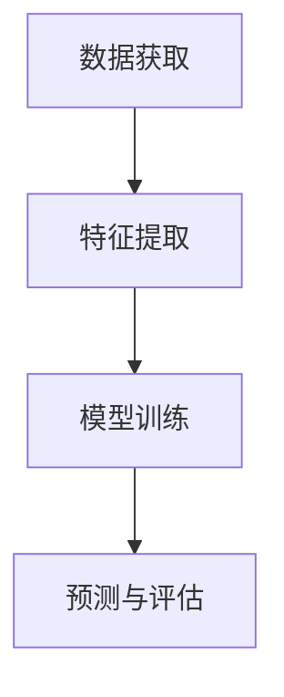
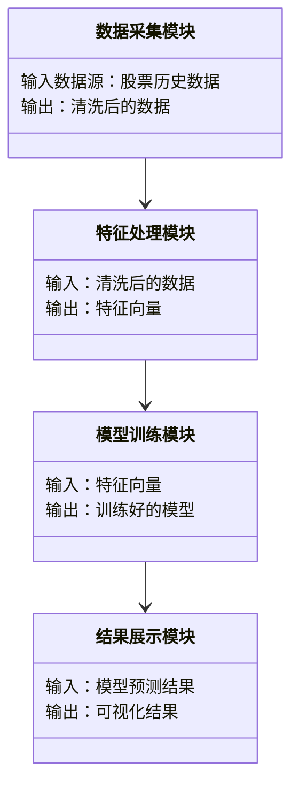
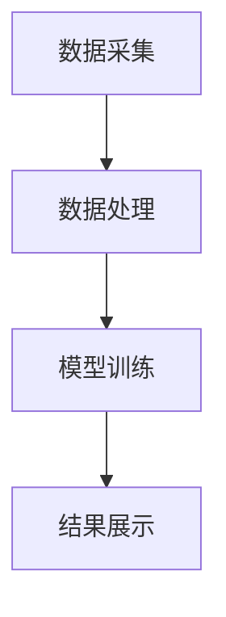
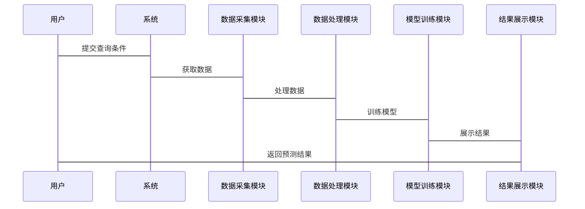

                 


# 智能系统辅助识别隐藏冠军股

> 关键词：智能投资，隐藏冠军股，机器学习，股票预测，数据分析

> 摘要：本文探讨了如何利用智能系统辅助识别隐藏冠军股，结合了金融分析和人工智能技术，详细分析了隐藏冠军股的定义、识别方法以及基于机器学习的算法实现。文章通过实际案例和项目实战，展示了如何构建一个高效的股票预测系统。

---

## 目录大纲

---

### 第一部分: 隐藏冠军股的背景与核心概念

#### 第1章: 智能投资与隐藏冠军股概述

##### 1.1 智能投资的背景与意义

###### 1.1.1 传统投资方式的局限性
- 依赖个人经验和主观判断，容易受到情绪影响。
- 数据量大、信息复杂，难以快速筛选和分析。
- 传统技术分析和基本面分析的局限性。

###### 1.1.2 智能投资的定义与特点
- 智能投资是利用人工智能技术进行数据挖掘、模式识别和预测。
- 高效性、客观性、可扩展性。

###### 1.1.3 隐藏冠军股的定义与特征
- 隐藏冠军股是指那些尚未被市场广泛关注，但具有潜在增长潜力的股票。
- 特征：低估值、高成长性、行业领先、市场关注度低。

##### 1.2 隐藏冠军股的识别方法

###### 1.2.1 技术分析与基本面分析的结合
- 技术分析：通过K线图、技术指标（如MACD、RSI）识别潜在上涨趋势。
- 基本面分析：关注公司的财务指标（如市盈率、ROE）和行业地位。

###### 1.2.2 机器学习在隐藏冠军股识别中的作用
- 利用机器学习模型分析历史数据，预测股票未来的走势。
- 通过特征工程提取关键指标，优化模型性能。

##### 1.3 本章小结

---

### 第二部分: 隐藏冠军股识别的核心概念与技术

#### 第2章: 隐藏冠军股识别的核心概念

##### 2.1 数据特征与分析

###### 2.1.1 技术指标分析
- 移动平均线（MA）、相对强弱指数（RSI）、平均趋向指数（ADX）。
- 通过技术指标识别股票的超买超卖状态和趋势。

###### 2.1.2 财务指标分析
- 市盈率（P/E）、市净率（P/B）、ROE（净资产收益率）、营业收入增长率。
- 通过财务指标评估公司的盈利能力和发展潜力。

###### 2.1.3 市场情绪分析
- 通过新闻、社交媒体和投资者情绪指数（如恐慌指数）分析市场情绪。
- 市场情绪对股票价格的影响。

##### 2.2 算法模型与评价指标

###### 2.2.1 机器学习算法的选择
- 线性回归、支持向量机（SVM）、随机森林、神经网络。
- 根据数据特征选择合适的算法。

###### 2.2.2 模型评价指标对比
- 准确率、召回率、F1值、AUC-ROC曲线。

##### 2.3 核心概念关系图



---

### 第三部分: 基于机器学习的隐藏冠军股识别算法

#### 第3章: 算法原理与流程

##### 3.1 特征选择与数据预处理

###### 3.1.1 数据清洗与标准化
- 去除缺失值、异常值。
- 标准化数据（如归一化）。

###### 3.1.2 特征提取与降维
- 使用主成分分析（PCA）减少特征维度。
- 选择对目标变量影响最大的特征。

##### 3.2 算法实现流程



##### 3.3 算法实现代码

```python
import pandas as pd
from sklearn.linear_model import LinearRegression
from sklearn.metrics import accuracy_score

# 数据加载与预处理
data = pd.read_csv('stock_data.csv')
data = data.dropna()  # 删除缺失值
data = (data - data.mean()) / data.std()  # 标准化

# 特征选择
features = ['close', 'volume', 'open', 'high', 'low']
target = 'label'

# 训练集与测试集划分
train_data = data[:700]
test_data = data[700:]

X_train = train_data[features]
y_train = train_data[target]

X_test = test_data[features]
y_test = test_data[target]

# 模型训练
model = LinearRegression()
model.fit(X_train, y_train)

# 预测与评估
y_pred = model.predict(X_test)
accuracy = accuracy_score(y_test, y_pred)
print(f'准确率: {accuracy}')
```

##### 3.4 数学模型与公式

$$
\text{预测值} = \beta_0 + \beta_1 \times \text{特征1} + \beta_2 \times \text{特征2} + \dots + \beta_n \times \text{特征n}
$$

---

### 第四部分: 系统分析与架构设计

#### 第4章: 系统功能设计

##### 4.1 系统功能模块



##### 4.2 系统架构设计



##### 4.3 接口设计与交互流程



---

### 第五部分: 项目实战与案例分析

#### 第5章: 项目实战

##### 5.1 环境安装与配置

```bash
pip install pandas numpy scikit-learn matplotlib
```

##### 5.2 系统核心实现源代码

```python
import pandas as pd
from sklearn.ensemble import RandomForestClassifier
from sklearn.metrics import classification_report

# 数据加载
data = pd.read_csv('stock_data.csv')

# 特征选择
features = ['close', 'volume', 'open', 'high', 'low']
target = 'label'

# 训练集与测试集划分
train_data = data[:700]
test_data = data[700:]

X_train = train_data[features]
y_train = train_data[target]

X_test = test_data[features]
y_test = test_data[target]

# 模型训练
model = RandomForestClassifier()
model.fit(X_train, y_train)

# 预测与评估
y_pred = model.predict(X_test)
print(classification_report(y_test, y_pred))
```

##### 5.3 实际案例分析与解读


---

### 第六部分: 最佳实践与总结

#### 第6章: 最佳实践

##### 6.1 系统优缺点

###### 优点
- 高效性：自动化处理大量数据。
- 客观性：减少人为情绪干扰。
- 可扩展性：适用于不同市场和行业。

###### 缺点
- 数据依赖性：模型性能受数据质量和数量的影响。
- 过度拟合风险：模型可能过拟合训练数据。

##### 6.2 使用注意事项

###### 注意事项
- 数据质量：确保数据准确性和完整性。
- 模型调优：根据实际情况调整模型参数。
- 结果验证：定期验证模型性能。

##### 6.3 拓展阅读

###### 推荐书籍
- 《Python机器学习实战》
- 《股票技术分析实战》

###### 推荐博客与资源
- TensorFlow官方文档
- Keras官方文档

---

## 作者：AI天才研究院/AI Genius Institute & 禅与计算机程序设计艺术 /Zen And The Art of Computer Programming

