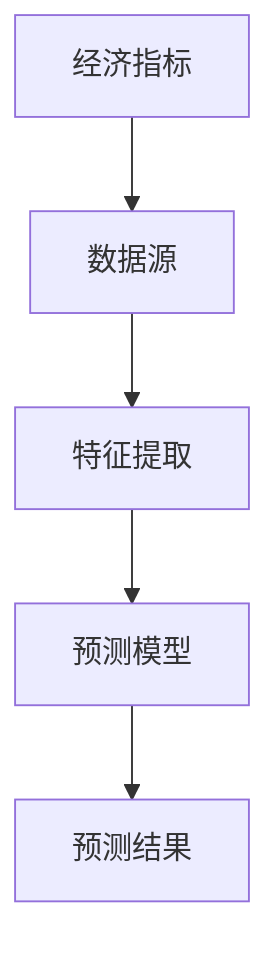
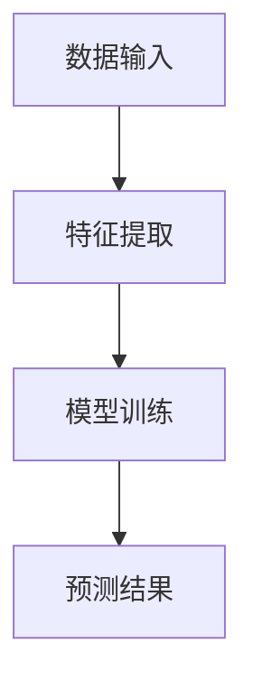
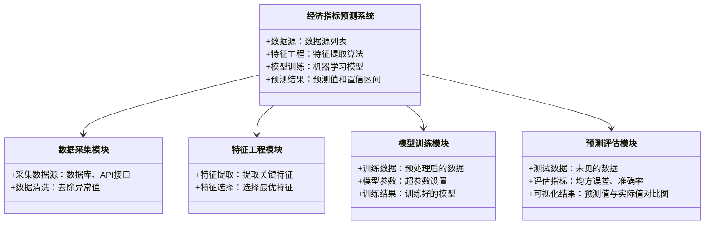
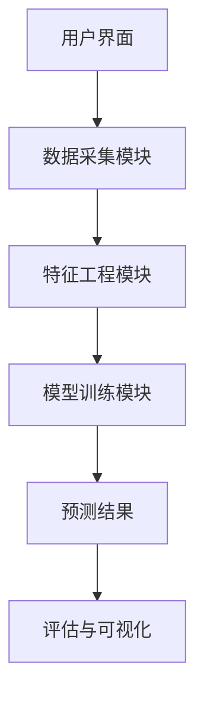
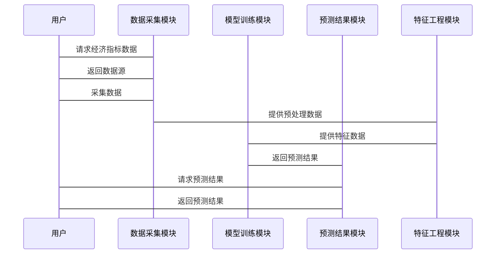

                 


# 智能经济指标预测系统

> 关键词：智能经济预测、人工智能、时间序列分析、机器学习、经济指标

> 摘要：本文详细探讨了智能经济指标预测系统的核心概念、算法原理、系统架构设计以及项目实战。通过分析经济指标预测的背景与挑战，结合时间序列分析和机器学习算法，构建了一个高效的预测系统，并提供了实际案例以展示系统的应用价值。

---

# 第一部分: 智能经济指标预测系统概述

## 第1章: 智能经济指标预测系统的背景与意义

### 1.1 经济指标预测的背景与挑战

经济指标预测是宏观经济管理和企业决策中的重要环节。传统的经济指标预测方法依赖于统计分析和专家经验，但在面对复杂多变的经济环境时，往往显得力不从心。例如，传统方法难以处理大数据量、多维度的数据，且模型的泛化能力有限。

智能经济指标预测系统通过引入人工智能技术，能够更好地应对这些挑战。它利用机器学习算法对海量数据进行分析，挖掘出传统方法难以捕捉的模式和趋势，从而提高预测的准确性和及时性。

### 1.2 智能经济指标预测系统的定义与特点

智能经济指标预测系统是一种基于人工智能技术的预测系统，旨在通过收集、处理和分析经济数据，利用机器学习算法生成经济指标的预测结果。其核心特点包括：

1. **数据驱动**：依赖于大量的历史经济数据，通过数据挖掘和分析提取有用的信息。
2. **实时性**：能够实时更新数据并快速生成预测结果，满足宏观经济决策的实时性需求。
3. **高精度**：通过复杂的算法和模型优化，提高预测的准确性。
4. **可解释性**：部分算法（如线性回归）具有较高的可解释性，便于用户理解和信任。

### 1.3 智能经济指标预测系统的应用场景

智能经济指标预测系统在多个领域都有广泛的应用：

1. **政府宏观经济决策**：用于预测GDP增长率、通货膨胀率等宏观经济指标，为政策制定提供依据。
2. **企业投资决策**：帮助企业预测市场需求、行业趋势，优化投资策略。
3. **金融市场的风险管理**：用于预测股票价格、汇率波动等，帮助金融机构规避风险。

### 1.4 本章小结

本章介绍了智能经济指标预测系统的背景、定义、特点及其应用场景。通过分析传统预测方法的局限性，提出了智能预测系统的优势和必要性。

---

## 第2章: 智能经济指标预测系统的核心概念与联系

### 2.1 核心概念原理

智能经济指标预测系统的核心概念包括数据采集与处理、特征工程和模型训练与优化。

1. **数据采集与处理**：从多种数据源（如政府数据库、金融市场数据）获取经济指标数据，并进行清洗、转换和标准化处理。
2. **特征工程**：通过对数据的分析，提取具有代表性的特征（如GDP增长率、失业率等），并进行特征选择和降维处理。
3. **模型训练与优化**：利用机器学习算法对特征进行训练，生成预测模型，并通过交叉验证和超参数调优优化模型性能。

### 2.2 核心概念属性特征对比表

下表对比了智能经济指标预测系统中核心概念的主要属性特征：

| 概念 | 属性 | 特征 |
|------|------|------|
| 数据采集 | 来源 | 政府数据库、金融市场数据 |
| 数据处理 | 方法 | 清洗、转换、标准化 |
| 特征工程 | 目的 | 提升模型性能 |
| 模型训练 | 算法 | 时间序列分析、机器学习模型 |

### 2.3 ER实体关系图

以下是智能经济指标预测系统的ER实体关系图：



### 2.4 本章小结

本章详细讲解了智能经济指标预测系统的核心概念及其联系，通过对比表和实体关系图帮助读者理解系统的整体架构。

---

## 第3章: 智能经济指标预测系统的算法原理

### 3.1 时间序列分析

时间序列分析是一种常用的预测方法，特别适用于经济指标的预测。

#### 3.1.1 时间序列的基本概念

时间序列是指按照时间顺序排列的数据序列。经济指标的时间序列通常具有趋势性、周期性和随机性。

#### 3.1.2 时间序列的分解方法

时间序列分解方法包括加法模型和乘法模型，常用的有：

1. **加法模型**：$Y_t = T_t + S_t + R_t + E_t$
2. **乘法模型**：$Y_t = T_t \times S_t \times R_t \times E_t$

其中，$T_t$表示趋势，$S_t$表示季节性，$R_t$表示周期性，$E_t$表示误差。

#### 3.1.3 时间序列预测的数学模型

常用的时间序列预测模型包括ARIMA（自回归积分滑动平均模型）和LSTM（长短期记忆网络）。

### 3.2 机器学习模型

#### 3.2.1 ARIMA模型

ARIMA模型是一种广泛应用于时间序列预测的统计模型，其基本形式为：

$$ARIMA(p, d, q)$$

其中，$p$表示自回归阶数，$d$表示差分阶数，$q$表示移动平均阶数。

#### 3.2.2 LSTM网络

LSTM（Long Short-Term Memory）是一种特殊的RNN（循环神经网络），特别适合处理长序列数据。

LSTM的结构包括输入门、遗忘门和输出门：

1. 输入门：决定哪些新信息要被存储。
2. 遗忘门：决定哪些旧信息要被遗忘。
3. 输出门：决定输出什么信息。

#### 3.2.3 集成学习方法

集成学习方法通过组合多个模型的结果来提高预测精度。常用的集成方法包括投票法和加权平均法。

### 3.3 算法流程图

以下是智能经济指标预测系统的算法流程图：



### 3.4 算法实现代码

以下是基于Python的ARIMA模型实现代码：

```python
from statsmodels.tsa.arima_model import ARIMA
import pandas as pd
import numpy as np

# 数据预处理
data = pd.read_csv('economic_data.csv')
data = data['economic_indicator'].values

# 模型训练
model = ARIMA(data, order=(5, 1, 0))
model_fit = model.fit(disp=0)

# 预测
forecast = model_fit.forecast(steps=5)[0]
print(forecast)
```

### 3.5 本章小结

本章详细讲解了智能经济指标预测系统的算法原理，包括时间序列分析和机器学习模型的实现方法。

---

## 第4章: 智能经济指标预测系统的系统架构设计

### 4.1 系统功能设计

智能经济指标预测系统的功能模块包括：

1. **数据采集模块**：从多种数据源获取经济指标数据。
2. **特征工程模块**：对数据进行清洗、转换和特征提取。
3. **模型训练模块**：利用机器学习算法训练预测模型。
4. **预测评估模块**：对模型的预测结果进行评估和可视化。

### 4.2 领域模型类图

以下是系统的领域模型类图：



### 4.3 系统架构图

以下是系统的整体架构图：



### 4.4 系统接口设计

系统的接口设计包括：

1. 数据输入接口：接收外部数据源的数据。
2. 模型训练接口：接受训练数据和超参数设置。
3. 预测接口：接受测试数据并返回预测结果。
4. 评估接口：返回模型的评估指标。

### 4.5 系统交互序列图

以下是系统的交互序列图：



### 4.6 本章小结

本章详细讲解了智能经济指标预测系统的系统架构设计，包括功能模块、类图、架构图、接口设计和交互序列图。

---

## 第5章: 智能经济指标预测系统的项目实战

### 5.1 环境安装

为了运行智能经济指标预测系统，需要安装以下环境和库：

1. **Python**：推荐使用最新版本的Python 3.x。
2. **Pandas**：用于数据处理。
3. **NumPy**：用于数值计算。
4. **Matplotlib**：用于数据可视化。
5. **Scikit-learn**：用于机器学习模型。
6. **Statsmodels**：用于时间序列分析。

安装命令如下：

```bash
pip install pandas numpy matplotlib scikit-learn statsmodels
```

### 5.2 系统核心实现源代码

以下是系统的核心实现代码：

```python
import pandas as pd
import numpy as np
import matplotlib.pyplot as plt
from statsmodels.tsa.arima_model import ARIMA
from sklearn.metrics import mean_squared_error

# 数据预处理
data = pd.read_csv('economic_data.csv')
data = data['economic_indicator'].values

# 划分训练集和测试集
train_data = data[:int(len(data)*0.8)]
test_data = data[int(len(data)*0.8):]

# 模型训练
model = ARIMA(train_data, order=(5, 1, 0))
model_fit = model.fit(disp=0)

# 预测
forecast = model_fit.forecast(steps=len(test_data))[0]

# 评估
mse = mean_squared_error(test_data, forecast)
print(f'mse: {mse}')

# 可视化
plt.plot(test_data, label='Actual')
plt.plot(forecast, label='Predicted')
plt.legend()
plt.show()
```

### 5.3 代码应用解读与分析

上述代码实现了一个基于ARIMA模型的经济指标预测系统。首先，从CSV文件中读取数据并进行训练集和测试集的划分。然后，使用ARIMA模型进行训练并生成预测结果。最后，通过均方误差评估模型的性能，并将实际值和预测值进行可视化对比。

### 5.4 实际案例分析

假设我们有一个包含GDP增长率的CSV文件，我们可以使用上述代码进行预测。运行代码后，会输出预测结果和模型的均方误差，并生成实际值与预测值的对比图。

### 5.5 项目小结

本章通过实际案例详细讲解了智能经济指标预测系统的实现过程，包括环境安装、代码实现、结果评估和可视化。

---

## 第6章: 智能经济指标预测系统的最佳实践

### 6.1 小结

智能经济指标预测系统通过引入人工智能技术，显著提高了经济指标预测的准确性和效率。本文详细探讨了系统的背景、核心概念、算法原理、系统架构设计和项目实战。

### 6.2 注意事项

在实际应用中，需要注意以下几点：

1. **数据质量**：确保数据的完整性和准确性。
2. **模型调优**：通过交叉验证和超参数调优提高模型性能。
3. **实时性**：确保系统的实时更新和快速响应。

### 6.3 拓展阅读

以下是一些进一步学习的资源：

1. 《时间序列分析与应用》
2. 《机器学习实战》
3. Statsmodels官方文档

---

# 作者：AI天才研究院/AI Genius Institute & 禅与计算机程序设计艺术/Zen And The Art of Computer Programming

