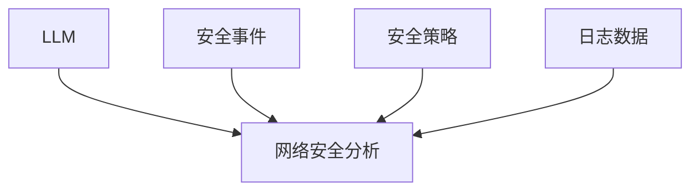

                 


# 智能网络安全分析 AI Agent：LLM 在网络防御中的应用

---

## 关键词

- AI Agent
- 大语言模型（LLM）
- 网络安全分析
- 智能防御
- 机器学习

---

## 摘要

本文探讨了大语言模型（LLM）在网络安全分析中的应用，详细介绍了AI Agent的基本概念、核心原理、系统架构以及实际应用场景。通过对比分析和案例研究，本文揭示了LLM在提升网络防御能力方面的巨大潜力，并提供了系统设计与实现的具体方案。

---

# 第1章: AI Agent与LLM概述

## 1.1 AI Agent的基本概念

### 1.1.1 AI Agent的定义与特点

人工智能代理（AI Agent）是指能够感知环境并采取行动以实现目标的智能实体。其特点包括：

- **自主性**：能够独立决策和行动。
- **反应性**：能够实时感知环境并做出反应。
- **目标导向**：所有行动均以实现特定目标为导向。
- **学习能力**：能够通过经验改进自身性能。

### 1.1.2 大语言模型（LLM）的定义与特点

大语言模型（LLM）是基于深度学习的自然语言处理模型，具有以下特点：

- **大规模数据训练**：通常基于海量数据进行训练。
- **多任务能力**：能够处理多种自然语言处理任务。
- **生成能力强**：能够生成连贯且有意义的文本。
- **上下文理解**：能够理解上下文并进行推理。

### 1.1.3 AI Agent与LLM的关系

AI Agent可以利用LLM作为其核心组件，通过LLM的生成能力和理解能力实现智能分析和决策。LLM为AI Agent提供强大的语言理解和生成能力，而AI Agent则为LLM提供具体的任务场景和目标导向。

## 1.2 网络安全分析的背景与挑战

### 1.2.1 网络安全分析的背景

随着互联网的快速发展，网络安全问题日益严重。传统的基于规则的安全分析方法逐渐暴露出效率低下、难以应对复杂攻击模式的缺点。

### 1.2.2 网络安全分析的常见挑战

- **攻击手段多样化**：攻击者不断改进攻击方法，传统的基于规则的检测方法难以应对。
- **数据量大**：网络安全数据量庞大，人工分析效率低下。
- **误报与漏报问题**：传统方法容易出现误报和漏报。

### 1.2.3 LLM在网络安全中的应用前景

通过利用LLM的强大语言理解和生成能力，可以实现更智能、更高效的网络安全分析，提升检测准确性和响应速度。

---

## 1.3 LLM在网络安全中的结合与应用

### 1.3.1 LLM在网络安全分析中的优势

- **高效理解能力**：能够快速理解复杂的日志和安全事件。
- **自适应学习**：能够通过不断学习优化检测策略。
- **多任务处理**：能够同时处理多种类型的安全数据分析任务。

### 1.3.2 LLM在网络安全防御中的具体应用

- **异常检测**：通过分析日志数据，发现异常行为模式。
- **威胁情报分析**：快速分析和理解最新的威胁情报。
- **漏洞挖掘**：辅助发现潜在的安全漏洞。

### 1.3.3 LLM在网络安全分析中的边界与外延

虽然LLM在网络安全分析中有广泛的应用前景，但其也有一定的局限性，例如需要大量高质量的训练数据，且对模型的计算资源要求较高。

---

## 1.4 实体关系图与架构设计

### 1.4.1 ER实体关系图

以下是一个简单的ER实体关系图，展示了LLM在网络安全分析中的主要实体及其关系。



### 1.4.2 系统架构设计

以下是一个基于LLM的网络安全分析系统的架构设计图。

```mermaid
graph TD
A[LLM] --> B[网络安全分析系统]
C[安全数据] --> B
D[用户输入] --> B
E[安全事件输出] <-- B
F[安全报告] <-- B
```

---

## 总结

通过本章的介绍，我们了解了AI Agent和LLM的基本概念，以及它们在网络安全分析中的应用背景和优势。接下来，我们将深入探讨LLM的核心原理及其在网络安全分析中的具体应用。

--- 

**作者：AI天才研究院/AI Genius Institute & 禅与计算机程序设计艺术 /Zen And The Art of Computer Programming**

