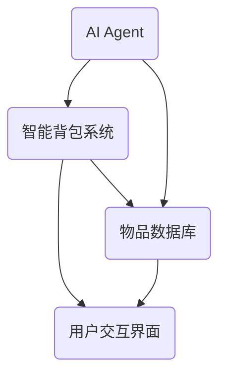
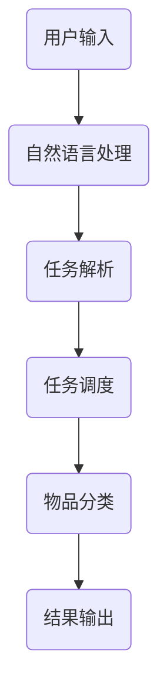
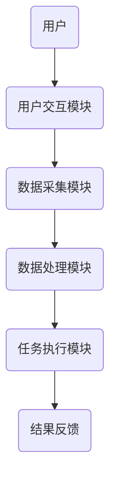

                 


# 智能背包：AI Agent的物品整理与提醒助手

> 关键词：AI Agent, 智能背包, 物品整理, 提醒助手, 人工智能, 系统架构

> 摘要：本文探讨了AI Agent在物品整理与提醒助手中的应用，分析了智能背包的核心概念、算法原理、系统架构设计以及实际项目实现。通过详细的技术分析和实例说明，展示了如何利用AI技术提升物品管理效率，帮助用户更好地完成日常任务。

---

# 第一部分: 智能背包的背景与核心概念

## 第1章: 智能背包的背景与问题背景

### 1.1 问题背景介绍

#### 1.1.1 传统背包的物品管理痛点
传统的背包或物品管理方式存在诸多痛点：  
1. **物品分类混乱**：用户通常将不同类型的物品随意放置，导致查找困难。  
2. **遗忘风险**：重要物品容易被遗忘，影响工作效率和生活质量。  
3. **效率低下**：手动整理物品耗时耗力，难以高效管理。

#### 1.1.2 AI Agent在物品管理中的应用潜力
AI Agent（人工智能代理）通过智能化的感知和执行能力，能够帮助用户实现物品的自动化管理。其优势包括：  
1. **自动化分类**：AI Agent可以自动识别物品类型并进行分类。  
2. **智能提醒**：通过学习用户的习惯，AI Agent可以主动提醒用户处理重要物品。  
3. **高效交互**：用户可以通过自然语言与AI Agent进行交互，简化操作流程。

#### 1.1.3 智能背包的核心问题描述
智能背包的核心问题是如何通过AI技术实现物品的智能化管理，包括：  
1. **物品识别与分类**：利用计算机视觉和自然语言处理技术实现物品的自动识别。  
2. **任务调度与提醒**：根据用户需求，智能安排物品的整理和提醒任务。  
3. **用户交互优化**：设计高效的交互方式，提升用户体验。

### 1.2 问题解决与边界定义

#### 1.2.1 智能背包的目标与核心功能
智能背包的目标是通过AI技术实现物品的智能化管理，其核心功能包括：  
1. **物品识别与分类**：支持多种物品的自动识别和分类。  
2. **任务调度**：根据用户需求，智能安排整理任务。  
3. **智能提醒**：通过AI学习用户的习惯，主动提醒用户处理重要物品。  
4. **用户交互**：提供自然语言交互和图形化界面，方便用户操作。

#### 1.2.2 AI Agent在物品整理中的具体应用
AI Agent在智能背包中的具体应用包括：  
1. **物品识别**：通过图像识别技术，自动识别背包中的物品。  
2. **分类管理**：根据物品类型，自动将其分类存储。  
3. **任务提醒**：根据用户设置，主动提醒用户处理特定任务。

#### 1.2.3 智能背包的边界与外延
智能背包的边界在于其核心功能——物品整理与提醒，而外延则包括与之相关的辅助功能，如数据存储、用户交互等。

### 1.3 核心概念与概念结构

#### 1.3.1 智能背包的核心要素组成
智能背包的核心要素包括：  
1. **AI Agent**：负责物品的识别、分类和任务调度。  
2. **物品数据库**：存储所有物品的详细信息。  
3. **用户交互界面**：用户与系统之间的交互界面。  
4. **提醒模块**：负责任务的提醒和通知。

#### 1.3.2 AI Agent在智能背包中的角色与功能
AI Agent在智能背包中的角色是核心控制器，其功能包括：  
1. **感知**：通过传感器或图像识别感知背包中的物品。  
2. **决策**：根据物品信息和用户需求，制定整理策略。  
3. **执行**：通过交互界面或外部设备执行整理任务。

#### 1.3.3 智能背包与传统背包的对比分析
智能背包与传统背包的主要区别在于智能化管理功能，传统背包仅提供物理存储空间，而智能背包通过AI技术实现了物品的自动化管理。

---

## 第2章: AI Agent与智能背包的核心概念

### 2.1 AI Agent的基本原理

#### 2.1.1 AI Agent的定义与分类
AI Agent是一种能够感知环境并采取行动以实现目标的智能实体。根据功能不同，AI Agent可以分为：  
1. **反应式AI Agent**：根据当前感知做出反应。  
2. **认知式AI Agent**：具备推理和规划能力。

#### 2.1.2 AI Agent的核心功能与属性
AI Agent的核心功能包括：  
1. **感知**：通过传感器或API获取环境信息。  
2. **推理**：基于感知信息进行逻辑推理。  
3. **决策**：根据推理结果制定行动方案。  
4. **执行**：通过执行器完成任务。

#### 2.1.3 AI Agent与智能背包的结合方式
AI Agent与智能背包的结合方式主要体现在：  
1. **物品识别**：AI Agent通过图像识别技术识别背包中的物品。  
2. **任务调度**：AI Agent根据用户需求，智能安排整理任务。  
3. **用户交互**：AI Agent通过自然语言处理与用户进行交互。

### 2.2 智能背包的系统架构

#### 2.2.1 系统功能模块划分
智能背包的系统功能模块包括：  
1. **用户交互模块**：负责与用户的交互。  
2. **数据采集模块**：通过传感器或摄像头采集物品信息。  
3. **数据处理模块**：对采集的数据进行分类和处理。  
4. **任务执行模块**：根据处理结果执行整理任务。

#### 2.2.2 系统的核心功能流程
智能背包的核心功能流程如下：  
1. 用户通过交互界面输入需求。  
2. AI Agent感知背包中的物品。  
3. 数据处理模块对物品进行分类。  
4. 任务执行模块根据需求执行整理任务。  
5. 系统通过提醒模块通知用户任务完成。

#### 2.2.3 系统的输入输出与交互方式
系统的输入包括：  
1. 用户的需求输入。  
2. 传感器的物品信息。  
系统的输出包括：  
1. 整理结果。  
2. 提醒通知。

### 2.3 AI Agent与智能背包的实体关系

#### 2.3.1 实体关系图


---

## 第3章: 智能背包的算法原理与实现

### 3.1 AI Agent的核心算法

#### 3.1.1 自然语言处理算法
自然语言处理（NLP）用于实现用户与AI Agent之间的自然语言交互。常用算法包括：  
1. **词袋模型**：将文本表示为词袋。  
2. **TF-IDF**：计算关键词的重要性。  
3. **神经网络语言模型**：如BERT，用于理解上下文。

#### 3.1.2 任务调度算法
任务调度算法用于优化整理任务的执行顺序。常用算法包括：  
1. **贪心算法**：优先处理紧急任务。  
2. **动态规划**：通过动态规划优化任务安排。  
3. **优先级队列**：根据任务优先级进行调度。

#### 3.1.3 物品识别与分类算法
物品识别与分类算法用于自动识别背包中的物品。常用算法包括：  
1. **卷积神经网络（CNN）**：用于图像识别。  
2. **支持向量机（SVM）**：用于分类任务。  
3. **图像分割算法**：用于精确识别物品位置。

### 3.2 算法实现流程

#### 3.2.1 算法流程图


### 3.3 算法数学模型与公式

#### 3.3.1 自然语言处理的数学模型
自然语言处理中的词袋模型表示如下：  
$$ P(w_i | w_{i-1}) $$  

#### 3.3.2 任务调度算法的数学公式
任务调度的贪心算法公式：  
$$ T = \sum_{i=1}^{n} t_i $$  

#### 3.3.3 物品分类的数学模型
物品分类的逻辑回归模型表示为：  
$$ C = \arg\max_{c} P(c|x) $$  

### 3.4 本章小结

---

## 第4章: 智能背包的系统架构设计

### 4.1 系统功能模块设计

#### 4.1.1 用户交互模块
用户交互模块负责与用户的交互，支持自然语言和图形界面两种方式。

#### 4.1.2 数据采集模块
数据采集模块通过传感器或摄像头采集背包中的物品信息。

#### 4.1.3 数据处理模块
数据处理模块对采集的数据进行分类和处理，生成任务列表。

#### 4.1.4 任务执行模块
任务执行模块根据任务列表执行整理任务，并通过提醒模块通知用户。

### 4.2 系统架构设计

#### 4.2.1 系统架构图


### 4.3 数据库设计

#### 4.3.1 数据库表结构
数据库表结构如下：  
| 字段名       | 类型       | 描述           |
|--------------|------------|----------------|
| item_id      | int        | 物品ID         |
| item_name    | string     | 物品名称       |
| item_type    | string     | 物品类型       |
| timestamp    | datetime   | 时间戳         |
| status       | string     | 物品状态       |

#### 4.3.2 数据存储与检索逻辑
数据存储逻辑：  
1. 数据采集模块将物品信息传递给数据处理模块。  
2. 数据处理模块将物品信息存入数据库。  
数据检索逻辑：  
1. 根据用户需求，从数据库中检索相关物品信息。  
2. 返回检索结果。

#### 4.3.3 数据安全与隐私保护
数据安全与隐私保护措施包括：  
1. 数据加密存储。  
2. 访问权限控制。  
3. 数据备份与恢复。

### 4.4 本章小结

---

## 第5章: 智能背包的项目实战

### 5.1 环境与工具安装

#### 5.1.1 开发环境
开发环境包括：  
1. Python 3.8及以上版本。  
2. PyTorch深度学习框架。  
3. OpenCV图像处理库。  
4. Flask web框架。

#### 5.1.2 工具安装
安装所需的库：  
```bash
pip install numpy pandas torch cv2 flask
```

### 5.2 核心代码实现

#### 5.2.1 物品识别代码
```python
import cv2
import numpy as np

def detect_items(image_path):
    # 加载预训练模型
    model = torch.load("item_classifier.pth")
    # 读取图像
    image = cv2.imread(image_path)
    # 图像预处理
    image = cv2.resize(image, (224, 224))
    image = image / 255.0
    image = torch.FloatTensor(image)
    # 预测
    with torch.no_grad():
        output = model(image)
    # 获取类别
    predicted_class = output.argmax(dim=1).item()
    return predicted_class
```

#### 5.2.2 任务调度代码
```python
import heapq

def greedy_task_scheduling(tasks):
    # 根据优先级排序
    tasks.sort(key=lambda x: x['priority'])
    # 贪心算法
    selected_tasks = []
    for task in tasks:
        if task['time'] <= 0:
            continue
        selected_tasks.append(task)
        heapq.heappush(selected_tasks, (-task['time'], task['id']))
    return selected_tasks
```

### 5.3 实际案例分析与代码解读

#### 5.3.1 案例分析
假设用户需要整理背包中的文件，系统会执行以下步骤：  
1. 用户通过交互界面输入需求。  
2. AI Agent通过图像识别技术识别背包中的文件。  
3. 数据处理模块将文件分类存储。  
4. 任务执行模块根据优先级安排整理任务。  
5. 系统通过提醒模块通知用户任务完成。

#### 5.3.2 代码实现细节
物品识别代码实现了图像分类功能，任务调度代码实现了任务的最优执行顺序。

### 5.4 本章小结

---

## 第6章: 智能背包的最佳实践与总结

### 6.1 最佳实践 tips
1. **数据质量**：确保训练数据的多样性和代表性。  
2. **模型优化**：定期更新模型以提升识别精度。  
3. **用户体验**：优化交互设计，提升用户体验。  

### 6.2 小结
智能背包通过AI Agent实现了物品的智能化管理，显著提升了用户的整理效率和生活质量。

### 6.3 注意事项
1. **数据隐私**：注意保护用户的隐私数据。  
2. **系统稳定性**：确保系统的高可用性。  

### 6.4 拓展阅读
推荐阅读《深度学习实战》和《自然语言处理入门》等书籍，进一步提升对AI技术的理解。

---

# 作者：AI天才研究院/AI Genius Institute & 禅与计算机程序设计艺术 /Zen And The Art of Computer Programming

