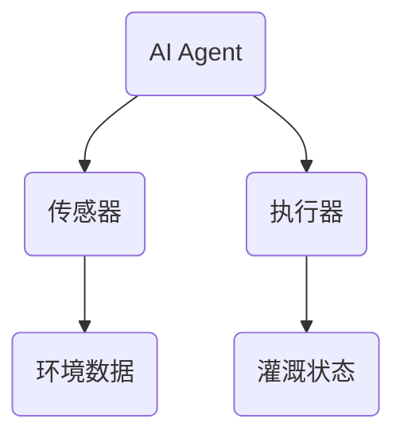
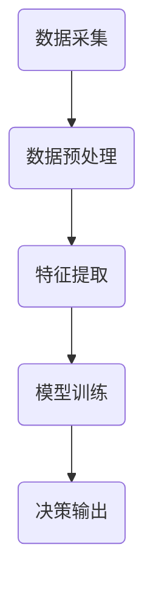
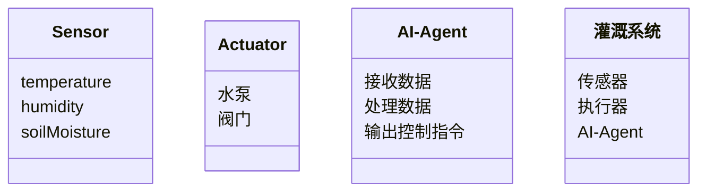
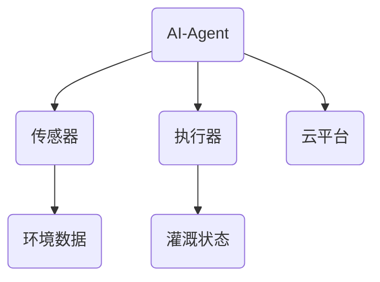

                 


# 智能花园灌溉系统：AI Agent的精准浇水控制

> 关键词：AI Agent、精准浇水、智能灌溉系统、物联网技术、传感器、机器学习、环境监测

> 摘要：本文详细探讨了智能花园灌溉系统中AI Agent的精准浇水控制技术。通过分析背景、核心概念、算法原理、系统架构及项目实战，本文为读者提供了一套基于AI的智能灌溉解决方案。文章结合理论与实践，展示了如何利用AI技术实现高效、精准的灌溉控制，帮助用户节省资源、提高植物生长质量。

---

## 目录

### 第一部分: 智能花园灌溉系统概述

#### 第1章: 智能花园灌溉系统的背景与现状

##### 1.1 智能花园灌溉的背景
###### 1.1.1 传统灌溉方式的局限性
###### 1.1.2 智能化灌溉的需求与趋势
###### 1.1.3 AI Agent在灌溉系统中的作用

##### 1.2 问题背景与描述
###### 1.2.1 灌溉系统中的水资源浪费问题
###### 1.2.2 植物生长对精准浇水的需求
###### 1.2.3 环境因素对灌溉控制的影响

##### 1.3 AI Agent在精准浇水中的应用
###### 1.3.1 AI Agent的基本概念
###### 1.3.2 AI Agent在灌溉控制中的优势
###### 1.3.3 精准浇水的实现目标与边界

#### 第2章: 智能花园灌溉系统的核心概念与联系

##### 2.1 AI Agent的核心原理
###### 2.1.1 AI Agent的基本原理
###### 2.1.2 基于传感器的数据采集与分析
###### 2.1.3 AI算法在决策控制中的应用

##### 2.2 核心概念对比分析
###### 2.2.1 AI Agent与传统自动控制系统的对比
###### 2.2.2 物联网技术在灌溉系统中的应用
###### 2.2.3 传感器与执行器的协同工作

##### 2.3 实体关系架构图


---

### 第二部分: AI Agent的算法原理与实现

#### 第3章: AI Agent的算法原理

##### 3.1 算法选择与优化
###### 3.1.1 基于规则的AI Agent
###### 3.1.2 基于机器学习的AI Agent
###### 3.1.3 算法选择的考虑因素

##### 3.2 算法实现流程


##### 3.3 算法实现代码
```python
import numpy as np
from sklearn import tree

# 示例数据集
X = np.array([[2, 1], [3, 2], [4, 3], [5, 4]])
y = np.array([0, 1, 2, 3])

# 训练决策树模型
clf = tree.DecisionTreeClassifier()
clf.fit(X, y)

# 预测新数据点
new_data = np.array([[3, 1]])
print(clf.predict(new_data))  # 输出：[[1]]
```

##### 3.4 数学模型与公式
###### 3.4.1 传感器数据预处理
$$
\text{标准化处理：} \quad x' = \frac{x - \mu}{\sigma}
$$

###### 3.4.2 决策树模型训练
$$
\text{特征重要性计算：} \quad \text{基于信息增益的ID3算法}
$$

---

### 第三部分: 系统架构与设计

#### 第4章: 系统架构设计

##### 4.1 问题场景介绍
###### 4.1.1 室内花园灌溉系统
###### 4.1.2 大田作物灌溉系统
###### 4.1.3 灌溉系统的扩展性需求

##### 4.2 系统功能设计
###### 4.2.1 领域模型


##### 4.3 系统架构设计


---

### 第四部分: 项目实战与案例分析

#### 第5章: 项目实战

##### 5.1 环境安装与配置
###### 5.1.1 系统依赖安装
###### 5.1.2 传感器与执行器的连接

##### 5.2 系统核心功能实现
###### 5.2.1 数据采集模块
###### 5.2.2 决策控制模块
###### 5.2.3 用户交互模块

##### 5.3 代码实现与解读
###### 5.3.1 数据采集代码
```python
import serial

ser = serial.Serial('COM3', 9600)
data = ser.readline().decode().strip()
print(data)
```

###### 5.3.2 决策控制代码
```python
if soilMoisture < threshold:
    actuate_watering()
```

##### 5.4 案例分析
###### 5.4.1 灌溉系统实际运行数据
###### 5.4.2 系统性能分析
###### 5.4.3 案例总结与优化建议

---

### 第五部分: 最佳实践与总结

#### 第6章: 最佳实践与总结

##### 6.1 项目成果总结
###### 6.1.1 AI Agent在灌溉系统中的实际效果
###### 6.1.2 精准浇水的经济效益与生态效益

##### 6.2 注意事项与建议
###### 6.2.1 系统维护与更新
###### 6.2.2 数据安全与隐私保护
###### 6.2.3 系统扩展性设计

##### 6.3 未来发展方向
###### 6.3.1 更智能的AI算法研究
###### 6.3.2 多传感器融合技术的应用
###### 6.3.3 灌溉系统的智能化与联网化

---

### 作者：AI天才研究院/AI Genius Institute & 禅与计算机程序设计艺术 /Zen And The Art of Computer Programming

