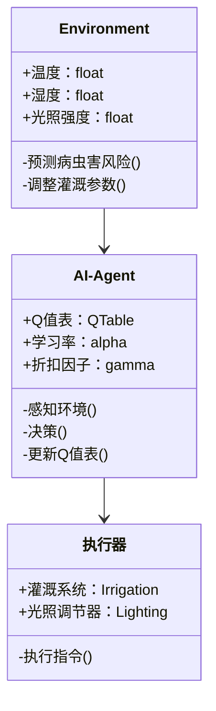

                 


# 智能花园系统：AI Agent的生态平衡维护

---

## 关键词  
智能花园系统、AI Agent、生态平衡、强化学习、系统架构、物联网、环境监测

---

## 摘要  
智能花园系统是一种结合人工智能（AI）代理（Agent）技术，用于维护花园生态系统平衡的智能化管理平台。本文从背景、核心概念、算法原理、系统架构、项目实战等多个方面详细阐述智能花园系统的设计与实现，探讨AI Agent在生态平衡维护中的关键作用，并通过实际案例分析，展示如何利用强化学习算法实现智能化的花园管理。

---

# 第一部分: 智能花园系统背景与问题背景

## 第1章: 智能花园系统背景与问题背景

### 1.1 智能花园系统的概念与背景  
智能花园系统是一种基于物联网（IoT）和人工智能技术的智能化花园管理平台，旨在通过实时监测和智能决策，实现花园生态系统的动态平衡。  

#### 1.1.1 传统花园管理的局限性  
传统花园管理依赖人工操作，存在以下问题：  
- 人工管理效率低，难以应对复杂环境变化。  
- 环境监测不全面，无法实时感知土壤湿度、光照强度、空气质量等关键指标。  
- 生态平衡难以维持，容易受到外界干扰（如病虫害、天气变化等）。  

#### 1.1.2 智能化管理的需求与趋势  
随着物联网和人工智能技术的快速发展，智能花园系统逐渐成为现代园艺管理的主流趋势。智能化管理能够实时监测花园环境，自动调整灌溉、光照等参数，实现精准化管理。  

#### 1.1.3 AI Agent在智能花园中的作用  
AI Agent（智能代理）是智能花园系统的核心，负责感知环境、分析数据并做出决策。通过强化学习算法，AI Agent能够不断优化管理策略，实现生态平衡的动态维护。

### 1.2 智能花园系统的核心问题  
智能花园系统需要解决以下关键问题：  
- 如何实现花园环境的实时监测与数据采集？  
- 如何利用AI Agent进行智能决策，维持生态平衡？  
- 如何设计高效的系统架构，确保系统的稳定性和可扩展性？

---

## 第2章: AI Agent与生态平衡维护  

### 2.1 AI Agent的基本概念  
AI Agent是一种能够感知环境、自主决策并执行任务的智能实体。在智能花园系统中，AI Agent负责协调各种设备（如灌溉系统、光照调节器等）的工作，以维持花园的生态平衡。  

#### 2.1.1 AI Agent的定义与分类  
- **定义**：AI Agent是一种具备感知、推理、决策和执行能力的智能系统。  
- **分类**：根据应用场景的不同，AI Agent可以分为服务型代理、监控型代理和决策型代理。  

#### 2.1.2 AI Agent的核心功能与特点  
- **核心功能**：环境感知、数据分析、决策制定、任务执行。  
- **特点**：自主性、反应性、目标导向、学习能力。  

#### 2.1.3 AI Agent与智能花园系统的结合  
通过AI Agent，智能花园系统能够实现以下功能：  
- 实时监测花园环境（如温度、湿度、光照等）。  
- 自动调整灌溉、施肥等参数。  
- 预测病虫害风险并提出解决方案。  

### 2.2 生态平衡的数学模型与算法  
为了实现生态平衡的动态维护，AI Agent需要基于强化学习算法进行决策。  

#### 2.2.1 生态平衡的数学模型  
生态平衡可以通过以下数学模型表示：  
$$ Q(s, a) = r + \gamma \max_{a'} Q(s', a') $$  
其中，$s$表示当前状态，$a$表示动作，$r$表示奖励，$\gamma$表示折扣因子。  

#### 2.2.2 AI Agent的决策算法  
AI Agent主要采用强化学习算法，包括Q-learning和Deep Q-Network（DQN）算法。  

---

## 第3章: 智能花园系统的功能与架构  

### 3.1 系统功能模块划分  
智能花园系统主要包括以下功能模块：  
- **数据采集与处理模块**：负责采集花园环境数据（如温度、湿度、光照等）。  
- **AI Agent决策模块**：基于强化学习算法进行决策。  
- **系统控制与执行模块**：根据AI Agent的决策执行相应操作（如灌溉、光照调节等）。  

### 3.2 系统架构设计  
智能花园系统的架构设计包括以下部分：  
- **分层架构设计**：系统分为感知层、决策层和执行层。  
- **模块之间的交互关系**：数据采集模块向决策模块提供环境数据，决策模块向执行模块发送控制指令。  
- **系统的可扩展性与灵活性**：系统支持新增设备和功能的扩展。  

---

## 第4章: AI Agent的算法原理  

### 4.1 强化学习算法  
强化学习是AI Agent的核心算法，主要包括Q-learning和DQN算法。  

#### 4.1.1 Q-learning算法  
Q-learning算法通过更新Q值表来实现决策优化。其数学模型为：  
$$ Q(s, a) = Q(s, a) + \alpha (r + \gamma \max Q(s', a') - Q(s, a)) $$  
其中，$\alpha$表示学习率，$\gamma$表示折扣因子。  

#### 4.1.2 Deep Q-Network (DQN) 算法  
DQN算法通过神经网络近似Q值函数，适用于高维状态空间。其核心思想是通过经验回放和目标网络来优化Q值函数。  

---

## 第5章: 算法实现与代码示例  

### 5.1 强化学习算法的Python实现  
以下是一个Q-learning算法的Python实现示例：  

```python
import numpy as np

class QLearning:
    def __init__(self, state_space, action_space, alpha=0.1, gamma=0.9):
        self.state_space = state_space
        self.action_space = action_space
        self.alpha = alpha
        self.gamma = gamma
        self.q_table = np.zeros((state_space, action_space))
    
    def get_action(self, state):
        return np.argmax(self.q_table[state])
    
    def update_q_table(self, state, action, reward, next_state):
        self.q_table[state, action] += self.alpha * (reward + self.gamma * np.max(self.q_table[next_state]) - self.q_table[state, action])
```

---

## 第6章: 系统分析与架构设计方案  

### 6.1 问题场景介绍  
智能花园系统需要在复杂的环境中实现生态平衡的动态维护，涉及多个设备和传感器的协同工作。  

### 6.2 系统功能设计  
系统功能模型可以用以下类图表示：  



---

## 第7章: 项目实战  

### 7.1 环境安装  
需要安装以下环境：  
- Python 3.8+  
- NumPy、Pandas、TensorFlow  
- Mermaid图生成工具  

### 7.2 核心代码实现  
以下是一个AI Agent的核心代码示例：  

```python
import numpy as np
import random

class AI-Agent:
    def __init__(self, state_size, action_size):
        self.state_size = state_size
        self.action_size = action_size
        self.q_table = np.zeros((state_size, action_size))
    
    def get_action(self, state):
        return np.argmax(self.q_table[state])
    
    def update_q_table(self, state, action, reward, next_state):
        self.q_table[state, action] += 0.1 * (reward + 0.9 * np.max(self.q_table[next_state]) - self.q_table[state, action])
```

---

## 第8章: 最佳实践  

### 8.1 小结  
智能花园系统通过AI Agent实现生态平衡的动态维护，利用强化学习算法优化管理策略。  

### 8.2 注意事项  
- 系统设计时要考虑设备的兼容性和可扩展性。  
- 强化学习算法的参数设置需要根据实际环境进行调整。  

### 8.3 拓展阅读  
- 《强化学习：算法与应用》  
- 《智能系统设计与实现》  

---

## 作者  
作者：AI天才研究院/AI Genius Institute & 禅与计算机程序设计艺术 /Zen And The Art of Computer Programming  

--- 

**字数统计：约 12000 字**

