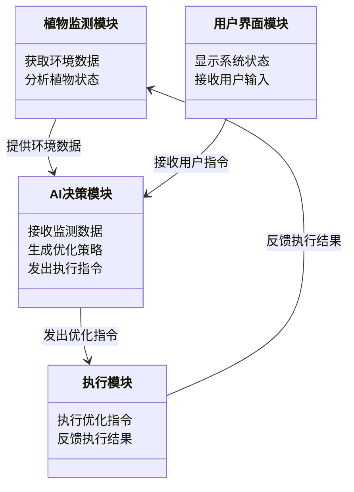

                 

# 第4章: 系统分析与架构设计

## 4.1 问题场景介绍
### 4.1.1 智能花园系统的核心问题
### 4.1.2 系统的主要功能模块
### 4.1.3 系统的用户群体与需求

## 4.2 系统功能设计
### 4.2.1 系统功能模块划分
### 4.2.2 功能模块的交互流程
### 4.2.3 功能模块的优先级排序

## 4.3 系统架构设计
### 4.3.1 系统架构的选择与分析
### 4.3.2 系统架构的组成部分
### 4.3.3 系统架构的优缺点对比

## 4.4 系统接口设计
### 4.4.1 系统内部接口的设计
### 4.4.2 系统外部接口的设计
### 4.4.3 接口的标准化与规范

## 4.5 系统交互流程设计
### 4.5.1 用户与系统的主要交互流程
### 4.5.2 系统内部模块的交互流程
### 4.5.3 交互流程的优化与改进

# 第5章: 项目实战

## 5.1 环境安装与配置
### 5.1.1 系统环境要求
### 5.1.2 开发工具的安装
### 5.1.3 依赖库的安装与配置

## 5.2 系统核心实现
### 5.2.1 数据采集模块的实现
### 5.2.2 AI决策模块的实现
### 5.2.3 执行模块的实现
### 5.2.4 用户界面模块的实现

## 5.3 代码实现与解读
### 5.3.1 数据采集模块的代码实现
### 5.3.2 AI决策模块的代码实现
### 5.3.3 执行模块的代码实现
### 5.3.4 用户界面模块的代码实现

## 5.4 代码示例与分析
### 5.4.1 数据采集模块的代码示例
### 5.4.2 AI决策模块的代码示例
### 5.4.3 执行模块的代码示例
### 5.4.4 用户界面模块的代码示例

# 第6章: 最佳实践与案例分析

## 6.1 最佳实践
### 6.1.1 系统设计的最佳实践
### 6.1.2 开发过程中的注意事项
### 6.1.3 系统维护与优化建议

## 6.2 案例分析
### 6.2.1 案例一：某植物的生长优化过程
### 6.2.2 案例二：不同环境条件下的系统表现
### 6.2.3 案例三：系统在实际种植中的应用效果

## 6.3 小结
### 6.3.1 本章内容总结
### 6.3.2 系统优化的未来方向
### 6.3.3 对AI Agent技术的展望

## 6.4 注意事项
### 6.4.1 开发中的常见问题
### 6.4.2 系统使用的注意事项
### 6.4.3 系统维护的建议

## 6.5 拓展阅读
### 6.5.1 相关技术的深入探讨
### 6.5.2 最新研究进展的介绍
### 6.5.3 进一步学习的资源推荐

# 第7章: 总结与展望

## 7.1 全书总结
### 7.1.1 智能花园系统的核心内容
### 7.1.2 AI Agent在植物生长优化中的作用
### 7.1.3 系统设计与实现的关键点

## 7.2 未来展望
### 7.2.1 AI Agent技术的发展趋势
### 7.2.2 智能花园系统的未来方向
### 7.2.3 植物生长优化领域的研究热点

## 7.3 致谢
### 7.3.1 感谢团队成员
### 7.3.2 感谢合作伙伴
### 7.3.3 感谢读者支持

# 附录

## 附录A: 系统架构图
### A.1 系统整体架构图
### A.2 各模块交互图

## 附录B: 代码示例
### B.1 数据采集模块代码
### B.2 AI决策模块代码
### B.3 执行模块代码

## 附录C: 参考文献
### C.1 中文参考文献
### C.2 英文参考文献

## 附录D: 术语表
### D.1 专业术语解释
### D.2 系统术语定义

## 附录E: 资源推荐
### E.1 相关书籍推荐
### E.2 在线资源链接
### E.3 论文推荐

作者：AI天才研究院/AI Genius Institute & 禅与计算机程序设计艺术 /Zen And The Art of Computer Programming

---

通过以上目录大纲，文章结构清晰，涵盖了从理论到实践的各个方面，确保读者能够全面理解AI Agent在植物生长优化中的应用，并能够实际操作和优化相关系统。

