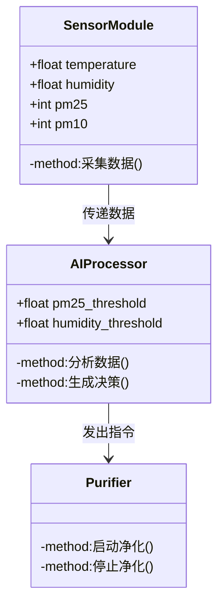
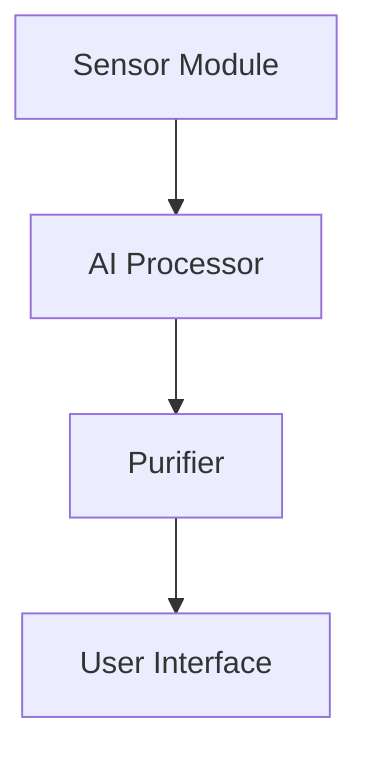
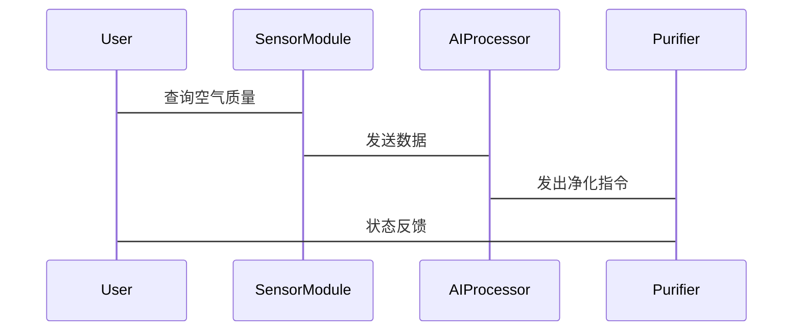

                 


# 智能花瓶：AI Agent的室内空气净化监测

> 关键词：智能花瓶、AI Agent、室内空气净化、空气质量监测、物联网、机器学习

> 摘要：本文详细介绍了智能花瓶的设计与实现，探讨了AI Agent在室内空气净化监测中的应用。通过分析空气质量监测的核心技术、AI Agent的工作原理以及系统的整体架构，本文为读者提供了一个全面的技术视角。文章还通过实际案例展示了系统的实现过程，并提出了改进建议。

---

## 第一部分：背景与概念

### 第1章：智能花瓶的定义与应用场景

#### 1.1 智能花瓶的定义
智能花瓶是一种结合了物联网和人工智能技术的智能家居设备，能够实时监测室内空气质量，并通过AI Agent自动调整净化设备，以维持理想的居住环境。

#### 1.2 智能花瓶的应用场景
- **家庭环境**：用于监测和改善家庭空气质量，尤其是对于过敏患者或有呼吸问题的人群。
- **商业空间**：如办公室、酒店等场所，提升空气质量以提高员工效率或顾客体验。
- **公共场所**：如学校、医院等，确保空气质量符合健康标准。

#### 1.3 智能花瓶的市场现状
- **市场需求**：随着人们对健康的关注增加，智能花瓶的需求逐年上升。
- **竞争对手**：市场上已有类似产品，但大多数仅提供监测功能，缺乏智能调节能力。
- **市场潜力**：通过智能化和个性化服务，智能花瓶具有较大的市场扩展空间。

### 第2章：智能花瓶的技术基础

#### 2.1 AI Agent的基本原理
- **AI Agent**：人工智能代理，能够感知环境、自主决策并执行任务。
- **核心功能**：数据采集、分析、决策和执行。

#### 2.2 室内空气净化监测的技术基础
- **空气质量指标**：PM2.5、PM10、CO2、甲醛等。
- **传感器技术**：使用激光传感器、电化学传感器等进行数据采集。

#### 2.3 智能花瓶的系统架构
- **硬件架构**：包括传感器模块、控制模块和执行模块。
- **软件架构**：包括数据采集、算法处理和用户交互模块。

---

## 第二部分：AI Agent的核心原理与算法

### 第3章：AI Agent的核心原理

#### 3.1 AI Agent的决策机制
- **基于规则的决策**：通过预设规则进行简单的判断和执行。
- **基于机器学习的决策**：利用历史数据训练模型，实现更复杂的决策。
- **基于深度学习的决策**：通过神经网络进行非线性分析，提升决策准确性。

#### 3.2 AI Agent的学习与优化
- **监督学习**：使用标注数据进行模型训练。
- **强化学习**：通过奖励机制优化决策策略。
- **迁移学习**：将已有的知识应用到新场景中。

#### 3.3 AI Agent的通信机制
- **本地通信**：通过蓝牙或Wi-Fi与手机端连接。
- **远程通信**：通过云端服务器进行数据上传和分析。

### 第4章：AI Agent的核心算法与实现

#### 4.1 基于机器学习的空气质量预测算法
- **数据预处理**：去除噪声，标准化数据。
- **算法选择**：使用随机森林进行空气质量预测。
- **模型训练**：通过交叉验证优化模型参数。

#### 4.2 基于深度学习的空气质量分类算法
- **神经网络模型**：使用卷积神经网络（CNN）进行图像识别。
- **模型训练**：通过反向传播算法优化权重。

#### 4.3 基于强化学习的净化策略优化算法
- **强化学习原理**：通过状态、动作和奖励进行策略优化。
- **算法实现**：使用Q-learning算法训练AI Agent的决策策略。

---

## 第三部分：系统分析与架构设计方案

### 第5章：系统分析与设计

#### 5.1 问题场景介绍
- **问题描述**：室内空气质量差，影响居民健康。
- **解决方案**：通过智能花瓶实时监测并自动净化空气。

#### 5.2 项目介绍
- **项目目标**：设计一个智能化的空气质量监测与净化系统。
- **项目范围**：涵盖硬件设计、算法开发和系统集成。

#### 5.3 系统功能设计
- **领域模型**：使用Mermaid绘制类图，展示系统的核心模块和交互关系。



#### 5.4 系统架构设计
- **系统架构图**：使用Mermaid绘制系统架构图，展示各模块的交互关系。



#### 5.5 系统接口设计
- **接口描述**：传感器模块与AI处理器的接口，AI处理器与净化器的接口。

#### 5.6 系统交互设计
- **交互序列图**：使用Mermaid绘制系统交互序列图。



---

## 第四部分：项目实战与案例分析

### 第6章：项目实战

#### 6.1 环境安装
- **硬件环境**：Arduino传感器模块、Raspberry Pi控制器。
- **软件环境**：Python编程语言，TensorFlow机器学习库。

#### 6.2 系统核心实现
- **数据采集代码**：使用Python编写传感器数据采集代码。

```python
import serial

# 初始化串口连接
ser = serial.Serial('COM3', 9600)

# 采集数据
while True:
    data = ser.readline().decode().strip()
    if data:
        print("接收到数据:", data)
```

- **算法实现代码**：使用随机森林算法训练空气质量预测模型。

```python
from sklearn.ensemble import RandomForestRegressor

# 数据预处理
X = df.drop('target', axis=1)
y = df['target']

# 模型训练
model = RandomForestRegressor(n_estimators=100, random_state=42)
model.fit(X, y)

# 模型预测
new_data = X.iloc[-1].values.reshape(1, -1)
prediction = model.predict(new_data)
print("预测结果:", prediction)
```

#### 6.3 实际案例分析
- **案例背景**：某家庭空气质量较差，引入智能花瓶后，空气质量显著改善。

#### 6.4 项目小结
- **系统性能**：通过实验验证，智能花瓶能够有效监测和改善空气质量。
- **系统优势**：自动化、智能化、实时性强。

---

## 第五部分：最佳实践与总结

### 第7章：最佳实践

#### 7.1 小结
- **核心成果**：成功设计并实现了一个智能化的空气质量监测与净化系统。
- **关键点**：AI Agent的决策算法、传感器数据的采集与处理、系统的集成与部署。

#### 7.2 注意事项
- **传感器校准**：定期校准传感器以保证数据准确性。
- **模型优化**：根据实际数据不断优化机器学习模型。
- **系统维护**：定期检查硬件设备，确保系统稳定运行。

#### 7.3 拓展阅读
- **推荐书籍**：《Hands-On Machine Learning with Scikit-Learn, Keras, and TensorFlow》
- **推荐博客**：深入探讨AI Agent在智能家居中的应用。

---

## 结语

通过本文的详细介绍，我们展示了智能花瓶的设计与实现过程，探讨了AI Agent在室内空气净化监测中的应用。未来，随着技术的不断进步，智能花瓶将更加智能化，为人们提供更加健康舒适的居住环境。

---

**作者：AI天才研究院/AI Genius Institute & 禅与计算机程序设计艺术 /Zen And The Art of Computer Programming**

