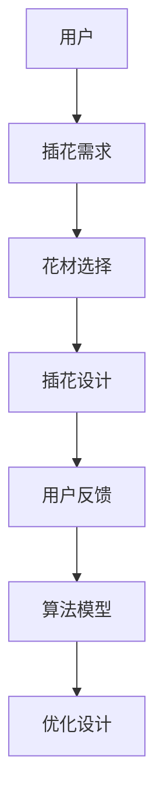
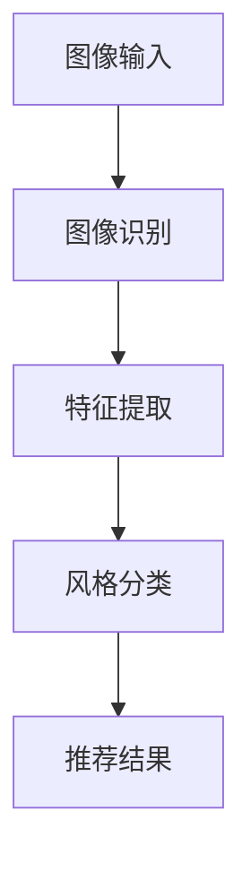
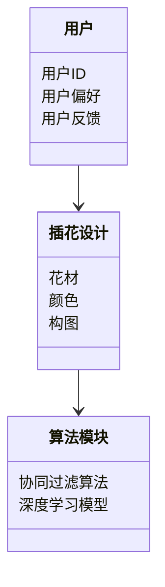
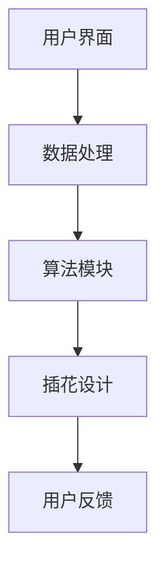
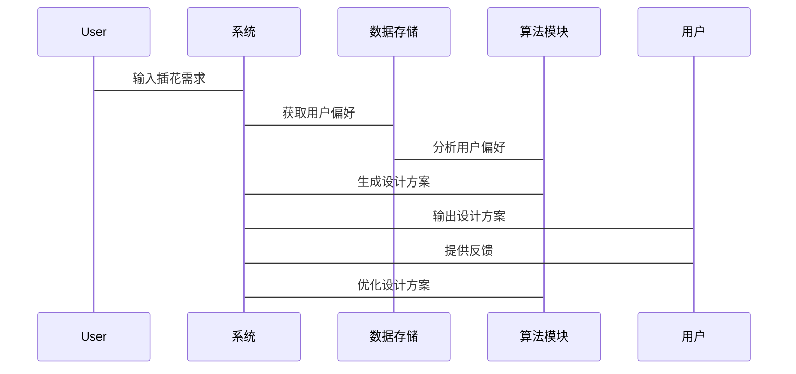

                 


# 智能花瓶：AI Agent的插花艺术指导

> 关键词：AI Agent、插花艺术、推荐系统、深度学习、系统架构

> 摘要：本文将探讨AI Agent在插花艺术中的应用，结合技术背景、算法原理、系统设计和项目实战，深入分析AI Agent如何通过推荐系统和深度学习算法，帮助用户实现个性化的插花艺术指导。文章从理论到实践，全面覆盖AI Agent在插花艺术中的应用，旨在为读者提供一个清晰、详细且实用的技术指导。

---

## 第一部分：背景介绍与核心概念

### 第1章：背景介绍与核心概念

#### 1.1 AI Agent的基本概念

##### 1.1.1 什么是AI Agent

AI Agent（人工智能代理）是指能够感知环境并采取行动以实现目标的智能实体。在插花艺术中，AI Agent可以作为用户助手，提供个性化的插花设计建议。

##### 1.1.2 AI Agent的核心特征

- **自主性**：能够在没有外部干预的情况下独立运作。
- **反应性**：能够根据环境输入实时调整行为。
- **目标导向**：以特定目标为导向，优化决策。
- **学习能力**：通过数据和反馈不断优化自身性能。

##### 1.1.3 AI Agent与传统插花艺术的结合

AI Agent通过数据驱动的方式，将传统插花艺术与现代技术结合，为用户提供更智能、个性化的插花指导。

#### 1.2 插花艺术的基本原理

##### 1.2.1 插花艺术的历史与发展

插花艺术起源于古代文明，经过 centuries 的发展，形成了多种风格和技术。现代插花艺术注重个性化和创新。

##### 1.2.2 插花艺术的核心要素

- **花材选择**：包括花的种类、颜色和形状。
- **构图设计**：包括对称、平衡和节奏等美学原则。
- **工具使用**：剪刀、花瓶等工具的使用技巧。

##### 1.2.3 插花艺术的分类与特点

插花艺术可以分为传统插花和现代插花，传统插花注重对称和平衡，现代插花则更强调个性化和创新。

#### 1.3 AI Agent在插花艺术中的应用背景

##### 1.3.1 当代插花艺术的挑战

- **个性化需求增加**：用户希望获得更个性化的插花设计。
- **技术驱动创新**：AI技术为插花艺术提供了新的可能性。
- **市场竞争力**：通过技术创新提升插花艺术的市场竞争力。

##### 1.3.2 AI技术在艺术领域的潜力

AI技术可以用于艺术创作、艺术推荐和艺术教育等领域，为艺术创作提供新的工具和方法。

##### 1.3.3 AI Agent在插花艺术中的具体应用场景

- **个性化推荐**：根据用户偏好推荐插花设计方案。
- **实时反馈**：通过图像识别技术提供实时插花建议。
- **学习与优化**：通过机器学习优化插花设计算法。

---

### 第2章：AI Agent与插花艺术的核心概念联系

#### 2.1 AI Agent的原理与插花艺术的结合

##### 2.1.1 AI Agent的基本工作流程

1. **感知环境**：通过用户输入获取插花需求。
2. **数据处理**：分析用户偏好和插花历史数据。
3. **生成建议**：基于数据生成插花设计方案。
4. **反馈优化**：根据用户反馈优化设计方案。

##### 2.1.2 插花艺术的数字化表示

插花艺术可以通过数字化的方式表示，包括花材、颜色、构图等特征。

##### 2.1.3 AI Agent在插花艺术中的角色定位

AI Agent在插花艺术中扮演用户助手的角色，通过推荐和优化设计帮助用户实现个性化插花。

#### 2.2 插花艺术与AI Agent的实体关系图

##### 2.2.1 插花艺术的实体分析

- **用户**：插花艺术的消费者。
- **插花设计**：插花艺术的核心产品。
- **花材**：插花设计的基础材料。

##### 2.2.2 AI Agent的实体分析

- **算法模型**：AI Agent的核心技术。
- **数据存储**：存储用户偏好和插花历史数据。
- **用户界面**：用户与AI Agent的交互界面。

##### 2.2.3 实体关系的Mermaid图展示



---

### 第3章：AI Agent插花艺术指导的算法原理

#### 3.1 推荐系统算法

##### 3.1.1 协同过滤算法

协同过滤是一种基于用户相似性推荐算法。例如，如果用户A喜欢花束X，而用户B也喜欢花束X，那么用户B可能也喜欢花束Y。

##### 3.1.2 基于内容的推荐算法

基于内容的推荐算法通过分析花束的特征（如颜色、形状）进行推荐。

##### 3.1.3 深度学习推荐算法

深度学习推荐算法通过神经网络模型学习花束的特征和用户偏好，生成推荐结果。

#### 3.2 插花艺术风格识别算法

##### 3.2.1 基于图像识别的插花风格分类

通过图像识别技术，AI Agent可以识别插花的风格，并进行分类。

##### 3.2.2 基于深度学习的插花风格识别

深度学习模型可以更准确地识别插花的风格和特征。

##### 3.2.3 算法流程的Mermaid图展示



---

### 第4章：系统分析与架构设计

#### 4.1 插花艺术指导系统的功能设计

##### 4.1.1 用户需求分析

- **用户1**：希望根据自己的喜好推荐插花方案。
- **用户2**：希望了解插花的历史和文化背景。
- **用户3**：希望优化现有的插花设计。

##### 4.1.2 系统功能模块划分

- **用户界面**：用户输入插花需求。
- **数据存储**：存储用户偏好和插花历史数据。
- **算法模块**：生成插花设计方案。
- **反馈模块**：根据用户反馈优化设计方案。

##### 4.1.3 领域模型的Mermaid类图



#### 4.2 系统架构设计

##### 4.2.1 系统架构的分层设计

- **前端**：用户界面和交互。
- **后端**：数据处理和算法实现。
- **AI模块**：插花设计和优化。

##### 4.2.2 系统架构的Mermaid架构图



##### 4.2.3 系统接口设计

- **输入接口**：用户输入插花需求。
- **输出接口**：生成插花设计方案。
- **反馈接口**：用户反馈设计建议。

#### 4.3 系统交互设计

##### 4.3.1 用户与系统的交互流程

1. 用户输入插花需求。
2. 系统分析用户偏好。
3. 系统生成插花设计方案。
4. 用户反馈设计建议。
5. 系统优化设计方案。

##### 4.3.2 交互流程的Mermaid序列图



---

### 第5章：项目实战与代码实现

#### 5.1 环境安装与配置

- **Python版本**：Python 3.8+
- **库依赖**：安装numpy、pandas、scikit-learn、tensorflow等库。

#### 5.2 系统核心实现源代码

##### 5.2.1 协同过滤算法实现

```python
import numpy as np

def collaborative_filtering(user_matrix):
    # 计算用户相似性
    user_similarity = np.corrcoef(user_matrix)
    # 生成推荐结果
   推荐结果 = np.dot(user_similarity, user_matrix)
    return 推荐结果
```

##### 5.2.2 深度学习模型实现

```python
import tensorflow as tf

model = tf.keras.Sequential([
    tf.keras.layers.Dense(64, activation='relu'),
    tf.keras.layers.Dense(1, activation='sigmoid')
])

model.compile(optimizer='adam', loss='binary_crossentropy', metrics=['accuracy'])
```

#### 5.3 代码应用解读与分析

- **协同过滤算法**：基于用户相似性推荐插花设计方案。
- **深度学习模型**：通过神经网络学习用户偏好，生成推荐结果。

#### 5.4 实际案例分析

- **案例1**：用户偏好红色花束，系统推荐红色玫瑰花束。
- **案例2**：用户偏好简约风格，系统推荐简约插花设计。

#### 5.5 项目小结

通过实际案例分析，验证了AI Agent在插花艺术中的应用价值，为用户提供个性化的插花设计建议。

---

## 第二部分：最佳实践与总结

### 6.1 最佳实践 Tips

- **数据质量**：确保插花数据的准确性和完整性。
- **模型优化**：通过反馈不断优化推荐算法。
- **用户体验**：注重用户界面设计和交互体验。

### 6.2 小结

本文详细介绍了AI Agent在插花艺术中的应用，结合算法原理和系统设计，为读者提供了一个全面的技术指导。

### 6.3 注意事项

- **数据隐私**：确保用户数据的安全和隐私。
- **模型维护**：定期更新模型和优化算法。
- **技术更新**：关注AI技术的发展，及时更新插花设计方法。

### 6.4 拓展阅读

- **相关书籍**：《AI in Art》
- **技术博客**：AI Agent在艺术领域的应用研究

---

作者：AI天才研究院/AI Genius Institute & 禅与计算机程序设计艺术/Zen And The Art of Computer Programming

