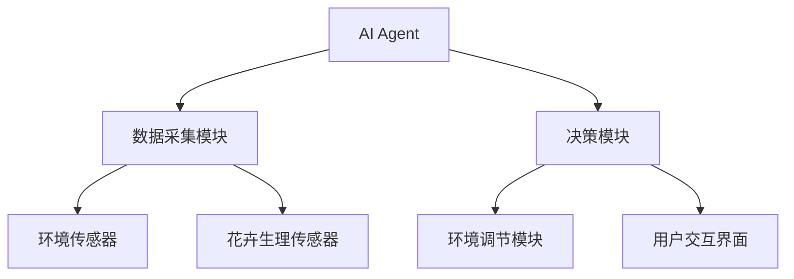
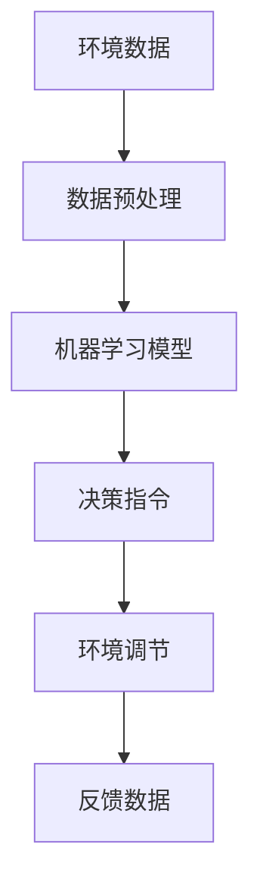

                 


# 智能花瓶：AI Agent的花卉保鲜技巧指导

> 关键词：AI Agent, 花卉保鲜, 机器学习, 系统架构, 项目实战

> 摘要：本文深入探讨了AI Agent在花卉保鲜领域的应用，结合机器学习算法和系统架构设计，详细讲解了如何利用AI技术优化花卉的保鲜过程，实现智能化的花卉管理。

---

# 第1章: AI Agent与花卉保鲜的背景介绍

## 1.1 AI Agent的基本概念

### 1.1.1 什么是AI Agent

AI Agent（人工智能代理）是一种能够感知环境、自主决策并执行任务的智能实体。它能够通过传感器获取信息，利用算法进行分析，并根据结果采取相应行动。AI Agent可以是软件程序，也可以是与硬件结合的实体设备。

### 1.1.2 AI Agent的核心特征

- **自主性**：能够在没有人工干预的情况下自主运行。
- **反应性**：能够实时感知环境变化并做出响应。
- **学习能力**：通过机器学习不断优化自身的决策能力。
- **协作性**：能够与其他系统或人类用户进行交互和协作。

### 1.1.3 AI Agent与传统养花的区别

传统养花依赖人工经验，存在保鲜效果不稳定、效率低的问题。而AI Agent能够通过数据采集、分析和决策，提供精准的保鲜建议，显著提高保鲜效果和效率。

---

## 1.2 花卉保鲜的基本原理

### 1.2.1 花卉保鲜的关键因素

- **温度**：不同花卉对温度的需求不同，过高或过低的温度都会影响保鲜效果。
- **湿度**：适当的湿度有助于保持花卉的水分平衡。
- **光照**：光照强度和时长对花卉的生长和保鲜有重要影响。
- **氧气与二氧化碳**：气体环境的平衡是维持花卉新鲜度的关键。

### 1.2.2 影响花卉保鲜的主要环境因素

- **温度**：温度过高会导致花卉快速凋谢，温度过低则可能引发冻害。
- **湿度**：湿度过高会导致霉菌滋生，湿度过低则会使花卉枯萎。
- **光照**：光照不足会导致花卉徒长，光照过强则会灼伤叶片。
- **气体环境**：高浓度的二氧化碳会导致花卉窒息，而氧气不足则会影响其呼吸作用。

### 1.2.3 传统花卉保鲜方法的局限性

传统保鲜方法主要依赖人工经验，缺乏科学性和系统性。例如，浇水的频率、施肥的量度、修剪的时机等，往往难以精确控制，导致保鲜效果不稳定。

---

## 1.3 AI Agent在花卉保鲜中的应用背景

### 1.3.1 现代花卉保鲜技术的发展趋势

随着科技的进步，花卉保鲜技术逐渐从传统经验向智能化、数据化方向发展。AI技术的应用为花卉保鲜提供了新的可能性。

### 1.3.2 AI技术在农业与园艺中的应用现状

AI技术已经在农业和园艺领域得到了广泛应用，例如智能灌溉系统、病虫害监测系统等。AI Agent在花卉保鲜中的应用是这一技术的延伸。

### 1.3.3 AI Agent在花卉保鲜中的潜力与优势

AI Agent能够通过实时监测花卉的生理指标和环境参数，结合机器学习模型，提供精准的保鲜建议，从而提高花卉的存活率和观赏价值。

---

## 1.4 本章小结

本章介绍了AI Agent的基本概念及其在花卉保鲜中的应用背景，分析了传统花卉保鲜方法的局限性，并提出了AI Agent在花卉保鲜中的潜力与优势。

---

# 第2章: AI Agent与花卉保鲜的核心概念

## 2.1 AI Agent的核心原理

### 2.1.1 AI Agent的感知与决策机制

AI Agent通过传感器采集环境数据（如温度、湿度、光照等），利用机器学习模型进行分析，生成决策指令（如调整温湿度、提供光照等）。

### 2.1.2 基于机器学习的花卉保鲜模型

花卉保鲜模型通过历史数据训练，能够预测不同环境条件下花卉的保鲜状态，并生成相应的保鲜建议。

### 2.1.3 AI Agent的实时监测与反馈机制

AI Agent能够实时监测花卉的生理指标和环境参数，根据反馈结果不断优化决策策略。

---

## 2.2 花卉保鲜的关键指标与特征

### 2.2.1 花卉保鲜的温度控制模型

不同花卉对温度的需求不同，AI Agent能够根据花卉种类自动调整温湿度。

### 2.2.2 湿度与光照对花卉保鲜的影响

AI Agent能够实时监测湿度和光照强度，并根据花卉需求进行调节。

### 2.2.3 花卉生理指标的实时监测

通过传感器监测花卉的生理指标（如叶片温度、茎干湿度等），AI Agent能够及时发现异常并采取措施。

---

## 2.3 AI Agent与花卉保鲜的系统架构

### 2.3.1 系统的整体架构图



### 2.3.2 数据流的处理流程



### 2.3.3 AI Agent的决策逻辑

AI Agent的决策逻辑包括数据采集、特征提取、模型预测、指令生成四个步骤。

---

## 2.4 本章小结

本章详细讲解了AI Agent的核心原理及其在花卉保鲜中的应用，分析了花卉保鲜的关键指标与特征，并通过系统架构图展示了AI Agent的工作流程。

---

# 第3章: AI Agent的花卉保鲜算法原理

## 3.1 基于机器学习的花卉保鲜预测模型

### 3.1.1 数据预处理与特征提取

数据预处理包括数据清洗、归一化等步骤。特征提取则需要选择对保鲜影响较大的环境参数。

### 3.1.2 基于决策树的花卉保鲜预测

决策树是一种常用的分类算法，适用于花卉保鲜状态的预测。

### 3.1.3 神经网络模型在花卉保鲜中的应用

神经网络模型能够处理非线性关系，适用于复杂的保鲜预测任务。

---

## 3.2 算法原理的数学模型

### 3.2.1 决策树模型的构建与优化

决策树模型的构建过程如下：

1. 选择最优特征进行分裂。
2. 递归地构建子树。
3. 剪枝优化，防止过拟合。

### 3.2.2 神经网络模型的训练过程

神经网络模型的训练过程包括：

1. 初始化权重。
2. 前向传播计算预测值。
3. 计算损失函数。
4. 反向传播更新权重。
5. 重复迭代直到收敛。

---

## 3.3 算法实现的代码示例

```python
import numpy as np
from sklearn.tree import DecisionTreeClassifier

# 数据预处理
X = ...  # 特征矩阵
y = ...  # 标签向量

# 模型训练
model = DecisionTreeClassifier()
model.fit(X, y)

# 预测
new_sample = ...  # 新样本
prediction = model.predict(new_sample)
```

---

## 3.4 本章小结

本章详细讲解了AI Agent的花卉保鲜算法原理，介绍了决策树和神经网络两种算法，并通过代码示例展示了算法的实现过程。

---

# 第4章: 系统分析与架构设计方案

## 4.1 系统的整体架构

### 4.1.1 系统的功能模块划分

- 数据采集模块：负责采集环境和花卉生理数据。
- 决策模块：负责分析数据并生成决策指令。
- 环境调节模块：负责执行决策指令。
- 用户交互界面：提供人机交互功能。

### 4.1.2 系统的硬件与软件架构

- 硬件部分：环境传感器、花卉生理传感器、执行机构。
- 软件部分：数据采集程序、机器学习模型、控制程序。

### 4.1.3 系统的通信与数据流设计

数据流从传感器流向数据处理模块，经过模型分析后生成指令，最终传递给执行机构。

---

## 4.2 系统的功能设计

### 4.2.1 数据采集模块的设计

数据采集模块负责采集温度、湿度、光照等环境数据，以及花卉生理数据。

### 4.2.2 AI Agent的决策模块设计

决策模块基于机器学习模型，根据采集的数据生成保鲜建议。

### 4.2.3 用户交互界面的设计

用户可以通过界面查看实时数据和保鲜建议，并进行手动干预。

---

## 4.3 系统的接口设计

### 4.3.1 系统与传感器的接口设计

传感器通过UART或I2C接口与系统连接，数据通过串口传输。

### 4.3.2 系统与用户的交互接口

用户通过触摸屏或手机APP与系统交互。

### 4.3.3 系统的远程监控接口

系统可以通过Wi-Fi或4G网络实现远程监控。

---

## 4.4 系统的交互流程设计

### 4.4.1 用户操作流程

1. 用户通过界面查看实时数据。
2. 用户选择自动或手动模式。
3. 系统根据选择执行相应操作。

### 4.4.2 

（待续）

