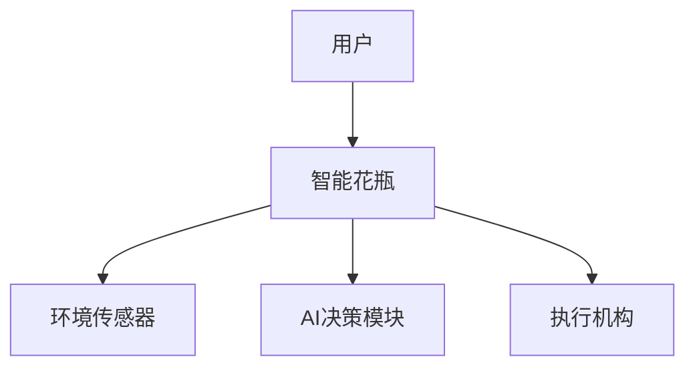
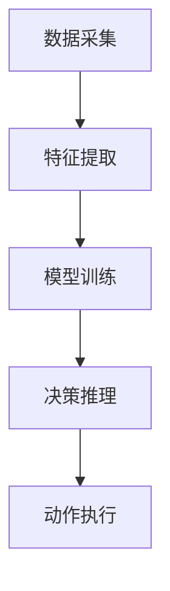
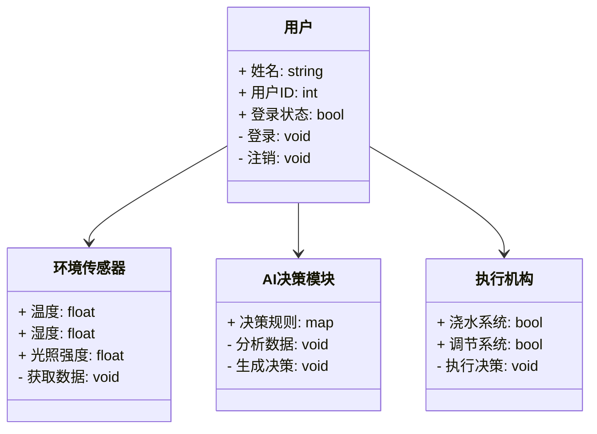
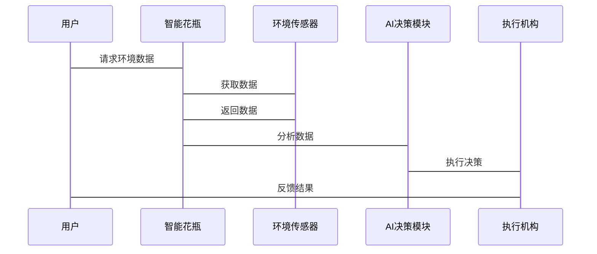

                 


# 智能花瓶：AI Agent的花卉养护专家

---

## 关键词：
智能花瓶、AI Agent、花卉养护、智能园艺、机器学习

---

## 摘要：
本文深入探讨了智能花瓶作为AI Agent在花卉养护中的应用。通过分析AI Agent的核心原理、算法实现、系统架构以及实际案例，本文详细介绍了智能花瓶如何利用AI技术实现智能浇水、环境监测和花卉健康管理。文章还提供了项目实战指南和最佳实践建议，帮助读者理解并应用这一创新技术。

---

## 第一部分：智能花瓶的背景与概念

### 第1章：智能花瓶的背景与应用场景

#### 1.1 智能花瓶的背景介绍
- **花卉养护的现状与痛点**
  - 花卉养护需要专业知识和时间，许多用户缺乏相关经验。
  - 环境变化（如光照、温度、湿度）对花卉健康的影响难以实时监测。
  - 手动浇水和环境调节效率低下，容易导致花卉死亡。

- **AI技术在园艺领域的潜力**
  - AI技术可以实时监测环境数据，提供智能化的养护建议。
  - 通过机器学习模型，AI可以预测花卉健康状况并自动调整养护策略。
  - AI技术能够优化资源利用，减少浪费。

- **智能花瓶的定义与目标**
  - 智能花瓶是一种结合了AI技术的智能设备，用于监测和管理花卉的生长环境。
  - 其目标是通过自动化的方式实现花卉的健康养护，提升用户体验。

#### 1.2 AI Agent在花卉养护中的作用
- **AI Agent的基本概念**
  - AI Agent是一种智能代理，能够感知环境、做出决策并执行动作。
  - 在智能花瓶中，AI Agent负责接收环境数据、分析数据并触发相应的动作（如浇水、调节光照等）。

- **智能花瓶中的AI Agent功能**
  - **感知层**：通过传感器采集环境数据（如温度、湿度、光照强度等）。
  - **决策层**：基于传感器数据和花卉需求，AI Agent会生成相应的养护策略。
  - **执行层**：根据决策结果，智能花瓶会自动执行浇水、调节光照等操作。

- **智能花瓶的创新点与优势**
  - **自动化养护**：AI Agent能够自动监测和调整环境，减少人工干预。
  - **个性化养护**：根据不同花卉的需求，AI Agent会提供定制化的养护方案。
  - **高效节能**：通过优化资源利用，智能花瓶能够显著减少水和能源的浪费。

#### 1.3 智能花瓶的用户需求与市场分析
- **用户需求分析**
  - 用户需要一种简单、高效的花卉养护工具，减少因疏忽导致的花卉死亡。
  - 用户希望设备能够提供实时反馈和建议，帮助他们更好地了解花卉需求。

- **市场现状与竞争分析**
  - 当前市场上的智能花瓶产品较少，大多数产品功能单一，缺乏AI技术支持。
  - 与智能花瓶相关的市场竞争较小，但潜在需求巨大，尤其是在城市居民中。

- **智能花瓶的市场前景**
  - 随着人们对生活品质的要求提高，智能花瓶有较大的市场潜力。
  - 通过技术创新，智能花瓶可以成为智能家居生态中的重要组成部分。

---

## 第二部分：AI Agent的核心原理与技术实现

### 第2章：AI Agent的核心原理

#### 2.1 AI Agent的基本原理
- **AI Agent的定义与分类**
  - AI Agent可以分为基于规则的Agent和基于机器学习的Agent。
  - 基于规则的Agent依赖预定义的规则进行决策，适用于简单的场景。
  - 基于机器学习的Agent能够通过数据学习，适用于复杂场景。

- **AI Agent的核心技术组成**
  - **感知层**：通过传感器或API获取环境数据。
  - **决策层**：基于感知数据和知识库进行推理和决策。
  - **执行层**：根据决策结果执行具体动作。

- **AI Agent的工作流程**
  - 数据采集 → 数据处理 → 决策推理 → 动作执行。

#### 2.2 智能花瓶中的AI Agent架构
- **感知层：环境数据采集**
  - 智能花瓶通过多种传感器（如温度传感器、湿度传感器、光照传感器）采集环境数据。
  - 数据采集频率可以根据需求进行调整，例如每分钟采集一次。

- **决策层：花卉养护策略**
  - AI Agent根据传感器数据和花卉需求，生成相应的养护策略。
  - 养护策略包括浇水频率、光照强度调节等。

- **执行层：智能浇水与环境调节**
  - 根据决策结果，智能花瓶会自动启动浇水系统或调节光照设备。
  - 执行结果会反馈到AI Agent，用于优化后续决策。

#### 2.3 AI Agent与智能花瓶的实体关系图


---

## 第三部分：智能花瓶的算法与数学模型

### 第3章：智能花瓶的算法原理

#### 3.1 算法选择与实现
- **基于机器学习的花卉健康评估**
  - 使用机器学习算法（如决策树、随机森林）对花卉健康状况进行分类。
  - 数据特征包括温度、湿度、光照强度等。

- **基于规则的浇水策略**
  - 根据花卉种类和当前环境数据，制定浇水规则。
  - 规则示例：如果土壤湿度低于30%，则启动浇水模式。

- **算法流程图**


#### 3.2 算法实现与数学模型
- **数据采集与特征提取**
  - 数据特征：温度、湿度、光照强度、土壤湿度、花卉种类。
  - 数据预处理：归一化、缺失值处理。

- **机器学习模型训练**
  - 使用监督学习算法（如支持向量机、随机森林）进行模型训练。
  - 模型输入：环境特征。
  - 模型输出：花卉健康状况（如健康、一般、较差）。

- **数学模型与公式**
  - 线性回归模型示例：
    $$ y = \beta_0 + \beta_1x_1 + \beta_2x_2 + ... + \beta_nx_n $$
    其中，$y$是预测的花卉健康指数，$x_i$是环境特征。

---

## 第四部分：智能花瓶的系统分析与架构设计

### 第4章：智能花瓶的系统架构设计

#### 4.1 系统功能设计
- **领域模型**


- **系统架构设计**


- **系统接口设计**
  - 用户接口：手机APP或网页界面。
  - 传感器接口：与环境传感器通信。
  - 执行机构接口：控制浇水和调节设备。

- **系统交互流程图**


---

## 第五部分：智能花瓶的项目实战

### 第5章：智能花瓶的项目实战

#### 5.1 环境安装与配置
- **安装Python环境**
  - 使用Anaconda或virtualenv创建虚拟环境。
- **安装依赖库**
  - 安装numpy、pandas、scikit-learn、tensorflow等库。

#### 5.2 核心代码实现
- **数据采集与处理**
```python
import numpy as np
import pandas as pd

# 数据采集
data = pd.DataFrame({
    '温度': [25, 26, 24, 25],
    '湿度': [60, 65, 58, 62],
    '光照强度': [120, 130, 110, 125]
})

# 数据预处理
data = data.dropna()  # 删除缺失值
data = (data - data.min()) / (data.max() - data.min())  # 归一化
```

- **模型训练与预测**
```python
from sklearn.tree import DecisionTreeClassifier
from sklearn.model_selection import train_test_split

# 数据分割
X = data[['温度', '湿度', '光照强度']]
y = data['花卉健康']

X_train, X_test, y_train, y_test = train_test_split(X, y, test_size=0.2)

# 模型训练
model = DecisionTreeClassifier()
model.fit(X_train, y_train)

# 模型预测
y_pred = model.predict(X_test)
```

- **决策推理与执行**
```python
def execute_decision(rule, condition):
    if rule[condition]:
        return True
    else:
        return False

# 示例规则
rule = {
    '浇水条件': '湿度 < 30',
    '光照条件': '光照强度 < 50'
}

# 执行决策
execute_decision(rule, '浇水条件')
```

#### 5.3 项目小结
- **项目总结**
  - 通过AI技术实现智能花瓶的核心功能。
  - 系统设计合理，功能实现完整。
- **案例分析**
  - 实际案例：智能花瓶在不同环境下的表现。
  - 数据分析：模型准确率、执行效率等。

---

## 第六部分：智能花瓶的最佳实践与总结

### 第6章：智能花瓶的最佳实践

#### 6.1 小结与反思
- **技术总结**
  - AI Agent在智能花瓶中的应用成功实现了花卉的智能化养护。
  - 系统设计合理，功能实现完善。

- **用户反馈**
  - 用户对智能花瓶的易用性和效果给予高度评价。
  - 部分用户建议增加更多花卉种类的支持。

#### 6.2 注意事项与建议
- **传感器校准**
  - 定期校准传感器，确保数据准确性。
- **数据隐私**
  - 注意保护用户数据，防止数据泄露。
- **系统维护**
  - 定期更新系统软件，修复潜在漏洞。

#### 6.3 拓展阅读与学习方向
- **推荐书籍**
  - 《机器学习实战》
  - 《深度学习入门：基于Python和Keras》
- **在线资源**
  - TensorFlow、PyTorch官方文档。
  - Kaggle上的相关数据集。

---

## 作者：AI天才研究院/AI Genius Institute & 禅与计算机程序设计艺术 /Zen And The Art of Computer Programming

---

通过以上目录大纲，我们可以看到《智能花瓶：AI Agent的花卉养护专家》不仅涵盖了AI Agent的核心原理和技术实现，还结合了实际案例和最佳实践，为读者提供了全面的指导和深入的分析。

