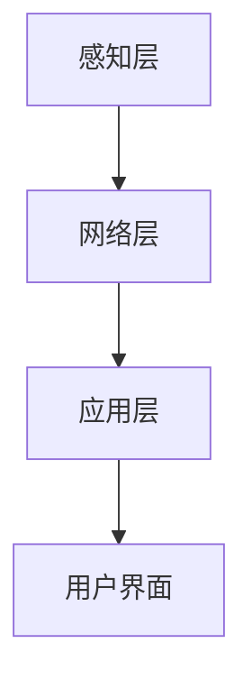
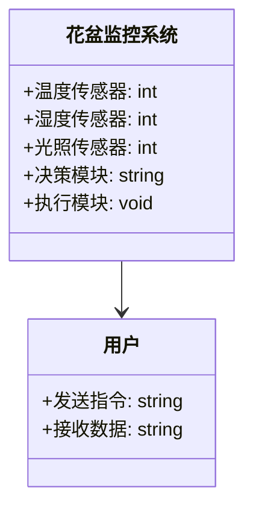
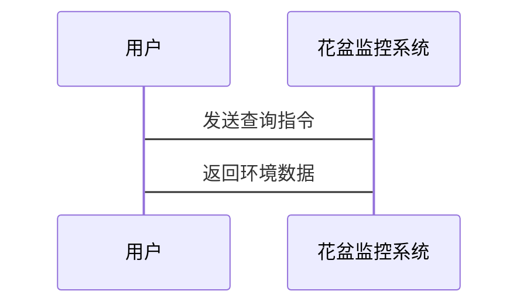

                 


# 智能花盆：AI Agent的植物生长监测

---

## 关键词：智能花盆、AI Agent、植物生长监测、物联网、机器学习、数据采集、智能园艺

---

## 摘要

智能花盆通过AI Agent和物联网技术的结合，实现对植物生长环境的实时监测和智能控制。本文详细介绍了智能花盆的概念、技术基础、算法原理、系统架构以及项目实战，展示了如何利用AI技术优化植物生长监测，为现代农业和家庭园艺提供智能化解决方案。

---

# 正文

## 第1章 智能花盆的概念与背景

### 1.1 智能花盆的定义与应用场景

#### 1.1.1 智能花盆的定义

智能花盆是一种结合了人工智能（AI）和物联网（IoT）技术的智能设备，能够实时监测植物的生长环境，并根据监测数据自动调整光照、水分和温度等条件，以优化植物的生长。

#### 1.1.2 智能花盆的主要应用场景

智能花盆广泛应用于家庭园艺、办公室绿化、农业大棚等领域。它可以帮助用户实现远程监控和智能管理，减少人工干预，提高植物的生长效率。

#### 1.1.3 智能花盆与传统花盆的对比

| 特性         | 传统花盆         | 智能花盆         |
|--------------|------------------|------------------|
| 监测能力     | 无               | 实时监测         |
| 调控能力     | 无               | 智能调控         |
| 连通性       | 无               | 无线连接         |
| 可扩展性     | 低               | 高               |

### 1.2 植物生长监测的背景与问题

#### 1.2.1 植物生长监测的重要性

植物生长监测是现代农业和园艺的重要组成部分。通过监测环境参数，可以及时发现问题并采取措施，确保植物健康生长。

#### 1.2.2 现有监测方法的局限性

传统监测方法依赖人工观察，存在效率低、误差大、实时性差等问题。随着科技的发展，智能化监测成为趋势。

#### 1.2.3 AI Agent在植物生长监测中的优势

AI Agent能够实时分析数据，自主决策并执行控制，显著提高了监测的效率和准确性。

### 1.3 AI Agent的基本概念与特点

#### 1.3.1 AI Agent的定义

AI Agent是一种能够感知环境、自主决策并执行任务的智能实体。它能够通过传感器获取信息，并根据预设规则或学习模型做出决策。

#### 1.3.2 AI Agent的核心特点

- **自主性**：能够自主决策。
- **反应性**：能够实时响应环境变化。
- **学习能力**：能够通过数据学习和优化。

#### 1.3.3 AI Agent与传统自动控制系统的区别

| 特性         | AI Agent         | 传统控制系统     |
|--------------|------------------|------------------|
| 决策方式     | 基于学习模型     | 基于固定规则     |
| 灵活性       | 高               | 低               |
| 智能性       | 高               | 无               |

## 第2章 AI Agent的核心技术

### 2.1 感知技术

#### 2.1.1 传感器技术

智能花盆使用多种传感器，如温度传感器、湿度传感器和光照传感器，实时监测环境参数。

#### 2.1.2 数据采集与处理

数据采集模块负责收集传感器数据，并进行预处理，提取特征。

#### 2.1.3 数据分析与特征提取

通过数据分析，识别关键特征，如温度波动、湿度变化等。

### 2.2 决策与执行技术

#### 2.2.1 机器学习算法

使用随机森林或支持向量机（SVM）进行分类和预测。

#### 2.2.2 决策逻辑与规则

基于传感器数据和模型预测结果，制定决策策略。

#### 2.2.3 执行机构的控制

通过继电器或电机控制LED灯和水泵，实现环境调控。

### 2.3 通信与交互技术

#### 2.3.1 物联网通信技术

使用Wi-Fi或蓝牙实现设备间的通信。

#### 2.3.2 用户交互设计

设计友好的用户界面，方便用户查看数据和控制设备。

#### 2.3.3 数据同步与远程控制

通过云平台实现数据同步和远程操作。

## 第3章 智能花盆的物联网架构

### 3.1 物联网的基本概念

物联网（IoT）通过传感器和网络实现设备间的互联，广泛应用于各个领域。

### 3.2 智能花盆的物联网架构

#### 3.2.1 感知层

包括传感器和执行器，负责数据采集和设备控制。

#### 3.2.2 网络层

通过无线网络传输数据。

#### 3.2.3 应用层

处理数据并提供用户界面。

### 3.3 数据传输

确保数据的安全性和可靠性，防止数据丢失和泄露。

## 第4章 算法原理

### 4.1 机器学习算法的选择与实现

使用随机森林算法进行分类，模型流程如下：

1. 数据预处理：归一化和标准化。
2. 特征选择：使用特征重要性分析。
3. 模型训练：构建随机森林。
4. 模型预测：分类结果。

数学模型：

$$
\text{随机森林} = \{ \text{决策树}_1, \text{决策树}_2, ..., \text{决策树}_n \}
$$

### 4.2 深度学习在植物监测中的应用

使用卷积神经网络（CNN）进行图像分类，流程如下：

1. 图像预处理：归一化和数据增强。
2. 模型训练：训练CNN。
3. 图像分类：识别病虫害。

数学模型：

$$
\text{CNN} = \text{卷积层} \circ \text{池化层} \circ \text{全连接层}
$$

## 第5章 系统架构与设计

### 5.1 系统架构设计

分层架构：

- 感知层：传感器和执行器。
- 网络层：通信模块。
- 应用层：数据处理和用户界面。

Mermaid图：



### 5.2 系统功能设计

#### 5.2.1 领域模型

Mermaid类图：



#### 5.2.2 系统交互

Mermaid序列图：



## 第6章 项目实战

### 6.1 环境安装

安装Python、传感器库、物联网库等。

### 6.2 核心实现

#### 数据采集模块

```python
import sensor

def get_data():
    temperature = sensor.read_temp()
    humidity = sensor.read_humid()
    light = sensor.read_light()
    return temperature, humidity, light
```

#### 决策模块

```python
from sklearn.ensemble import RandomForestClassifier

model = RandomForestClassifier()
model.fit(X_train, y_train)
预测结果 = model.predict(X_test)
```

#### 执行模块

```python
def control_system(action):
    if action == '开灯':
        led.on()
    elif action == '关灯':
        led.off()
    elif action == '浇水':
        pump.on()
    elif action == '停止':
        pump.off()
```

### 6.3 实际案例分析

通过实际案例展示系统如何优化植物生长环境，分析数据和模型决策过程。

## 第7章 结论

### 7.1 总结

智能花盆通过AI Agent和物联网技术，实现植物生长环境的智能化监测和调控，显著提高了种植效率。

### 7.2 未来展望

未来可以增加更多传感器，优化算法性能，拓展应用场景，如垂直农业和智能温室。

### 7.3 注意事项

在使用系统时，需注意数据隐私和系统维护，确保设备正常运行。

---

## 作者

作者：AI天才研究院/AI Genius Institute & 禅与计算机程序设计艺术/Zen And The Art of Computer Programming

---

# 结束语

本文详细介绍了智能花盆的设计与实现，展示了AI Agent在植物生长监测中的巨大潜力。通过技术与实践的结合，智能花盆将为现代农业和家庭园艺带来更多的便利和效率提升。

