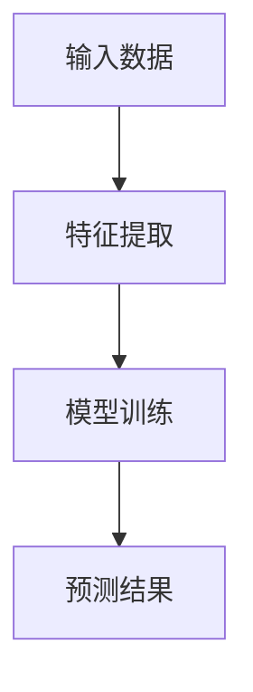
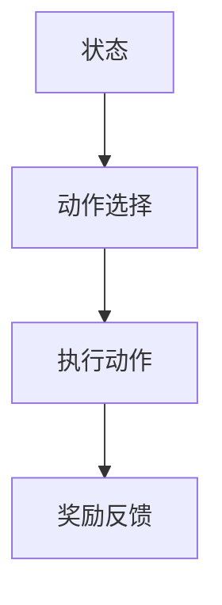
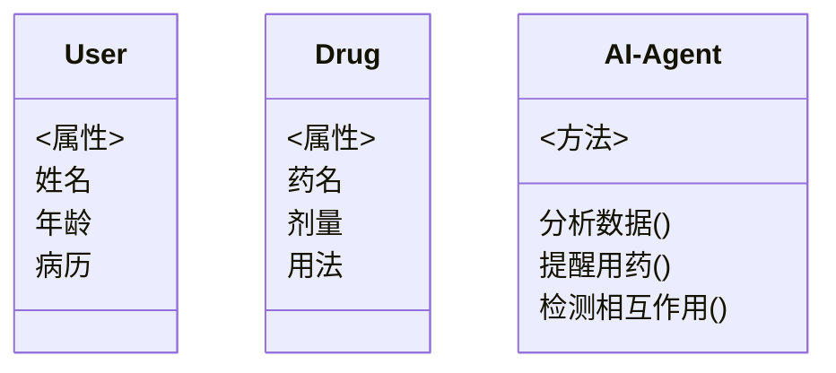
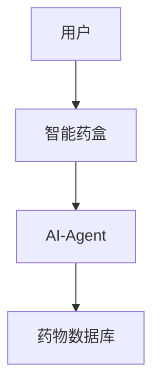

                 


# 智能药盒：AI Agent的用药安全监督助手

## 关键词：智能药盒、AI Agent、用药安全、药物相互作用、用药提醒

## 摘要：  
本文探讨了智能药盒在AI Agent技术的支持下，如何实现用药安全的智能化监督。通过分析AI Agent的核心概念、算法原理及系统架构，结合实际应用场景，详细阐述了智能药盒的设计与实现过程，为用药安全提供了创新解决方案。

---

# 第一部分：AI Agent与智能药盒概述

## 第1章：AI Agent的基本概念与技术基础

### 1.1 AI Agent的定义与核心原理

#### 1.1.1 什么是AI Agent  
AI Agent（人工智能代理）是能够感知环境、自主决策并执行任务的智能实体。它通过传感器获取信息，利用算法处理数据，做出决策并采取行动。  

**核心概念：**  
- **自主性**：AI Agent能够自主决策，无需外部干预。  
- **反应性**：能够实时感知环境变化并做出反应。  
- **智能性**：具备学习和推理能力，能够优化决策过程。  

#### 1.1.2 AI Agent的技术特征  
AI Agent的关键技术包括：  
1. **信息处理**：通过自然语言处理（NLP）、计算机视觉等技术分析数据。  
2. **决策系统**：基于机器学习模型做出最优决策。  
3. **执行机制**：通过物理或数字接口执行操作。  

#### 1.1.3 AI Agent与传统软件的区别  
AI Agent的核心区别在于其智能性和自主性。传统软件依赖预定义规则，而AI Agent能够学习、适应并优化行为。  

### 1.2 智能药盒的应用场景  
智能药盒结合AI Agent技术，广泛应用于家庭医疗、医院药房、远程医疗等领域，帮助用户安全用药、提醒用药时间，并检测药物相互作用。  

---

## 第2章：AI Agent在智能药盒中的应用

### 2.1 AI Agent在用药安全监督中的作用  

#### 2.1.1 AI Agent如何监督用药安全  
AI Agent通过分析用户的用药记录、健康数据和药物信息，实时监控用药情况，识别潜在风险。  

#### 2.1.2 AI Agent的用药提醒功能  
AI Agent可以根据用户的服药时间表，通过手机APP或智能设备发送提醒，避免漏服或误服。  

#### 2.1.3 AI Agent检测药物相互作用  
通过分析用户的用药记录和药物数据库，AI Agent能够识别潜在的药物相互作用，提醒用户避免危险组合。  

### 2.2 AI Agent与智能药盒的结合  

#### 2.2.1 AI Agent的核心功能  
1. **用药提醒**：基于用户的用药计划，发送个性化提醒。  
2. **药物管理**：智能分类和存储药品，确保用药正确。  
3. **数据同步**：与医疗机构系统对接，实时更新用药信息。  

#### 2.2.2 AI Agent的智能分析  
AI Agent利用机器学习算法，分析用户的用药数据、健康状况和生活习惯，优化用药方案。  

#### 2.2.3 交互设计  
智能药盒通过语音交互、触控操作和手机APP，提供便捷的用户界面，提升用户体验。  

---

# 第二部分：AI Agent的核心概念与联系

## 第3章：AI Agent的核心概念与原理  

### 3.1 AI Agent的核心概念  

#### 3.1.1 信息感知与处理  
AI Agent通过传感器、摄像头等设备获取环境数据，利用NLP、计算机视觉等技术进行处理。  

#### 3.1.2 决策与执行  
基于处理后的信息，AI Agent通过决策算法选择最优行动，并通过执行模块完成任务。  

#### 3.1.3 学习与优化  
AI Agent通过监督学习、强化学习等算法，不断优化自身的决策模型。  

### 3.2 AI Agent的核心原理  

#### 3.2.1 监督学习算法  
- **定义**：通过标记数据训练模型，预测新数据的类别或数值。  
- **数学模型**：线性回归（$y = \beta x + \epsilon$）。  
- **流程图**：  


---

## 第4章：AI Agent与智能药盒的实体关系分析  

### 4.1 实体关系图  

#### 4.1.1 用户与智能药盒的关系  
用户是智能药盒的主要使用者，通过药盒获取用药提醒和药物管理服务。  

#### 4.1.2 AI Agent与智能药盒的关系  
AI Agent作为智能药盒的核心模块，负责数据处理、决策和执行。  

#### 4.1.3 药物数据与AI Agent的关系  
AI Agent通过分析药物数据，识别潜在的药物相互作用和用药风险。  

### 4.2 实体属性对比表格  

| 实体 | 属性 | 描述 |
|------|------|------|
| 用户 | 姓名 | 用户的名称 |
|      | 年龄 | 用户的年龄 |
|      | 病历 | 用户的健康记录 |
| 药物数据 | 药名 | 药品名称 |
|         | 剂量 | 药品用量 |
|         | 用法 | 用药方法 |

---

## 第5章：AI Agent的算法原理与流程图  

### 5.1 AI Agent的算法原理  

#### 5.1.1 监督学习算法  
- **目标**：预测用户是否按时用药。  
- **流程图**：  


#### 5.1.2 强化学习算法  
- **目标**：优化用药提醒策略。  
- **流程图**：  


---

# 第三部分：系统分析与架构设计

## 第6章：系统分析与架构设计  

### 6.1 问题场景介绍  
智能药盒需要实时监督用户的用药行为，确保用药安全。主要问题包括：用药提醒延迟、药物数据不准确、用户交互不便捷。  

### 6.2 系统功能设计  

#### 6.2.1 领域模型类图  


#### 6.2.2 系统架构设计  


---

## 第7章：项目实战  

### 7.1 环境安装  
- **工具**：Python 3.8及以上版本，TensorFlow 2.0及以上版本。  

### 7.2 核心代码实现  

#### 7.2.1 用药提醒模块  
```python
import datetime

def schedule_reminder(user, time):
    if datetime.datetime.now() >= time:
        return f"{user}, 是时候吃药了！"
    else:
        return f"{user}, 还有 {time - datetime.datetime.now()} 分钟提醒您吃药。"
```

#### 7.2.2 药物相互作用检测模块  
```python
def detect_interaction(drug1, drug2):
    if (drug1 in dangerous_interactions and dangerous_interactions[drug1] == drug2):
        return True
    return False
```

---

## 第8章：总结与展望  

### 8.1 最佳实践  
- 定期更新药物数据库，确保检测准确性。  
- 提供多语言支持，扩大用户群体。  

### 8.2 小结  
AI Agent技术为智能药盒提供了强大的技术支持，通过实时监督和智能分析，显著提升了用药安全性和用户体验。  

### 8.3 注意事项  
- 保护用户隐私，确保数据安全。  
- 定期维护系统，更新AI模型。  

### 8.4 拓展阅读  
- 推荐阅读《AI Agent在医疗健康领域的应用》和《智能系统设计与实现》。  

---

# 作者：AI天才研究院 & 禅与计算机程序设计艺术

---

以上是《智能药盒：AI Agent的用药安全监督助手》的技术博客文章的详细内容，涵盖了从基本概念到系统设计再到项目实战的各个方面，结合了技术深度与实际应用，为读者提供了全面的指导。

