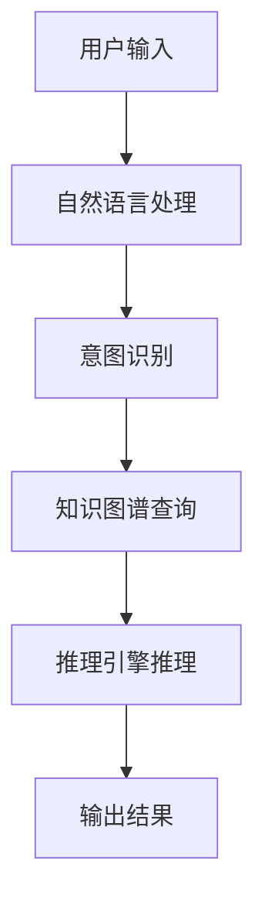
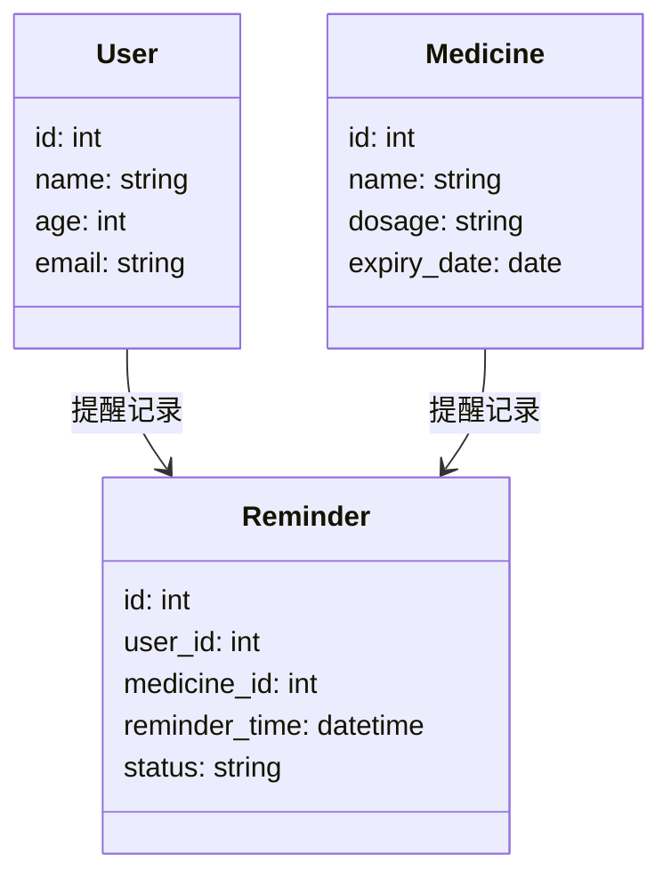
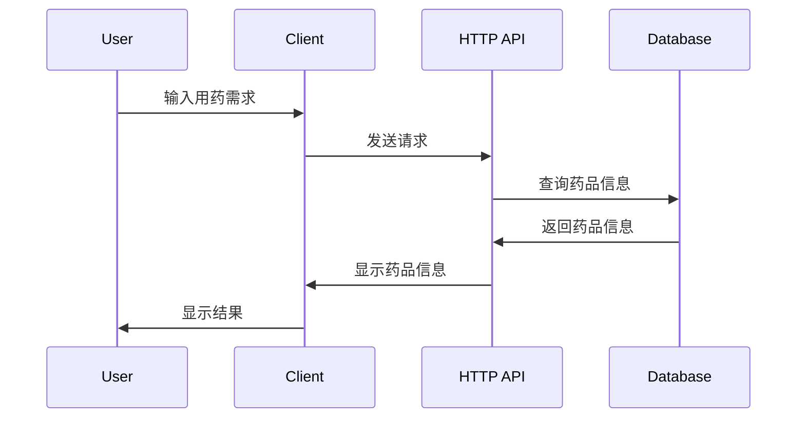
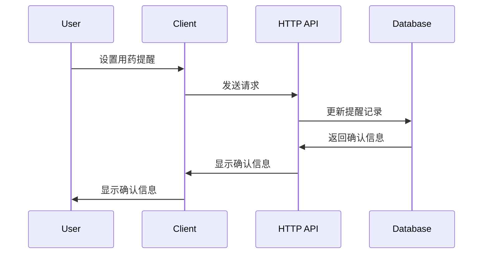

                 


# 智能药盒：AI Agent的用药提醒与管理系统

## 关键词：AI Agent, 智能药盒, 用药提醒, 系统管理, 机器学习, 自然语言处理, 系统架构

## 摘要：本文将详细介绍智能药盒的设计与实现过程，探讨AI Agent在用药提醒与管理系统中的应用。通过分析问题背景、核心概念、算法原理、系统架构以及项目实战，全面解析智能药盒的构建过程，帮助读者理解AI技术在医疗健康领域的创新应用。

---

# 第一部分: 智能药盒的背景与核心概念

## 第1章: 智能药盒的背景与问题背景

### 1.1 问题背景与问题描述

#### 1.1.1 药品管理与用药提醒的现状
现代生活中，许多人需要长期服药，尤其是慢性病患者。传统药盒管理方式存在以下问题：
- **遗忘风险**：用户可能忘记按时服药。
- **管理混乱**：药品种类多，难以分类和记录。
- **信息孤岛**：药品信息分散，缺乏统一的管理平台。

#### 1.1.2 传统药盒管理的痛点
传统药盒管理方式存在以下痛点：
- **手动记录**：需要用户手动记录用药时间，容易出错。
- **缺乏提醒**：无法主动提醒用户服药。
- **信息不整合**：药品信息和用药记录无法有效整合。

#### 1.1.3 AI Agent在药盒管理中的应用价值
AI Agent（人工智能代理）可以通过以下方式解决上述问题：
- **智能提醒**：主动提醒用户用药时间。
- **数据分析**：分析用药记录，提供个性化建议。
- **信息整合**：整合药品信息和用药记录，提供统一管理平台。

### 1.2 智能药盒的解决方案

#### 1.2.1 AI Agent的核心作用
AI Agent在智能药盒中的核心作用包括：
- **主动提醒**：通过自然语言处理技术，提供个性化的用药提醒。
- **数据分析**：通过机器学习模型，分析用药记录，优化用药计划。
- **信息整合**：整合药品信息和用药记录，提供统一的管理平台。

#### 1.2.2 智能药盒的功能定位
智能药盒的功能定位为：
- **用药提醒**：通过AI Agent主动提醒用户用药时间。
- **药品管理**：帮助用户分类和记录药品信息。
- **数据分析**：分析用药记录，提供个性化建议。

#### 1.2.3 解决方案的边界与外延
解决方案的边界包括：
- **用户范围**：适用于需要长期服药的用户。
- **功能范围**：仅限于用药提醒和药品管理。
- **技术范围**：基于AI Agent的技术实现。

### 1.3 智能药盒的核心要素与概念结构

#### 1.3.1 核心概念与属性对比
以下是智能药盒的核心概念对比表：

| 实体 | 属性 |
|------|------|
| 用户 | 用户ID、用户名、年龄、联系方式 |
| 药品 | 药品ID、药品名称、剂量、生产日期、有效期 |
| 提醒记录 | 记录ID、用户ID、药品ID、提醒时间、提醒状态 |

#### 1.3.2 智能药盒的实体关系图
以下是智能药盒的实体关系图：

```mermaid
entity User {
  id: int
  name: string
  age: int
  email: string
}
entity Medicine {
  id: int
  name: string
  dosage: string
  expiry_date: date
}
entity Reminder {
  id: int
  user_id: int
  medicine_id: int
  reminder_time: datetime
  status: string
}
```

## 第2章: AI Agent的核心概念与技术原理

### 2.1 AI Agent的基本原理

#### 2.1.1 AI Agent的定义与特点
AI Agent是一种能够感知环境并采取行动以实现目标的智能体。其特点包括：
- **自主性**：能够在没有外部干预的情况下运行。
- **反应性**：能够根据环境变化调整行为。
- **学习能力**：能够通过数据学习优化自身行为。

#### 2.1.2 AI Agent的分类与应用场景
AI Agent的分类包括：
- **简单反射型**：基于规则的反应式代理。
- **基于模型的反射型**：基于内部模型的反应式代理。
- **目标驱动型**：基于目标的规划式代理。

### 2.2 AI Agent的关键技术

#### 2.2.1 自然语言处理技术
自然语言处理技术用于AI Agent与用户之间的交互。例如，用户可以通过语音或文本输入用药需求，AI Agent通过自然语言处理技术理解用户意图。

#### 2.2.2 机器学习模型
机器学习模型用于分析用药记录，优化用药计划。例如，可以通过支持向量机（SVM）或决策树（Decision Tree）模型进行分类。

#### 2.2.3 知识图谱与推理引擎
知识图谱用于存储药品信息和用药知识，推理引擎用于基于知识图谱进行推理。

### 2.3 AI Agent的算法原理

#### 2.3.1 算法流程图
以下是AI Agent的算法流程图：



#### 2.3.2 支持向量机（SVM）模型
以下是支持向量机（SVM）模型的数学公式：

$$
\text{目标函数} = \sum_{i=1}^{n} \sum_{j=1}^{m} \alpha_{ij} y_i y_j \langle x_i, x_j \rangle + C \sum_{i=1}^{n} \xi_i
$$

其中：
- $\alpha_{ij}$ 是拉格朗日乘子。
- $y_i$ 是样本标签。
- $\langle x_i, x_j \rangle$ 是内积。
- $C$ 是惩罚系数。
- $\xi_i$ 是松弛变量。

#### 2.3.3 决策树（Decision Tree）模型
以下是决策树（Decision Tree）模型的数学公式：

$$
\text{决策树} = \sum_{i=1}^{n} \text{信息增益} \times \text{分裂节点}
$$

其中：
- $\text{信息增益}$ 是分裂节点的信息增益值。
- $\text{分裂节点}$ 是分裂节点的条件。

---

# 第二部分: 智能药盒的系统设计与实现

## 第3章: 系统分析与架构设计

### 3.1 系统场景介绍
智能药盒的系统场景包括：
- **用户注册与登录**：用户可以通过手机或电脑注册并登录系统。
- **药品信息录入**：用户可以录入药品信息，包括药品名称、剂量、生产日期和有效期。
- **用药提醒设置**：用户可以设置用药提醒时间。
- **用药记录查询**：用户可以查询用药记录。

### 3.2 系统功能设计

#### 3.2.1 领域模型设计
以下是领域模型设计：



#### 3.2.2 系统架构设计
以下是系统架构设计：


### 3.3 系统接口设计

#### 3.3.1 用户接口设计
以下是用户接口设计：



#### 3.3.2 系统交互设计
以下是系统交互设计：



---

## 第4章: 项目实战与实现

### 4.1 环境安装与配置

#### 4.1.1 系统环境
建议使用以下系统环境：
- **操作系统**：Windows 10 或更高版本，macOS 10.15 或更高版本，Linux（Ubuntu 20.04 或更高版本）。
- **Python版本**：Python 3.8 或更高版本。
- **依赖管理工具**：pip。

#### 4.1.2 安装依赖
运行以下命令安装依赖：

```bash
pip install Flask
pip install numpy
pip install scikit-learn
pip install spacy
```

### 4.2 系统核心实现

#### 4.2.1 自然语言处理实现
以下是自然语言处理实现的Python代码：

```python
import spacy

nlp = spacy.load("en_core_web_sm")

def process_input(text):
    doc = nlp(text)
    entities = []
    for ent in doc.ents:
        entities.append((ent.text, ent.label_))
    return entities

text = "Take metformin at 8 AM and 8 PM daily."
print(process_input(text))
```

#### 4.2.2 机器学习模型实现
以下是机器学习模型实现的Python代码：

```python
from sklearn import tree

# 训练数据
X = [[0, 0], [0, 1], [1, 0], [1, 1]]
y = [0, 1, 1, 1]

# 创建决策树模型
clf = tree.DecisionTreeClassifier()
clf.fit(X, y)

# 预测新数据
new_data = [[0, 0]]
print(clf.predict(new_data))
```

### 4.3 项目实战与案例分析

#### 4.3.1 案例分析
以下是案例分析：

假设用户需要每天服用两种药物，A药和B药，分别在早上和晚上服用。用户通过智能药盒设置用药提醒，AI Agent通过自然语言处理技术理解用户需求，并通过机器学习模型优化用药计划。

#### 4.3.2 代码解读与分析
以下是代码解读与分析：

- **自然语言处理代码**：使用spaCy进行实体识别，提取药品名称和剂量信息。
- **机器学习模型代码**：使用Scikit-learn中的决策树模型进行分类，预测用药时间。

### 4.4 项目小结

---

## 第5章: 最佳实践与系统优化

### 5.1 小结与总结

#### 5.1.1 系统小结
智能药盒系统通过AI Agent实现用药提醒和药品管理，解决了传统药盒管理的痛点。系统设计包括背景介绍、核心概念、算法原理、系统架构和项目实战。

#### 5.1.2 系统总结
AI Agent在智能药盒中的应用为用户提供了智能化的用药管理方式，通过自然语言处理技术和机器学习模型优化了用药计划，提高了用药依从性。

### 5.2 注意事项与使用建议

#### 5.2.1 注意事项
- **数据隐私**：用户数据需要加密存储，确保隐私安全。
- **系统稳定性**：确保系统稳定运行，避免数据丢失。
- **用户体验**：优化用户界面，提高用户体验。

#### 5.2.2 使用建议
- **定期备份**：定期备份数据，防止数据丢失。
- **系统更新**：定期更新系统，修复漏洞。
- **用户培训**：对用户进行培训，提高用户使用效率。

### 5.3 拓展阅读与深入学习

#### 5.3.1 拓展阅读
- **自然语言处理**：深入学习自然语言处理技术，如BERT模型。
- **机器学习模型**：深入学习机器学习模型，如深度学习模型。

#### 5.3.2 深入学习
- **知识图谱**：深入学习知识图谱构建技术。
- **推理引擎**：深入学习推理引擎实现技术。

---

# 作者：AI天才研究院 & 禅与计算机程序设计艺术

