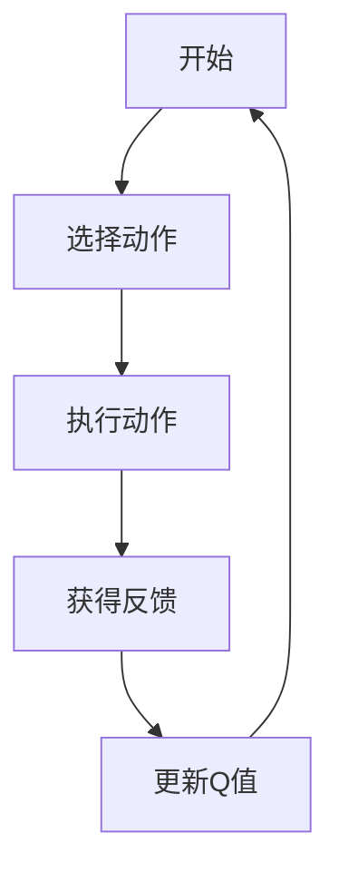

                 


# 智能药盒：AI Agent的用药提醒系统

> 关键词：AI Agent, 智能药盒, 用药提醒系统, 机器学习, 智能提醒

> 摘要：本文探讨了AI Agent在智能药盒中的应用，分析了用药提醒系统的实现原理，结合实际案例，详细讲解了系统设计与实现过程，旨在为开发者提供参考。

---

# 目录大纲：《智能药盒：AI Agent的用药提醒系统》

## 第一部分：AI Agent与智能药盒的背景介绍

### 第1章：AI Agent与智能药盒概述

#### 1.1 AI Agent的基本概念
- 1.1.1 AI Agent的定义与特点
- 1.1.2 AI Agent的核心功能与应用场景
- 1.1.3 智能药盒的定义与功能

#### 1.2 智能药盒的背景与问题背景
- 1.2.1 药物管理问题的现状
- 1.2.2 智能药盒的必要性与目标
- 1.2.3 智能药盒的边界与外延

#### 1.3 AI Agent在智能药盒中的作用
- 1.3.1 AI Agent如何提升用药提醒效率
- 1.3.2 AI Agent在智能药盒中的核心任务
- 1.3.3 AI Agent与智能药盒的结合方式

---

## 第二部分：AI Agent的核心概念与原理

### 第2章：AI Agent的核心概念与联系

#### 2.1 AI Agent的核心概念
- 2.1.1 AI Agent的感知模块
- 2.1.2 AI Agent的决策模块
- 2.1.3 AI Agent的执行模块

#### 2.2 AI Agent与智能药盒的关系
- 2.2.1 AI Agent在智能药盒中的角色
- 2.2.2 智能药盒的实体关系图

```mermaid
er
    actor 用户
    actor 医生
    actor 药盒
    actor 系统
    user --> 医生: 提供用药信息
    医生 --> 药盒: 设置用药提醒
    药盒 --> 系统: 执行提醒任务
```

---

## 第三部分：AI Agent的算法原理

### 第3章：AI Agent的算法原理

#### 3.1 状态表示
- 3.1.1 状态空间的定义
- 3.1.2 状态转移的数学模型
- 3.1.3 示例：用药提醒的状态表示

#### 3.2 行为选择
- 3.2.1 Q-learning算法
- 3.2.2 算法流程图



---

## 第四部分：系统分析与架构设计

### 第4章：系统分析与架构设计

#### 4.1 问题场景介绍
- 4.1.1 用户需求分析
- 4.1.2 系统目标与范围
- 4.1.3 问题场景描述

#### 4.2 系统功能设计
- 4.2.1 用户管理
- 4.2.2 用药提醒
- 4.2.3 数据记录与分析

#### 4.3 系统架构设计
- 4.3.1 系统架构图

```mermaid
graph TD
    User --> AI-Agent: 发出提醒请求
    AI-Agent --> Database: 查询用药信息
    Database --> AI-Agent: 返回用药信息
    AI-Agent --> Notification: 发送提醒
    Notification --> User: 提醒弹出
```

---

## 第五部分：项目实战

### 第5章：项目实战

#### 5.1 环境安装与配置
- 5.1.1 安装Python与相关库
- 5.1.2 安装AI框架（如TensorFlow）

#### 5.2 系统核心实现
- 5.2.1 AI-Agent的实现
- 5.2.2 用药提醒的触发逻辑

#### 5.3 代码实现与解读
- 5.3.1 核心代码示例
- 5.3.2 代码功能分析

#### 5.4 实际案例分析
- 5.4.1 案例背景
- 5.4.2 系统运行流程
- 5.4.3 数据分析与结果解读

---

## 第六部分：总结与展望

### 第6章：总结与展望

#### 6.1 最佳实践 tips
- 6.1.1 开发建议
- 6.1.2 使用注意事项
- 6.1.3 拓展阅读推荐

#### 6.2 小结
- 6.2.1 本文核心内容回顾
- 6.2.2 未来发展方向展望

---

## 作者：AI天才研究院 & 禅与计算机程序设计艺术

---

这篇目录大纲详细涵盖了《智能药盒：AI Agent的用药提醒系统》的核心内容，从背景介绍到项目实战，逻辑清晰，结构紧凑，适合专业技术人员阅读和参考。

