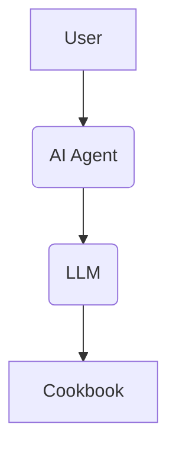
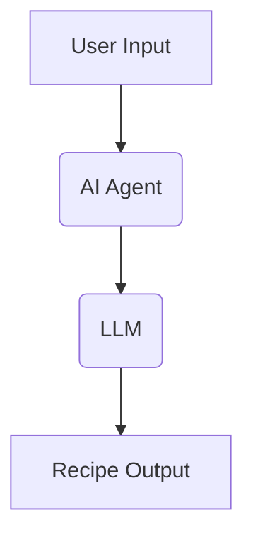
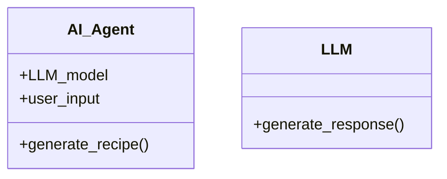
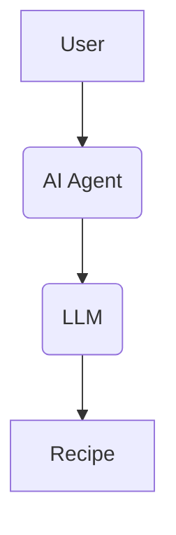
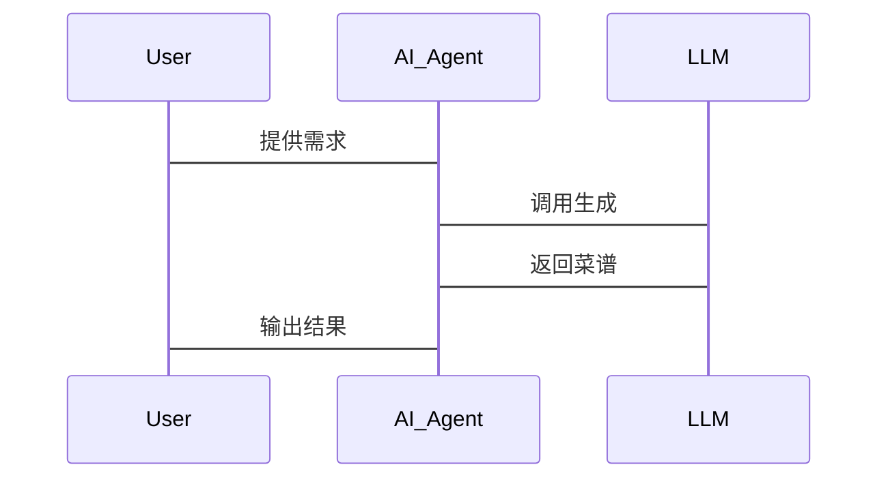

                 


# 智能菜谱生成 AI Agent：LLM 辅助烹饪创新

## 关键词：智能菜谱生成，AI Agent，LLM，烹饪创新，大语言模型

## 摘要：  
本文探讨了如何利用大语言模型（LLM）构建智能菜谱生成 AI Agent，通过自然语言处理技术实现个性化菜谱推荐与创新。文章从背景介绍、核心概念、算法原理、系统架构设计、项目实战到最佳实践，全面解析了LLM在烹饪创新中的应用，为读者提供了从理论到实践的深度指导。

---

## 第一部分: 智能菜谱生成 AI Agent 的背景与概述

### 第1章: 智能菜谱生成的背景与问题描述

#### 1.1 智能菜谱生成的背景
随着人们对个性化饮食需求的增加，传统的菜谱生成工具已经难以满足多样化的需求。AI技术的快速发展为烹饪创新提供了新的可能性，特别是大语言模型（LLM）的出现，使得菜谱生成更加智能化、个性化。

#### 1.2 问题背景与描述
- **烹饪过程中的信息处理挑战**：传统菜谱生成工具依赖固定的数据库，难以根据用户需求实时生成个性化菜谱。
- **用户对个性化菜谱的需求**：现代用户不仅追求美食，还希望菜谱能够根据口味偏好、食材可用性或健康需求进行调整。
- **现有菜谱生成工具的局限性**：传统工具缺乏灵活性和智能化，无法实时优化菜谱或提供创新建议。

#### 1.3 问题解决与边界
- **目标**：通过AI Agent结合LLM技术，实现智能化菜谱生成与优化。
- **边界**：仅关注基于文本的菜谱生成，不涉及实际烹饪过程。
- **核心要素**：AI Agent作为接口，LLM作为核心生成模块，结合用户需求和食材信息进行菜谱生成。

### 第2章: AI Agent与LLM的核心概念

#### 2.1 AI Agent的基本原理
- **定义与分类**：AI Agent是能够感知环境并采取行动以实现目标的智能体。
- **LLM在AI Agent中的作用**：LLM作为生成模块，负责文本的自然语言处理和生成。
- **与传统菜谱生成工具的区别**：AI Agent更具灵活性和智能化，能够实时适应用户需求。

#### 2.2 LLM的工作原理
- **大语言模型的训练机制**：通过大量数据的预训练，模型学习了语言的结构和语义。
- **模型的输入输出机制**：用户输入需求，模型输出生成的菜谱。
- **生成过程**：LLM通过概率分布生成文本，结合上下文和用户需求优化生成结果。

#### 2.3 AI Agent与LLM的联系
- **AI Agent作为LLM的接口**：AI Agent接收用户输入，并将需求传递给LLM。
- **LLM作为核心模块**：AI Agent调用LLM生成菜谱。
- **应用场景**：通过AI Agent与LLM的结合，实现个性化的菜谱生成和创新。

---

## 第二部分: 智能菜谱生成 AI Agent 的核心概念与联系

### 第3章: 核心概念的原理与对比

#### 3.1 核心概念原理
- **AI Agent的决策机制**：基于用户输入和LLM生成结果，AI Agent选择最优菜谱方案。
- **LLM的文本生成算法**：通过自然语言处理技术生成多样化的菜谱内容。
- **菜谱生成的逻辑框架**：从用户需求到菜谱生成，AI Agent协调LLM完成任务。

#### 3.2 核心概念的对比分析
| 对比维度 | AI Agent | LLM |
|----------|-----------|-----|
| 功能     | 协调LLM与用户交互 | 生成文本 |
| 作用     | 中介角色 | 核心生成模块 |
| 依赖     | 依赖LLM的生成能力 | 依赖AI Agent的接口 |

#### 3.3 ER实体关系图


---

## 第三部分: 智能菜谱生成 AI Agent 的算法原理

### 第4章: 算法原理的详细讲解

#### 4.1 算法原理概述
大语言模型通过预训练掌握语言规律，生成符合语义的文本。AI Agent根据用户需求调用LLM生成菜谱。

#### 4.2 生成过程


#### 4.3 Python代码实现
```python
import transformers

# 初始化LLM模型
model = transformers.AutoModelForCausalLM.from_pretrained('gpt2')
tokenizer = transformers.AutoTokenizer.from_pretrained('gpt2')

# 生成菜谱
def generate_recipe(user_input):
    inputs = tokenizer(user_input, return_tensors='np')
    outputs = model.generate(**inputs, max_length=150)
    recipe = tokenizer.decode(outputs[0], skip_special_tokens=True)
    return recipe

# 示例
user_input = "我想要一个低脂高蛋白的晚餐菜谱。"
print(generate_recipe(user_input))
```

#### 4.4 数学模型
$$ P(word|context) = \frac{P(word, context)}{P(context)} $$

---

## 第四部分: 智能菜谱生成 AI Agent 的系统架构设计

### 第5章: 系统架构的详细设计

#### 5.1 项目背景
构建一个基于AI Agent和LLM的智能菜谱生成系统，满足用户的个性化需求。

#### 5.2 功能设计


#### 5.3 系统架构设计


#### 5.4 接口与交互


---

## 第五部分: 智能菜谱生成 AI Agent 的项目实战

### 第6章: 项目实战

#### 6.1 环境安装
```bash
pip install transformers
```

#### 6.2 核心代码实现
```python
import transformers

class AI_Agent:
    def __init__(self):
        self.model = transformers.AutoModelForCausalLM.from_pretrained('gpt2')
        self.tokenizer = transformers.AutoTokenizer.from_pretrained('gpt2')

    def generate_recipe(self, user_input):
        inputs = self.tokenizer(user_input, return_tensors='np')
        outputs = self.model.generate(**inputs, max_length=150)
        return self.tokenizer.decode(outputs[0], skip_special_tokens=True)

# 示例
agent = AI_Agent()
print(agent.generate_recipe("我想要一个适合素食主义者的午餐菜谱。"))
```

#### 6.3 案例分析
用户输入：“我想要一个适合素食主义者的午餐菜谱。”  
生成输出：“建议您尝试制作一份素食沙拉，主要食材包括生菜、黄瓜、樱桃番茄和牛油果。您可以添加一些坚果碎和香草调味料，提升口感。”

#### 6.4 项目小结
通过AI Agent与LLM的结合，实现了智能化的菜谱生成，满足用户的个性化需求。

---

## 第六部分: 智能菜谱生成 AI Agent 的最佳实践

### 第7章: 最佳实践

#### 7.1 小结
本文详细介绍了AI Agent与LLM在智能菜谱生成中的应用，展示了从理论到实践的完整流程。

#### 7.2 注意事项
- 确保模型的可解释性
- 处理好用户隐私问题
- 优化生成结果的准确性

#### 7.3 拓展阅读
- 《Large Language Models in AI》
- 《Deep Learning for Natural Language Processing》

---

## 作者信息

作者：AI天才研究院/AI Genius Institute & 禅与计算机程序设计艺术 /Zen And The Art of Computer Programming

