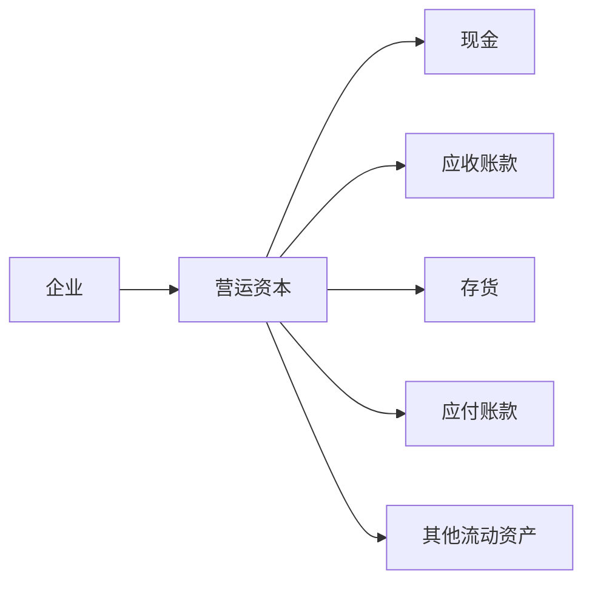
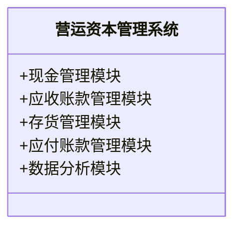

                 


# 智能营运资本管理优化系统

> 关键词：智能营运资本管理，优化系统，人工智能，算法，系统架构

> 摘要：本文探讨了智能营运资本管理优化系统的设计与实现，结合背景介绍、核心概念、算法原理、系统架构、项目实战和最佳实践，深入剖析系统的优化目标、实现路径及实际应用价值。

---

## 第一部分：背景介绍

### 第1章：智能营运资本管理的背景与目标

#### 1.1 智能营运资本管理的定义
- 营运资本管理是指对企业日常运营中使用的资金进行计划、控制和优化，以提高资金使用效率。
- 智能化管理通过人工智能技术，实现数据驱动的自动化决策。

#### 1.2 问题背景
- 传统营运资本管理依赖人工经验，效率低且易出错。
- 数据量爆炸式增长，人工分析难以应对复杂场景。
- 企业需要实时优化，传统方法难以满足动态需求。

#### 1.3 目标与意义
- 目标：通过智能系统实现营运资本的动态优化，降低资金成本，提高运营效率。
- 意义：提升企业竞争力，增强财务稳健性。

---

## 第二部分：核心概念与联系

### 第2章：核心概念解析

#### 2.1 数据来源与处理
- 数据来源：财务报表、业务系统日志、外部市场数据。
- 数据处理：清洗、转换、特征提取，为模型提供高质量输入。

#### 2.2 优化模型与算法
- 线性规划：用于确定性优化问题。
- 机器学习：预测现金流、风险评估。
- 深度学习：复杂模式识别。

#### 2.3 系统架构与功能模块
- 模块划分：数据采集、分析引擎、优化模块、反馈机制。
- 功能联系：数据输入 → 分析 → 优化 → 输出结果。

### 第3章：概念对比分析

#### 3.1 数据特征对比
| 数据类型 | 特征描述 | 示例 |
|----------|----------|------|
| 现金流   | 时间序列 | 每日现金流数据 |
| 应收账款 | 账期与金额 | 客户付款周期 |

#### 3.2 算法性能对比
| 算法     | 优点       | 缺点         |
|----------|------------|-------------|
| 线性规划  | 简单高效   | 适用于线性问题 |
| 机器学习 | 高精度     | 需大量数据   |

### 第4章：实体关系图



---

## 第三部分：算法原理讲解

### 第4章：算法原理

#### 4.1 线性规划模型
- 目标函数：$\min \sum c_j x_j$
- 约束条件：$\sum a_{ij} x_j \geq b_i$

#### 4.2 机器学习模型
- 预测模型：$y = \sum w_j x_j + b$
- 训练过程：最小化损失函数，调整权重参数。

#### 4.3 流程图


---

## 第四部分：系统分析与架构设计

### 第5章：系统功能设计

#### 5.1 功能模块
- 数据采集模块：实时采集财务数据。
- 分析引擎：利用算法进行预测与分析。
- 优化模块：生成优化方案。
- 反馈机制：监控结果并调整模型。

#### 5.2 系统架构图



---

## 第五部分：项目实战

### 第6章：项目实战

#### 6.1 环境安装
- 安装Python、机器学习库（如scikit-learn）和数据分析工具（如Pandas）。

#### 6.2 核心代码实现

```python
import pandas as pd
from sklearn.linear_model import LinearRegression

# 数据加载
data = pd.read_csv('operating_capital.csv')

# 模型训练
model = LinearRegression()
model.fit(data[['feature1', 'feature2']], data['target'])

# 预测与优化
predictions = model.predict(new_data)
```

#### 6.3 案例分析
- 通过具体案例展示系统如何优化营运资本，提升资金使用效率。

---

## 第六部分：最佳实践与总结

### 第7章：总结与展望

#### 7.1 总结
- 智能营运资本管理通过技术手段实现高效优化。
- 系统设计的关键在于数据处理、算法选择和架构优化。

#### 7.2 展望
- 结合更多AI技术，如强化学习，提升优化效果。
- 数据隐私保护与系统安全需进一步加强。

---

## 作者信息

作者：AI天才研究院/AI Genius Institute & 禅与计算机程序设计艺术 /Zen And The Art of Computer Programming

---

这篇文章系统地介绍了智能营运资本管理优化系统的各个方面，从背景到算法，再到实际应用，为读者提供了全面的知识框架和实践指导。

