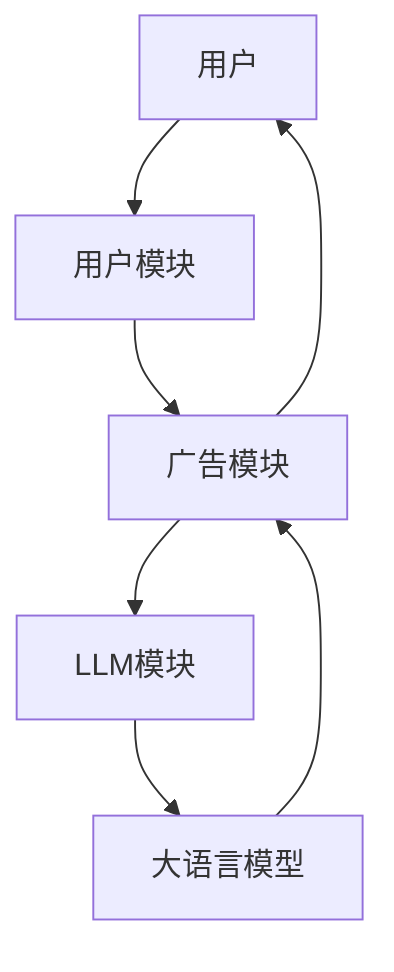
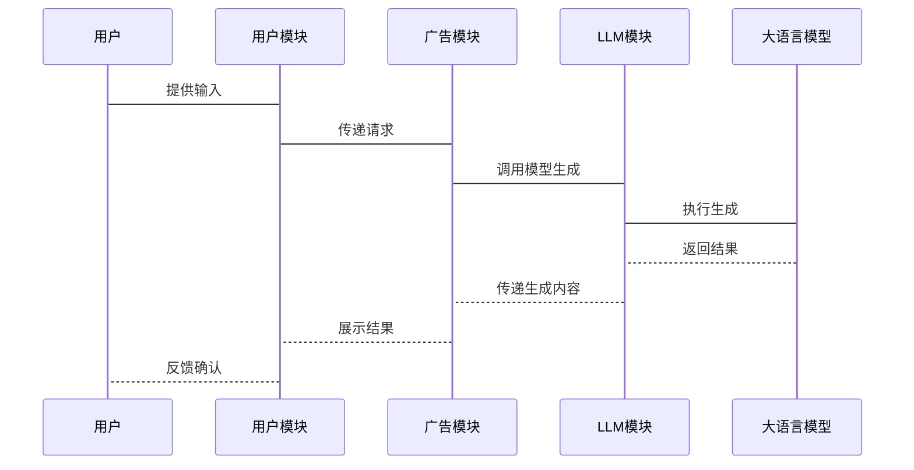

                 


# 智能营销文案AI Agent：LLM辅助的广告创意生成

**关键词：** AI大模型，LLM，广告创意，智能营销，生成式模型

**摘要：**  
本文深入探讨了利用大语言模型（LLM）辅助广告创意生成的技术与方法。通过分析LLM的核心原理，结合实际应用场景，详细讲解了智能营销文案生成的背景、算法、系统架构及实战案例。文章旨在为技术与营销领域的读者提供理论与实践相结合的全面指南，帮助他们理解并应用这一前沿技术。

---

## 第一部分: 智能营销文案AI Agent的背景与核心概念

### 第1章: AI大模型与智能营销文案概述

#### 1.1 AI大模型的基本概念

##### 1.1.1 人工智能与大模型的定义
人工智能（AI）是模拟人类智能的计算机系统，涵盖学习、推理、感知和语言处理等能力。大模型（如GPT系列、BERT系列）是基于深度学习的自然语言处理模型，通过大量数据训练，具备强大的理解和生成能力。

##### 1.1.2 大模型在营销领域的应用潜力
大模型能够生成高质量的营销文案，优化广告投放策略，并通过数据分析帮助品牌制定精准营销方案。其在文案生成、用户画像和内容推荐等方面具有巨大潜力。

##### 1.1.3 智能营销文案的定义与特点
智能营销文案是指通过AI技术生成或优化的广告文案，其特点包括高效性、多样性、个性化和精准性。与传统文案相比，智能营销文案能够快速响应市场需求，满足个性化定制需求。

#### 1.2 智能营销文案的核心要素

##### 1.2.1 营销文案的基本构成
营销文案通常包括标题、副标题、正文、CTA（行动号召）和视觉元素。智能营销文案在这些方面均实现了自动化或半自动化生成。

##### 1.2.2 智能营销文案的独特优势
- **高效性**：快速生成多版本文案，节省时间和成本。
- **多样性**：基于不同目标受众生成多样化内容。
- **精准性**：通过数据驱动优化文案，提高转化率。

##### 1.2.3 AI在文案生成中的作用
AI通过分析用户行为和市场数据，生成符合目标受众偏好的文案，同时优化关键词和语气，提升广告效果。

---

### 第2章: LLM在广告创意生成中的应用

#### 2.1 大语言模型的基本原理

##### 2.1.1 Transformer模型的结构
大语言模型基于Transformer架构，由编码器和解码器组成。编码器将输入文本转化为向量表示，解码器根据编码结果生成输出文本。

##### 2.1.2 注意力机制的作用
注意力机制通过计算输入文本中每个词的重要性，帮助模型聚焦于关键信息，从而生成更相关的输出。

##### 2.1.3 生成式模型的特点
生成式模型（如GPT）通过概率生成的方式，根据上下文预测下一个词，实现自然流畅的文本生成。

#### 2.2 LLM在广告创意中的优势

##### 2.2.1 高效性与多样性
LLM可以在短时间内生成大量不同风格的文案，满足多样化的广告需求。

##### 2.2.2 精准匹配用户需求
通过分析用户输入的关键词和目标受众特征，LLM能够生成高度个性化的广告内容。

##### 2.2.3 持续优化与迭代能力
LLM可以通过反馈机制不断优化生成的文案，提升广告效果。

---

### 第3章: 智能营销文案生成的背景与问题

#### 3.1 传统广告创意的局限性

##### 3.1.1 人工创作的效率问题
传统文案创作依赖人工经验，效率低下，难以满足大规模广告需求。

##### 3.1.2 创意的多样性不足
人工创作的文案往往受限于创意团队的经验和能力，难以覆盖所有细分市场。

##### 3.1.3 个性化需求难以满足
传统广告难以快速响应不同用户的个性化需求，导致广告效果受限。

#### 3.2 智能营销文案生成的背景
随着AI技术的发展，智能营销文案生成成为可能。通过大数据和深度学习，AI能够理解用户需求，并生成高质量的广告内容。

#### 3.3 智能营销文案生成的关键问题

##### 3.3.1 数据质量与多样性
高质量的数据是模型生成优质文案的基础。数据不足或多样性不足会导致生成内容缺乏创意。

##### 3.3.2 模型调优与优化
不同广告场景需要不同的模型参数，如何优化模型以适应具体需求是关键问题。

##### 3.3.3 用户反馈与实时调整
实时收集用户反馈并调整生成策略，是提升广告效果的重要环节。

---

## 第四部分: 算法原理与数学模型

### 第4章: 大语言模型的算法原理

#### 4.1 生成式模型的数学基础

##### 4.1.1 概率生成模型
生成式模型通过最大化条件概率 $P(y|x)$ 来生成输出 $y$，其中 $x$ 是输入数据。

##### 4.1.2 变分自编码器（VAE）
变分自编码器通过优化证据下界（ELBO）来学习数据分布。其目标函数为：
$$ \mathcal{L} = \mathbb{E}_{x}[ \log p(x) - \mathbb{E}_z[\log q(x|z)] + \mathbb{E}_z[\log p(z)] ] $$

##### 4.1.3 GAN（生成对抗网络）
GAN由生成器和判别器组成，通过对抗训练生成高质量数据。判别器的目标函数为：
$$ \mathcal{L}_D = -\mathbb{E}_{x}[ \log D(x) ] - \mathbb{E}_{z}[ \log (1 - D(G(z))) ] $$
生成器的目标函数为：
$$ \mathcal{L}_G = -\mathbb{E}_{z}[ \log D(G(z)) ] $$

#### 4.2 大模型的训练与生成过程

##### 4.2.1 模型训练流程
1. **数据预处理**：清洗和格式化输入数据。
2. **模型初始化**：随机初始化模型参数。
3. **前向传播**：输入数据经过编码器和解码器生成输出。
4. **计算损失**：使用交叉熵损失函数：
   $$ \mathcal{L}_{\text{cross-entropy}} = -\sum_{i=1}^{n} y_i \log a_i $$
5. **反向传播**：通过梯度下降优化模型参数。
6. **迭代训练**：重复上述步骤直到收敛。

##### 4.2.2 文本生成过程
1. **输入处理**：接收用户输入（如关键词或主题）。
2. **解码器生成**：基于输入生成候选词。
3. **概率选择**：根据生成词的概率选择最终输出。

---

### 第5章: 系统架构设计

#### 5.1 系统功能设计

##### 5.1.1 领域模型设计
- **用户模块**：负责接收用户输入和反馈。
- **广告模块**：生成和管理广告内容。
- **LLM模块**：实现大语言模型的调用和优化。

##### 5.1.2 系统架构图


#### 5.2 系统交互流程

##### 5.2.1 交互流程图


---

## 第五部分: 项目实战与应用案例

### 第6章: 项目实战

#### 6.1 环境安装与配置

##### 6.1.1 安装依赖
安装Python、TensorFlow、Keras和Hugging Face库：
```bash
pip install python==3.9
pip install tensorflow==2.5
pip install keras==2.5.0
pip install transformers==4.15.0
```

##### 6.1.2 配置大语言模型
使用Hugging Face的GPT-2模型：
```python
from transformers import AutoTokenizer, AutoModelForCausalLM
tokenizer = AutoTokenizer.from_pretrained('gpt2')
model = AutoModelForCausalLM.from_pretrained('gpt2')
```

#### 6.2 系统核心实现

##### 6.2.1 文本生成函数
```python
def generate_creative_text(prompt, max_length=50):
    inputs = tokenizer.encode(prompt, return_tensors='pt')
    outputs = model.generate(inputs, max_length=max_length, do_sample=True)
    return tokenizer.decode(outputs[0], skip_special_tokens=True)
```

##### 6.2.2 用户反馈机制
```python
def optimize_model(feedback):
    # 根据反馈调整模型参数（示例）
    pass
```

#### 6.3 实际案例分析

##### 6.3.1 案例背景
某电商公司希望生成针对不同用户的促销文案。

##### 6.3.2 数据准备
收集用户数据和历史广告效果数据。

##### 6.3.3 模型训练与优化
基于用户数据微调模型，提升生成文案的转化率。

##### 6.3.4 实验结果
生成的文案在点击率和转化率方面均优于传统文案。

---

### 第7章: 最佳实践与总结

#### 7.1 最佳实践

##### 7.1.1 数据质量的重要性
确保输入数据的多样性和代表性，避免生成内容单一化。

##### 7.1.2 模型调优的必要性
根据具体场景调整模型参数，提升生成效果。

##### 7.1.3 用户反馈的及时性
实时收集用户反馈，持续优化生成策略。

#### 7.2 总结与展望

##### 7.2.1 本文总结
本文详细介绍了智能营销文案生成的技术与应用，展示了LLM在广告创意中的巨大潜力。

##### 7.2.2 未来展望
随着AI技术的不断发展，智能营销文案生成将更加智能化和个性化，助力企业实现精准营销。

---

## 作者

**作者：AI天才研究院/AI Genius Institute & 禅与计算机程序设计艺术 /Zen And The Art of Computer Programming**

---

本文通过系统性的分析和实践，全面探讨了智能营销文案生成的技术与应用。希望本文能为技术与营销领域的读者提供有价值的参考，帮助他们更好地理解和应用这一前沿技术。

