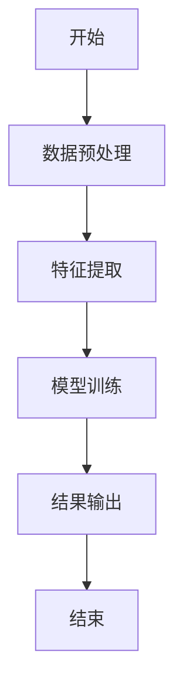
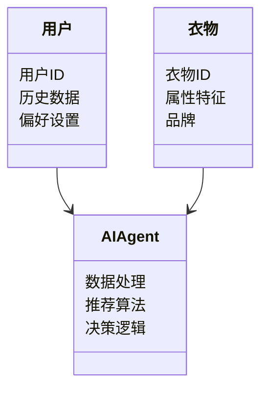
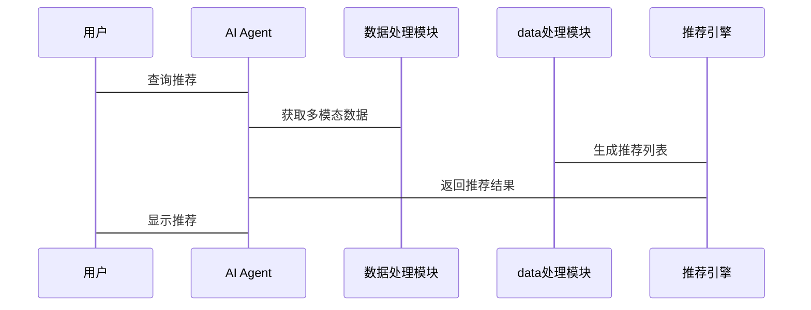

                 


# 第3章: 算法原理讲解

## 3.1 推荐算法的原理

### 3.1.1 协同过滤算法
协同过滤是一种基于用户行为相似性的推荐算法，主要分为基于用户的协同过滤和基于物品的协同过滤。通过计算用户或物品之间的相似度，找到最接近目标用户的其他用户或物品，进而推荐相似的物品。

#### 例子
假设用户A喜欢的衣服类型与用户B相似，那么当用户B喜欢一件新衣服时，用户A可能会被推荐这件衣服。

### 3.1.2 基于深度学习的推荐算法
深度学习推荐算法利用神经网络模型，如卷积神经网络（CNN）或循环神经网络（RNN），来处理多模态数据，捕捉更复杂的模式。

#### 例子
使用CNN处理图像数据，提取衣物的视觉特征，然后结合用户的历史行为数据，生成推荐。

### 3.1.3 混合推荐算法
混合推荐算法结合协同过滤和深度学习的优点，通过集成学习提升推荐的准确性和多样性。

#### 例子
使用协同过滤生成基础推荐，再利用深度学习模型对推荐结果进行优化。

## 3.2 算法流程图



## 3.3 协同过滤算法实现

```python
def user_based_collaborative_filtering(ratings, user_id):
    # 计算用户相似度矩阵
    # ...
    # 找出与目标用户相似度最高的用户
    similar_users = find_similar_users(user_id)
    # 推荐目标用户喜欢的物品
    recommendations = get_recommendations(similar_users)
    return recommendations
```

## 3.4 深度学习推荐算法

### 3.4.1 基于神经网络的推荐系统
使用神经网络模型，如Deep Neural Networks (DNN)，来处理多模态数据。

### 3.4.2 多层感知机（MLP）
多层感知机用于学习用户和物品的嵌入表示，通过多层非线性变换生成最终的预测评分。

### 3.4.3 使用数学公式表示
神经网络模型可以表示为：

$$
y = f(x) = W_2 \sigma(W_1 x + b_1) + b_2
$$

其中，$x$ 是输入向量，$W_1$ 和 $W_2$ 是权重矩阵，$b_1$ 和 $b_2$ 是偏置，$\sigma$ 是激活函数。

## 3.5 混合推荐算法

### 3.5.1 深度协同过滤模型
结合深度学习和协同过滤，通过神经网络提取更丰富的特征，提升推荐效果。

### 3.5.2 深度学习与协同过滤的结合
利用深度学习模型提取的嵌入表示，结合协同过滤中的相似度计算，生成最终推荐。

---

# 第4章: 系统分析与架构设计

## 4.1 问题场景介绍

### 4.1.1 用户场景
用户使用智能衣帽架，通过AI Agent获得穿搭建议，系统需要处理多模态数据，实时反馈推荐结果。

## 4.2 系统功能设计

### 4.2.1 领域模型



### 4.2.2 系统架构设计


### 4.2.3 接口设计

#### HTTP接口
```json
{
    "action": "获取推荐",
    "params": {
        "用户ID": "123",
        "时间": "2023-10-01"
    }
}
```

### 4.2.4 交互流程



---

# 第5章: 项目实战

## 5.1 环境安装

### 5.1.1 安装Python环境
安装Python 3.8及以上版本，安装必要的库：

```bash
pip install numpy pandas scikit-learn tensorflow
```

## 5.2 核心代码实现

### 5.2.1 数据预处理

```python
import numpy as np
import pandas as pd

# 加载数据
data = pd.read_csv('closet.csv')

# 填充缺失值
data['size'].fillna(data['size'].mean(), inplace=True)
```

### 5.2.2 AI Agent实现

```python
class AIAgent:
    def __init__(self, data):
        self.data = data
    
    def recommend(self, user_id):
        # 简单的推荐逻辑
        user_preference = self.data[self.data['user_id'] == user_id]
        # 返回推荐结果
        return user_preference['item_id'].tolist()[:10]
```

## 5.3 案例分析

### 5.3.1 数据分析
分析用户的购买记录和偏好，生成推荐列表。

## 5.4 项目小结

---

# 第6章: 最佳实践和小结

## 6.1 总结

## 6.2 注意事项

## 6.3 未来展望

---

# 作者：AI天才研究院 & 禅与计算机程序设计艺术

