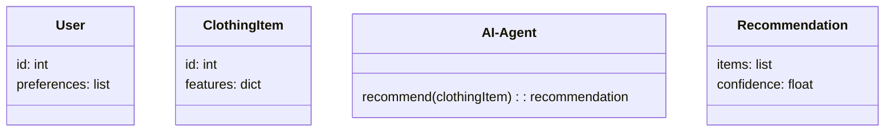
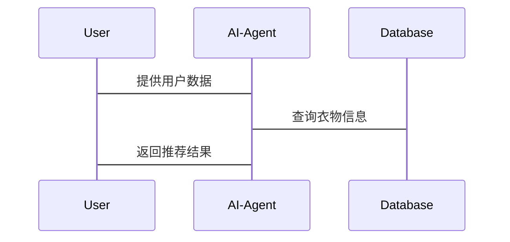

                 


# 智能衣帽架：AI Agent的穿衣风格顾问

> 关键词：智能衣帽架，AI Agent，穿衣风格，个性化推荐，协同过滤，深度学习

> 摘要：本文将详细介绍智能衣帽架的设计与实现，重点探讨AI Agent在穿衣风格顾问中的应用。通过分析问题背景、核心概念、算法原理、系统架构以及实际案例，本文将深入剖析如何利用人工智能技术实现个性化的穿衣建议，为用户提供高效、智能的穿衣解决方案。

---

# 第1章: 智能衣帽架的背景介绍

## 1.1 问题背景与需求分析

### 1.1.1 衣帽架的传统功能与局限性
传统衣帽架主要用于衣物的存放与展示，功能单一，无法满足用户对个性化穿衣搭配的需求。

### 1.1.2 智能化的需求与发展趋势
随着人工智能技术的发展，用户对衣物管理的智能化需求日益增长，AI Agent在衣帽架中的应用成为可能。

### 1.1.3 AI Agent在衣帽架中的应用潜力
通过AI Agent技术，智能衣帽架可以实现衣物的智能分类、搭配建议和个性化推荐。

## 1.2 问题描述与目标设定

### 1.2.1 衣着搭配与个人风格的需求
用户希望衣帽架能够根据自身风格推荐合适的衣物搭配。

### 1.2.2 用户行为分析与数据采集
通过分析用户的穿衣习惯和偏好，提取关键数据用于AI Agent的决策。

### 1.2.3 AI Agent的目标与功能定位
设计AI Agent的核心目标是为用户提供个性化的穿衣风格顾问服务。

## 1.3 问题解决与边界定义

### 1.3.1 AI Agent的核心功能设计
包括衣物分类、搭配推荐、个性化建议等功能。

### 1.3.2 穿衣风格顾问的实现边界
限定在基于用户数据的推荐系统，不涉及实际衣物的物理操作。

### 1.3.3 系统的可用性与性能指标
确保系统能够实时响应用户需求，推荐结果准确率高。

## 1.4 本章小结
本章介绍了智能衣帽架的背景，分析了用户需求，并明确了AI Agent的目标与功能。

---

# 第2章: AI Agent与穿衣风格顾问的核心概念

## 2.1 AI Agent的基本原理

### 2.1.1 AI Agent的定义与分类
AI Agent是一种能够感知环境并执行任务的智能体，可分为简单反射Agent和基于模型的反射Agent。

### 2.1.2 状态感知与行为决策
通过感知环境状态，AI Agent能够做出相应的决策并执行动作。

### 2.1.3 事件驱动的交互机制
AI Agent通过事件触发的方式与用户进行交互，实时响应用户需求。

## 2.2 穿衣风格顾问的实现原理

### 2.2.1 服装属性的特征提取
提取衣物的材质、颜色、款式等特征，为推荐系统提供基础数据。

### 2.2.2 用户偏好的建模方法
通过分析用户的历史数据，建立用户偏好的数学模型。

### 2.2.3 个性化推荐的算法框架
基于协同过滤和深度学习的推荐算法，为用户提供个性化的穿衣建议。

## 2.3 核心概念的联系与对比

### 2.3.1 AI Agent与传统推荐系统的区别
AI Agent具有更强的自主决策能力，能够实时感知环境变化。

### 2.3.2 穿衣风格顾问的特征与优势
基于用户数据的个性化推荐是穿衣风格顾问的核心优势。

### 2.3.3 系统功能与用户需求的匹配关系
AI Agent的功能设计紧密围绕用户的穿衣需求展开。

## 2.4 核心概念的数学模型与公式

### 2.4.1 用户偏好的向量表示
$$ u_i = [u_{i1}, u_{i2}, ..., u_{in}] $$

### 2.4.2 服装特征的相似度计算
$$ sim(i, j) = \frac{\sum_{k=1}^{m} w_{ijk}}{\sqrt{\sum_{k=1}^{m} w_{ijk}^2}} $$

### 2.4.3 推荐系统的评分预测公式
$$ \hat{r}_{ui} = \bar{r} + b_u + b_i + \sum_{j \in N(u)} w_{uj} (r_{uj} - \bar{r}) $$

## 2.5 核心概念的ER实体关系图

```mermaid
er
user: 用户
clothing_item: 服装物品
preference: 用户偏好
recommendation: 推荐结果
agent: AI Agent
```

---

# 第3章: AI Agent与穿衣风格顾问的算法原理

## 3.1 协同过滤算法的实现

### 3.1.1 基于用户的协同过滤
通过分析用户的相似性，推荐用户喜欢的衣物。

### 3.1.2 基于物品的协同过滤
通过分析衣物的相似性，推荐用户可能喜欢的衣物。

### 3.1.3 混合协同过滤算法
结合用户和物品的特征，提升推荐的准确性。

## 3.2 聚类分析算法的实现

### 3.2.1 用户聚类
将用户按照穿衣风格进行聚类，为不同用户提供个性化推荐。

### 3.2.2 物品聚类
将衣物按照风格进行聚类，提升推荐效率。

### 3.2.3 聚类算法的优缺点分析
聚类算法能够处理大规模数据，但对噪声敏感。

## 3.3 深度学习算法的实现

### 3.3.1 神经网络模型
通过卷积神经网络（CNN）提取衣物图像特征。

### 3.3.2 循环神经网络（RNN）
用于处理用户行为序列数据，提升推荐精度。

### 3.3.3 深度学习模型的训练流程
包括数据预处理、模型训练、评估与优化。

## 3.4 算法原理的代码实现

### 3.4.1 协同过滤算法的Python代码
```python
def collaborative_filtering(user_matrix):
    # 计算用户相似度
    user_similarity = user_matrix.T.dot(user_matrix)
    user_similarity[user_similarity < 0] = 0
    return user_similarity
```

### 3.4.2 聚类分析算法的Python代码
```python
from sklearn.cluster import KMeans

def clothing_clustering(items):
    # 特征提取
    features = extract_features(items)
    # 聚类
    kmeans = KMeans(n_clusters=5)
    kmeans.fit(features)
    return kmeans.labels_
```

### 3.4.3 深度学习模型的代码示例
```python
import torch
import torch.nn as nn

class ClothingRecommender(nn.Module):
    def __init__(self, input_size, hidden_size, output_size):
        super(ClothingRecommender, self).__init__()
        self.fc1 = nn.Linear(input_size, hidden_size)
        self.fc2 = nn.Linear(hidden_size, output_size)
    
    def forward(self, x):
        x = torch.relu(self.fc1(x))
        x = torch.sigmoid(self.fc2(x))
        return x
```

---

# 第4章: 智能衣帽架的系统架构设计

## 4.1 系统功能设计

### 4.1.1 领域模型设计


### 4.1.2 系统架构设计


### 4.1.3 系统交互设计


## 4.2 系统接口设计

### 4.2.1 用户接口设计
定义用户与系统交互的API接口，包括数据输入和输出格式。

### 4.2.2 系统内部接口设计
定义AI Agent与数据库之间的交互接口，确保数据流的高效传输。

### 4.2.3 接口设计的优缺点分析
良好的接口设计能够提升系统的可扩展性和可维护性。

---

# 第5章: 项目实战与案例分析

## 5.1 环境安装与配置

### 5.1.1 开发环境搭建
安装Python、TensorFlow、Scikit-learn等开发工具。

### 5.1.2 数据集准备
收集用户数据和衣物特征数据，进行预处理。

## 5.2 系统核心实现

### 5.2.1 AI Agent的实现
编写AI Agent的代码，实现衣物分类和搭配推荐功能。

### 5.2.2 推荐系统的实现
基于协同过滤和深度学习算法，实现个性化推荐功能。

## 5.3 代码应用解读与分析

### 5.3.1 协同过滤算法的代码解读
详细分析协同过滤算法的实现细节和优化方法。

### 5.3.2 深度学习模型的代码解读
解读深度学习模型的网络结构和训练流程。

## 5.4 实际案例分析

### 5.4.1 案例背景介绍
介绍一个实际的用户案例，展示系统的应用场景。

### 5.4.2 系统运行结果
展示推荐系统的输出结果，并进行分析。

### 5.4.3 案例分析总结
总结案例分析的结果，提出改进建议。

## 5.5 本章小结
本章通过实际案例分析，展示了AI Agent在穿衣风格顾问中的应用。

---

# 第6章: 总结与展望

## 6.1 核心观点总结

### 6.1.1 AI Agent的核心作用
AI Agent为智能衣帽架提供了智能化的决策能力。

### 6.1.2 穿衣风格顾问的实现价值
个性化推荐能够显著提升用户体验。

## 6.2 未来展望与挑战

### 6.2.1 技术发展展望
AI Agent和推荐系统的性能将进一步提升。

### 6.2.2 应用场景拓展
智能衣帽架的应用场景将更加广泛。

### 6.2.3 挑战与解决方案
数据隐私、计算资源等挑战需要进一步解决。

## 6.3 最佳实践Tips

### 6.3.1 数据处理建议
确保数据质量和完整性，避免信息丢失。

### 6.3.2 系统优化建议
优化算法模型，提升推荐效率和准确率。

### 6.3.3 用户体验建议
注重用户体验设计，提升系统的易用性。

## 6.4 小结
本文通过系统化的分析与实践，为智能衣帽架的设计与实现提供了有益的参考。

---

# 作者：AI天才研究院/AI Genius Institute & 禅与计算机程序设计艺术 /Zen And The Art of Computer Programming

