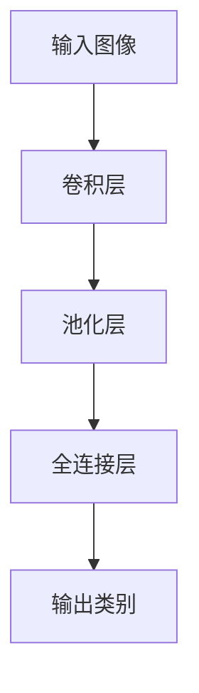
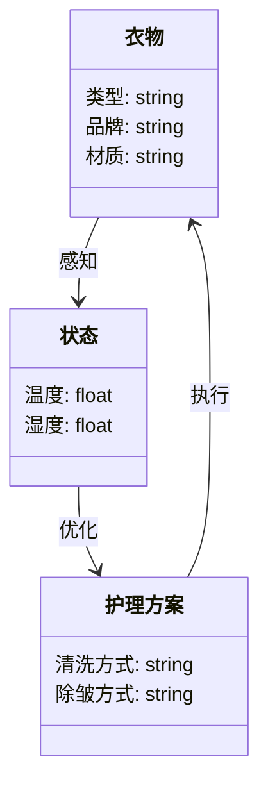

                 


# 智能衣架：AI Agent的衣物护理与除皱系统

## 关键词：智能衣架、AI Agent、衣物护理、除皱系统、机器学习、深度学习

## 摘要：  
随着人工智能技术的快速发展，衣物护理与除皱领域迎来了智能化的革新。本文深入探讨了基于AI Agent的智能衣架系统，结合衣物识别、状态感知、算法优化等技术，提出了高效的衣物护理与除皱解决方案。通过详细分析系统架构、算法原理和实际案例，本文为读者展示了如何利用AI技术提升衣物护理效率和效果。

---

## 第一部分: 背景介绍

## 第1章: 智能衣架与AI Agent概述

### 1.1 智能衣架的发展历程

#### 1.1.1 从传统衣架到智能衣架的演变  
传统衣架主要以悬挂衣物为主，功能单一。随着科技的进步，智能衣架逐渐融合传感器、AI算法等技术，能够感知衣物状态、优化护理方案并执行操作。

#### 1.1.2 AI Agent在智能衣架中的作用  
AI Agent（智能体）通过感知环境、自主决策和执行任务，为智能衣架提供了智能化的核心能力。它能够根据衣物的状态和环境条件，动态调整护理策略。

#### 1.1.3 智能衣架的市场前景  
随着人们对衣物护理需求的增加，智能衣架凭借其高效、精准的特点，逐渐成为智能家居的重要组成部分。

---

### 1.2 衣物护理与除皱的背景与挑战

#### 1.2.1 衣物护理的基本需求  
衣物护理包括清洗、晾晒、除皱等环节，传统方法效率低、效果差，难以满足多样化的需求。

#### 1.2.2 传统除皱方法的局限性  
传统除皱方法依赖人工经验，效率低且效果不稳定，难以应对复杂衣物材质和形状。

#### 1.2.3 AI Agent在衣物护理中的应用价值  
AI Agent能够通过感知衣物状态、优化护理方案，实现高效、精准的衣物护理与除皱。

---

## 第2章: AI Agent的基本原理

### 2.1 AI Agent的核心概念

#### 2.1.1 AI Agent的定义与特点  
AI Agent是一种能够感知环境、自主决策并执行任务的智能系统，具有自主性、反应性、目标性和学习性等特点。

#### 2.1.2 AI Agent的感知、决策与执行机制  
- **感知**：通过传感器或数据输入，获取环境信息。  
- **决策**：基于感知数据，利用算法生成最优决策。  
- **执行**：通过执行机构完成任务。

#### 2.1.3 AI Agent与传统衣物护理的区别  
AI Agent能够动态调整护理方案，实现个性化和精细化管理，而传统方法则依赖固定流程。

---

## 第3章: 衣物护理与除皱系统的ER实体关系图

### 3.1 实体关系图分析

```mermaid
er
  entity 衣物 {
    key 属性: 类型, 品牌
    other 属性: 材质, 颜色
  }

  entity 状态 {
    key 属性: 温度, 湿度
    other 属性: 时间
  }

  entity 护理方案 {
    key 属性: 清洗方式, 除皱方式
    other 属性: 时间
  }

  衣物 --> 状态: 感知状态
  状态 --> 护理方案: 优化方案
  护理方案 --> 衣物: 执行操作
```

---

## 第4章: AI Agent的算法原理

### 4.1 衣物识别算法

#### 4.1.1 基于卷积神经网络（CNN）的衣物分类



#### 4.1.2 算法流程

1. **输入图像**：获取衣物的图像数据。  
2. **卷积层**：提取图像的特征。  
3. **池化层**：降低计算复杂度并提取更抽象特征。  
4. **全连接层**：分类衣物类型。  

#### 4.1.3 代码实现

```python
import tensorflow as tf
from tensorflow.keras import layers

model = tf.keras.Sequential([
    layers.Conv2D(32, (3,3), activation='relu', input_shape=(128, 128, 3)),
    layers.MaxPooling2D((2,2)),
    layers.Flatten(),
    layers.Dense(128, activation='relu'),
    layers.Dense(10, activation='softmax')
])
```

---

## 第5章: 系统架构设计

### 5.1 系统功能设计

#### 5.1.1 领域模型



---

## 第6章: 项目实战

### 6.1 环境安装

#### 6.1.1 安装Python和TensorFlow

```bash
pip install numpy
pip install tensorflow
```

---

## 第7章: 总结与展望

### 7.1 总结

本文详细探讨了基于AI Agent的智能衣架系统，从背景介绍、核心概念到算法原理和系统架构，为读者提供了全面的技术解析。

### 7.2 未来展望

未来，智能衣架系统将更加智能化和个性化，结合更多AI技术，如强化学习和自适应算法，进一步提升衣物护理的效果和效率。

---

作者：AI天才研究院 & 禅与计算机程序设计艺术

