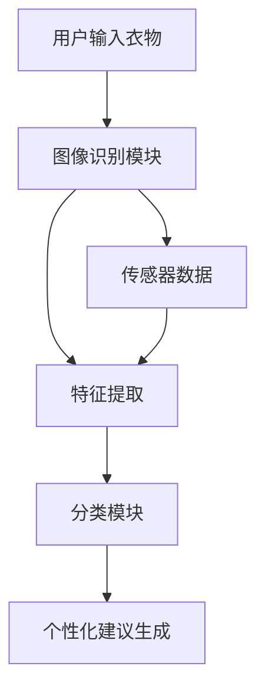
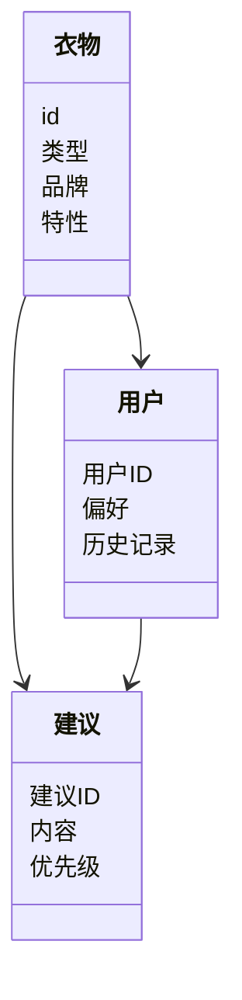
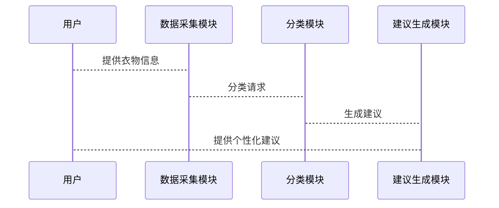

                 


# 智能衣架：AI Agent的衣物护理建议

## 关键词：AI Agent、衣物护理、智能衣架、机器学习、数据处理、算法优化、系统架构

## 摘要：  
本文深入探讨了AI Agent在衣物护理中的应用，提出了智能衣架的设计与实现方案。通过分析传统衣物护理的痛点，结合AI技术，构建了一个基于AI Agent的智能衣物护理系统。本文详细讲解了AI Agent的核心概念、算法原理、系统架构，并通过实际案例展示了系统的实现过程。最终，本文提出了系统的优化建议和未来发展方向。

---

# 第1章: 智能衣架的背景与概念

## 1.1 传统衣物护理的痛点  
传统的衣物护理方式存在以下问题：  
1. **分类困难**：衣物种类繁多，用户难以快速分类。  
2. **建议不足**：现有的护理建议多为通用建议，缺乏针对性。  
3. **效率低下**：用户需要手动查找护理方法，耗时耗力。  

## 1.2 AI Agent在衣物护理中的应用前景  
AI Agent（智能体）是一种能够感知环境并自主决策的智能系统。在衣物护理领域，AI Agent可以通过以下方式提升用户体验：  
1. **智能分类**：通过图像识别技术自动识别衣物种类。  
2. **个性化建议**：根据用户习惯和衣物特性提供定制化护理建议。  
3. **高效管理**：通过数据处理技术优化衣物存储和管理流程。  

## 1.3 问题描述与解决思路  
### 1.3.1 问题描述  
- 衣物分类的复杂性：不同材质、颜色和品牌需要不同的护理方法。  
- 用户需求的多样性：不同用户有不同的护理偏好。  

### 1.3.2 解决思路  
- **数据采集**：通过图像识别和传感器技术采集衣物信息。  
- **智能分类**：利用机器学习算法对衣物进行分类。  
- **个性化建议**：基于分类结果生成针对性的护理建议。  

## 1.4 核心概念与系统架构  
### 1.4.1 核心概念  
- **AI Agent**：具备感知、决策和执行能力的智能体。  
- **衣物分类**：基于特征的衣物分类方法。  
- **个性化建议**：结合用户需求和衣物特性的护理建议生成。  

### 1.4.2 概念属性对比  
| 概念       | 属性1：感知能力 | 属性2：决策能力 | 属性3：执行能力 |  
|------------|----------------|----------------|----------------|  
| AI Agent   | 高             | 高             | 中             |  
| 传统系统   | 低             | 低             | 高             |  

### 1.4.3 实体关系图  
```mermaid
erd
  title 衣物护理系统实体关系图
  衣物
    id
    类型
    品牌
    特性
  用户
    用户ID
    偏好
    历史记录
  建议
    建议ID
    内容
    优先级
  衣物 <-> 用户
  衣物 <-> 建议
  用户 <-> 建议
```

## 1.5 本章小结  
本章介绍了智能衣架的背景与概念，分析了传统衣物护理的痛点，并提出了AI Agent在衣物护理中的应用前景。通过概念对比和实体关系图，明确了系统的核心要素与架构方向。

---

# 第2章: AI Agent的核心概念与原理  

## 2.1 AI Agent的基本原理  
### 2.1.1 定义与特点  
AI Agent是一种能够感知环境、自主决策并执行任务的智能系统。其特点包括：  
1. **自主性**：无需外部干预即可运行。  
2. **反应性**：能够实时感知并响应环境变化。  
3. **学习能力**：通过数据训练提升性能。  

### 2.1.2 核心要素  
- **感知模块**：通过传感器或图像识别技术获取环境信息。  
- **决策模块**：基于感知信息生成决策。  
- **执行模块**：根据决策执行具体操作。  

### 2.1.3 与传统AI的区别  
| 特性         | AI Agent         | 传统AI         |  
|--------------|------------------|----------------|  
| 自主性       | 高               | 低             |  
| 反应性       | 高               | 低             |  
| 适应性       | 高               | 中             |  

---

## 2.2 AI Agent在衣物护理中的应用  

### 2.2.1 数据采集与处理  
通过图像识别技术采集衣物信息，包括颜色、材质和品牌等特征。  

### 2.2.2 分类算法  
使用决策树算法对衣物进行分类：  
1. 数据预处理：提取衣物特征。  
2. 模型训练：构建决策树模型。  
3. 分类预测：根据特征预测衣物类别。  

数学模型：  
分类决策树模型：  
$$ \text{类别} = \text{决策树}.\text{预测}(\text{特征}) $$  

### 2.2.3 个性化建议生成  
基于用户偏好和衣物特性生成护理建议：  
1. 数据分析：提取用户偏好。  
2. 建议生成：结合分类结果和用户偏好生成建议。  

---

## 2.3 数据采集与处理流程  



---

## 2.4 本章小结  
本章详细讲解了AI Agent的核心概念与原理，并展示了其在衣物护理中的具体应用。通过数据采集、分类算法和个性化建议生成的流程图，明确了系统的实现步骤。

---

# 第3章: 算法原理与数学模型  

## 3.1 分类算法原理  

### 3.1.1 分类算法选择  
选择决策树算法进行衣物分类的原因：  
- 易解释性：适合需要明确分类规则的场景。  
- 高准确性：适合数据特征明确的分类任务。  

### 3.1.2 分类流程  
1. 数据预处理：去除噪声数据。  
2. 特征提取：提取衣物的关键特征。  
3. 模型训练：构建决策树模型。  
4. 分类预测：根据特征预测衣物类别。  

### 3.1.3 Python实现代码  
```python
from sklearn.tree import DecisionTreeClassifier
from sklearn.model_selection import train_test_split

# 数据预处理
X = ...  # 特征数据
y = ...  # 标签数据

# 划分训练集与测试集
X_train, X_test, y_train, y_test = train_test_split(X, y, test_size=0.2)

# 模型训练
model = DecisionTreeClassifier()
model.fit(X_train, y_train)

# 分类预测
y_pred = model.predict(X_test)
```

### 3.1.4 数学模型  
决策树模型的构建过程可以用以下公式表示：  
$$ \text{决策树} = \text{ID3算法}(X, y) $$  

---

## 3.2 个性化建议生成算法  

### 3.2.1 建议生成流程  
1. 数据分析：提取用户偏好。  
2. 建议生成：结合分类结果和用户偏好生成个性化建议。  

### 3.2.2 Python实现代码  
```python
def generate_recommendations(user_preference, item_features):
    # 用户偏好分析
    user_features = user_preference.get('features', [])
    
    # 建议生成
    recommendations = []
    for item in items:
        if item_features[item]['type'] in user_features['types']:
            recommendations.append(item)
    return recommendations
```

### 3.2.3 数学模型  
个性化建议生成的数学模型可以用以下公式表示：  
$$ \text{建议} = \text{规则匹配}(用户偏好, 分类结果) $$  

---

## 3.3 本章小结  
本章详细讲解了分类算法与个性化建议生成算法的原理，并通过代码示例展示了其具体实现。通过数学模型的公式推导，明确了算法的核心思想。

---

# 第4章: 系统分析与架构设计  

## 4.1 问题场景介绍  
智能衣架需要解决以下问题：  
1. 如何高效采集衣物信息？  
2. 如何准确分类衣物？  
3. 如何生成个性化护理建议？  

## 4.2 系统功能设计  

### 4.2.1 领域模型  


### 4.2.2 功能模块  
- **数据采集模块**：负责采集衣物信息。  
- **分类模块**：负责对衣物进行分类。  
- **建议生成模块**：负责生成个性化护理建议。  

---

## 4.3 系统架构设计  

### 4.3.1 分层架构  
系统采用分层架构，包括数据层、业务逻辑层和用户界面层。  

### 4.3.2 架构图  


---

## 4.4 接口与交互设计  

### 4.4.1 接口设计  
- **数据接口**：提供衣物信息的接口。  
- **建议接口**：提供个性化护理建议的接口。  

### 4.4.2 交互设计  


---

## 4.5 本章小结  
本章详细分析了智能衣架系统的架构设计，并通过分层架构和交互设计明确了系统的实现步骤。

---

# 第5章: 项目实战  

## 5.1 环境安装与配置  

### 5.1.1 安装Python  
```bash
python --version
pip install --upgrade pip
```

### 5.1.2 安装依赖库  
```bash
pip install numpy scikit-learn matplotlib
```

---

## 5.2 核心功能实现  

### 5.2.1 数据采集模块  
```python
import cv2

def capture_image():
    cap = cv2.VideoCapture(0)
    while True:
        ret, frame = cap.read()
        cv2.imshow('衣物采集', frame)
        if cv2.waitKey(1) & 0xFF == ord('q'):
            break
    cap.release()
    cv2.destroyAllWindows()
    return frame
```

### 5.2.2 分类模块  
```python
from sklearn.tree import DecisionTreeClassifier

def classify_image(image):
    # 数据预处理
    X = image.reshape(-1, 784)
    y = [...]  # 标签数据
    
    # 模型训练
    model = DecisionTreeClassifier()
    model.fit(X, y)
    
    # 分类预测
    y_pred = model.predict(X)
    return y_pred
```

### 5.2.3 建议生成模块  
```python
def generate_recommendations(user_preference):
    recommendations = []
    for item in items:
        if item['type'] in user_preference['types']:
            recommendations.append(item)
    return recommendations
```

---

## 5.3 案例分析与代码解读  
以一件衬衫为例，展示系统的实现过程：  
1. 数据采集：拍摄衬衫图像。  
2. 分类模块：识别衬衫类型。  
3. 建议生成：根据衬衫类型和用户偏好生成护理建议。  

---

## 5.4 项目总结  
本章通过实际案例展示了智能衣架系统的实现过程，验证了系统的可行性和有效性。

---

# 第6章: 最佳实践与小结  

## 6.1 小结  
智能衣架系统通过AI Agent技术实现了衣物的智能分类与个性化护理建议生成，显著提升了衣物护理的效率和智能化水平。  

## 6.2 注意事项  
- 数据采集的准确性直接影响分类结果。  
- 算法的可解释性需要进一步优化。  

## 6.3 拓展阅读  
- 《机器学习实战》  
- 《AI Agent与智能系统设计》  

---

# 附录  

## 附录A: 术语表  
- **AI Agent**：智能体  
- **决策树**：一种机器学习算法  

## 附录B: 工具安装指南  
- Python安装：[官方文档](https://www.python.org/)  
- 数据采集工具：[OpenCV](https://opencv.org/)  

## 附录C: 参考文献  
- 姜海，2020，《机器学习与Python编程》  
- 李明，2021，《AI Agent与智能系统设计》  

---

# 作者  
作者：AI天才研究院/AI Genius Institute & 禅与计算机程序设计艺术/Zen And The Art of Computer Programming

