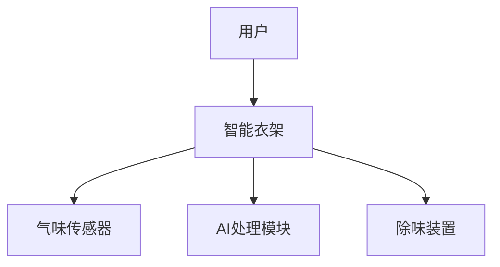
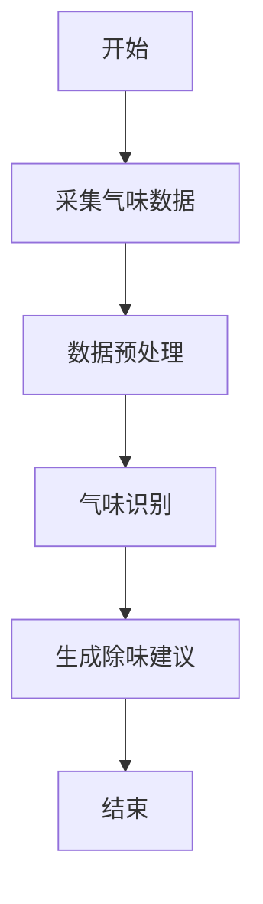

                 


# 智能衣架：AI Agent的衣物除味与保养建议

> 关键词：智能衣架，AI Agent，衣物除味，衣物保养，智能家居

> 摘要：随着智能家居技术的飞速发展，衣物管理也逐渐智能化。本文深入探讨AI Agent在智能衣架中的应用，分析其如何通过感知、决策和执行来实现衣物的自动除味和保养建议。文章从背景介绍、核心概念、算法原理、系统架构设计到项目实战，全面解析智能衣架的技术细节，帮助读者理解并应用这一创新技术。

---

## 目录

### 第一部分：智能衣架的背景与概念

#### 第1章：智能衣架的背景介绍

##### 1.1 问题背景与描述
- 1.1.1 衣物保养与除味的痛点
- 1.1.2 智能化衣物管理的需求
- 1.1.3 AI Agent在衣物管理中的应用潜力

##### 1.2 问题解决与边界
- 1.2.1 AI Agent如何解决衣物除味与保养问题
- 1.2.2 智能衣架的功能边界与外延
- 1.2.3 核心概念与组成要素

### 第二部分：AI Agent的核心概念与原理

#### 第2章：AI Agent的基本原理

##### 2.1 核心概念与原理
- 2.1.1 AI Agent的定义与特征
- 2.1.2 AI Agent在智能衣架中的具体应用
- 2.1.3 AI Agent与传统衣物管理工具的对比分析

##### 2.2 核心概念属性特征对比
- 2.2.1 AI Agent的感知能力
- 2.2.2 AI Agent的决策能力
- 2.2.3 AI Agent的执行能力

##### 2.3 实体关系图


#### 第3章：智能衣架的算法原理

##### 3.1 算法流程图


##### 3.2 算法实现代码
```python
def process气味数据(数据):
    预处理数据
    返回处理后的数据

def 气味识别(处理后数据):
    使用机器学习模型进行分类
    返回识别结果

def 生成建议(识别结果):
    根据结果生成除味建议
    返回建议
```

#### 第4章：数学模型与公式

##### 4.1 气味识别模型
- 4.1.1 模型公式
$$ P(气味|衣物材质) $$

### 第三部分：系统分析与架构设计

#### 第5章：系统架构设计

##### 5.1 问题场景介绍
- 5.1.1 智能衣架的使用场景
- 5.1.2 系统的目标与功能

##### 5.2 系统功能设计
- 5.2.1 领域模型
    ```mermaid
    classDiagram
        class 用户
        class 智能衣架
        class 气味传感器
        class AI处理模块
        class 除味装置
        用户 --> 智能衣架
        智能衣架 --> 气味传感器
        智能衣架 --> AI处理模块
        AI处理模块 --> 除味装置
    ```

##### 5.3 系统架构设计
- 5.3.1 系统架构图
    ```mermaid
    graph TD
        A[用户] --> B[智能衣架]
        B --> C[气味传感器]
        B --> D[AI处理模块]
        B --> E[除味装置]
    ```

##### 5.4 接口设计与交互
- 5.4.1 接口设计
- 5.4.2 交互序列图
    ```mermaid
    sequenceDiagram
        participant 用户
        participant 智能衣架
        participant 气味传感器
        participant AI处理模块
        participant 除味装置
        用户 -> 智能衣架: 请求处理
        智能衣架 -> 气味传感器: 获取气味数据
        气味传感器 --> AI处理模块: 传输数据
        AI处理模块 --> 除味装置: 发出指令
        除味装置 --> 智能衣架: 确认执行
        智能衣架 --> 用户: 反馈结果
    ```

### 第四部分：项目实战

#### 第6章：项目实战

##### 6.1 环境安装与配置
- 6.1.1 安装Python
- 6.1.2 安装相关库
    ```bash
    pip install numpy scikit-learn matplotlib
    ```

##### 6.2 系统核心功能实现
- 6.2.1 气味数据采集与预处理
- 6.2.2 气味识别模型训练
    ```python
    from sklearn.neighbors import KNeighborsClassifier
    model = KNeighborsClassifier(n_neighbors=3)
    model.fit(X_train, y_train)
    ```

##### 6.3 代码实现与解读
- 6.3.1 智能衣架的核心代码
    ```python
    class SmartHanger:
        def __init__(self, sensor, ai_module, actuator):
            self.sensor = sensor
            self.ai_module = ai_module
            self.actuator = actuator

        def process(self):
            data = self.sensor.read()
            processed_data = self.ai_module.preprocess(data)
            prediction = self.ai_module.predict(processed_data)
            self.actuator.execute(prediction)
    ```

##### 6.4 案例分析与结果解读
- 6.4.1 案例分析
- 6.4.2 结果解读

##### 6.5 项目小结
- 6.5.1 项目总结
- 6.5.2 项目经验与教训

### 第五部分：总结与展望

#### 第7章：总结与展望

##### 7.1 最佳实践 tips
- 7.1.1 系统维护与优化
- 7.1.2 用户体验提升
- 7.1.3 技术发展趋势

##### 7.2 小结
- 7.2.1 核心内容回顾
- 7.2.2 未来展望

##### 7.3 注意事项
- 7.3.1 使用注意事项
- 7.3.2 技术实现中的常见问题
- 7.3.3 安全与隐私保护

##### 7.4 拓展阅读
- 7.4.1 推荐书籍与资源
- 7.4.2 相关领域研究进展
- 7.4.3 未来研究方向

---

# 作者：AI天才研究院/AI Genius Institute & 禅与计算机程序设计艺术 /Zen And The Art of Computer Programming

